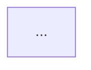

# AGENTS COORDINATION

| AGENT NAME     | ROLE DESCRIPTION           | RESPONSIBILITIES                                               |
| -------------- | -------------------------- | -------------------------------------------------------------- |
| <agent_1_name> | <agent_1_role_description> | - <agent_1_responsibility_1>   - <agent_1_responsibility_2> |

## Communication flow

## Usage

### <agent_1_name>

> Description of when and how to use <agent_1_name>.

Use-cases :

- **<Use-case 1>** : <ultra focused example of when to use the agent>
