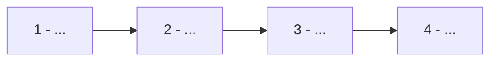

<!-- COMMENTS FOR YOU: ACKNOWLEDGE TO GUIDE YOU THEN REMOVE FROM OUTPUT -->

# [name]

> [short_description]

- **🎯 Objectif** : [l'objectif du cours et ce qu'on va y voir]
- **👌 Bénéfice** : [bénéfice 100% visible pour le développeur à la fin du cours]

---

## 📚 Ressources (optionnel)

<!--
Les pages de documentation connexes internes, si mentionnés.

type: 📝 doc, 📁 command,  🖋️ prompt, 🖼️ template, 👨‍💻 code / repository, 🧰 tool, 🎓 course
description: front matter of the linked doc (if available) or short description
-->

### Pages connexes

| Lien                                   | Description                                      |
| -------------------------------------- | ------------------------------------------------ |
| <icon> [Documentation de la règle](./) | Documentation détaillée sur la règle en question |

### Pages externes

| Lien                  | Description    |
| --------------------- | -------------- |
| <icon> [Lien 1](url1) | [description1] |

---

## 🙏 Pré-requis (optionnel)

- [requis 1]

## ⚠️ Attention (optionnel)

- [point d'attention 1]

---

## 🛣️ Vue d'ensemble

<!--
Minimal schema with no colors, simple logical steps, beautiful explained titles, bring clarity to the process.

Rules: no   or line jump, be concise
-->

---

## 🔍 Détails des étapes

---

### [etape_n_without_number_nor_emojis]

> [attendu]

---

1. [détail 1]
2. [détail 2]

---

### Exemples (optionnel)

[exemples concrets: code, url, mermaid, table...]

---

#### 1. [etape_1]

> [attendu]

1. [détail 1]
2. [détail 2]

---

#### Framework AIDD (optionnel)

<!--
For each command / prompt, get frontmatter is available:
- name: original name of the command / prompt
- description: translated to french description
 -->

| Commande                                                                                        | Description                                                        |
| ----------------------------------------------------------------------------------------------- | ------------------------------------------------------------------ |
| [`/refresh_memory_bank <module>`](../../../prompts/ide/07_documentation/refresh_memory_bank.md) | Rafraîchir la mémoire de l'IA avec les dernières informations      |
| `aidd worktree <branchname> <command>`                                                          | Créer un worktree Git temporaire pour travailler de manière isolée |

---

## 🧠 L'essentiel à retenir

<!-- Top info to remember summarized in small actionable list -->

- [ ] [point_1]

---

## ✅ Checklist des actions (optionnel)

> Rappel des actions à valider pour considérer cette section comme terminée.

<!-- Necessary actions to complete the course, generalist, universal, VERY actionable, concise, concrete -->

- [ ] [action_1]
