### Codebase Structure

#### Root Directory

- **donaction-frontend**: Next.js web application for public-facing site
- **donaction-api**: Strapi CMS backend API
- **donaction-admin**: Angular admin dashboard application
- **donaction-saas**: Svelte web components for embeddable widgets
- **aidd**: AI-driven development configuration and agents
- **docs**: Project documentation including agents, rules, flows, memory-bank
- **cicd**: CI/CD pipeline configurations
- **.github**: GitHub workflows and configurations
- **http-requests**: HTTP request examples for testing
- **logs**: Application logs per module

#### Configuration Files

- @.gitlab-ci.yml: GitLab CI/CD pipeline configuration
- @docker-compose.yml: Multi-container Docker setup
- @lefthook.yml: Git hooks configuration
- @.env: Environment variables
- @CLAUDE.md: AI assistant instructions (symlink to AGENTS.md)
- @AGENTS.md: Main project rules and AI configuration

#### donaction-frontend (Next.js)

##### Tech Stack
- **Framework**: Next.js 14
- **Language**: TypeScript 5
- **UI**: React 18, TailwindCSS 3, PrimeReact 10
- **State**: Redux Toolkit 2
- **Auth**: NextAuth 4
- **Styling**: Sass, Tailwind
- **Payments**: Stripe

##### Directory Structure
- `src/app`: Next.js App Router routes and pages
  - `(main)`: Main application routes
  - `(auth)`: Authentication routes
  - `[slug]`: Dynamic slug routes
  - `api`: API routes
- `src/core`: Core business logic
  - `hooks`: Custom React hooks
  - `services`: API services
  - `store`: Redux store configuration
  - `models`: Data models
  - `types`: TypeScript type definitions
  - `constants`: Application constants
  - `enum`: Enumerations
  - `helpers`: Utility functions
- `src/layouts`: Layout components
  - `partials`: Reusable layout parts
  - `components`: Layout-specific components
- `src/config`: Configuration files
- `src/styles`: Global styles and themes
- `src/types`: Shared TypeScript types
- `public`: Static assets
- `scripts`: Build and utility scripts

##### Config Files
- @donaction-frontend/next.config.js: Next.js configuration
- @donaction-frontend/tailwind.config.js: TailwindCSS configuration
- @donaction-frontend/postcss.config.js: PostCSS configuration
- @donaction-frontend/tsconfig.json: TypeScript configuration
- @donaction-frontend/package.json: Dependencies and scripts

#### donaction-api (Strapi)

##### Tech Stack
- **Framework**: Strapi 5
- **Language**: TypeScript 5
- **Database**: PostgreSQL via `pg` 8
- **Media**: ImageKit via custom provider
- **Email**: Nodemailer, Sendinblue API
- **PDF**: pdf-lib, pdf2pic
- **Payments**: Stripe 17

##### Directory Structure
- `src/api`: API endpoints per entity
  - `klubr`: Main Klubr entity
  - `klub-projet`: Project management
  - `klub-don`: Donation management
  - `klubr-donateur`: Donor management
  - `klubr-membre`: Member management
  - `klubr-subscription`: Subscription management
  - `invoice`: Invoice generation
  - `blog`: Blog posts
  - `contact`: Contact forms
  - `newsletter`: Newsletter management
- `src/components`: Strapi components
  - `composant-atoms`: Atomic components
  - `club-presentation`: Club presentation blocks
  - `page-sections`: Page section components
  - `club-header`: Club header components
  - `club-chiffres`: Club statistics components
- `src/helpers`: Utility functions
  - `gcc`: Google Cloud Console integrations
  - `emails`: Email templates and sending
  - `klubrPDF`: PDF generation logic
  - `users-extensions`: User permission extensions
- `src/extensions`: Strapi extensions
  - `users-permissions`: Custom user permissions
- `src/plugins`: Custom Strapi plugins
  - `custom-upload`: Custom upload handling
- `src/middlewares`: Custom middlewares
- `src/admin`: Admin panel customizations
- `config`: Strapi configuration files
- `database`: Database schemas and migrations
- `public`: Public uploads
- `private-pdf`: Private PDF storage
- `data`: Database exports
- `types`: TypeScript type definitions

##### Config Files
- @donaction-api/package.json: Dependencies and scripts
- @donaction-api/tsconfig.json: TypeScript configuration
- @donaction-api/donaction-gcc-config.json: Google Cloud Console config

#### donaction-admin (Angular)

##### Tech Stack
- **Framework**: Angular 19
- **Language**: TypeScript 5
- **UI**: PrimeNG 19, TailwindCSS 3
- **State**: NgRx 19
- **Maps**: Google Maps API
- **Auth**: Social login via angularx-social-login
- **Editor**: ngx-editor 18
- **Testing**: Jasmine 5, Karma 6

##### Directory Structure
- `src/app`: Angular application
  - `routes`: Route configurations
  - `shared`: Shared components and services
- `src/assets`: Static assets
  - `images`: Image files
  - `animations`: Lottie animations
  - `layout`: Layout-specific assets
  - `theme`: Theme files
  - `prime-ng`: PrimeNG customizations
  - `videos`: Video files
  - `pdf`: PDF documents
- `src/public`: Public static files
  - `icons`: Icon assets
- `src/environments`: Environment configurations

##### Config Files
- @donaction-admin/angular.json: Angular workspace configuration
- @donaction-admin/tsconfig.json: TypeScript configuration
- @donaction-admin/package.json: Dependencies and scripts
- @donaction-admin/proxy.conf.json: Proxy configuration for development
- @donaction-admin/ngsw-config.json: Service worker configuration

#### donaction-saas (Svelte)

##### Tech Stack
- **Framework**: Svelte 5 (Web Components)
- **Language**: TypeScript 5
- **Build**: Vite 5
- **Testing**: Vitest 2
- **Styling**: Sass
- **Payments**: Stripe JS 4
- **Animations**: Lottie Web 5
- **Carousel**: Swiper 11

##### Directory Structure
- `src/components`: Svelte components
  - `sponsorshipForm`: Sponsorship form component
- `src/utils`: Utility functions
  - `richTextBlock`: Rich text rendering
  - `share`: Social sharing utilities
  - `lottie`: Lottie animation helpers
  - `tooltip`: Tooltip utilities
- `src/types`: TypeScript types
  - `sponsorshipForm`: Form type definitions
- `src/styles`: Global styles
- `src/assets`: Static assets
  - `animations`: Lottie animations
  - `icons`: SVG icons
  - `fonts`: Custom fonts
  - `docs`: Documentation files

##### Config Files
- @donaction-saas/vite.config.ts: Vite build configuration
- @donaction-saas/vite.config.development.ts: Development configuration
- @donaction-saas/svelte.config.js: Svelte configuration
- @donaction-saas/tsconfig.json: TypeScript configuration
- @donaction-saas/package.json: Dependencies and scripts

#### AIDD Structure

- **sub-agents**: Specialized AI agent definitions
- **prompts**: AI prompt templates
- **templates**: Code generation templates
- **supports**: Support files and documentation
- **assets**: Asset files for AI operations

#### Docs Structure

- **agents**: Agent configuration and documentation
- **rules**: Development rules and guidelines
- **flows**: Development workflow documentation
- **memory-bank**: Project memory and context
- **prompts**: Custom prompt templates
- **tasks**: Task definitions and tracking
- **logs**: Operation logs


---
name: deployment
description: Infrastructure and deployment documentation
argument-hint: N/A
---

### Deployment

#### CI/CD Pipeline

##### GitLab CI Flow

- **Steps**:

  1. Version: Generate semantic version based on branch (`MAJOR.MINOR.PATCH`)
  2. Build: Build Docker images using `docker buildx` for each service
  3. Deploy: SSH to target host, pull images, restart containers

- **Test Automation**:

  - Unit tests: Not configured in pipeline
  - Integration tests: Not configured in pipeline
  - E2E tests: Not configured in pipeline

- **Deployment Triggers**:
  - Manual deployments: All deployments require manual trigger via `when: manual`
  - Automated deployments: Version generation manual on `release/*`, `demo/*`, `feature/*` branches

#### Monitoring & Logging

- **Monitoring Tools**: Not configured

  - Application monitoring: Not configured
  - Infrastructure monitoring: Not configured
  - Performance monitoring: Not configured

- **Logging**:

  - Log aggregation: Local volume mounts to `./logs/` directory
  - Log levels: Not specified
  - Log retention: Based on host filesystem

- **Alert Configuration**:
  - Critical alerts: Not configured
  - Warning alerts: Not configured
  - Alert channels: Not configured

#### Deployment Process

- **Deployment Steps**:

  - Database migration process: Not specified in CI/CD

- **Rollback Procedure**:

  1. Identify: Check logs and monitoring for issues
  2. Execute: SSH to host, pull previous image tag, restart containers
  3. Verify: Manual verification required

### Infrastructure

#### Project Structure

```plaintext
/repos/klubr/klubr-front/
├── donaction-admin/          # Angular admin dashboard
├── donaction-frontend/       # Next.js frontend
├── donaction-api/            # Strapi API backend
├── donaction-saas/           # Web components
├── docker-compose.yml    # Local dev orchestration
├── .gitlab-ci.yml        # CI/CD pipeline
└── cicd/
    ├── env/              # Environment setup scripts
    └── globalDefinitions/
        └── ssh.yml       # SSH deployment template
```

#### Environments Variables

##### Environment Files

- @.env (root)
- @donaction-admin/.env
- @donaction-frontend/.env, @donaction-frontend/.env.prod, @donaction-frontend/.env.re7
- @donaction-api/.env.development, @donaction-api/.env.prod, @donaction-api/.env.re7
- @donaction-saas/.env.prod, @donaction-saas/.env.re7

##### Required Environment Variables

- `PROJECT_SLUG`: Container prefix
- `ENVIRONMENT`: deployment, production, re7
- `DATABASE_CLIENT`: postgres
- `DATABASE_HOST`: postgres container name
- `DATABASE_NAME`: DB name
- `DATABASE_USERNAME`: DB user
- `DATABASE_PASSWORD`: DB password
- `DATABASE_PORT`: 5432
- `JWT_SECRET`: API authentication
- `NODE_ENV`: Node environment
- `PGADMIN_DEFAULT_EMAIL`: pgAdmin login
- `PGADMIN_DEFAULT_PASSWORD`: pgAdmin password
- `HOST_STG`: Staging server host
- `HOST_PROD`: Production server host
- `SSH_PRIVATE_KEY`: SSH deployment key
- `SSH_USER`: SSH username
- `CI_GITLAB_ACCESS_TOKEN`: GitLab API token
- `DOCKER_AUTH_TOKEN`: Docker Hub encoded auth

#### URLs

- **Development**:

  - URL: localhost:3100 (frontend), localhost:4300 (admin), localhost:1437 (api)
  - Purpose: Local development with docker-compose

- **Production**:
  - URL: Not specified in config
  - SLA: Not specified

#### Containerization

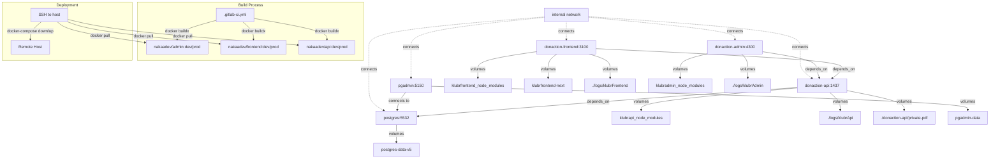


---
name: project-brief
description: Project vision and domain documentation
argument-hint: N/A
---

### PROJECT_BRIEF.md

Klubr is a platform enabling associations (Klubrs) to receive and manage sponsorships/donations from individuals and companies, with integrated payment processing, donor management, and administrative tools.

#### Executive Summary

- **Project Name**: Klubr
- **Vision**: Streamline sponsorship and donation management for associations through a comprehensive digital platform
- **Mission**: Building an integrated web ecosystem that connects donors with associations, facilitating financial contributions through automated workflows, payment processing, and administrative oversight

##### Full Description

Klubr is a multi-application platform designed to facilitate sponsorships and donations for associations. The platform consists of four main components: a public-facing frontend for donors, a headless CMS API for content and data management, embeddable web components for third-party integration, and an administrative interface for association management. The system handles the complete donation lifecycle including payment processing via Stripe, tax receipt generation, and donor relationship management.

#### Context

The platform addresses the need for associations to efficiently manage financial contributions from supporters while providing donors with a seamless contribution experience.

##### Core Domain

Klubr operates in the non-profit association management domain, specifically focusing on the financial relationship between donors and associations. The system manages the complete sponsorship lifecycle from initial donation through payment processing, tax documentation, and ongoing donor engagement. It integrates with payment providers, handles recurring subscriptions, and generates compliance documentation like tax receipts.

##### Ubiquitous Language

| Term | Definition | Synonymes |
| -------- | -------------- | ----------- |
| Klubr | An association/organization that receives donations through the platform | Association, Organization |
| Donator | Individual or company making a financial contribution | Donor, Sponsor |
| Donation | One-time or recurring financial contribution | Don, Sponsorship, Contribution |
| Subscription | Recurring donation arrangement | Recurring donation |
| Project | Specific initiative within a Klubr that can receive targeted donations | Campaign, Initiative |
| Tax Receipt | Fiscal document generated for donors | Reçu fiscal |
| SIREN | French company identification number (9 digits) | Company ID |

#### Features & Use-cases

- Donor registration and authentication via Google OAuth or credentials
- One-time and recurring donation processing via Stripe
- Customizable donation forms as embeddable web components
- Tax receipt generation and management
- Association profile management with projects and campaigns
- Donor dashboard showing contribution history
- Administrative interface for association managers
- Multi-klubr project management with targeted donations
- Logo upload and donator profile customization
- Email notifications via Brevo integration
- reCAPTCHA validation for form submissions
- Image management via ImageKit CDN

#### User Journey maps

##### Donor (Individual/Company)

- Discovers association via public frontend or embedded form
- Views association profile and available projects
- Role: Financial contributor seeking to support associations
- Goals: Make secure donations, receive tax documentation, track contributions

###### Primary Donation Journey

1. **Discovery**: Browse Klubrs or access embedded sponsorship form
2. **Selection**: Choose Klubr and optional project, select donation amount and frequency
3. **Information**: Complete donor profile (email, name, company details, logo)
4. **Payment**: Process payment securely via Stripe
5. **Confirmation**: Receive confirmation and tax receipt
6. **Management**: Access personal dashboard to view history and manage subscriptions

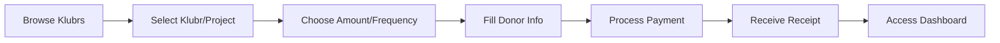

##### Association Administrator

- Manages association profile, projects, and content
- Role: Association representative managing fundraising
- Goals: Configure association presence, track donations, manage donor relationships

###### Association Management Journey

1. **Setup**: Create/configure Klubr profile with projects
2. **Content**: Manage description, images, and project details
3. **Monitoring**: Track incoming donations and active subscriptions
4. **Engagement**: View donor profiles and contribution patterns
5. **Reporting**: Generate reports and export data
6. **Integration**: Embed donation forms on external websites

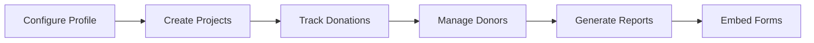


---
name: stack
description: Technology stack documentation
argument-hint: N/A
---

### Stack

#### donaction-frontend

@donaction-frontend/package.json

- Next.js 14 (React framework)
- React 18
- TypeScript 5
- NextAuth 4 (authentication)
- Redux Toolkit 2 (state management)
- Stripe 14 + Stripe React 2 (payments)
- PrimeReact 10 (UI components)
- TailwindCSS 3 (styling)
- date-fns 2 (date utilities)
- jose 5 (JWT handling)
- Sharp 0.33 (image optimization)
- Swiper 11 (carousels)

@donaction-frontend/next.config.js

- Standalone output mode
- Bundle analyzer support
- Custom image domains: `googleusercontent.com`, `cloudinary.com`, `imagekit.io`

@donaction-frontend/tsconfig.json

- Target: ES6
- Path aliases: `@/components/*`, `@/helpers/*`, `@/*`
- Strict mode enabled

#### donaction-admin

@donaction-admin/package.json

- Angular 19
- TypeScript 5
- RxJS 7
- NgRx 19 (state management)
- PrimeNG 19 + PrimeFlex 4 (UI components)
- TailwindCSS 3 (styling)
- Google Maps integration via `@angular/google-maps`
- ngx-editor 18 (rich text editor)
- ngx-image-cropper 9
- ngx-lottie 13 (animations)
- Jasmine 5 + Karma 6 (testing)

@donaction-admin/angular.json

- Builder: `@angular-devkit/build-angular:application`
- Style preprocessor: SCSS
- Service worker: PWA enabled via `ngsw-config.json`
- Multiple environments: `production`, `development`, `re7`

@donaction-admin/tsconfig.json

- Target: ES2022
- Strict mode with all strict flags
- Path aliases: `@app/*`, `@assets/*`, `@environments/*`, `@shared/*`

#### donaction-saas

@donaction-saas/package.json

- Svelte 5 (web components)
- TypeScript 5
- Vite 5 (build tool)
- Vitest 2 (testing)
- Stripe JS 4
- Swiper 11 (carousels)

@donaction-saas/vite.config.ts

- Custom element compilation for web components
- Multiple build modes: INDIVIDUAL (ESM) and IIFE
- Outputs to `build/donaction-web-components`

@donaction-saas/tsconfig.json

- Target: ESNext
- Extends `@tsconfig/svelte`

#### donaction-api

@donaction-api/package.json

- Strapi 5 (headless CMS)
- Node.js 18-22
- TypeScript 5
- PostgreSQL 8 (`pg` driver)
- Stripe 17 (payments)
- React 18 + React Router 6 (admin panel)
- Sharp 0.33 (image processing)
- ImageKit 6 (media hosting)
- pdf-lib 1 (PDF generation)
- xlsx 0.18 (Excel handling)
- Nodemailer (email provider)
- Sendinblue API v3 SDK (`sib-api-v3-sdk`)

#### Shared Dependencies

- Node.js >= 18
- TypeScript 5 across all projects
- Sass/SCSS for styling
- Sharp for image processing
- Lottie for animations
- Google Maps API integration
- Stripe SDK for payments


---
name: architecture
description: Module architecture and structure
argument-hint: N/A
---

### Architecture

- [Language/Framework](#languageframework)
  - [Dashboard](#dashboard)
- [Full project structure](#full-project-structure)
  - [Naming Conventions](#naming-conventions)
- [Services communication](#services-communication)
  - [Component to API Flow](#component-to-api-flow)

#### Language/Framework

##### Dashboard

- **Framework**: Angular 19 → @donaction-admin/package.json
- **UI Library**: PrimeNG 19 with custom theme preset - Component library with Tailwind integration via `tailwindcss-primeui`
- **Routing**: Angular Router with lazy loading - Feature-based routing with guards (`authGuard`, `invitationCodeGuard`)
- **Data Fetching**: Angular HttpClient with interceptors - JWT auth and error handling interceptors
- **Form Handling**: Angular Reactive Forms - Template-driven and reactive forms
- **Validation**: Angular Validators with custom validators - Located in `@shared/utils/validators`
- **State Management**: NgRx Store 19 with Effects - Feature-based state organization with facades pattern
- **Build Tool**: Angular CLI with esbuild - Application builder with service worker support
- **Structure**: Feature-based architecture - Routes contain feature modules, shared contains reusable code

#### Full project structure

```text
donaction-admin/
├── src/
│   ├── app/
│   │   ├── routes/                          # Feature routes (lazy loaded)
│   │   │   ├── auth/                        # Authentication feature
│   │   │   │   ├── data-access/            # NgRx state management
│   │   │   │   │   ├── +state/             # Actions, reducers, effects, selectors, facade
│   │   │   │   │   └── repositories/       # HTTP services
│   │   │   │   ├── model/                  # Feature models
│   │   │   │   └── ui/                     # Feature components
│   │   │   ├── klub/                        # Club management
│   │   │   ├── members/                     # Member management
│   │   │   ├── project/                     # Project management
│   │   │   ├── don/                         # Donations
│   │   │   ├── facturation/                 # Invoicing
│   │   │   ├── stats/                       # Statistics
│   │   │   ├── profile/                     # User profiles
│   │   │   ├── dashboard/                   # Main dashboard layout
│   │   │   └── homepage/                    # Home page
│   │   ├── shared/                          # Shared resources
│   │   │   ├── components/                  # Reusable components
│   │   │   │   ├── atoms/                   # Atomic components
│   │   │   │   ├── header/                  # Header component
│   │   │   │   ├── sidebar/                 # Sidebar component
│   │   │   │   ├── dialog/                  # Dialog components
│   │   │   │   ├── form/                    # Form components
│   │   │   │   └── ...                      # Domain-specific components
│   │   │   ├── data-access/                 # Shared state
│   │   │   │   ├── +state/                  # Shared NgRx state
│   │   │   │   └── repositories/            # Shared HTTP services
│   │   │   ├── pipes/                       # Custom pipes by domain
│   │   │   ├── services/                    # Business logic services
│   │   │   │   ├── entities/                # Entity services
│   │   │   │   ├── analytics/               # Analytics service
│   │   │   │   └── misc/                    # Utility services
│   │   │   └── utils/                       # Utilities
│   │   │       ├── guards/                  # Route guards
│   │   │       ├── interceptors/            # HTTP interceptors
│   │   │       ├── models/                  # Shared models/interfaces
│   │   │       ├── validators/              # Custom validators
│   │   │       ├── helpers/                 # Helper functions
│   │   │       ├── theme/                   # PrimeNG theme config
│   │   │       └── config/                  # Config files
│   │   ├── app.component.ts                 # Root component
│   │   ├── app.config.ts                    # Application configuration
│   │   └── app.routes.ts                    # Root routing
│   ├── environments/                        # Environment configs
│   ├── assets/                              # Static assets
│   └── styles.scss                          # Global styles
├── angular.json                             # Angular workspace config
├── tailwind.config.js                       # Tailwind configuration
├── tsconfig.json                            # TypeScript config
└── package.json                             # Dependencies
```

##### Naming Conventions

- **Files**: kebab-case with suffix (e.g., `auth.service.ts`, `login.component.ts`)
- **Components**: PascalCase (e.g., `LoginComponent`)
- **Functions**: camelCase
- **Variables**: camelCase
- **Constants**: UPPER_CASE (e.g., `AUTH_FEATURE_KEY`)
- **Types/Interfaces**: PascalCase

#### Services communication

##### Component to API Flow

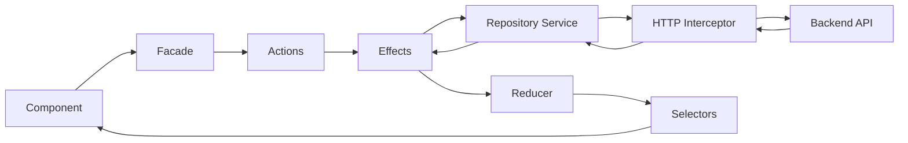

Flow:
- Component dispatches action via `Facade`
- `Actions` trigger `Effects`
- `Effects` call `Repository Service` (HTTP service)
- `Interceptors` add auth token and handle errors
- Response updates `State` via `Reducer`
- Component observes state via `Selectors`


### Backend Communication

#### API Client Setup

##### Base Configuration

@donaction-admin/src/environments/environment.ts
@donaction-admin/src/app/app.config.ts

- `environment.apiUrl` for Strapi backend (`http://localhost:1437/api/`)
- `environment.nextJsUrl` for Next.js SSR routes
- `environment.apiTokenV1` for API-level authentication
- Native Angular `HttpClient` via `provideHttpClient()`

##### HTTP Client

**Location**: `@angular/common/http`

**Configuration**:
- Functional interceptors via `withInterceptors([authInterceptor, httpErrorsInterceptor])`
- JSONP support via `withJsonpSupport()`
- Standalone services pattern with `providedIn: 'root'`
- Direct `HttpClient` injection in services

#### Authentication Flow

##### Dual Auth Mode

@donaction-admin/src/app/routes/auth/data-access/repositories/auth.service.ts

**Auth Modes**:
- `'angular'` - Cookie-based JWT via `JwtService`
- `'nextJs'` - Session token from Next.js backend at `/api/auth/session`

**Initialization**:
1. On app load, call `checkAuthModeAndIfUserAuthentificated()`
2. Try Next.js session endpoint first
3. Fallback to Angular cookies if Next.js fails
4. Store mode, token, and auth state in `AuthFacade` (NgRx)

##### Auth Interceptor

@donaction-admin/src/app/shared/utils/interceptors/auth.interceptor.ts

**Token Routing**:
- `apiTokenRoutes` use `environment.apiTokenV1` (e.g., `/api/auth/local`, `/api/auth/google/callback`)
- `unauthenticatedRoutes` skip token injection (e.g., Google Maps API)
- All other routes use `authFacade.token$` from NgRx state
- Adds `Authorization: Bearer <token>` header via `HttpRequest.clone()`

##### Auth Endpoints

**AuthService**:
- `authenticate()` - POST `/auth/local` with credentials
- `register()` - POST `/auth/local/register`
- `getMe()` - GET `/users/me` with full population
- `changeMePassword()` - POST `/auth/change-password`
- `googleOAuthRegister()` - GET `/auth/google/callback?access_token=`

#### Error Handling

##### HTTP Errors Interceptor

@donaction-admin/src/app/shared/utils/interceptors/http-errors.interceptor.ts

**Error Types**:
- `403` - Expired session: show toast, delay 3s, trigger `authFacade.logout()`
- `400` - Validation error: extract `error.error.message`, show toast
- `504` - Gateway timeout: show network toast, return `NEVER` observable
- Blob errors: parse via `FileReader`, extract nested error details
- Default: show generic error toast

**Error Structure**:
- Nested error parsing: `error.error || error`
- Details array flattened to `'<key> ><value>'` format
- HTML error messages for detailed display

#### API Patterns

##### Endpoint Organization

@donaction-admin/src/app/shared/utils/config/endpoints.ts

**Constants**:
- Authentication: `LOGIN`, `REGISTER`, `CHANGE_PASSWORD`
- Users: `USER`, `USER_PERMISSIONS`, `AVATAR`
- Clubs: `KLUBR`, `KLUBR_BY_SLUG`, `KLUBR_HOUSE`, `FEDERATION`
- Members: `MEMBER`, `LINK_MEMBER_TO_USER`, `SWITCH_TO_PROFILE`, `SWITCH_TO_ADMIN_EDITOR`
- Projects: `KLUB_PROJECT`, `PROJECT_TMPL_CATEGORY`, `PROJECT_TMPL_LIBRARY`
- Donations: `DON`, `DON_RECEIVED`, `MY_DONS`, `ATTESTATION_PDF`, `RECU_PDF`
- Invoices: `INVOICES`, `STATS`
- Media: `MEDIAS_PROFILE`, `KLUBR_DOCUMENTS`
- Cache: `REVALIDATE`

##### Service Layer Architecture

**SharedService** - `@shared/data-access/repositories/shared.service.ts`:
- `getUserDetail()`, `switchToProfile()`, `linkMemberToUser()`
- `getKlubrDetail()`, `updateKlub()`, `filterKlubs()`
- `filterMembers()`, `createProfile()`, `updateProfile()`
- `getKlubrHouseDetails()`, `updateKlubrHouseDetails()`
- `switchToProfileAdminEditor()`

**ProjectService** - `@shared/services/project.service.ts`:
- `getProjectsWithFilters()`, `getProject()`, `createProject()`, `updateProject()`
- `getProjectTmplLibraries()`, `getOwnProjectTmplLibraries()`
- Filter system: `ProjectFilters` with klubrUUIDs, status, member, isTemplate
- Populate arrays: `defaultProjectPopulate`, `defaultProjectResolverPopulate`

**UserService** - `@shared/services/user.service.ts`:
- `getUsersWithFilters()` with `UserFilters`
- Complex filter logic: role, profiles, origin, searchParams, creationDate

##### Query Building System

@donaction-admin/src/app/shared/utils/helpers/query-helpers.ts

**Core Functions**:
- `getQueryString()` - Combines filters, populate, sort, pagination
- `getPopulateQueryParam()` - Nested population: `populate[0]=field`
- `getUserPopulateQueryParam()` - Pre-built complex user population
- `addFilter()` - Single field: `filters[field][$eq]=value`
- `addSubElementFilter()` - Relation: `filters[element][subElement][$eq]=value`
- `addSubSubElementFilter()` - Deep relation (3 levels)
- `addGreaterEqualFilter()`, `addGreaterLessFilter()` - Date ranges
- `pagination()` - `pagination[page]=1&pagination[pageSize]=10`
- `getSortQueryParam()` - Array to `sort[0]=field:desc`

**Strapi V4 Query Pattern**:
```typescript
// Example: GET /api/klub-projets/?
// filters[klubr][uuid][$eq]=abc-123
// &populate[0]=couverture
// &populate[1]=klubr_membre.avatar
// &sort[0]=status:desc
// &pagination[page]=1&pagination[pageSize]=9
```

#### Data Fetching Strategies

##### Service-Based Pattern

**Standard Flow**:
1. Component injects service (e.g., `ProjectService`)
2. Calls method with typed filters (e.g., `ProjectFilters`)
3. Service builds query string via `query-helpers`
4. Returns `Observable<ApiListResult<T>>` or `Observable<T>`
5. Component subscribes or uses `async` pipe

**Populate Strategy**:
- Default arrays per entity (e.g., `defaultProjectPopulate`)
- Resolver-specific arrays for detail views
- Update-specific arrays to get modified relations

##### NgRx State Management

@donaction-admin/src/app/routes/auth/data-access/+state/

**Features**:
- `AuthFacade` exposes observables: `token$`, `isAuthenticated$`, `authMode$`
- `SharedFacade` for shared entities
- Effects handle async operations
- Reducers store normalized data

##### Cache Invalidation

@donaction-admin/src/app/shared/services/invalidate-cache.service.ts

**Pattern**:
- Services return `pathsToUnvalidateDataRequest()` with affected routes
- Call Next.js `/api/revalidate` endpoint with path array
- Invalidates Next.js ISR cache for updated entities

#### External Integrations

##### Google OAuth

@donaction-admin/src/app/routes/auth/data-access/repositories/google-auth.service.ts

- Client ID via `environment.googleClientId`
- Callback: `${apiUrl}/auth/google/callback?access_token=<token>`
- Backend returns Strapi JWT

##### Google Maps

@donaction-admin/src/app/shared/components/form/google-maps/

- API key: `environment.GOOGLE_MAPS_API_KEY`
- Unauthenticated route (no Bearer token)
- Services: `google-maps-api.service.ts`, `google-maps-utils.service.ts`

##### reCAPTCHA

@donaction-admin/src/app/app.config.ts

- Site key: `environment.ANGULAR_PUBLIC_GOOGLE_RECAPTCHA_SITE_KEY`
- Provided via `RECAPTCHA_V3_SITE_KEY` injection token

#### State & Caching

##### Service Worker

- Configured via `provideServiceWorker()`
- Enabled when `environment.pwaEnabled === true`
- Strategy: `registerWhenStable:30000`

##### Dashboard Cache

@donaction-admin/src/app/shared/services/caching.service.ts

- In-memory caching layer
- Used for repeated queries within session

#### Key Dependencies

@donaction-admin/package.json

- `@angular/common` ^19 (HttpClient)
- `@ngrx/store` ^19
- `@ngrx/effects` ^19
- `rxjs` ^7
- `primeng` ^19


---
name: coding-assertions
description: Code quality verification checklist
argument-hint: N/A
---

### Coding Guidelines

> Those rules must be minimal because the MUST be checked after EVERY CODE GENERATION.

#### Requirements to complete a feature

**A feature is really completed if ALL of the above are satisfied: if not, iterate to fix all until all are green.**

#### Steps to follow

1. Check their is no duplication
2. Ensure code is re-used
3. Run all those commands, in order to ensure code is perfect:

```markdown
| Order | Command    | Description                |
|-------|------------|----------------------------|
| 1     | ng test    | Run unit tests with Karma |
| 2     | ng build   | Build application          |
```

#### Angular Coding Patterns

##### Component Architecture
- Use **standalone components** (no `NgModule` except legacy `google-maps-utils.module.ts`)
- Components declare imports in `@Component` decorator `imports` array
- Use `inject()` function for dependency injection (not constructor injection)
- File naming: `*.component.ts`, `*.service.ts`, `*.pipe.ts`, `*.guard.ts`
- Component prefix: `app-` (configured in @angular.json)

##### Modern Angular Features
- Use `signal()`, `computed()`, `effect()` from `@angular/core`
- Use `input()` and `model()` for component inputs
- Use `viewChild()` for view queries
- Control flow: `@if`, `@for`, `@switch` in templates (modern syntax)
- Use `toSignal()` from `@angular/core/rxjs-interop` for signal conversion
- Use `takeUntilDestroyed()` for subscription cleanup (no manual `takeUntil`)

##### State Management
- NgRx Store for global state with signals integration
- Facades pattern: services expose state via `selectSignal()` and `toSignal()`
- Actions/Effects pattern for side effects
- Services use `providedIn: 'root'`

##### Forms
- Reactive forms with `FormGroup`, `FormControl`, `Validators`
- Custom `FormControlPipe` to access controls: `form | formControl:'fieldName'`
- Helper functions in `form-helpers.ts`
- Validation errors displayed via `ErrorDisplayComponent`

##### RxJS Patterns
- Prefer `takeUntilDestroyed()` over manual `takeUntil(destroyed$)`
- Use operators: `map`, `tap`, `switchMap`, `catchError`, `filter`, `take`
- Observable naming: suffix with `$` (e.g., `me$`, `isAuthenticated$`)
- Combine observables with `combineLatest`, `merge`

##### HTTP & API
- Services inject `HttpClient` via `inject(HttpClient)`
- Interceptors: `httpErrorsInterceptor` for centralized error handling
- Guards: functional guards with `CanActivateFn` (e.g., `authGuard`)
- Query helpers in `query-helpers.ts` for API filters/pagination
- Environment config via `@environments/environment`

##### Error Handling
- HTTP errors caught in `httpErrorsInterceptor`
- Toast notifications via `ToastService.showErrorToast()`
- Errors thrown early, never silent
- Blob responses parsed for error details

##### Routing
- Functional guards: `authGuard`, `invitationCodeGuard`, `linkMemberGuard`
- Resolvers for data preloading
- Routes defined in `*.routes.ts` files
- Base href: `/admin/` (configured in @angular.json)

##### Services Organization
- `data-access/repositories`: API calls
- `data-access/+state`: NgRx state (actions, effects, selectors, facade)
- `shared/services`: reusable services
- `shared/utils`: helpers, interceptors, guards, models

##### Styling
- SCSS with `styleUrl` in components
- PrimeNG v19 with PrimeFlex v4
- Tailwind CSS with `tailwindcss-primeui`
- Animations: `fadeAnimation` from `animations.ts`

##### Change Detection
- Most components use default change detection
- `OnPush` used sparingly (e.g., `klub-house-update.component.ts`)

#### TypeScript Usage

##### Types & Interfaces
- Models in `shared/utils/models/`: `klubr.ts`, `user-details.ts`, `media.ts`, `misc.ts`
- Strict typing, no `any` unless unavoidable
- Use `Partial<T>` for partial updates
- Type imports from models

##### Dependency Injection
- Use `inject()` function in component/service body
- Private services: `private http = inject(HttpClient)`
- Public when needed in template: `public toastService = inject(ToastService)`

##### Async/Await
- Helper functions use `async/await` (e.g., `urlToFormData` in `form-helpers.ts`)
- Services prefer observables over promises

#### Code Organization

##### Component Structure
- Template-driven with reactive forms
- Component extends base classes when needed (e.g., `GenericListingComponent`)
- Lifecycle hooks: `ngOnInit`, `AfterViewInit`
- Signals for local state
- Facade for global state

##### Service Structure
- Injectable with `providedIn: 'root'`
- Methods return `Observable<T>`
- Inject dependencies via `inject()`
- Actions dispatched via facade or store

##### File Structure
- Feature modules: `routes/{feature}/ui`, `routes/{feature}/data-access`, `routes/{feature}/model`
- Shared: `shared/components`, `shared/services`, `shared/pipes`, `shared/utils`
- Config: `shared/utils/config/` (endpoints, settings)
- Helpers: `shared/utils/helpers/` (query, form, pdf, html, type)

#### Testing

##### Test Framework
- Jasmine with Karma
- Test files: `*.spec.ts`
- Component tests check basic rendering
- Service tests mock dependencies

#### Key Libraries

##### Core
- Angular 19
- RxJS 7
- TypeScript 5.5
- zone.js 0.15

##### UI
- PrimeNG 19
- PrimeFlex 4
- PrimeIcons 7
- ngx-lottie 13
- ngx-editor 18
- ngx-image-cropper 9

##### State & Auth
- @ngrx/store 19
- @ngrx/effects 19
- @ngrx/signals 19
- jwt-decode 4
- ngx-cookie-service 19

##### Other
- @angular/google-maps 19
- @angular/service-worker 19
- ngx-device-detector 9
- ng-recaptcha 13
- plausible-tracker

#### Configuration Files
- @angular.json: build config, base href `/admin/`
- @tsconfig.app.json: TypeScript config
- @package.json: dependencies
- @proxy.conf.json: dev proxy


### DESIGN.md

#### Design Implementation

- **Design System Approach**: PrimeNG Aura preset with custom klubr theme, TailwindCSS utility classes, layered CSS architecture
- **Styling Method**: Hybrid - PrimeNG components styled via theme preset, TailwindCSS for layout/spacing, SCSS for custom components

#### Design System Files

- **Theme Config**: @donaction-admin/src/app/shared/utils/theme/theme.preset.ts (PrimeNG Aura preset), @donaction-admin/src/app/app.config.ts (theme provider)
- **Design Components**: @donaction-admin/src/assets/layout/ (layout SCSS), @donaction-admin/src/assets/theme/ (theme overrides)
- **Style Guidelines**: @donaction-admin/src/styles.scss (global styles, layer order)

#### Design System

- **Spacing Scale**: See PrimeNG theme preset - uses TailwindCSS spacing (1rem base)
- **Border Radius**: `12px` for layout elements (cards, sidebar), `6px` for form controls, `32px` for rounded pills
- **Shadows**: `box-shadow: 0 4px 15px 0 rgba(0, 0, 0, 0.12)` for cards, elevation via PrimeNG theme
- **Breakpoints**: 768px (mobile), 992px (tablet), 1960px (max layout width)

- **Color Palette**: See @donaction-admin/src/app/shared/utils/theme/theme.preset.ts

  - Primary: Indigo palette (50-950) - primary actions, links, brand
  - Secondary: Zinc palette (light mode), Slate (dark mode) - surfaces, borders
  - Accent: Orange-400 (`#FFF0C5` bg, `#FFBB00` text) - warnings, notifications
  - Gray: Surface variants (0, 50-950) - backgrounds, borders, text hierarchy

- **Typography**: See @donaction-admin/src/assets/layout/_typography.scss
  - Primary Font: Inter - body text, UI components
  - Secondary Font: Inter (with font-feature-settings) - branded elements
  - Fallback: sans-serif

#### Component Standards and Variantes

- **Button Variants**: PrimeNG buttons with `pButton` directive, severity variants (primary/secondary/success/danger), ripple disabled
- **Input States**: PrimeNG input components, outlined style default, focus/error/disabled states from theme preset
- **Card Patterns**: `.card` class (2rem padding, 12px radius, border, shadow), `surface-card` background, `surface-border` borders

#### Layout System

- **Grid System**: CSS Grid with utility classes (`.grid-member-listing`, `.grid-project-listing`, `.grid-user-listing`), auto-fill responsive columns
- **Container Widths**: 1504px max width above 1960px breakpoint, fluid below with 1rem horizontal padding
- **Spacing Rules**: PrimeNG scale 14 (base 14px), TailwindCSS spacing utilities (`px-`, `py-`, `gap-`), consistent 1rem padding on mobile

#### Accessibility

- **Color Contrast**: Uses PrimeNG theme contrast ratios, semantic color tokens for status
- **Focus Management**: Focus outline/box-shadow disabled globally (`:focus { outline: none !important; }`), keyboard navigation via PrimeNG
- **Screen Reader**: PrimeNG components include ARIA labels, custom components need manual ARIA


---
name: forms
description: Dashboard form handling guidelines
argument-hint: N/A
---

### Forms

This part describe how dashboard forms are handled in the project, including libraries used, validation strategies, and state management.

#### State Management

- Angular Reactive Forms - Form state managed through `FormGroup`, `FormControl`, `FormArray`
- Local component state using signals (`WritableSignal`, `Signal`)
- Form submission tracked with `isSubmitted` signal
- Form reset via `resetForm()` method restoring initial values
- Form dirty state tracked to determine if changes exist
- No data persistence, forms reset on component destroy

#### Validation

- Angular built-in validators - `Validators.required`, `Validators.email`, `Validators.minLength`, `Validators.maxLength`, `Validators.min`, `Validators.max`, `Validators.pattern`
- Custom validators in @shared/utils/validators/:
  - `passwordStrengthValidator()` - Min 8 chars, digit, special char, lower/upper case
  - `passwordMatchValidator` - Compares password and passwordConfirmation fields
  - `differentPasswordValidator` - Ensures new password differs from current
  - `minHtmlLengthValidator(minLength)` - Validates HTML content length
  - `maxHtmlLengthValidator(maxLength)` - Validates HTML content length
  - `hexColorValidator()` - Validates hex color format
  - `webSiteValidator()` - Validates URL format (http/https)
  - `dateAtLeastTomorrowValidator()` - Ensures date is at least tomorrow
  - `warn(validator)` - Transforms validator to warning instead of error
- Custom pipes for type-safe form access:
  - `FormControlPipe` - Extract typed `FormControl` from `FormGroup`
  - `FormArrayPipe` - Extract typed `FormArray` from `FormGroup`
  - `FormStatusPipe` - Access form status
- Client-side validation using reactive patterns with `statusChanges` observable

#### Error handling

- `FormErrorHandlingService` - Centralized error message mapping
- `ErrorDisplayComponent` - Displays errors and warnings
  - Shows errors when control is dirty or form submitted
  - Supports warnings via `AbstractControlWarn` interface
  - Subscribes to `statusChanges` for real-time feedback
- Error messages in French, mapped from validation errors
- Custom `AbstractControlWarn` interface extends `AbstractControl` with warnings property

#### GenericUpdateComponent Pattern

##### Overview

`GenericUpdateComponent<T>` - Base class for CRUD forms handling both create and update operations

**Location**: @shared/components/generics/generic-update/generic-update.component.ts

##### Key Features

- Automatic edit/create mode detection based on entity presence
- Form lifecycle management (init, reset, validation)
- File upload integration via `updateFile()` hook
- Cache invalidation after successful updates
- Analytics tracking with custom properties
- Loading states and error handling
- Automatic navigation after create/update

##### Core Properties

**Injected Services**:
- `sharedFacade` - NgRx state management
- `router`, `route` - Navigation
- `toastService` - User notifications
- `analyticsService` - Event tracking
- `invalidateCacheService` - Cache management
- `permissionsService` - Permission checks

**Form State Signals**:
- `isSubmitted: WritableSignal<boolean>` - Tracks submission state
- `loading: WritableSignal<boolean>` - Loading indicator
- `isReady: WritableSignal<boolean>` - Form ready state
- `entitySignal: WritableSignal<T | null>` - Current entity state

**Modes**:
- `editMode: boolean` - `true` for update, `false` for create

##### Methods to Override

###### Required Overrides

**`initForm(): void`** - Initialize form structure with controls and validators
```typescript
protected override initForm(): void {
  const entity = untracked(this.entitySignal);
  this.entityForm = new FormGroup({
    name: new FormControl(entity?.name, Validators.required),
    email: new FormControl(entity?.email, [Validators.required, Validators.email])
  });
}
```

**`formFields(): { [key: string]: any }`** - Transform form values before submission
```typescript
protected override formFields(): { [key: string]: any } {
  return {
    ...this.entityForm.value,
    klubr: this.sharedFacade.profile()!.klubr.uuid
  };
}
```

**`serviceUpdate(uuid: string, formValues: any): Observable<T>`** - Update API call
```typescript
protected override serviceUpdate(uuid: string, formValues: any): Observable<Member> {
  this.sharedFacade.updateProfile(uuid, formValues);
  return this.actions$.pipe(
    ofType(SharedActions.updateProfileSuccess),
    map(({profile}) => profile),
    take(1)
  );
}
```

**`serviceCreate(formValues: any): Observable<T>`** - Create API call
```typescript
protected override serviceCreate(formValues: any): Observable<Member> {
  return this.profileService.createProfile(formValues).pipe(
    map((response) => response.data as Member)
  );
}
```

###### Optional Overrides

**`getEntityForCreateMode(entity: T | null): T | null`** - Provide default values for create mode
```typescript
protected override getEntityForCreateMode(member: Member | null): Member | null {
  return {
    uuid: '',
    nom: '',
    prenom: '',
    role: 'KlubMember',
    klubr: untracked(this.sharedFacade.profile)!.klubr
  };
}
```

**`updateFile(entity: T): Observable<T>`** - Handle file uploads after form submission
```typescript
protected override updateFile(member: Member): Observable<Member> {
  if (this.entityForm.get('avatar')?.dirty && this.entityForm.get('avatar')?.value) {
    const formData = new FormData();
    formData.append('avatar', this.entityForm.get('avatar')!.value);
    return this.avatarService.newMediaProfileFile(entity.uuid, formData);
  }
  return of(member);
}
```

**`resetForm(): void`** - Reset form to initial entity values
**`preUpdateHook(formValues): any`** - Transform values before update
**`preCreateHook(formValues): any`** - Transform values before create
**`cacheToUnvalidate(entity: T): void`** - Clear relevant cache entries
**`pathsToUnvalidateDataRequest(entity: T): string[]`** - Next.js ISR paths to revalidate
**`redirectAfterCreate(entity: T): void`** - Custom navigation after create
**`redirectAfterUpdate(entity: T): void`** - Custom navigation after update
**`reloadEntity(entity: T): Observable<T>`** - Refetch entity (for Strapi components)

##### Implementation Example

```typescript
@Component({
  selector: 'app-member-update',
  templateUrl: './member-update.component.html'
})
export class MemberUpdateComponent extends GenericUpdateComponent<Member> {
  protected override successMsg = 'Le profil a été mis à jour';
  protected override errorUpdateMsg = 'Le profil n\'a pas pu être modifié';
  protected override routePrefix = '/profile';

  constructor() {
    super();
    this.entity.set(this.config.data.profile); // Pass entity via DynamicDialogConfig
  }

  protected override initForm(): void {
    const entity = untracked(this.entitySignal);
    this.entityForm = new FormGroup({
      nom: new FormControl(entity?.nom, Validators.required),
      prenom: new FormControl(entity?.prenom, Validators.required),
      role: new FormControl(entity?.role, Validators.required)
    });
  }

  protected override formFields(): { [key: string]: any } {
    return {
      ...this.entityForm.value,
      klubr: this.sharedFacade.profile()!.klubr.uuid
    };
  }

  protected override serviceUpdate(uuid: string, formValues: any): Observable<Member> {
    this.sharedFacade.updateProfile(uuid, formValues);
    return this.actions$.pipe(
      ofType(SharedActions.updateProfileSuccess),
      map(({profile}) => profile),
      take(1)
    );
  }

  protected override serviceCreate(formValues: any): Observable<Member> {
    return this.profileService.createProfile(formValues).pipe(
      map((response) => response.data as Member)
    );
  }
}
```

##### Submission Flow

1. User calls `onSubmit()`
2. Form validation runs, marks all controls as touched
3. If invalid, show error toast and abort
4. Get form values via `formFields()`
5. If edit mode, clean values (only dirty fields)
6. Call `preCreateHook()` or `preUpdateHook()`
7. Execute `serviceCreate()` or `serviceUpdate()`
8. Call `updateFile()` for file uploads
9. Call `reloadEntity()` to refresh entity
10. Call `cacheToUnvalidate()` and `pathsToUnvalidateDataRequest()`
11. Show success toast, reset form, redirect
12. Track analytics event

##### Best Practices

- Always set `entity` model in constructor (from route data or dialog config)
- Override `successMsg`, `errorUpdateMsg`, `errorCreateMsg` for user-friendly messages
- Use `untracked()` when reading signals in form initialization
- Call `super()` in constructor before any logic
- Return only dirty fields in edit mode via `cleanFormValues()`
- Use `take(1)` with NgRx actions to prevent memory leaks
- Implement `cacheToUnvalidate()` to invalidate affected cache entries
- Set `routePrefix` for correct redirection after create

#### Form Flow

1. Component initializes form with `FormGroup`/`FormControl`
2. User interacts with PrimeNG form components (`p-inputtext`, `p-inputmask`, `p-datepicker`, `app-editor`)
3. Validators run on value changes, set control errors
4. `ErrorDisplayComponent` subscribes to `statusChanges`, displays errors when dirty/submitted
5. On submit: set `isSubmitted` signal to true, validate form
6. If valid: transform data via `TransformationService`, call service method
7. Service returns Observable, component handles success/error
8. On success: update cache via `CachingService`, navigate or update entity
9. File uploads handled separately via `FormMediaUpdateComponent`, merged with main form data

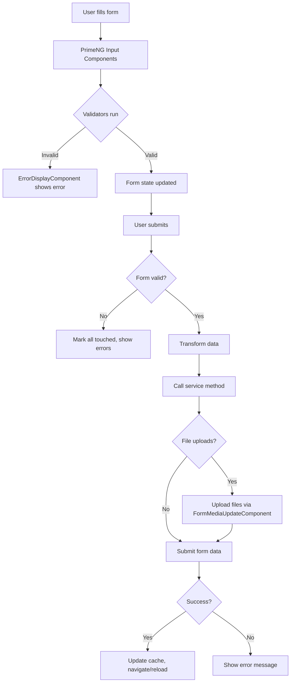


---
name: testing
description: Testing strategy and guidelines
argument-hint: N/A
---

### Testing Guidelines

This document outlines the testing strategies and guidelines for donaction-admin.

#### Tools and Frameworks

- Jasmine v5
- Karma v6
- karma-chrome-launcher
- karma-coverage
- karma-jasmine
- karma-jasmine-html-reporter
- @angular/core/testing TestBed
- zone.js/testing

#### Testing Strategy

- Unit tests for all components, services, guards, pipes, resolvers, interceptors
- Tests co-located with source files using `.spec.ts` suffix
- TestBed configuration for dependency injection and component testing
- Standalone component testing with imports array
- Basic smoke tests ("should create") for all entities

Types of tests implemented:
- Unit Tests (components, services, guards, pipes, interceptors, resolvers)

#### Test Execution Process

- Run tests: `npm test` or `ng test`
- Config in @angular.json under `test` architect section
- Builder: `@angular-devkit/build-angular:karma`
- Polyfills: `zone.js` and `zone.js/testing`
- TypeScript config: @tsconfig.spec.json
- Style language: scss
- Assets: favicon.png, assets folder

#### Mocking and Stubbing

- TestBed.configureTestingModule for dependency injection setup
- TestBed.inject() for service instance retrieval
- TestBed.runInInjectionContext() for functional guards/resolvers
- ComponentFixture for component instance access
- fixture.detectChanges() for change detection triggering
- No functional component mocking (per CLAUDE.md rules)


---
name: api-docs
description: API documentation and specifications
argument-hint: N/A
---

### API Documentation

#### Authentication & Authorization

- **Authentication**: JWT - Strapi users-permissions plugin with JWT token authentication
- **Authorization**: Role-based with custom middlewares - Profile-based permissions (`owner-or-admin`, `admin-editor-or-admin`, `klubr-membre`)
- **Session Management**: JWT tokens - Token stored in user state, validated via `ctx.state.user`

#### Endpoints

- Endpoints file: @donaction-api/src/api/*/routes/*-custom.ts - Custom routes per module
- Base URL: `/api` - Strapi REST API base
- Versioning: None - Single version API
- Format: REST - JSON request/response
- Protocol: HTTPS - Production, HTTP in development

#### Request/Response Formats

- Request format: JSON - Standard REST JSON bodies, multipart/form-data for file uploads
- Response format: JSON - Strapi standard response format with `data`, `meta`, pagination

#### Error Handling

- Error format: JSON - Standard Strapi error format with `error.status`, `error.message`
- Status codes: HTTP standard - 400 (BadRequest), 401 (Unauthorized), 404 (NotFound), 500 (ServerError)
- Error responses: `ctx.badRequest()`, `ctx.unauthorized()`, `ctx.notFound()` - Strapi context methods

#### Key Endpoints

##### Klubr (Clubs)
- `GET /klubrs` - List clubs with filters
- `GET /klubrs/:uuid` - Get club by UUID
- `GET /klubrs/bySlug/:slug/:preview?` - Get club by slug with preview support
- `GET /klubrs/stats-all` - Admin: Get all clubs stats
- `GET /klubrs/:uuid/stats` - Owner/Admin: Get club stats
- `POST /klubrs/new/by-leader/:memberUuid` - Create club from member
- `POST /klubrs/:code/send-invitation` - Send club invitation
- `POST /klubrs/:uuid/create-documents` - Owner/Admin: Generate documents
- `POST /klubrs/:uuid/documents` - Owner/Admin: Upload documents
- `PUT /klubrs/:uuid/documents/validate` - Admin: Validate documents
- `GET /klubrs/:uuid/documents/:doc` - Owner/Admin: Download document

##### Klubr Membres (Members)
- `GET /klubr-membres` - List members
- `GET /klubr-membres/:uuid` - Get member by UUID
- `POST /klubr-membres` - Create member
- `POST /klubr-membres/for-front` - Create member from frontend
- `PUT /klubr-membres/:uuid` - Update member
- `PUT /klubr-membres/for-front/:uuid` - Update member from frontend
- `POST /klubr-membres/link-to-user/:code` - Link member to user account
- `POST /klubr-membres/switch-to/:uuid` - Switch to member profile
- `POST /klubr-membres/switch-to-admin-editor/:klubUuid` - Admin: Switch to admin editor profile
- `POST /klubr-membres/:code/send-invitation` - Send member invitation

##### Invoices
- `GET /invoices` - List user invoices
- `GET /invoices/:id` - Get invoice by ID
- `GET /invoices/generate/:month/:year/:genPdf?/:send?` - Generate invoices for period
- `GET /invoices/:clubUuid/generate/:month/:year/:genPdf?/:send?` - Generate invoices for club
- `GET /invoices/:uuid/pdf` - Generate invoice PDF
- `GET /invoices/:uuid/send` - Send invoice email

##### Donations
- `POST /klub-don-payments/create-payment-intent` - Create Stripe payment intent
- `POST /klub-don-payments/stripe-web-hooks` - Stripe webhook handler (no auth)
- `GET /klub-don-payments/check` - Check payment status

#### Middlewares

##### Custom Middlewares
- `global::request-logger` - Logs all incoming requests
- `api::klubr.owner-or-admin` - Restricts access to club owner or admin
- `api::klubr.admin-editor-or-admin` - Restricts access to admin editor or admin
- `api::klubr.remove-unauthorized-fields` - Sanitizes response fields based on permissions
- `api::invoice.my-invoices` - Restricts invoices to user's own invoices
- `api::klubr-membre.can-create` - Validates member creation permissions
- `api::klubr-membre.can-update` - Validates member update permissions
- `api::klubr-membre.admin` - Admin-only access

##### Built-in Strapi Middlewares
- `strapi::errors` - Global error handler
- `strapi::security` - Security headers and CSP configuration
- `strapi::cors` - CORS configuration
- `strapi::body` - Body parsing with 20MB limit, multipart support

#### Rate Limiting

- Default limit: 25 - Records per page
- Max limit: 100 - Maximum records per page
- Pagination: Enabled with count - `withCount: true`

#### External Integrations

##### Stripe
- Payment processing via Stripe SDK
- Webhook endpoint: `/klub-don-payments/stripe-web-hooks`
- Secret key: `process.env.STRIPE_SECRET_KEY`

##### Brevo (Email)
- Email provider: Brevo SMTP relay
- Configuration: `@donaction-api/config/plugins.ts` email settings
- SDK integration: `sib-api-v3-sdk`

##### ImageKit
- Upload provider: `strapi-provider-upload-imagekit`
- Configuration: `@donaction-api/config/plugins.ts` upload settings
- Folder management for avatars and media

##### Google Cloud
- Authentication library for Google APIs
- Used for club assessments and place data


### Architecture

- [Language/Framework](#languageframework)
  - [Backend](#backend)
    - [Database](#database)
- [Full project structure](#full-project-structure)
  - [Naming Conventions](#naming-conventions)
- [Services communication](#services-communication)
  - [External Services](#external-services)
    - [ImageKit](#imagekit)
    - [Brevo (Sendinblue)](#brevo-sendinblue)
    - [Stripe](#stripe)

#### Language/Framework

##### Backend

- **Language/Framework**: Node.js with TypeScript / Strapi v5 → @donaction-api/package.json
- **API Style**: REST - Strapi auto-generated endpoints with custom routes
- **Architecture**: Strapi CMS with content-types, services, controllers, and lifecycles
- **ORM**: Strapi Query Engine (built-in) - database abstraction layer
- **Schema path**: `src/api/*/content-types/*/schema.json` - JSON schema definitions for content types
- **Endpoints**: `src/api/*/routes/*.ts` - custom routes + Strapi default CRUD
- **Caching**: No explicit caching layer
- **Testing**: No test framework configured

###### Database

- **Type**: PostgreSQL (production) / SQLite (development)
- **ORM/Driver**: `pg` v8 driver with Strapi Query Engine
- **Connection**: Configured via environment variables → @donaction-api/config/database.ts
- **Migration**: Strapi built-in migrations (automatic on schema changes)
- **Seeding**: `strapi import` command with encrypted exports → @donaction-api/data/
- **Mock**: No mock database configured

#### Full project structure

```text
donaction-api/
├── config/                     # Strapi configuration
│   ├── admin.ts               # Admin panel config
│   ├── api.ts                 # API config
│   ├── database.ts            # Database connection config
│   ├── middlewares.ts         # Global middleware config
│   ├── plugins.ts             # Plugin configuration (users-permissions, email, upload, uuid)
│   ├── server.ts              # Server config
│   ├── cronTasks.ts           # Scheduled tasks (project status updates, etc)
│   └── logger.ts              # Logging config
├── src/
│   ├── index.ts               # Bootstrap entry point with lifecycle hooks
│   ├── constants.ts           # Global constants
│   ├── _types.ts              # Global TypeScript types
│   ├── api/                   # Content-type modules (30+ entities)
│   │   ├── klubr/             # Main club entity
│   │   │   ├── content-types/klubr/
│   │   │   │   ├── schema.json          # Content type definition
│   │   │   │   └── lifecycles.ts        # Before/after hooks
│   │   │   ├── controllers/klubr.ts     # Request handlers
│   │   │   ├── services/klubr.ts        # Business logic
│   │   │   ├── routes/
│   │   │   │   ├── klubr.ts             # Default CRUD routes
│   │   │   │   └── klubr-custom.ts      # Custom endpoints
│   │   │   └── middlewares/             # Route-specific middleware
│   │   │       ├── klubr.ts
│   │   │       ├── owner-or-admin.ts
│   │   │       ├── admin-editor-or-admin.ts
│   │   │       └── remove-unauthorized-fields.ts
│   │   ├── [entity]/          # Other entities follow same pattern
│   │   │   ├── content-types/
│   │   │   ├── controllers/
│   │   │   ├── services/
│   │   │   ├── routes/
│   │   │   └── middlewares/
│   │   └── ...                # blog, invoice, klub-don, etc
│   ├── components/            # Reusable Strapi components
│   │   ├── club-header/
│   │   ├── club-chiffres/
│   │   ├── club-presentation/
│   │   └── ...
│   ├── helpers/               # Utility functions
│   │   ├── emails/            # Email sending utilities
│   │   ├── klubrPDF/          # PDF generation (pdf-lib, qrcode)
│   │   ├── gcc/               # Google Cloud Console integration
│   │   ├── users-extensions/  # User auth extensions (register, reset password, etc)
│   │   ├── permissions.ts
│   │   ├── medias.ts
│   │   └── ...
│   ├── extensions/            # Strapi core extensions
│   ├── middlewares/           # Global middleware
│   │   └── request-logger.ts
│   └── plugins/               # Custom plugins
│       └── custom-upload/
├── types/                     # Generated TypeScript types
├── data/                      # Database exports/imports (encrypted)
└── private-pdf/               # PDF template storage
```

##### Naming Conventions

- **Files**: kebab-case for routes/controllers/services, PascalCase for types
- **Functions**: camelCase
- **Variables**: camelCase
- **Constants**: UPPER_SNAKE_CASE
- **Types/Interfaces**: PascalCase with `Entity` suffix for Strapi entities

#### Services communication

##### Strapi Request Flow

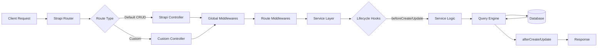

##### External Services

###### ImageKit

- **Purpose**: CDN and image storage provider
- **Integration**: Custom Strapi upload provider `strapi-provider-upload-imagekit`
- **Config**: @donaction-api/config/plugins.ts
- **Usage**: Handles all media uploads with environment-based tagging (production/staging)
- **Lifecycle**: File metadata updated on `beforeCreate` hook → @donaction-api/src/index.ts

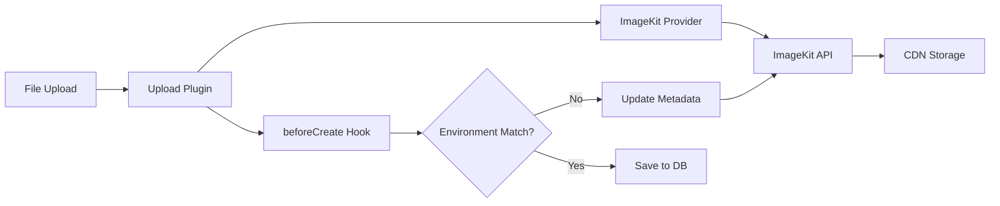

###### Brevo (Sendinblue)

- **Purpose**: Transactional email service (invitations, newsletters)
- **Integration**: `@strapi/provider-email-nodemailer` with Brevo SMTP + `sib-api-v3-sdk` API client
- **Config**: @donaction-api/config/plugins.ts email provider
- **Usage**: `sendBrevoTransacEmail()` helper for templated emails → @donaction-api/src/helpers/emails/
- **Templates**: Predefined template IDs for member invitations, password resets, etc

###### Stripe

- **Purpose**: Payment processing for donations and subscriptions
- **Integration**: `stripe` v17 SDK
- **Config**: API keys via environment variables
- **Usage**: Invoice generation, payment handling → @donaction-api/src/api/invoice/


---
name: coding-assertions
description: Code quality verification checklist
argument-hint: N/A
---

### Coding Guidelines

> Those rules must be minimal because the MUST be checked after EVERY CODE GENERATION.

#### Requirements to complete a feature

**A feature is really completed if ALL of the above are satisfied: if not, iterate to fix all until all are green.**

#### Steps to follow

1. Check their is no duplication
2. Ensure code is re-used
3. Run all those commands, in order to ensure code is perfect:

```markdown
| Order | Command               | Description                  |
|-------|-----------------------|------------------------------|
| 1     | `npm run gen:types`   | Generate TypeScript types    |
| 2     | TypeScript check      | Verify no type errors        |
| 3     | `npm run build`       | Build Strapi application     |
```

#### Backend-Specific Coding Patterns

##### Framework & Architecture

- Strapi v5 headless CMS using `@strapi/strapi`
- TypeScript with `strict: false` but `noImplicitThis: true`
- Node.js runtime with CommonJS modules
- PostgreSQL database (production), SQLite (dev)

##### Core Dependencies

- `@strapi/strapi` v5
- `stripe` for payments
- `sib-api-v3-sdk` for Brevo email service
- `pdf-lib` for PDF generation
- `pg` v8 for PostgreSQL
- `imagekit` for media handling

##### TypeScript Usage

- Use Strapi generated types from `@strapi/strapi`
- Entity types defined in `@/src/_types.ts` using `Data.ContentType<>`
- Use `Core.Strapi` type for strapi instance
- Context type from `koa`
- `@ts-ignore` used sparingly for Strapi API limitations
- Use generic types with `factories.createCoreController()` and `factories.createCoreService()`

##### Controllers Pattern

- Use `factories.createCoreController()` from `@strapi/strapi`
- Access context via `strapi.requestContext.get()`
- Return sanitized data using `this.sanitizeOutput()`
- Use helper `removeId()` to remove internal ids from responses
- Use `ctx.badRequest()`, `ctx.notFound()`, `ctx.unauthorized()`, `ctx.forbidden()` for errors
- Always validate query params with `await this.validateQuery(ctx)`
- Always sanitize query params with `await this.sanitizeQuery(ctx)`

##### Services Pattern

- Use `factories.createCoreService()` from `@strapi/strapi`
- Business logic separated from controllers
- Pure functions for data transformations
- Helper functions like `countEmptyFields()`, `countDocs()` as private module functions

##### Database Access

- Use `strapi.db.query()` for direct database queries with populate
- Use `strapi.documents()` for CRUD operations on content types
- Use `strapi.service()` to access services
- Always specify populate when needed
- Use `where` clauses with operators like `$eq`, `$ne`, `$in`, `$notIn`, `$and`, `$or`
- Use `findOne()`, `findMany()`, `findWithCount()`, `create()`, `update()` methods

##### Middlewares Pattern

- Export default function with `config` and `{ strapi }`
- Return async function with `ctx, next` parameters
- Check permissions using helpers from `@/src/helpers/permissions.ts`
- Always call `await next()` when passing to next middleware
- Use `ctx.unauthorized()` or `ctx.forbidden()` for auth failures

##### Lifecycle Hooks

- Implement in `content-types/<name>/lifecycles.ts`
- Export object with lifecycle methods: `beforeCreate`, `beforeUpdate`, `afterCreate`, etc.
- Receive `LifecycleEvent<T>` with `params.data`, `params.where`, `result`
- Modify `event.params.data` to change data before save
- Use for UUID generation, data validation, side effects

##### Error Handling

- Use `try/catch` blocks in controllers
- Log errors with `console.error()` or `console.log()`
- Return appropriate HTTP status via context methods
- No silent failures - always throw or return error response
- Use `ctx.internalServerError()` for unexpected errors

##### Code Organization

- Controllers in `@/src/api/<entity>/controllers/`
- Services in `@/src/api/<entity>/services/`
- Routes in `@/src/api/<entity>/routes/`
- Middlewares in `@/src/api/<entity>/middlewares/`
- Helpers in `@/src/helpers/`
- Types in `@/src/_types.ts`
- Config files in `@/config/` using TypeScript

##### Helper Functions

- Pure functions exported from `@/src/helpers/`
- Permission checks in `permissions.ts`
- Sanitization functions in `sanitizeHelpers.ts`
- Email sending in `emails/sendBrevoTransacEmail.ts`
- Media transformations in `medias.ts`
- Constants for roles, statuses in dedicated files

##### Email Handling

- Use `sendBrevoTransacEmail()` from helpers
- Template IDs from `BREVO_TEMPLATES` enum
- Include `tags` array for categorization
- Attachments as array of `{ filename, path }`
- Dynamic params for template variables

##### Configuration Files

- @config/database.ts for database config
- @config/middlewares.ts for middleware stack
- @config/api.ts for API settings
- @config/plugins.ts for plugin configuration
- All use arrow functions with `({ env })` parameter

##### Naming Conventions

- Entity types: `EntityNameEntity` (e.g., `KlubrEntity`)
- Service methods: descriptive verbs (e.g., `sendInvitationEmail`)
- Private helpers: camelCase module-level functions
- Database fields: camelCase
- Constants: UPPER_SNAKE_CASE

##### Security Practices

- Always check user permissions in middlewares
- Sanitize all inputs and outputs
- Remove sensitive fields (`removeId`, `removeCodes`)
- Use environment variables for secrets
- Validate all external data
- CORS configured in middlewares
- Content Security Policy configured

##### Best Practices

- No code duplication - extract to helpers
- Single responsibility per function
- Explicit error messages in French for user-facing errors
- Console logs for debugging (not production-ready)
- Use destructuring for cleaner code
- Prefer `async/await` over promises
- Keep controllers thin, logic in services
- Use TypeScript for type safety despite `strict: false`


### Database

This part provides detailed information about the database used in the project, including its type, connection details, migration strategies, and tools for seeding and mocking data.

#### Information

- **Schema path**: @donaction-api/src/api/*/content-types/*/schema.json
- **Type**: PostgreSQL (production), SQLite (dev), MySQL (supported)
- **ORM/Driver**: Strapi 5 (built on Knex.js), `pg` driver v8
- **Connection**: @donaction-api/config/database.ts with multi-client support

#### Main entities and relationships

Core entities managing club donations, memberships, projects, and invoicing:

**Club management**:
- `klubr`: Main club entity with federation relations, logo, address, members count
- `klubr-house`: OneToOne with `klubr` (club house details)
- `klubr-info`: OneToOne with `klubr` (additional club information)
- `klubr-document`: OneToOne with `klubr` (club documents)
- `klubr-membre`: Club members
- `klubr-subscription`: ManyToOne with `klubr` (subscriptions with API tokens)
- `federation`: ManyToOne relation with `klubr` (clubs can belong to federations)

**Donation system**:
- `klub-don`: Donations with relations to `klubr-donateur`, `klubr`, `klub-projet`, `invoice`, `invoice-line`
- `klubr-donateur`: Donor entity (Particulier/Organisme) with OneToOne to `klub-don` and `users-permissions.user`
- `klub-don-payment`: OneToMany with `klub-don` (payment tracking)
- `klub-projet`: Projects with OneToOne to `klubr`, funding goals, dynamic content zones

**Invoicing**:
- `invoice`: Invoices with OneToMany to `klub-dons` and `invoice-lines`, OneToOne to `klubr`
- `invoice-line`: ManyToOne with `invoice` and `klub-don`

**Content**:
- `blog`, `newsletter`: Content types
- `page-*`: Static pages (home, contact, mecenat, cookie, liste-don)
- `template-projects-*`: Project templates with categories

**Other**:
- `cgu`, `cgu-klub`: Terms and conditions
- `trade-policy`: Trade policies
- `mecenat-reassurance`: Sponsorship reassurance content

**Plugins**:
- `users-permissions`: User authentication
- `strapi-advanced-uuid`: UUID generation for entities
- `strapi-plugin-color-picker`: Color selection
- `strapi-provider-upload-imagekit`: Image storage

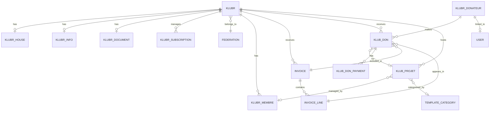

#### Migrations

Strapi 5 built-in migrations - Auto-generated on schema changes, stored in `database/migrations/`

#### Seeding

Strapi import/export commands:
- `npm run export-db`: Export DB to `data/strapi-export`
- `npm run import-db`: Import DB from `data/strapi-export.tar.gz.enc`
- Both use encryption key for security


---
name: testing
description: Testing strategy and guidelines
argument-hint: N/A
---

### Testing Guidelines

#### Tools and Frameworks

**Currently not configured** - No testing framework is set up in donaction-api.

#### Testing Strategy

- No formal testing strategy implemented
- Manual testing via Strapi admin panel
- API testing through Strapi development mode endpoints

#### Test Execution Process

No test scripts available in @donaction-api/package.json

#### Mocking and Stubbing

Not applicable - no testing framework configured


---
name: architecture
description: Module architecture and structure
argument-hint: N/A
---

### Architecture

- [Language/Framework](#languageframework)
  - [Frontend](#frontend)
- [Full project structure](#full-project-structure)
  - [Naming Conventions](#naming-conventions)
- [Services communication](#services-communication)
  - [Data Flow](#data-flow)
  - [External Services](#external-services)
    - [Strapi CMS](#strapi-cms)
    - [Stripe](#stripe)
    - [NextAuth](#nextauth)

#### Language/Framework

##### Frontend

- **Framework**: Next.js 14 (App Router) → @donaction-frontend/package.json
- **UI Library**: TailwindCSS + SCSS - Utility-first CSS with custom theme system
- **Routing**: Next.js App Router - File-based routing with route groups
- **Data Fetching**: Native `fetch` with `HttpService` wrapper - Custom service layer handling SSR/CSR
- **Form Handling**: Native React state - No dedicated form library
- **Validation**: Manual validation - Client-side checks in form components
- **State Management**: Redux Toolkit (`@reduxjs/toolkit`) - Global state with slices for auth, sponsors, projects, root
- **Build Tool**: Next.js built-in - Webpack-based bundler with standalone output
- **Structure**: Feature-based - Organized by domains (core, layouts, app)

#### Full project structure

```text
donaction-frontend/
├── src/
│   ├── app/                      # Next.js App Router pages
│   │   ├── (main)/              # Route group for public pages
│   │   │   ├── clubs/           # Clubs listing
│   │   │   ├── projets/         # Projects listing
│   │   │   ├── mecenat/         # Sponsorship info
│   │   │   ├── mes-dons/        # User donations
│   │   │   └── page.tsx         # Homepage
│   │   ├── (auth)/              # Route group for auth pages
│   │   ├── [slug]/              # Dynamic club pages
│   │   ├── api/                 # API routes
│   │   │   ├── auth/[...nextauth]/  # NextAuth handler
│   │   │   ├── create-payment-intent/  # Stripe integration
│   │   │   └── [...fetch]/      # Proxy to backend
│   │   ├── layout.tsx           # Root layout with providers
│   │   └── Providers.tsx        # Redux + NextAuth + PrimeReact providers
│   ├── core/                    # Business logic layer
│   │   ├── services/            # API communication
│   │   │   ├── club/            # Club-related API calls
│   │   │   ├── don/             # Donation API calls
│   │   │   ├── projet/          # Project API calls
│   │   │   ├── auth/            # Authentication API calls
│   │   │   ├── donateur/        # Donor API calls
│   │   │   ├── cms/             # CMS content API calls
│   │   │   ├── index.ts         # HttpService wrapper
│   │   │   └── endpoints.ts     # All API endpoint definitions
│   │   ├── store/               # Redux store
│   │   │   ├── modules/         # Redux slices
│   │   │   │   ├── authSlice.ts
│   │   │   │   ├── projectSlice.ts
│   │   │   │   ├── sponsorsSlice.ts
│   │   │   │   └── rootSlice.ts
│   │   │   └── index.ts         # Store configuration
│   │   ├── models/              # TypeScript interfaces/types
│   │   │   ├── club/
│   │   │   ├── klub-don/
│   │   │   ├── klub-project/
│   │   │   ├── klubr-donateur/
│   │   │   ├── user/
│   │   │   └── cms/
│   │   ├── hooks/               # Custom React hooks
│   │   ├── helpers/             # Utility functions
│   │   ├── constants/           # Application constants
│   │   └── enum/                # Enumerations
│   ├── layouts/                 # UI components
│   │   ├── partials/            # Page sections
│   │   │   ├── clubPage/
│   │   │   ├── projectPage/
│   │   │   ├── mecenatPage/
│   │   │   ├── profilePage/
│   │   │   ├── sponsorshipForm/
│   │   │   ├── authentication/
│   │   │   └── common/
│   │   └── components/          # Reusable UI components
│   │       ├── dropdownList/
│   │       ├── popUp/
│   │       ├── toaster/
│   │       └── media/
│   ├── config/                  # Configuration files
│   │   ├── config.json          # Site configuration
│   │   └── theme.json           # Theme configuration
│   ├── styles/                  # Global styles
│   │   ├── main.scss            # Main stylesheet entry
│   │   ├── base.scss
│   │   ├── buttons.scss
│   │   └── utilities.scss
│   └── types/                   # Global TypeScript types
├── next.config.js               # Next.js configuration
├── tailwind.config.js           # TailwindCSS configuration
└── tsconfig.json                # TypeScript configuration
```

##### Naming Conventions

- **Files**: kebab-case for pages, camelCase for components
- **Components**: PascalCase
- **Functions**: camelCase
- **Variables**: camelCase
- **Constants**: UPPER_CASE
- **Types/Interfaces**: PascalCase

#### Services communication

##### Data Flow

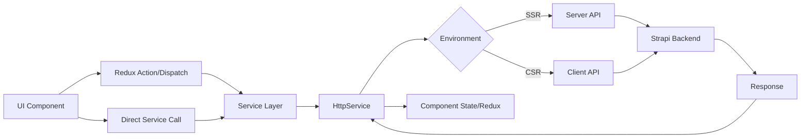

##### External Services

###### Strapi CMS

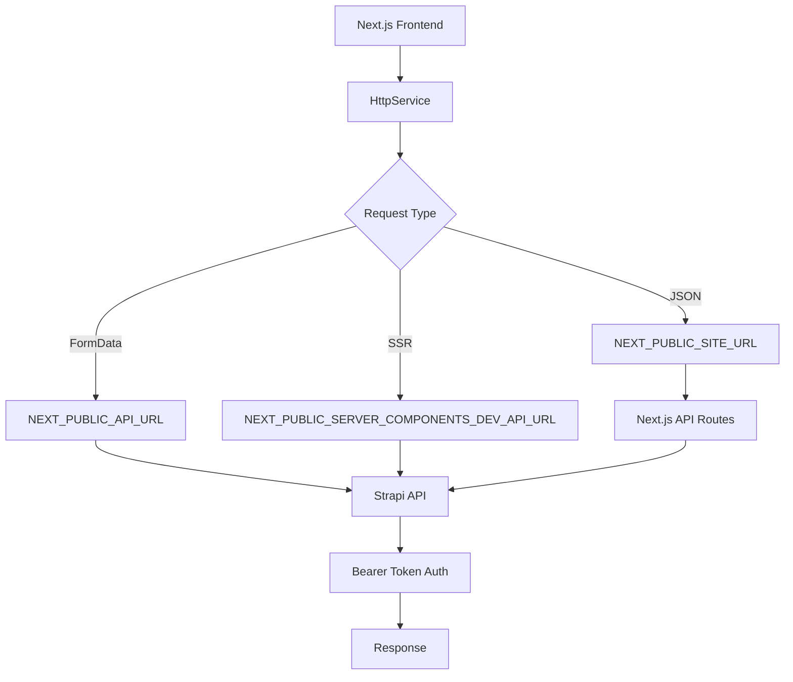

###### Stripe

```mermaid
graph LR
    A[Payment Form] --> B[create-payment-intent API]
    B --> C[@stripe/stripe-js]
    C --> D[Stripe API]
    D --> E[Payment Intent]
    E --> F[@stripe/react-stripe-js]
    F --> G[Payment Confirmation]
    G --> H[klub-don-payments endpoint]
```

###### NextAuth

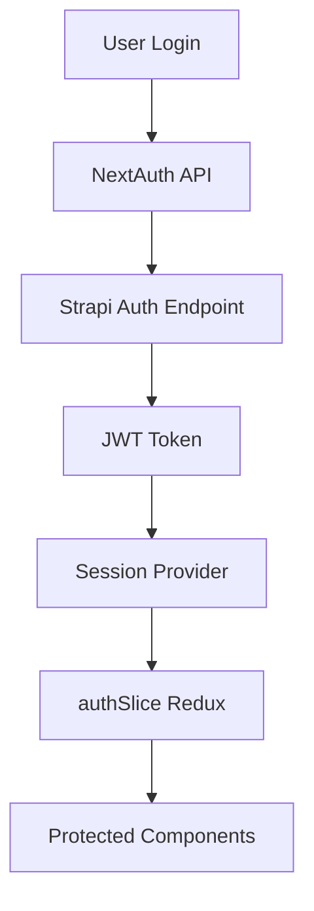


### Backend Communication

#### API Client Setup

##### Base Configuration

@donaction-frontend/src/core/services/endpoints.ts
@donaction-frontend/src/core/services/index.ts

- Environment URLs via `process.env`
- `NEXT_PUBLIC_API_URL` for Strapi backend
- `NEXT_PUBLIC_SERVER_COMPONENTS_DEV_API_URL` for server-side calls
- `NEXT_PUBLIC_SITE_URL` for internal Next.js routes

##### HTTP Service

**Location**: `src/core/services/index.ts`

**Core Features**:
- Native `fetch` API wrapper
- Automatic Bearer token injection via `NEXT_PUBLIC_STRAPI_API_TOKEN`
- SSR/CSR URL switching based on `typeof window === 'undefined'`
- FormData support with `isFormData` flag
- Response type handling: `json` (default) | `blob`
- Next.js revalidation tags support via `tags` array
- Cache control with `noCache` flag and `cache` option

**Request Interface**:
```typescript
ExecutorInterface {
  endPoint: string
  method?: 'get' | 'post' | 'put' | 'delete'
  data?: Record<string, any>
  headers?: Record<string, any>
  isFormData?: boolean
  responseType?: 'blob' | 'json'
  tags?: Array<string>
  noCache?: boolean
  cookies?: string
  useDefaultHttp?: boolean
}
```

#### Authentication Flow

##### NextAuth Integration

@donaction-frontend/src/app/api/auth/[...nextauth]/route.ts

**Providers**:
- Google OAuth via `GoogleProvider`
- Credentials (email/password) via `CredentialsProvider`

**Session Strategy**: JWT-based, 30-day expiry

**Token Flow**:
1. `authorize()` calls backend `/api/auth/local` (credentials) or Google callback
2. JWT stored in token with user ID
3. Session callback fetches fresh user data via `me()` endpoint
4. Updates `lastLogin` timestamp on each session refresh

**Key Callbacks**:
- `jwt()`: Stores backend JWT and user ID in NextAuth token
- `session()`: Fetches current user data from Strapi using stored JWT

##### Auth Service Layer

@donaction-frontend/src/core/services/auth/index.ts

**Endpoints**:
- `me()` - GET `/api/users/me` with role, klubr_membres, avatar
- `login()` - POST `/api/strapi-auth/local`
- `register()` - POST `/api/strapi-auth/local/register`
- `postForgotPassword()` - POST `/api/strapi-auth/forgot-password`
- `postResetPassword()` - POST `/api/strapi-auth/reset-password`
- `changePassword()` - POST `/api/strapi-auth/change-password`
- `update()` - PUT `/api/users/:id`
- `updateUserImg()` - POST `/api/medias/user/:uuid/files` (FormData)
- `uploadCompanyLogo()` - POST `/api/medias/klubr-donateur/:uuid/files` (FormData)
- `checkUserExistence()` - GET `/api/users-permissions/users/exists/:email`
- `getAvatars()` - GET `/api/medias/avatars/:type`

##### State Management

@donaction-frontend/src/core/store/modules/authSlice.ts

- Redux Toolkit slice for session state
- Stores NextAuth session data
- Status: `'loading'` | `'authenticated'` | `'unauthenticated'`

#### API Patterns

##### Endpoint Organization

@donaction-frontend/src/core/services/endpoints.ts

**Strapi Entities**:
- Clubs: `/api/klubrs`
- Projects: `/api/klub-projets`
- Donations: `/api/klub-dons`
- Donors: `/api/klubr-donateurs`
- CMS: `/api/page-*`, `/api/cgu*`, `/api/page-cookie`

**Naming Convention**: `GET_<ENTITY>_<ACTION>`
- `GET_KLUB_BY_SLUG(slug)` returns parameterized endpoint string
- Functions accept pagination: `page`, `pageSize`
- UUID vs slug variants for flexible querying

##### Service Modules

**Club Service** - `src/core/services/club/index.ts`:
- `getAllClubs()`, `getClubDetailBySlug()`, `getClubHouse()`
- Preview mode support with `isPreview` flag
- Tags: `TagsEnum.Club_ClubHouse_Slugs`, `TagsEnum.AllClubs`

**Project Service** - `src/core/services/projet/index.ts`:
- `getProjets()`, `getProjetDetail()`, `getProjetsByKlub()`
- Tags: `TagsEnum.PROJECTS`, `TagsEnum.GetProjectDetail`

**Donation Service** - `src/core/services/don/index.ts`:
- `getDonsByKlubOrProjet()`, `postDon()`, `putDon()`
- Payment: `createKlubDonPayment()`, `updateKlubDonPayment()`
- Tags: `TagsEnum.DONATIONS`, `TagsEnum.GetMyDonations`

**Donor Service** - `src/core/services/donateur/index.ts`:
- `getDonateur()`, `postDonateur()`, `putDonateur()`

**CMS Service** - `src/core/services/cms/index.ts`:
- `getHp()`, `getMecenat()`, `getCGU()`, `getCookies()`
- Forms: `postContactUs()`, `postNewsletters()`
- reCAPTCHA integration via `grecaptcha.enterprise`

#### Data Fetching Strategies

##### SSR with Revalidation Tags

- Server Components use `tags` for on-demand revalidation
- Tags organized by entity group (e.g., `TagsEnum.Club_ClubHouse_Slugs`)
- Cache bypass with `noCache: true` for authenticated/preview content

##### CSR with Redux

- Client-side state in Redux for user session
- React hooks fetch data directly via service functions
- Cookie forwarding for SSR context: `cookies().toString()`

##### Hybrid: Next.js API Routes as Proxy

@donaction-frontend/src/app/api/[...fetch]/route.ts

**Purpose**: Unified proxy for all Strapi requests

**Features**:
- Rewrites `/strapi-auth` to `/auth`
- Token switching: user JWT vs API token based on endpoint
- User endpoints: `/api/users`, `/api/klub-dons/my-dons`, `/api/klubr-donateurs/my-last`
- Preview mode detection via `isPreviewMode` cookie
- Blob response streaming for file downloads
- Automatic `Strapi-Response-Format: v4` header

**Token Logic**:
```typescript
// User-specific endpoints use NextAuth JWT
if (USER_TOKEN_ENDPOINTS.includes(endpoint)) {
  const token = await getToken({ req })
  TOKEN = token?.jwt || API_TOKEN
}
```

#### External Integrations

##### Stripe Payment

@donaction-frontend/src/app/api/create-payment-intent/route.ts

- Endpoint: `/api/create-payment-intent`
- Creates Stripe PaymentIntent via server-side Stripe SDK
- Converts price to cents (multiply by 100)
- Currency: EUR
- Client receives `client_secret` for Stripe Elements

##### Google OAuth

- Provider: `next-auth/providers/google`
- Callback URL: `${BACKEND}/api/auth/google/callback?access_token=<token>`
- Backend returns JWT, stored in NextAuth session

#### Error Handling

- HTTP Service: Promise rejection with raw response
- API Routes: Status codes preserved, JSON error responses
- Session errors: `logout: true` flag triggers client-side logout

#### Cache Strategy

- Public content: Default Next.js caching with tags
- Authenticated: `cache: 'no-cache'`
- Preview mode: Always `noCache: true`
- Blob responses: No cache

#### Key Dependencies

@donaction-frontend/package.json

- `next` ^14
- `next-auth` ^4
- `@stripe/stripe-js` ^2
- `@stripe/react-stripe-js` ^2
- `stripe` ^14
- `@reduxjs/toolkit` ^2
- `react-redux` ^9


---
name: coding-assertions
description: Code quality verification checklist
argument-hint: N/A
---

### Coding Guidelines

> Those rules must be minimal because the MUST be checked after EVERY CODE GENERATION.

#### Requirements to complete a feature

**A feature is really completed if ALL of the above are satisfied: if not, iterate to fix all until all are green.**

#### Steps to follow

1. Check their is no duplication
2. Ensure code is re-used
3. Run all those commands, in order to ensure code is perfect:

```markdown
| Order | Command               | Description                  |
|-------|-----------------------|------------------------------|
| 1     | yarn lint             | ESLint check                 |
| 2     | yarn format           | Format with Prettier         |
| 3     | yarn build            | Next.js production build     |
```

#### TypeScript Configuration

Config: @donaction-frontend/tsconfig.json

- Strict mode enabled (`"strict": true`)
- Target ES6
- Module resolution: Node
- Path aliases configured:
  - `@/components/*` → `./src/layouts/components/*`
  - `@/shortcodes/*` → `./src/layouts/shortcodes/*`
  - `@/helpers/*` → `./src/layouts/helpers/*`
  - `@/partials/*` → `./src/layouts/partials/*`
  - `@/shapes` → `./src/shapes`
  - `@/*` → `./src/*`

#### Component Structure

- Client components: Use `'use client'` directive at top of file
- Component files: Named `index.tsx` in feature folders
- Custom hooks: Separate files prefixed with `use` (e.g., `useLoginForm.ts`)
- Constants: Separate `consts.ts` files when needed

#### Naming Conventions

- Components: PascalCase (e.g., `LoginForm`)
- Hooks: camelCase with `use` prefix (e.g., `useLoginForm`)
- Files: kebab-case for folders, `index.tsx` for components
- Types/Interfaces: PascalCase with `I` prefix for interfaces when appropriate

#### TypeScript Patterns

- Prefer `interface` for object shapes with properties
- Use `type` for unions, intersections, mapped types
- Export types from `@/core/models/` by domain
- Use `Omit` and `Pick` utilities for type composition
- Typed Redux hooks: `useAppDispatch`, `useAppSelector`, `useAppStore`

#### State Management

- Redux Toolkit for global state (@reduxjs/toolkit)
- Typed hooks from `@/core/store/hooks`
- Local state with `useState` for component-specific data
- `useRef` for non-rendering state (e.g., validation feedback)
- Dispatch actions via `useAppDispatch`

#### React Patterns

- Functional components only
- Custom hooks for business logic separation
- Props destructuring in component signature
- Conditional rendering with ternary or `&&`
- Event handlers: Arrow functions or extracted functions

#### HTTP Services

- Centralized `HttpService.ExecuteRequest` in `@/core/services`
- Service functions exported from domain folders (e.g., `@/core/services/auth`)
- Promises returned, no internal error handling
- Cookie support via optional `cookies` parameter
- FormData support via `isFormData` flag

#### Error Handling

- Services return rejected promises on error
- Components use try/catch in async handlers
- Toast notifications via Redux (`pushToast`)
- GA event tracking for errors (`sendGaEvent`)
- Silent catch discouraged, always notify user

#### Forms & Validation

- Custom validation pattern with `FeedbackParamsType`
- `receivedFeedbacks` ref to collect validation results
- `triggerValidation` counter to trigger revalidation
- `process.nextTick` for async validation checks
- Form state in custom hooks (e.g., `useLoginForm`)

#### Next.js Specifics

Config: @donaction-frontend/next.config.js

- App Router (Next.js 14)
- `reactStrictMode: false`
- Remote images from: `lh3.googleusercontent.com`, `res.cloudinary.com`, `ik.imagekit.io`, `cdn.kcak11.com`
- Output: `standalone`
- Bundle analyzer enabled via `ANALYZE=true`

#### Styling

Config: @donaction-frontend/.prettierrc

- Prettier for formatting
- Tabs for indentation (`"useTabs": true`)
- Tab width: 2
- Print width: 100
- Single quotes for strings
- JSX single quotes
- Trailing commas: all
- Tailwind CSS for styling

#### Code Quality

- No `console.log` in production code (55 instances found - should be removed)
- Prefer early returns over nested conditionals
- Extract complex logic into custom hooks
- Keep components focused on rendering
- Colocate related files (component + hook + consts)

#### Dependencies

Key libraries:
- `next` (14)
- `react` (18)
- `next-auth` (4) for authentication
- `@reduxjs/toolkit` (2) for state
- `primereact` (10) for UI components
- `stripe` (14) for payments
- `swiper` (11) for carousels
- `react-icons` (4) for icons
- `date-fns` (2) for dates

#### File Organization

```
src/
├── app/              # Next.js app router
├── config/           # App configuration
├── core/             # Core functionality
│   ├── helpers/      # Utility functions
│   ├── hooks/        # Shared hooks
│   ├── models/       # TypeScript types by domain
│   ├── services/     # API services by domain
│   └── store/        # Redux store
├── layouts/          # Layout components
│   ├── components/   # Reusable components
│   ├── partials/     # Page partials
│   └── shortcodes/   # Content shortcodes
├── middleware.ts     # Next.js middleware
├── styles/           # Global styles
└── types/            # Global type definitions
```


---
name: design
description: Design system and UI guidelines
argument-hint: N/A
---

### DESIGN.md

#### Design Implementation

- **Design System Approach**: Centralized theme config with Tailwind + SCSS for component-specific styling
- **Styling Method**: Hybrid - Tailwind utility classes + SCSS modules for complex components

#### Design System Files

- **Theme Config**: @donaction-frontend/src/config/theme.json (colors, fonts) + @donaction-frontend/tailwind.config.js (Tailwind configuration)
- **Design Components**: @donaction-frontend/src/layouts/components (reusable UI components)
- **Style Guidelines**: @donaction-frontend/src/styles/main.scss (base, buttons, utilities layers)

#### Design System

- **Spacing Scale**: Tailwind defaults with custom container padding `1.5rem`
- **Border Radius**: `rounded-md` for buttons, `rounded-3xl` for cards, `rounded-xl` for dropdowns
- **Shadows**: Custom utilities - `shadow-default`, `shadow-xs`, `shadow-sm`, `shadow-md`, `boxBoxShadow` class, `shadow-button` for buttons
- **Breakpoints**: Custom - `xs: 480px`, `sm: 575px`, `md: 768px`, `lg: 1024px`, `xl: 1320px`

- **Color Palette**: See @donaction-frontend/src/config/theme.json

  - Primary: `#000` (black) - Main brand, buttons, text headings
  - Secondary: `#73cfa8` (green) - Accent actions
  - Tertiary: `#fb9289` (coral) - Secondary accent
  - Quaternary: `#fde179` (yellow) - Highlights
  - Quinary: `#73b1ff` (blue) - Info states
  - Senary: `#F4FDFF` (light cyan) - Light backgrounds
  - Body: `#fff` (white) - Main background
  - Border: `#DBDBDB` (light gray) - Borders
  - Text: `#555555` (gray) - Body text
  - Text Dark: `#222222` - Dark text
  - Text Light: `#fffefe` - Light text

- **Typography**: See @donaction-frontend/src/config/theme.json
  - Primary Font: Maven Pro (400, 500, 600, 700) - All text
  - Fallback: sans-serif
  - Base size: `16px`, Scale: `1.23` (exponential heading scale)

#### Component Standards and Variantes

- **Button Variants**: `.btn-primary` (filled black), `.btn-outline-primary` (white with black border), sizes: default, `.btn-sm`, `.btn-md`, `.btn-icon` (with icons)
- **Input States**: Default with border, focus ring on dark color, custom select dropdown styling, disabled states handled via Tailwind forms plugin
- **Card Patterns**: `box-shadow` utility, rounded corners `rounded-3xl`, ring states for selection `ring-4 ring-[#CECECE]`

#### Layout System

- **Grid System**: Tailwind flexbox + CSS Grid - responsive with breakpoint-specific flex directions
- **Container Widths**: Custom `.minMaxWidth` class - `max-width: min(75vw, 1220px)`, `min-width: min(740px, 100%)`, responsive container with `center: true`
- **Spacing Rules**: Tailwind spacing scale - consistent use of `gap-*`, `p-*`, `m-*` utilities, component-specific SCSS for complex layouts

#### Accessibility

- **Color Contrast**: High contrast with black primary and white backgrounds - meets WCAG standards
- **Focus Management**: Custom focus styles with `focus:ring` and `focus:border-dark`, keyboard navigation supported
- **Screen Reader**: ARIA labels on interactive elements (`aria-label` on buttons), semantic HTML structure


---
name: forms
description: Frontend form handling guidelines
argument-hint: N/A
---

### Forms

This part describe how frontend forms are handled in the project, including libraries used, validation strategies, and state management.

#### State Management

- Custom form state management using `useState` hooks
- Local component state with refs (`useRef`) for form values and validation feedback
- Form config object pattern: `config` state holds `defaultValues`, `triggerValidation`, and `DEFAULT_FEEDBACK`
- Redux Toolkit for global state (authentication status, toasts, etc.)
- State updates via callback pattern through `DEFAULT_FEEDBACK` function
- `process.nextTick()` for async validation aggregation before submission

#### Validation

- Custom validation functions in `validations.ts`
- Client-side validation using regex patterns: `emailRexExp`, `sirenRexExp`, `stringRexExp`, `stringWithoutNumbersRexExp`
- Validation functions: `validateEmail`, `validateRequired`, `validateString`, `validatePassword`, `validateSame`, `validateTrue`, `validateSiren`, `validateAmount`, `validateDate`, `validateDateMajor`, `validateSelection`
- Validation triggered on `blur` and `onChange` events (after first edit)
- Feedback collected in `receivedFeedbacks` ref array with `{ attribute, cast, isValid }` structure
- Type casting enforced via `cast` property (BooleanConstructor, StringConstructor, NumberConstructor)

#### Error handling

- Inline error messages displayed below input fields in `<small>` tags
- Error messages returned by validation functions (e.g., "Ce champ est obligatoire")
- Visual feedback via CSS classes: `valid`, `invalid`
- Toast notifications via Redux `pushToast` action for server errors
- Google Analytics event tracking for errors using `sendGaEvent`

#### Form Flow

User fills form → `onChange`/`onBlur` trigger validation → `feedback()` collects results → on submit, `triggerFieldsValidation()` increments counter → all fields re-validate → check `receivedFeedbacks` for validity → if valid, create reCAPTCHA token → submit to API (postDon/putDon, postDonateur/putDonateur) → handle success/error → navigate to next step or show error toast

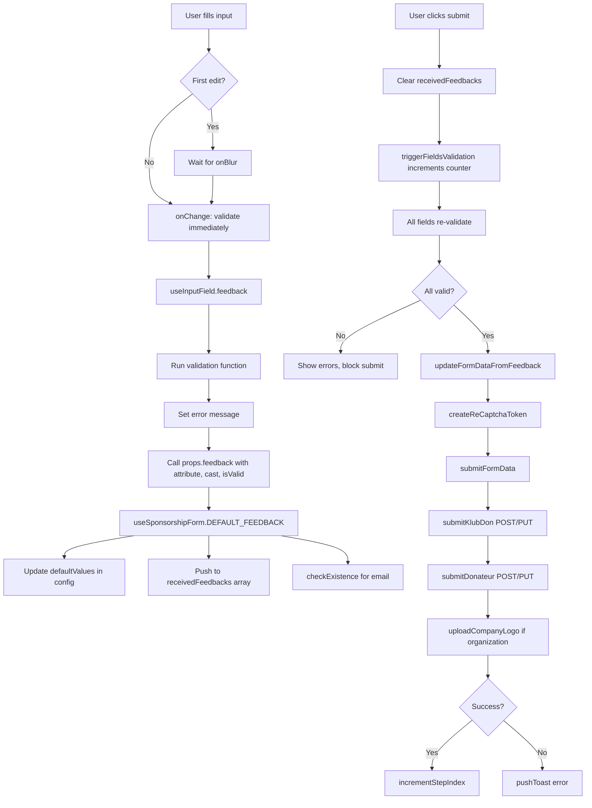


### Testing Guidelines

This document outlines the testing strategies and guidelines for donaction-frontend.

#### Test Coverage

- No test coverage currently implemented
- No testing framework configured
- 193 source files without tests

#### Tools and Frameworks

- No testing framework installed
- ESLint via `eslint-config-next`
- Prettier for code formatting
- TypeScript for type checking

#### Testing Strategy

- No formal testing strategy defined
- No unit tests
- No integration tests
- No E2E tests
- Manual testing through development environment

#### Test Execution Process

- No test execution scripts available
- Linting: `yarn lint`
- Format: `yarn format`
- Development: `yarn dev`
- Build validation: `yarn build`

#### Mocking and Stubbing

- Not applicable - no testing framework configured


### Architecture

- [Language/Framework](#languageframework)
  - [Frontend](#frontend)
- [Full project structure](#full-project-structure)
  - [Naming Conventions](#naming-conventions)
- [Services communication](#services-communication)
  - [Form Workflow](#form-workflow)
  - [External Services](#external-services)
    - [Stripe](#stripe)
    - [Google Services](#google-services)
    - [Analytics](#analytics)

#### Language/Framework

##### Frontend

- **Framework**: Svelte 5 → @donaction-saas/package.json
- **Component Type**: Web Components (Custom Elements)
- **Routing**: N/A - Single component module
- **Data Fetching**: Custom fetch util with event bus pattern
- **Form Handling**: Multi-step form with reactive state
- **Validation**: Custom validators with Svelte directives
- **State Management**: Svelte stores (`writable`) + Svelte 5 `$state` reactivity
- **Build Tool**: Vite with individual component builds
- **Structure**: Component-based with logic separation

#### Full project structure

```text
donaction-saas/
├── src/
│   ├── assets/           # Static assets
│   │   ├── animations/   # Lottie JSON files
│   │   ├── fonts/        # Custom fonts
│   │   └── icons/        # SVG icons
│   ├── components/       # Web components
│   │   └── sponsorshipForm/
│   │       ├── components/     # Sub-components (breadcrumb, formBanner, formBody, formNavigation, etc)
│   │       ├── logic/          # Business logic (api, stripe, validator, state management)
│   │       ├── index.svelte    # Main component entry
│   │       └── index.scss      # Component styles
│   ├── types/            # TypeScript type definitions
│   ├── utils/            # Shared utilities (eventBus, fetch, analytics)
│   └── main.ts           # Entry point
├── build/                # Build output
│   └── donaction-web-components/
│       └── components/   # Individual component builds
├── vite.config.ts              # Production build config
└── vite.config.development.ts  # Development build config
```

##### Naming Conventions

- **Files**: kebab-case for directories, PascalCase for components
- **Components**: PascalCase
- **Functions**: camelCase
- **Variables**: camelCase
- **Constants**: UPPER_CASE
- **Types/Interfaces**: PascalCase

#### Services communication

##### Form Workflow

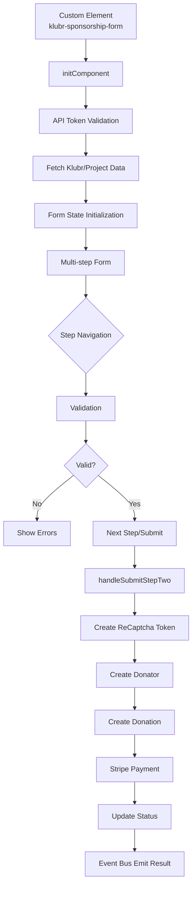

##### External Services

###### Stripe

- **Purpose**: Payment processing
- **Integration**: `@stripe/stripe-js` library
- **Flow**: Stripe Elements injected via slot → Payment creation → Confirmation
- **Files**: `logic/stripe.ts`

###### Google Services

- **ReCAPTCHA Enterprise**: Bot protection for form submission
- **Google Maps API**: Address autocomplete with Places library
- **Integration**: Script tags loaded in main component
- **Config**: Environment variables `VITE_GOOGLE_RECAPTCHA_SITE_KEY`, `VITE_GOOGLE_MAPS_KEY`

###### Analytics

- **Plausible**: Privacy-focused analytics tracking
- **Google Analytics**: Event tracking via `sendGaEvent`
- **Events**: Form navigation, open/close, step transitions
- **Config**: `VITE_ACTIVATE_ANALYTICS` flag


---
name: coding-assertions
description: Code quality verification checklist
argument-hint: N/A
---

### Coding Guidelines

> Those rules must be minimal because the MUST be checked after EVERY CODE GENERATION.

#### Requirements to complete a feature

**A feature is really completed if ALL of the above are satisfied: if not, iterate to fix all until all are green.**

#### Steps to follow

1. Check their is no duplication
2. Ensure code is re-used
3. Run all those commands, in order to ensure code is perfect:

```markdown
| Order | Command               | Description                  |
|-------|-----------------------|------------------------------|
| 1     | npm run build         | Vite production build        |
| 2     | npm test              | Run Vitest tests             |
```

#### TypeScript Configuration

Config: @donaction-saas/tsconfig.json

- Extends `@tsconfig/svelte`
- Target: ESNext
- Module: ESNext
- `checkJs: true` - typecheck JS files in `.svelte`
- `isolatedModules: true`
- `resolveJsonModule: true`
- Types: `vitest`

#### Component Structure

- Web Components: Use `<svelte:options customElement={{tag: 'tag-name'}}/>` at top
- Component files: Named `index.svelte` in component folders
- Logic separation: Business logic in separate `.ts` files under `logic/` folder
- Svelte 5 patterns: Use `$state`, `$derived`, `$effect`, `$props` runes
- State management: Svelte stores (`writable`) for reactive cross-component state

#### Naming Conventions

- Components: PascalCase (e.g., `FormBanner`)
- Files: PascalCase for Svelte components, camelCase for TS files
- Folders: camelCase (e.g., `formBanner/`, `videoPlayer/`)
- Functions: camelCase (e.g., `submitForm`, `initComponent`)
- Constants: SCREAMING_SNAKE_CASE (e.g., `DEFAULT_VALUES`, `FORM_CONFIG`)

#### TypeScript Patterns

- Use `type` for object shapes and unions
- Export types from `types/` folder by domain
- Return `Promise<T>` for async functions with explicit return types
- Use `Record<string, any>` for dynamic objects
- Declare globals in `global.d.ts`
- Use typed parameters in function signatures

#### State Management

- Svelte 5 runes: `$state` for reactive state, `$derived` for computed values
- Svelte stores: `writable` from `svelte/store` for cross-component state
- Store subscriptions: Use `.subscribe()` or `$` syntax in components
- Local state: `$state()` for component-specific data
- Event bus pattern: Custom event bus for cross-component communication

#### Svelte Patterns

- Script tags: Use `<script lang="ts">` for TypeScript
- Props: Use `$props()` rune (Svelte 5)
- Reactive declarations: Use `$derived` rune for computed values
- Lifecycle: `onMount`, `onDestroy` from `svelte`
- Effects: Use `$effect()` rune for side effects
- Custom actions: `use:` directive pattern for DOM manipulation

#### HTTP Services

- Centralized `Fetch` function in `@/utils/fetch.ts`
- Promises returned, rejection on non-ok responses
- Authorization via `Bearer` token from env
- FormData support via `isBlob` flag
- Service functions in `logic/api.ts` files

#### Error Handling

- Services return rejected promises on error
- Components use try/catch in async handlers
- Custom toast notifications via `dispatchToast`
- GA event tracking via `sendGaEvent`
- Console logs allowed for development (not production)

#### Forms & Validation

- Custom validation pattern with `validator` action
- Regular expressions for field validation (email, postal code, SIREN)
- `triggerValidation` store to trigger revalidation across form
- Error messages: Inline via `<small class="error">` elements
- Form state: Tracked in `$state` objects (`DEFAULT_VALUES`, `FORM_CONFIG`)

#### Vite Specifics

Config: @donaction-saas/vite.config.ts

- Plugin: `@sveltejs/vite-plugin-svelte`
- Preprocess: `svelte-preprocess` with TypeScript
- Custom elements: `customElement: true`
- Build mode: `BUILD_MODE=INDIVIDUAL` for separate component builds
- Output: ES modules to `build/donaction-web-components/components/`

#### Styling

Config: @donaction-saas/.prettierrc

- Prettier for formatting
- Tabs: 2 spaces (`"tabWidth": 2`)
- Print width: 100
- Single quotes for strings
- Trailing commas: none
- SCSS: Use `<style lang="scss">` with `@use` and `@forward`
- Utility classes: Custom utility classes in `styles/main.scss`
- BEM-like naming: `.sponsorFormParent`, `.mainContainer`, `.boxBoxShadow`

#### Code Quality

- No `console.log` in production code (development is OK)
- Prefer early returns over nested conditionals
- Extract complex logic into separate files under `logic/`
- Keep components focused on rendering
- Colocate related files (component + styles + logic)

#### Dependencies

Key libraries:
- `svelte` (5)
- `vite` (5)
- `@sveltejs/vite-plugin-svelte` (4)
- `vitest` (2) for testing
- `typescript` (5)
- `svelte-preprocess` (6)
- `@stripe/stripe-js` (4) for payments
- `swiper` (11) for carousels
- `lottie-web` (5) for animations
- `sass` (1) for styling

#### File Organization

```
src/
├── assets/           # Static assets (icons, fonts, animations)
├── components/       # Web components
│   └── sponsorshipForm/
│       ├── components/   # Sub-components
│       ├── logic/        # Business logic (TS files)
│       ├── __tests__/    # Component tests
│       ├── index.svelte  # Main component
│       └── index.scss    # Component styles
├── types/            # TypeScript types by domain
├── utils/            # Shared utilities
├── styles/           # Global styles
├── global.d.ts       # Global type declarations
└── main.ts           # Entry point
```


### Testing Guidelines

Testing strategy and configuration for donaction-saas module.

#### Tools and Frameworks

- **Test Runner**: Vitest 2
- **Test Environment**: Node (via Vite)
- **Config**: Uses @vite.config.ts (no separate vitest config)
- **Mocking**: Vitest native mocks (`vi.mock`, `vi.fn`, `vi.stubGlobal`)

#### Test Execution Process

- **Run tests**: `npm test`
- **Single test file**: `vitest run path/to/test.test.ts`
- **Watch mode**: `vitest` (default behavior)

#### Testing Strategy

- **Current Status**: Minimal test coverage
- **Test Location**: `__tests__` directories alongside components
- **File Pattern**: `*.test.ts`
- **Focus**: Component initialization and API integration

#### Test Patterns

##### File Structure
- Tests in `__tests__` subdirectories
- Example: @donaction-saas/src/components/sponsorshipForm/__tests__/initComponent.test.ts

##### Common Patterns
- Mock external dependencies (`Fetch`, `document.querySelectorAll`)
- Use `beforeEach` for setup, `afterEach` for cleanup
- Mock environment variables via `import.meta.env`
- Mock DOM APIs with `vi.stubGlobal`

##### Test Organization
```typescript
describe('ComponentName', () => {
  beforeEach(() => {
    vi.clearAllMocks();
  });

  it('should handle success case', async () => {
    // arrange, act, assert
  });

  it('should handle error case', async () => {
    await expect(fn()).rejects.toThrow('error');
  });
});
```

#### Mocking and Stubbing

- **API Mocking**: Mock `Fetch` utility for API calls
- **DOM Mocking**: Use `vi.stubGlobal` for global objects (`document`, `window`)
- **Module Mocking**: Use `vi.mock()` for external modules
- **Environment**: Mock `import.meta.env` for environment variables
✅ Rules merged successfully!
