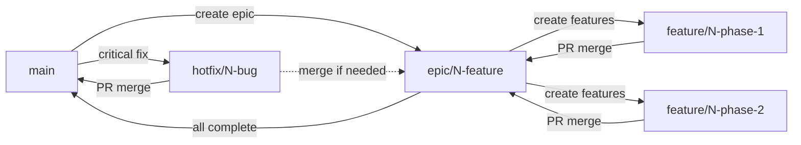

# Git Branching Strategy - Klubr Project

## 🌳 Overview

This document defines the branching strategy for the Klubr project. Each epic gets a dedicated branch to isolate development work until the entire feature set is complete and tested.

## 📋 Branch Types

### 1. Main Branch

- **Name**: `main`
- **Purpose**: Production-ready code
- **Protection**: Protected, requires PR approval
- **Merges**: Only from epic branches after full testing

### 2. Epic Branches

- **Naming**: `epic/<issue-number>-<short-description>`
- **Example**: `epic/4-stripe-connect-migration`
- **Purpose**: Isolate an entire epic's development
- **Created from**: `main`
- **Merges to**: `main` (after all phases complete)
- **Lifespan**: Duration of epic (can be weeks/months)

### 3. Feature Branches

- **Naming**: `feature/<epic-number>-phase-<X>-<description>` or `feature/<epic-number>-<description>`
- **Example**: `feature/4-phase-1-database-foundation`
- **Purpose**: Individual features or phases within an epic
- **Created from**: Epic branch
- **Merges to**: Epic branch (NOT main)
- **Lifespan**: Short (days to 1-2 weeks)

### 4. Hotfix Branches

- **Naming**: `hotfix/<issue-number>-<description>`
- **Example**: `hotfix/42-payment-crash`
- **Purpose**: Critical production fixes
- **Created from**: `main`
- **Merges to**: `main` (and epic branches if needed)
- **Lifespan**: Very short (hours to 1 day)

## 📐 Branch Structure Example

```
main
  ├── epic/4-stripe-connect-migration
  │     ├── feature/4-phase-0-angular-21-migration
  │     ├── feature/4-phase-1-database-foundation
  │     ├── feature/4-phase-2-stripe-integration
  │     └── feature/4-phase-3-payment-migration
  │
  ├── epic/15-donor-dashboard
  │     ├── feature/15-authentication
  │     ├── feature/15-donation-history
  │     └── feature/15-profile-management
  │
  └── hotfix/42-payment-crash
```

## 🚀 Workflows

### Epic Creation

When a new epic is created (GitHub Issue):

```bash
# 1. Ensure main is up to date
git checkout main
git pull origin main

# 2. Create epic branch from main
git checkout -b epic/<issue-number>-<short-description>

# 3. Push epic branch
git push origin epic/<issue-number>-<short-description>

# 4. Set epic branch as protected in GitHub (optional but recommended)
```

**Example:**
```bash
git checkout main
git pull origin main
git checkout -b epic/15-donor-dashboard
git push origin epic/15-donor-dashboard
```

### Feature Development

For each feature/phase within an epic:

```bash
# 1. Start from latest epic branch
git checkout epic/<epic-number>-<description>
git pull origin epic/<epic-number>-<description>

# 2. Create feature branch
git checkout -b feature/<epic-number>-<feature-description>

# 3. Develop your feature
git add .
git commit -m "feat(scope): description"

# 4. Push and create PR
git push origin feature/<epic-number>-<feature-description>
gh pr create \
  --base epic/<epic-number>-<description> \
  --head feature/<epic-number>-<feature-description> \
  --title "Feature: Description" \
  --body "Closes #<issue-number>"
```

**⚠️ CRITICAL:** Always target the **epic branch** as base, NOT `main`

### After PR Merge

```bash
# 1. Switch to epic branch
git checkout epic/<epic-number>-<description>

# 2. Delete local feature branch
git branch -D feature/<epic-number>-<feature-description>

# 3. Pull latest changes
git pull origin epic/<epic-number>-<description>
```

### Final Epic Merge to Main

After all features complete, tested, and deployed to staging:

```bash
# 1. Update epic branch with latest main (if needed)
git checkout epic/<epic-number>-<description>
git pull origin epic/<epic-number>-<description>
git merge main
# Resolve conflicts if any
git push origin epic/<epic-number>-<description>

# 2. Create final PR to main
gh pr create \
  --base main \
  --head epic/<epic-number>-<description> \
  --title "Epic #<number>: <Description> - Final Merge" \
  --body "Closes #<epic-issue-number>"

# 3. After merge, delete epic branch (optional)
git branch -D epic/<epic-number>-<description>
git push origin --delete epic/<epic-number>-<description>
```

### Hotfix Workflow

For critical production bugs:

```bash
# 1. Create from main
git checkout main
git pull origin main
git checkout -b hotfix/<issue-number>-<description>

# 2. Fix and commit
git add .
git commit -m "fix: description"

# 3. Create PR to main
git push origin hotfix/<issue-number>-<description>
gh pr create \
  --base main \
  --head hotfix/<issue-number>-<description> \
  --title "Hotfix: Description" \
  --body "Fixes #<issue-number>"

# 4. After merge to main, merge to active epic branches if needed
git checkout epic/<number>-<description>
git merge main
git push origin epic/<number>-<description>
```

## 🔄 Handling Conflicts

### When Epic Branch Falls Behind Main

If hotfixes or other changes are merged to main while epic is in development:

```bash
# 1. Update epic branch with main
git checkout epic/<number>-<description>
git pull origin epic/<number>-<description>
git merge main
# Resolve conflicts
git push origin epic/<number>-<description>

# 2. Notify team to update their feature branches
```

### Developer Updates Feature Branch

After epic branch is updated:

```bash
git checkout feature/<epic-number>-<description>
git fetch origin
git rebase origin/epic/<epic-number>-<description>
# Resolve conflicts if any
git push origin feature/<epic-number>-<description> --force-with-lease
```

## ✅ Pull Request Checklist

Before creating any PR:

- [ ] Base branch is correct (epic branch for features, main for hotfixes/epics)
- [ ] All commits follow [Conventional Commits](https://www.conventionalcommits.org/)
- [ ] Tests written and passing
- [ ] Code linted (`npm run lint` or `ng lint`)
- [ ] Code built successfully (`npm run build`)
- [ ] PR title references issue number
- [ ] PR description includes "Closes #X" or "Part of #X"
- [ ] Dependencies on other features documented
- [ ] No merge conflicts

## 🎯 Commit Message Format

Follow [Conventional Commits](https://www.conventionalcommits.org/):

```
<type>(<scope>): <description>

[optional body]

[optional footer]
```

**Types:**
- `feat`: New feature
- `fix`: Bug fix
- `docs`: Documentation changes
- `style`: Code style changes (formatting, etc.)
- `refactor`: Code refactoring
- `test`: Test additions/changes
- `chore`: Build/config changes

**Scopes:**
- `frontend`: Next.js frontend
- `admin`: Angular admin dashboard
- `api`: Strapi backend
- `saas`: Svelte web components
- `docs`: Documentation
- `cicd`: CI/CD pipeline

**Examples:**
```bash
feat(admin): add donation history table
fix(api): resolve payment intent creation error
docs(epic-4): update phase dependencies
refactor(frontend): extract donation form logic
test(admin): add unit tests for member service
```

## 🎯 Benefits of This Strategy

1. **Isolation**: Epic development isolated until complete
2. **Parallel Work**: Multiple developers work on different features simultaneously
3. **Testing**: Deploy epic branches to staging for full integration testing
4. **Rollback**: Easy to abandon entire epic if needed
5. **Review**: Review entire epic before merging to main
6. **Clean History**: Main branch history stays clean
7. **Flexibility**: Can hotfix production without waiting for epic completion

## 📊 Branch Lifecycle



## 📚 Resources

- [Conventional Commits](https://www.conventionalcommits.org/)
- [GitHub Flow](https://docs.github.com/en/get-started/quickstart/github-flow)
- [Git Best Practices](https://git-scm.com/book/en/v2/Git-Branching-Branching-Workflows)

## 🔗 Related Documentation

- Epic-specific branching guides in `docs/roadmap/`
- Project structure in `CLAUDE.md`
- Development flows in `docs/flows/`
- Coding rules in `docs/rules/`

---

**Last Updated**: 2025-12-05
**Version**: 1.0
