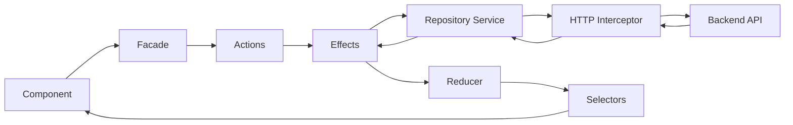
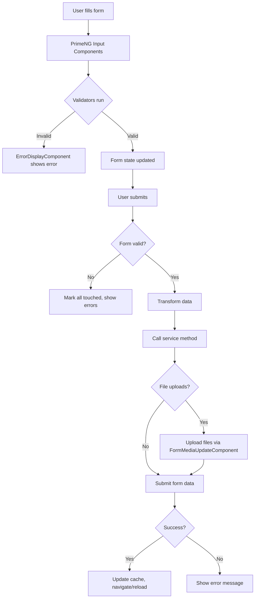

### Architecture

- [Language/Framework](#languageframework)
  - [Dashboard](#dashboard)
- [Full project structure](#full-project-structure)
  - [Naming Conventions](#naming-conventions)
- [Services communication](#services-communication)
  - [Component to API Flow](#component-to-api-flow)

#### Language/Framework

##### Dashboard

- **Framework**: Angular 19 → @donaction-admin/package.json
- **UI Library**: PrimeNG 19 with custom theme preset - Component library with Tailwind integration via `tailwindcss-primeui`
- **Routing**: Angular Router with lazy loading - Feature-based routing with guards (`authGuard`, `invitationCodeGuard`)
- **Data Fetching**: Angular HttpClient with interceptors - JWT auth and error handling interceptors
- **Form Handling**: Angular Reactive Forms - Template-driven and reactive forms
- **Validation**: Angular Validators with custom validators - Located in `@shared/utils/validators`
- **State Management**: NgRx Store 19 with Effects - Feature-based state organization with facades pattern
- **Build Tool**: Angular CLI with esbuild - Application builder with service worker support
- **Structure**: Feature-based architecture - Routes contain feature modules, shared contains reusable code

#### Full project structure

```text
donaction-admin/
├── src/
│   ├── app/
│   │   ├── routes/                          # Feature routes (lazy loaded)
│   │   │   ├── auth/                        # Authentication feature
│   │   │   │   ├── data-access/            # NgRx state management
│   │   │   │   │   ├── +state/             # Actions, reducers, effects, selectors, facade
│   │   │   │   │   └── repositories/       # HTTP services
│   │   │   │   ├── model/                  # Feature models
│   │   │   │   └── ui/                     # Feature components
│   │   │   ├── klub/                        # Club management
│   │   │   ├── members/                     # Member management
│   │   │   ├── project/                     # Project management
│   │   │   ├── don/                         # Donations
│   │   │   ├── facturation/                 # Invoicing
│   │   │   ├── stats/                       # Statistics
│   │   │   ├── profile/                     # User profiles
│   │   │   ├── dashboard/                   # Main dashboard layout
│   │   │   └── homepage/                    # Home page
│   │   ├── shared/                          # Shared resources
│   │   │   ├── components/                  # Reusable components
│   │   │   │   ├── atoms/                   # Atomic components
│   │   │   │   ├── header/                  # Header component
│   │   │   │   ├── sidebar/                 # Sidebar component
│   │   │   │   ├── dialog/                  # Dialog components
│   │   │   │   ├── form/                    # Form components
│   │   │   │   └── ...                      # Domain-specific components
│   │   │   ├── data-access/                 # Shared state
│   │   │   │   ├── +state/                  # Shared NgRx state
│   │   │   │   └── repositories/            # Shared HTTP services
│   │   │   ├── pipes/                       # Custom pipes by domain
│   │   │   ├── services/                    # Business logic services
│   │   │   │   ├── entities/                # Entity services
│   │   │   │   ├── analytics/               # Analytics service
│   │   │   │   └── misc/                    # Utility services
│   │   │   └── utils/                       # Utilities
│   │   │       ├── guards/                  # Route guards
│   │   │       ├── interceptors/            # HTTP interceptors
│   │   │       ├── models/                  # Shared models/interfaces
│   │   │       ├── validators/              # Custom validators
│   │   │       ├── helpers/                 # Helper functions
│   │   │       ├── theme/                   # PrimeNG theme config
│   │   │       └── config/                  # Config files
│   │   ├── app.component.ts                 # Root component
│   │   ├── app.config.ts                    # Application configuration
│   │   └── app.routes.ts                    # Root routing
│   ├── environments/                        # Environment configs
│   ├── assets/                              # Static assets
│   └── styles.scss                          # Global styles
├── angular.json                             # Angular workspace config
├── tailwind.config.js                       # Tailwind configuration
├── tsconfig.json                            # TypeScript config
└── package.json                             # Dependencies
```

##### Naming Conventions

- **Files**: kebab-case with suffix (e.g., `auth.service.ts`, `login.component.ts`)
- **Components**: PascalCase (e.g., `LoginComponent`)
- **Functions**: camelCase
- **Variables**: camelCase
- **Constants**: UPPER_CASE (e.g., `AUTH_FEATURE_KEY`)
- **Types/Interfaces**: PascalCase

#### Services communication

##### Component to API Flow



Flow:
- Component dispatches action via `Facade`
- `Actions` trigger `Effects`
- `Effects` call `Repository Service` (HTTP service)
- `Interceptors` add auth token and handle errors
- Response updates `State` via `Reducer`
- Component observes state via `Selectors`


### Backend Communication

#### API Client Setup

##### Base Configuration

@donaction-admin/src/environments/environment.ts
@donaction-admin/src/app/app.config.ts

- `environment.apiUrl` for Strapi backend (`http://localhost:1437/api/`)
- `environment.nextJsUrl` for Next.js SSR routes
- `environment.apiTokenV1` for API-level authentication
- Native Angular `HttpClient` via `provideHttpClient()`

##### HTTP Client

**Location**: `@angular/common/http`

**Configuration**:
- Functional interceptors via `withInterceptors([authInterceptor, httpErrorsInterceptor])`
- JSONP support via `withJsonpSupport()`
- Standalone services pattern with `providedIn: 'root'`
- Direct `HttpClient` injection in services

#### Authentication Flow

##### Dual Auth Mode

@donaction-admin/src/app/routes/auth/data-access/repositories/auth.service.ts

**Auth Modes**:
- `'angular'` - Cookie-based JWT via `JwtService`
- `'nextJs'` - Session token from Next.js backend at `/api/auth/session`

**Initialization**:
1. On app load, call `checkAuthModeAndIfUserAuthentificated()`
2. Try Next.js session endpoint first
3. Fallback to Angular cookies if Next.js fails
4. Store mode, token, and auth state in `AuthFacade` (NgRx)

##### Auth Interceptor

@donaction-admin/src/app/shared/utils/interceptors/auth.interceptor.ts

**Token Routing**:
- `apiTokenRoutes` use `environment.apiTokenV1` (e.g., `/api/auth/local`, `/api/auth/google/callback`)
- `unauthenticatedRoutes` skip token injection (e.g., Google Maps API)
- All other routes use `authFacade.token$` from NgRx state
- Adds `Authorization: Bearer <token>` header via `HttpRequest.clone()`

##### Auth Endpoints

**AuthService**:
- `authenticate()` - POST `/auth/local` with credentials
- `register()` - POST `/auth/local/register`
- `getMe()` - GET `/users/me` with full population
- `changeMePassword()` - POST `/auth/change-password`
- `googleOAuthRegister()` - GET `/auth/google/callback?access_token=`

#### Error Handling

##### HTTP Errors Interceptor

@donaction-admin/src/app/shared/utils/interceptors/http-errors.interceptor.ts

**Error Types**:
- `403` - Expired session: show toast, delay 3s, trigger `authFacade.logout()`
- `400` - Validation error: extract `error.error.message`, show toast
- `504` - Gateway timeout: show network toast, return `NEVER` observable
- Blob errors: parse via `FileReader`, extract nested error details
- Default: show generic error toast

**Error Structure**:
- Nested error parsing: `error.error || error`
- Details array flattened to `'<key> ><value>'` format
- HTML error messages for detailed display

#### API Patterns

##### Endpoint Organization

@donaction-admin/src/app/shared/utils/config/endpoints.ts

**Constants**:
- Authentication: `LOGIN`, `REGISTER`, `CHANGE_PASSWORD`
- Users: `USER`, `USER_PERMISSIONS`, `AVATAR`
- Clubs: `KLUBR`, `KLUBR_BY_SLUG`, `KLUBR_HOUSE`, `FEDERATION`
- Members: `MEMBER`, `LINK_MEMBER_TO_USER`, `SWITCH_TO_PROFILE`, `SWITCH_TO_ADMIN_EDITOR`
- Projects: `KLUB_PROJECT`, `PROJECT_TMPL_CATEGORY`, `PROJECT_TMPL_LIBRARY`
- Donations: `DON`, `DON_RECEIVED`, `MY_DONS`, `ATTESTATION_PDF`, `RECU_PDF`
- Invoices: `INVOICES`, `STATS`
- Media: `MEDIAS_PROFILE`, `KLUBR_DOCUMENTS`
- Cache: `REVALIDATE`

##### Service Layer Architecture

**SharedService** - `@shared/data-access/repositories/shared.service.ts`:
- `getUserDetail()`, `switchToProfile()`, `linkMemberToUser()`
- `getKlubrDetail()`, `updateKlub()`, `filterKlubs()`
- `filterMembers()`, `createProfile()`, `updateProfile()`
- `getKlubrHouseDetails()`, `updateKlubrHouseDetails()`
- `switchToProfileAdminEditor()`

**ProjectService** - `@shared/services/project.service.ts`:
- `getProjectsWithFilters()`, `getProject()`, `createProject()`, `updateProject()`
- `getProjectTmplLibraries()`, `getOwnProjectTmplLibraries()`
- Filter system: `ProjectFilters` with klubrUUIDs, status, member, isTemplate
- Populate arrays: `defaultProjectPopulate`, `defaultProjectResolverPopulate`

**UserService** - `@shared/services/user.service.ts`:
- `getUsersWithFilters()` with `UserFilters`
- Complex filter logic: role, profiles, origin, searchParams, creationDate

##### Query Building System

@donaction-admin/src/app/shared/utils/helpers/query-helpers.ts

**Core Functions**:
- `getQueryString()` - Combines filters, populate, sort, pagination
- `getPopulateQueryParam()` - Nested population: `populate[0]=field`
- `getUserPopulateQueryParam()` - Pre-built complex user population
- `addFilter()` - Single field: `filters[field][$eq]=value`
- `addSubElementFilter()` - Relation: `filters[element][subElement][$eq]=value`
- `addSubSubElementFilter()` - Deep relation (3 levels)
- `addGreaterEqualFilter()`, `addGreaterLessFilter()` - Date ranges
- `pagination()` - `pagination[page]=1&pagination[pageSize]=10`
- `getSortQueryParam()` - Array to `sort[0]=field:desc`

**Strapi V4 Query Pattern**:
```typescript
// Example: GET /api/klub-projets/?
// filters[klubr][uuid][$eq]=abc-123
// &populate[0]=couverture
// &populate[1]=klubr_membre.avatar
// &sort[0]=status:desc
// &pagination[page]=1&pagination[pageSize]=9
```

#### Data Fetching Strategies

##### Service-Based Pattern

**Standard Flow**:
1. Component injects service (e.g., `ProjectService`)
2. Calls method with typed filters (e.g., `ProjectFilters`)
3. Service builds query string via `query-helpers`
4. Returns `Observable<ApiListResult<T>>` or `Observable<T>`
5. Component subscribes or uses `async` pipe

**Populate Strategy**:
- Default arrays per entity (e.g., `defaultProjectPopulate`)
- Resolver-specific arrays for detail views
- Update-specific arrays to get modified relations

##### NgRx State Management

@donaction-admin/src/app/routes/auth/data-access/+state/

**Features**:
- `AuthFacade` exposes observables: `token$`, `isAuthenticated$`, `authMode$`
- `SharedFacade` for shared entities
- Effects handle async operations
- Reducers store normalized data

##### Cache Invalidation

@donaction-admin/src/app/shared/services/invalidate-cache.service.ts

**Pattern**:
- Services return `pathsToUnvalidateDataRequest()` with affected routes
- Call Next.js `/api/revalidate` endpoint with path array
- Invalidates Next.js ISR cache for updated entities

#### External Integrations

##### Google OAuth

@donaction-admin/src/app/routes/auth/data-access/repositories/google-auth.service.ts

- Client ID via `environment.googleClientId`
- Callback: `${apiUrl}/auth/google/callback?access_token=<token>`
- Backend returns Strapi JWT

##### Google Maps

@donaction-admin/src/app/shared/components/form/google-maps/

- API key: `environment.GOOGLE_MAPS_API_KEY`
- Unauthenticated route (no Bearer token)
- Services: `google-maps-api.service.ts`, `google-maps-utils.service.ts`

##### reCAPTCHA

@donaction-admin/src/app/app.config.ts

- Site key: `environment.ANGULAR_PUBLIC_GOOGLE_RECAPTCHA_SITE_KEY`
- Provided via `RECAPTCHA_V3_SITE_KEY` injection token

#### State & Caching

##### Service Worker

- Configured via `provideServiceWorker()`
- Enabled when `environment.pwaEnabled === true`
- Strategy: `registerWhenStable:30000`

##### Dashboard Cache

@donaction-admin/src/app/shared/services/caching.service.ts

- In-memory caching layer
- Used for repeated queries within session

#### Key Dependencies

@donaction-admin/package.json

- `@angular/common` ^19 (HttpClient)
- `@ngrx/store` ^19
- `@ngrx/effects` ^19
- `rxjs` ^7
- `primeng` ^19


---
name: coding-assertions
description: Code quality verification checklist
argument-hint: N/A
---

### Coding Guidelines

> Those rules must be minimal because the MUST be checked after EVERY CODE GENERATION.

#### Requirements to complete a feature

**A feature is really completed if ALL of the above are satisfied: if not, iterate to fix all until all are green.**

#### Steps to follow

1. Check their is no duplication
2. Ensure code is re-used
3. Run all those commands, in order to ensure code is perfect:

```markdown
| Order | Command    | Description                |
|-------|------------|----------------------------|
| 1     | ng test    | Run unit tests with Karma |
| 2     | ng build   | Build application          |
```

#### Angular Coding Patterns

##### Component Architecture
- Use **standalone components** (no `NgModule` except legacy `google-maps-utils.module.ts`)
- Components declare imports in `@Component` decorator `imports` array
- Use `inject()` function for dependency injection (not constructor injection)
- File naming: `*.component.ts`, `*.service.ts`, `*.pipe.ts`, `*.guard.ts`
- Component prefix: `app-` (configured in @angular.json)

##### Modern Angular Features
- Use `signal()`, `computed()`, `effect()` from `@angular/core`
- Use `input()` and `model()` for component inputs
- Use `viewChild()` for view queries
- Control flow: `@if`, `@for`, `@switch` in templates (modern syntax)
- Use `toSignal()` from `@angular/core/rxjs-interop` for signal conversion
- Use `takeUntilDestroyed()` for subscription cleanup (no manual `takeUntil`)

##### State Management
- NgRx Store for global state with signals integration
- Facades pattern: services expose state via `selectSignal()` and `toSignal()`
- Actions/Effects pattern for side effects
- Services use `providedIn: 'root'`

##### Forms
- Reactive forms with `FormGroup`, `FormControl`, `Validators`
- Custom `FormControlPipe` to access controls: `form | formControl:'fieldName'`
- Helper functions in `form-helpers.ts`
- Validation errors displayed via `ErrorDisplayComponent`

##### RxJS Patterns
- Prefer `takeUntilDestroyed()` over manual `takeUntil(destroyed$)`
- Use operators: `map`, `tap`, `switchMap`, `catchError`, `filter`, `take`
- Observable naming: suffix with `$` (e.g., `me$`, `isAuthenticated$`)
- Combine observables with `combineLatest`, `merge`

##### HTTP & API
- Services inject `HttpClient` via `inject(HttpClient)`
- Interceptors: `httpErrorsInterceptor` for centralized error handling
- Guards: functional guards with `CanActivateFn` (e.g., `authGuard`)
- Query helpers in `query-helpers.ts` for API filters/pagination
- Environment config via `@environments/environment`

##### Error Handling
- HTTP errors caught in `httpErrorsInterceptor`
- Toast notifications via `ToastService.showErrorToast()`
- Errors thrown early, never silent
- Blob responses parsed for error details

##### Routing
- Functional guards: `authGuard`, `invitationCodeGuard`, `linkMemberGuard`
- Resolvers for data preloading
- Routes defined in `*.routes.ts` files
- Base href: `/admin/` (configured in @angular.json)

##### Services Organization
- `data-access/repositories`: API calls
- `data-access/+state`: NgRx state (actions, effects, selectors, facade)
- `shared/services`: reusable services
- `shared/utils`: helpers, interceptors, guards, models

##### Styling
- SCSS with `styleUrl` in components
- PrimeNG v19 with PrimeFlex v4
- Tailwind CSS with `tailwindcss-primeui`
- Animations: `fadeAnimation` from `animations.ts`

##### Change Detection
- Most components use default change detection
- `OnPush` used sparingly (e.g., `klub-house-update.component.ts`)

#### TypeScript Usage

##### Types & Interfaces
- Models in `shared/utils/models/`: `klubr.ts`, `user-details.ts`, `media.ts`, `misc.ts`
- Strict typing, no `any` unless unavoidable
- Use `Partial<T>` for partial updates
- Type imports from models

##### Dependency Injection
- Use `inject()` function in component/service body
- Private services: `private http = inject(HttpClient)`
- Public when needed in template: `public toastService = inject(ToastService)`

##### Async/Await
- Helper functions use `async/await` (e.g., `urlToFormData` in `form-helpers.ts`)
- Services prefer observables over promises

#### Code Organization

##### Component Structure
- Template-driven with reactive forms
- Component extends base classes when needed (e.g., `GenericListingComponent`)
- Lifecycle hooks: `ngOnInit`, `AfterViewInit`
- Signals for local state
- Facade for global state

##### Service Structure
- Injectable with `providedIn: 'root'`
- Methods return `Observable<T>`
- Inject dependencies via `inject()`
- Actions dispatched via facade or store

##### File Structure
- Feature modules: `routes/{feature}/ui`, `routes/{feature}/data-access`, `routes/{feature}/model`
- Shared: `shared/components`, `shared/services`, `shared/pipes`, `shared/utils`
- Config: `shared/utils/config/` (endpoints, settings)
- Helpers: `shared/utils/helpers/` (query, form, pdf, html, type)

#### Testing

##### Test Framework
- Jasmine with Karma
- Test files: `*.spec.ts`
- Component tests check basic rendering
- Service tests mock dependencies

#### Key Libraries

##### Core
- Angular 19
- RxJS 7
- TypeScript 5.5
- zone.js 0.15

##### UI
- PrimeNG 19
- PrimeFlex 4
- PrimeIcons 7
- ngx-lottie 13
- ngx-editor 18
- ngx-image-cropper 9

##### State & Auth
- @ngrx/store 19
- @ngrx/effects 19
- @ngrx/signals 19
- jwt-decode 4
- ngx-cookie-service 19

##### Other
- @angular/google-maps 19
- @angular/service-worker 19
- ngx-device-detector 9
- ng-recaptcha 13
- plausible-tracker

#### Configuration Files
- @angular.json: build config, base href `/admin/`
- @tsconfig.app.json: TypeScript config
- @package.json: dependencies
- @proxy.conf.json: dev proxy


### DESIGN.md

#### Design Implementation

- **Design System Approach**: PrimeNG Aura preset with custom klubr theme, TailwindCSS utility classes, layered CSS architecture
- **Styling Method**: Hybrid - PrimeNG components styled via theme preset, TailwindCSS for layout/spacing, SCSS for custom components

#### Design System Files

- **Theme Config**: @donaction-admin/src/app/shared/utils/theme/theme.preset.ts (PrimeNG Aura preset), @donaction-admin/src/app/app.config.ts (theme provider)
- **Design Components**: @donaction-admin/src/assets/layout/ (layout SCSS), @donaction-admin/src/assets/theme/ (theme overrides)
- **Style Guidelines**: @donaction-admin/src/styles.scss (global styles, layer order)

#### Design System

- **Spacing Scale**: See PrimeNG theme preset - uses TailwindCSS spacing (1rem base)
- **Border Radius**: `12px` for layout elements (cards, sidebar), `6px` for form controls, `32px` for rounded pills
- **Shadows**: `box-shadow: 0 4px 15px 0 rgba(0, 0, 0, 0.12)` for cards, elevation via PrimeNG theme
- **Breakpoints**: 768px (mobile), 992px (tablet), 1960px (max layout width)

- **Color Palette**: See @donaction-admin/src/app/shared/utils/theme/theme.preset.ts

  - Primary: Indigo palette (50-950) - primary actions, links, brand
  - Secondary: Zinc palette (light mode), Slate (dark mode) - surfaces, borders
  - Accent: Orange-400 (`#FFF0C5` bg, `#FFBB00` text) - warnings, notifications
  - Gray: Surface variants (0, 50-950) - backgrounds, borders, text hierarchy

- **Typography**: See @donaction-admin/src/assets/layout/_typography.scss
  - Primary Font: Inter - body text, UI components
  - Secondary Font: Inter (with font-feature-settings) - branded elements
  - Fallback: sans-serif

#### Component Standards and Variantes

- **Button Variants**: PrimeNG buttons with `pButton` directive, severity variants (primary/secondary/success/danger), ripple disabled
- **Input States**: PrimeNG input components, outlined style default, focus/error/disabled states from theme preset
- **Card Patterns**: `.card` class (2rem padding, 12px radius, border, shadow), `surface-card` background, `surface-border` borders

#### Layout System

- **Grid System**: CSS Grid with utility classes (`.grid-member-listing`, `.grid-project-listing`, `.grid-user-listing`), auto-fill responsive columns
- **Container Widths**: 1504px max width above 1960px breakpoint, fluid below with 1rem horizontal padding
- **Spacing Rules**: PrimeNG scale 14 (base 14px), TailwindCSS spacing utilities (`px-`, `py-`, `gap-`), consistent 1rem padding on mobile

#### Accessibility

- **Color Contrast**: Uses PrimeNG theme contrast ratios, semantic color tokens for status
- **Focus Management**: Focus outline/box-shadow disabled globally (`:focus { outline: none !important; }`), keyboard navigation via PrimeNG
- **Screen Reader**: PrimeNG components include ARIA labels, custom components need manual ARIA


---
name: forms
description: Dashboard form handling guidelines
argument-hint: N/A
---

### Forms

This part describe how dashboard forms are handled in the project, including libraries used, validation strategies, and state management.

#### State Management

- Angular Reactive Forms - Form state managed through `FormGroup`, `FormControl`, `FormArray`
- Local component state using signals (`WritableSignal`, `Signal`)
- Form submission tracked with `isSubmitted` signal
- Form reset via `resetForm()` method restoring initial values
- Form dirty state tracked to determine if changes exist
- No data persistence, forms reset on component destroy

#### Validation

- Angular built-in validators - `Validators.required`, `Validators.email`, `Validators.minLength`, `Validators.maxLength`, `Validators.min`, `Validators.max`, `Validators.pattern`
- Custom validators in @shared/utils/validators/:
  - `passwordStrengthValidator()` - Min 8 chars, digit, special char, lower/upper case
  - `passwordMatchValidator` - Compares password and passwordConfirmation fields
  - `differentPasswordValidator` - Ensures new password differs from current
  - `minHtmlLengthValidator(minLength)` - Validates HTML content length
  - `maxHtmlLengthValidator(maxLength)` - Validates HTML content length
  - `hexColorValidator()` - Validates hex color format
  - `webSiteValidator()` - Validates URL format (http/https)
  - `dateAtLeastTomorrowValidator()` - Ensures date is at least tomorrow
  - `warn(validator)` - Transforms validator to warning instead of error
- Custom pipes for type-safe form access:
  - `FormControlPipe` - Extract typed `FormControl` from `FormGroup`
  - `FormArrayPipe` - Extract typed `FormArray` from `FormGroup`
  - `FormStatusPipe` - Access form status
- Client-side validation using reactive patterns with `statusChanges` observable

#### Error handling

- `FormErrorHandlingService` - Centralized error message mapping
- `ErrorDisplayComponent` - Displays errors and warnings
  - Shows errors when control is dirty or form submitted
  - Supports warnings via `AbstractControlWarn` interface
  - Subscribes to `statusChanges` for real-time feedback
- Error messages in French, mapped from validation errors
- Custom `AbstractControlWarn` interface extends `AbstractControl` with warnings property

#### GenericUpdateComponent Pattern

##### Overview

`GenericUpdateComponent<T>` - Base class for CRUD forms handling both create and update operations

**Location**: @shared/components/generics/generic-update/generic-update.component.ts

##### Key Features

- Automatic edit/create mode detection based on entity presence
- Form lifecycle management (init, reset, validation)
- File upload integration via `updateFile()` hook
- Cache invalidation after successful updates
- Analytics tracking with custom properties
- Loading states and error handling
- Automatic navigation after create/update

##### Core Properties

**Injected Services**:
- `sharedFacade` - NgRx state management
- `router`, `route` - Navigation
- `toastService` - User notifications
- `analyticsService` - Event tracking
- `invalidateCacheService` - Cache management
- `permissionsService` - Permission checks

**Form State Signals**:
- `isSubmitted: WritableSignal<boolean>` - Tracks submission state
- `loading: WritableSignal<boolean>` - Loading indicator
- `isReady: WritableSignal<boolean>` - Form ready state
- `entitySignal: WritableSignal<T | null>` - Current entity state

**Modes**:
- `editMode: boolean` - `true` for update, `false` for create

##### Methods to Override

###### Required Overrides

**`initForm(): void`** - Initialize form structure with controls and validators
```typescript
protected override initForm(): void {
  const entity = untracked(this.entitySignal);
  this.entityForm = new FormGroup({
    name: new FormControl(entity?.name, Validators.required),
    email: new FormControl(entity?.email, [Validators.required, Validators.email])
  });
}
```

**`formFields(): { [key: string]: any }`** - Transform form values before submission
```typescript
protected override formFields(): { [key: string]: any } {
  return {
    ...this.entityForm.value,
    klubr: this.sharedFacade.profile()!.klubr.uuid
  };
}
```

**`serviceUpdate(uuid: string, formValues: any): Observable<T>`** - Update API call
```typescript
protected override serviceUpdate(uuid: string, formValues: any): Observable<Member> {
  this.sharedFacade.updateProfile(uuid, formValues);
  return this.actions$.pipe(
    ofType(SharedActions.updateProfileSuccess),
    map(({profile}) => profile),
    take(1)
  );
}
```

**`serviceCreate(formValues: any): Observable<T>`** - Create API call
```typescript
protected override serviceCreate(formValues: any): Observable<Member> {
  return this.profileService.createProfile(formValues).pipe(
    map((response) => response.data as Member)
  );
}
```

###### Optional Overrides

**`getEntityForCreateMode(entity: T | null): T | null`** - Provide default values for create mode
```typescript
protected override getEntityForCreateMode(member: Member | null): Member | null {
  return {
    uuid: '',
    nom: '',
    prenom: '',
    role: 'KlubMember',
    klubr: untracked(this.sharedFacade.profile)!.klubr
  };
}
```

**`updateFile(entity: T): Observable<T>`** - Handle file uploads after form submission
```typescript
protected override updateFile(member: Member): Observable<Member> {
  if (this.entityForm.get('avatar')?.dirty && this.entityForm.get('avatar')?.value) {
    const formData = new FormData();
    formData.append('avatar', this.entityForm.get('avatar')!.value);
    return this.avatarService.newMediaProfileFile(entity.uuid, formData);
  }
  return of(member);
}
```

**`resetForm(): void`** - Reset form to initial entity values
**`preUpdateHook(formValues): any`** - Transform values before update
**`preCreateHook(formValues): any`** - Transform values before create
**`cacheToUnvalidate(entity: T): void`** - Clear relevant cache entries
**`pathsToUnvalidateDataRequest(entity: T): string[]`** - Next.js ISR paths to revalidate
**`redirectAfterCreate(entity: T): void`** - Custom navigation after create
**`redirectAfterUpdate(entity: T): void`** - Custom navigation after update
**`reloadEntity(entity: T): Observable<T>`** - Refetch entity (for Strapi components)

##### Implementation Example

```typescript
@Component({
  selector: 'app-member-update',
  templateUrl: './member-update.component.html'
})
export class MemberUpdateComponent extends GenericUpdateComponent<Member> {
  protected override successMsg = 'Le profil a été mis à jour';
  protected override errorUpdateMsg = 'Le profil n\'a pas pu être modifié';
  protected override routePrefix = '/profile';

  constructor() {
    super();
    this.entity.set(this.config.data.profile); // Pass entity via DynamicDialogConfig
  }

  protected override initForm(): void {
    const entity = untracked(this.entitySignal);
    this.entityForm = new FormGroup({
      nom: new FormControl(entity?.nom, Validators.required),
      prenom: new FormControl(entity?.prenom, Validators.required),
      role: new FormControl(entity?.role, Validators.required)
    });
  }

  protected override formFields(): { [key: string]: any } {
    return {
      ...this.entityForm.value,
      klubr: this.sharedFacade.profile()!.klubr.uuid
    };
  }

  protected override serviceUpdate(uuid: string, formValues: any): Observable<Member> {
    this.sharedFacade.updateProfile(uuid, formValues);
    return this.actions$.pipe(
      ofType(SharedActions.updateProfileSuccess),
      map(({profile}) => profile),
      take(1)
    );
  }

  protected override serviceCreate(formValues: any): Observable<Member> {
    return this.profileService.createProfile(formValues).pipe(
      map((response) => response.data as Member)
    );
  }
}
```

##### Submission Flow

1. User calls `onSubmit()`
2. Form validation runs, marks all controls as touched
3. If invalid, show error toast and abort
4. Get form values via `formFields()`
5. If edit mode, clean values (only dirty fields)
6. Call `preCreateHook()` or `preUpdateHook()`
7. Execute `serviceCreate()` or `serviceUpdate()`
8. Call `updateFile()` for file uploads
9. Call `reloadEntity()` to refresh entity
10. Call `cacheToUnvalidate()` and `pathsToUnvalidateDataRequest()`
11. Show success toast, reset form, redirect
12. Track analytics event

##### Best Practices

- Always set `entity` model in constructor (from route data or dialog config)
- Override `successMsg`, `errorUpdateMsg`, `errorCreateMsg` for user-friendly messages
- Use `untracked()` when reading signals in form initialization
- Call `super()` in constructor before any logic
- Return only dirty fields in edit mode via `cleanFormValues()`
- Use `take(1)` with NgRx actions to prevent memory leaks
- Implement `cacheToUnvalidate()` to invalidate affected cache entries
- Set `routePrefix` for correct redirection after create

#### Form Flow

1. Component initializes form with `FormGroup`/`FormControl`
2. User interacts with PrimeNG form components (`p-inputtext`, `p-inputmask`, `p-datepicker`, `app-editor`)
3. Validators run on value changes, set control errors
4. `ErrorDisplayComponent` subscribes to `statusChanges`, displays errors when dirty/submitted
5. On submit: set `isSubmitted` signal to true, validate form
6. If valid: transform data via `TransformationService`, call service method
7. Service returns Observable, component handles success/error
8. On success: update cache via `CachingService`, navigate or update entity
9. File uploads handled separately via `FormMediaUpdateComponent`, merged with main form data




---
name: testing
description: Testing strategy and guidelines
argument-hint: N/A
---

### Testing Guidelines

This document outlines the testing strategies and guidelines for donaction-admin.

#### Tools and Frameworks

- Jasmine v5
- Karma v6
- karma-chrome-launcher
- karma-coverage
- karma-jasmine
- karma-jasmine-html-reporter
- @angular/core/testing TestBed
- zone.js/testing

#### Testing Strategy

- Unit tests for all components, services, guards, pipes, resolvers, interceptors
- Tests co-located with source files using `.spec.ts` suffix
- TestBed configuration for dependency injection and component testing
- Standalone component testing with imports array
- Basic smoke tests ("should create") for all entities

Types of tests implemented:
- Unit Tests (components, services, guards, pipes, interceptors, resolvers)

#### Test Execution Process

- Run tests: `npm test` or `ng test`
- Config in @angular.json under `test` architect section
- Builder: `@angular-devkit/build-angular:karma`
- Polyfills: `zone.js` and `zone.js/testing`
- TypeScript config: @tsconfig.spec.json
- Style language: scss
- Assets: favicon.png, assets folder

#### Mocking and Stubbing

- TestBed.configureTestingModule for dependency injection setup
- TestBed.inject() for service instance retrieval
- TestBed.runInInjectionContext() for functional guards/resolvers
- ComponentFixture for component instance access
- fixture.detectChanges() for change detection triggering
- No functional component mocking (per CLAUDE.md rules)
