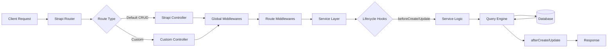
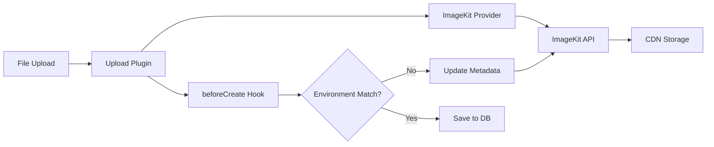
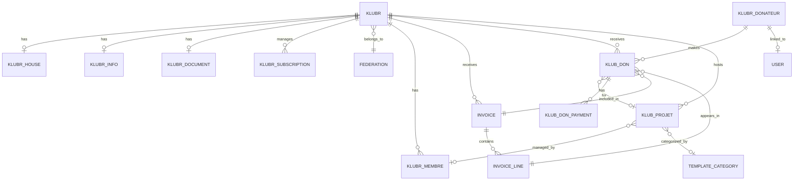

### API Documentation

#### Authentication & Authorization

- **Authentication**: JWT - Strapi users-permissions plugin with JWT token authentication
- **Authorization**: Role-based with custom middlewares - Profile-based permissions (`owner-or-admin`, `admin-editor-or-admin`, `klubr-membre`)
- **Session Management**: JWT tokens - Token stored in user state, validated via `ctx.state.user`

#### Endpoints

- Endpoints file: @donaction-api/src/api/*/routes/*-custom.ts - Custom routes per module
- Base URL: `/api` - Strapi REST API base
- Versioning: None - Single version API
- Format: REST - JSON request/response
- Protocol: HTTPS - Production, HTTP in development

#### Request/Response Formats

- Request format: JSON - Standard REST JSON bodies, multipart/form-data for file uploads
- Response format: JSON - Strapi standard response format with `data`, `meta`, pagination

#### Error Handling

- Error format: JSON - Standard Strapi error format with `error.status`, `error.message`
- Status codes: HTTP standard - 400 (BadRequest), 401 (Unauthorized), 404 (NotFound), 500 (ServerError)
- Error responses: `ctx.badRequest()`, `ctx.unauthorized()`, `ctx.notFound()` - Strapi context methods

#### Key Endpoints

##### Klubr (Clubs)
- `GET /klubrs` - List clubs with filters
- `GET /klubrs/:uuid` - Get club by UUID
- `GET /klubrs/bySlug/:slug/:preview?` - Get club by slug with preview support
- `GET /klubrs/stats-all` - Admin: Get all clubs stats
- `GET /klubrs/:uuid/stats` - Owner/Admin: Get club stats
- `POST /klubrs/new/by-leader/:memberUuid` - Create club from member
- `POST /klubrs/:code/send-invitation` - Send club invitation
- `POST /klubrs/:uuid/create-documents` - Owner/Admin: Generate documents
- `POST /klubrs/:uuid/documents` - Owner/Admin: Upload documents
- `PUT /klubrs/:uuid/documents/validate` - Admin: Validate documents
- `GET /klubrs/:uuid/documents/:doc` - Owner/Admin: Download document

##### Klubr Membres (Members)
- `GET /klubr-membres` - List members
- `GET /klubr-membres/:uuid` - Get member by UUID
- `POST /klubr-membres` - Create member
- `POST /klubr-membres/for-front` - Create member from frontend
- `PUT /klubr-membres/:uuid` - Update member
- `PUT /klubr-membres/for-front/:uuid` - Update member from frontend
- `POST /klubr-membres/link-to-user/:code` - Link member to user account
- `POST /klubr-membres/switch-to/:uuid` - Switch to member profile
- `POST /klubr-membres/switch-to-admin-editor/:klubUuid` - Admin: Switch to admin editor profile
- `POST /klubr-membres/:code/send-invitation` - Send member invitation

##### Invoices
- `GET /invoices` - List user invoices
- `GET /invoices/:id` - Get invoice by ID
- `GET /invoices/generate/:month/:year/:genPdf?/:send?` - Generate invoices for period
- `GET /invoices/:clubUuid/generate/:month/:year/:genPdf?/:send?` - Generate invoices for club
- `GET /invoices/:uuid/pdf` - Generate invoice PDF
- `GET /invoices/:uuid/send` - Send invoice email

##### Donations
- `POST /klub-don-payments/create-payment-intent` - Create Stripe payment intent
- `POST /klub-don-payments/stripe-web-hooks` - Stripe webhook handler (no auth)
- `GET /klub-don-payments/check` - Check payment status

#### Middlewares

##### Custom Middlewares
- `global::request-logger` - Logs all incoming requests
- `api::klubr.owner-or-admin` - Restricts access to club owner or admin
- `api::klubr.admin-editor-or-admin` - Restricts access to admin editor or admin
- `api::klubr.remove-unauthorized-fields` - Sanitizes response fields based on permissions
- `api::invoice.my-invoices` - Restricts invoices to user's own invoices
- `api::klubr-membre.can-create` - Validates member creation permissions
- `api::klubr-membre.can-update` - Validates member update permissions
- `api::klubr-membre.admin` - Admin-only access

##### Built-in Strapi Middlewares
- `strapi::errors` - Global error handler
- `strapi::security` - Security headers and CSP configuration
- `strapi::cors` - CORS configuration
- `strapi::body` - Body parsing with 20MB limit, multipart support

#### Rate Limiting

- Default limit: 25 - Records per page
- Max limit: 100 - Maximum records per page
- Pagination: Enabled with count - `withCount: true`

#### External Integrations

##### Stripe
- Payment processing via Stripe SDK
- Webhook endpoint: `/klub-don-payments/stripe-web-hooks`
- Secret key: `process.env.STRIPE_SECRET_KEY`

##### Brevo (Email)
- Email provider: Brevo SMTP relay
- Configuration: `@donaction-api/config/plugins.ts` email settings
- SDK integration: `sib-api-v3-sdk`

##### ImageKit
- Upload provider: `strapi-provider-upload-imagekit`
- Configuration: `@donaction-api/config/plugins.ts` upload settings
- Folder management for avatars and media

##### Google Cloud
- Authentication library for Google APIs
- Used for club assessments and place data


### Architecture

- [Language/Framework](#languageframework)
  - [Backend](#backend)
    - [Database](#database)
- [Full project structure](#full-project-structure)
  - [Naming Conventions](#naming-conventions)
- [Services communication](#services-communication)
  - [External Services](#external-services)
    - [ImageKit](#imagekit)
    - [Brevo (Sendinblue)](#brevo-sendinblue)
    - [Stripe](#stripe)

#### Language/Framework

##### Backend

- **Language/Framework**: Node.js with TypeScript / Strapi v5 → @donaction-api/package.json
- **API Style**: REST - Strapi auto-generated endpoints with custom routes
- **Architecture**: Strapi CMS with content-types, services, controllers, and lifecycles
- **ORM**: Strapi Query Engine (built-in) - database abstraction layer
- **Schema path**: `src/api/*/content-types/*/schema.json` - JSON schema definitions for content types
- **Endpoints**: `src/api/*/routes/*.ts` - custom routes + Strapi default CRUD
- **Caching**: No explicit caching layer
- **Testing**: No test framework configured

###### Database

- **Type**: PostgreSQL (production) / SQLite (development)
- **ORM/Driver**: `pg` v8 driver with Strapi Query Engine
- **Connection**: Configured via environment variables → @donaction-api/config/database.ts
- **Migration**: Strapi built-in migrations (automatic on schema changes)
- **Seeding**: `strapi import` command with encrypted exports → @donaction-api/data/
- **Mock**: No mock database configured

#### Full project structure

```text
donaction-api/
├── config/                     # Strapi configuration
│   ├── admin.ts               # Admin panel config
│   ├── api.ts                 # API config
│   ├── database.ts            # Database connection config
│   ├── middlewares.ts         # Global middleware config
│   ├── plugins.ts             # Plugin configuration (users-permissions, email, upload, uuid)
│   ├── server.ts              # Server config
│   ├── cronTasks.ts           # Scheduled tasks (project status updates, etc)
│   └── logger.ts              # Logging config
├── src/
│   ├── index.ts               # Bootstrap entry point with lifecycle hooks
│   ├── constants.ts           # Global constants
│   ├── _types.ts              # Global TypeScript types
│   ├── api/                   # Content-type modules (30+ entities)
│   │   ├── klubr/             # Main club entity
│   │   │   ├── content-types/klubr/
│   │   │   │   ├── schema.json          # Content type definition
│   │   │   │   └── lifecycles.ts        # Before/after hooks
│   │   │   ├── controllers/klubr.ts     # Request handlers
│   │   │   ├── services/klubr.ts        # Business logic
│   │   │   ├── routes/
│   │   │   │   ├── klubr.ts             # Default CRUD routes
│   │   │   │   └── klubr-custom.ts      # Custom endpoints
│   │   │   └── middlewares/             # Route-specific middleware
│   │   │       ├── klubr.ts
│   │   │       ├── owner-or-admin.ts
│   │   │       ├── admin-editor-or-admin.ts
│   │   │       └── remove-unauthorized-fields.ts
│   │   ├── [entity]/          # Other entities follow same pattern
│   │   │   ├── content-types/
│   │   │   ├── controllers/
│   │   │   ├── services/
│   │   │   ├── routes/
│   │   │   └── middlewares/
│   │   └── ...                # blog, invoice, klub-don, etc
│   ├── components/            # Reusable Strapi components
│   │   ├── club-header/
│   │   ├── club-chiffres/
│   │   ├── club-presentation/
│   │   └── ...
│   ├── helpers/               # Utility functions
│   │   ├── emails/            # Email sending utilities
│   │   ├── klubrPDF/          # PDF generation (pdf-lib, qrcode)
│   │   ├── gcc/               # Google Cloud Console integration
│   │   ├── users-extensions/  # User auth extensions (register, reset password, etc)
│   │   ├── permissions.ts
│   │   ├── medias.ts
│   │   └── ...
│   ├── extensions/            # Strapi core extensions
│   ├── middlewares/           # Global middleware
│   │   └── request-logger.ts
│   └── plugins/               # Custom plugins
│       └── custom-upload/
├── types/                     # Generated TypeScript types
├── data/                      # Database exports/imports (encrypted)
└── private-pdf/               # PDF template storage
```

##### Naming Conventions

- **Files**: kebab-case for routes/controllers/services, PascalCase for types
- **Functions**: camelCase
- **Variables**: camelCase
- **Constants**: UPPER_SNAKE_CASE
- **Types/Interfaces**: PascalCase with `Entity` suffix for Strapi entities

#### Services communication

##### Strapi Request Flow



##### External Services

###### ImageKit

- **Purpose**: CDN and image storage provider
- **Integration**: Custom Strapi upload provider `strapi-provider-upload-imagekit`
- **Config**: @donaction-api/config/plugins.ts
- **Usage**: Handles all media uploads with environment-based tagging (production/staging)
- **Lifecycle**: File metadata updated on `beforeCreate` hook → @donaction-api/src/index.ts



###### Brevo (Sendinblue)

- **Purpose**: Transactional email service (invitations, newsletters)
- **Integration**: `@strapi/provider-email-nodemailer` with Brevo SMTP + `sib-api-v3-sdk` API client
- **Config**: @donaction-api/config/plugins.ts email provider
- **Usage**: `sendBrevoTransacEmail()` helper for templated emails → @donaction-api/src/helpers/emails/
- **Templates**: Predefined template IDs for member invitations, password resets, etc

###### Stripe

- **Purpose**: Payment processing for donations and subscriptions
- **Integration**: `stripe` v17 SDK
- **Config**: API keys via environment variables
- **Usage**: Invoice generation, payment handling → @donaction-api/src/api/invoice/


---
name: coding-assertions
description: Code quality verification checklist
argument-hint: N/A
---

### Coding Guidelines

> Those rules must be minimal because the MUST be checked after EVERY CODE GENERATION.

#### Requirements to complete a feature

**A feature is really completed if ALL of the above are satisfied: if not, iterate to fix all until all are green.**

#### Steps to follow

1. Check their is no duplication
2. Ensure code is re-used
3. Run all those commands, in order to ensure code is perfect:

```markdown
| Order | Command               | Description                  |
|-------|-----------------------|------------------------------|
| 1     | `npm run gen:types`   | Generate TypeScript types    |
| 2     | TypeScript check      | Verify no type errors        |
| 3     | `npm run build`       | Build Strapi application     |
```

#### Backend-Specific Coding Patterns

##### Framework & Architecture

- Strapi v5 headless CMS using `@strapi/strapi`
- TypeScript with `strict: false` but `noImplicitThis: true`
- Node.js runtime with CommonJS modules
- PostgreSQL database (production), SQLite (dev)

##### Core Dependencies

- `@strapi/strapi` v5
- `stripe` for payments
- `sib-api-v3-sdk` for Brevo email service
- `pdf-lib` for PDF generation
- `pg` v8 for PostgreSQL
- `imagekit` for media handling

##### TypeScript Usage

- Use Strapi generated types from `@strapi/strapi`
- Entity types defined in `@/src/_types.ts` using `Data.ContentType<>`
- Use `Core.Strapi` type for strapi instance
- Context type from `koa`
- `@ts-ignore` used sparingly for Strapi API limitations
- Use generic types with `factories.createCoreController()` and `factories.createCoreService()`

##### Controllers Pattern

- Use `factories.createCoreController()` from `@strapi/strapi`
- Access context via `strapi.requestContext.get()`
- Return sanitized data using `this.sanitizeOutput()`
- Use helper `removeId()` to remove internal ids from responses
- Use `ctx.badRequest()`, `ctx.notFound()`, `ctx.unauthorized()`, `ctx.forbidden()` for errors
- Always validate query params with `await this.validateQuery(ctx)`
- Always sanitize query params with `await this.sanitizeQuery(ctx)`

##### Services Pattern

- Use `factories.createCoreService()` from `@strapi/strapi`
- Business logic separated from controllers
- Pure functions for data transformations
- Helper functions like `countEmptyFields()`, `countDocs()` as private module functions

##### Database Access

- Use `strapi.db.query()` for direct database queries with populate
- Use `strapi.documents()` for CRUD operations on content types
- Use `strapi.service()` to access services
- Always specify populate when needed
- Use `where` clauses with operators like `$eq`, `$ne`, `$in`, `$notIn`, `$and`, `$or`
- Use `findOne()`, `findMany()`, `findWithCount()`, `create()`, `update()` methods

##### Middlewares Pattern

- Export default function with `config` and `{ strapi }`
- Return async function with `ctx, next` parameters
- Check permissions using helpers from `@/src/helpers/permissions.ts`
- Always call `await next()` when passing to next middleware
- Use `ctx.unauthorized()` or `ctx.forbidden()` for auth failures

##### Lifecycle Hooks

- Implement in `content-types/<name>/lifecycles.ts`
- Export object with lifecycle methods: `beforeCreate`, `beforeUpdate`, `afterCreate`, etc.
- Receive `LifecycleEvent<T>` with `params.data`, `params.where`, `result`
- Modify `event.params.data` to change data before save
- Use for UUID generation, data validation, side effects

##### Error Handling

- Use `try/catch` blocks in controllers
- Log errors with `console.error()` or `console.log()`
- Return appropriate HTTP status via context methods
- No silent failures - always throw or return error response
- Use `ctx.internalServerError()` for unexpected errors

##### Code Organization

- Controllers in `@/src/api/<entity>/controllers/`
- Services in `@/src/api/<entity>/services/`
- Routes in `@/src/api/<entity>/routes/`
- Middlewares in `@/src/api/<entity>/middlewares/`
- Helpers in `@/src/helpers/`
- Types in `@/src/_types.ts`
- Config files in `@/config/` using TypeScript

##### Helper Functions

- Pure functions exported from `@/src/helpers/`
- Permission checks in `permissions.ts`
- Sanitization functions in `sanitizeHelpers.ts`
- Email sending in `emails/sendBrevoTransacEmail.ts`
- Media transformations in `medias.ts`
- Constants for roles, statuses in dedicated files

##### Email Handling

- Use `sendBrevoTransacEmail()` from helpers
- Template IDs from `BREVO_TEMPLATES` enum
- Include `tags` array for categorization
- Attachments as array of `{ filename, path }`
- Dynamic params for template variables

##### Configuration Files

- @config/database.ts for database config
- @config/middlewares.ts for middleware stack
- @config/api.ts for API settings
- @config/plugins.ts for plugin configuration
- All use arrow functions with `({ env })` parameter

##### Naming Conventions

- Entity types: `EntityNameEntity` (e.g., `KlubrEntity`)
- Service methods: descriptive verbs (e.g., `sendInvitationEmail`)
- Private helpers: camelCase module-level functions
- Database fields: camelCase
- Constants: UPPER_SNAKE_CASE

##### Security Practices

- Always check user permissions in middlewares
- Sanitize all inputs and outputs
- Remove sensitive fields (`removeId`, `removeCodes`)
- Use environment variables for secrets
- Validate all external data
- CORS configured in middlewares
- Content Security Policy configured

##### Best Practices

- No code duplication - extract to helpers
- Single responsibility per function
- Explicit error messages in French for user-facing errors
- Console logs for debugging (not production-ready)
- Use destructuring for cleaner code
- Prefer `async/await` over promises
- Keep controllers thin, logic in services
- Use TypeScript for type safety despite `strict: false`


### Database

This part provides detailed information about the database used in the project, including its type, connection details, migration strategies, and tools for seeding and mocking data.

#### Information

- **Schema path**: @donaction-api/src/api/*/content-types/*/schema.json
- **Type**: PostgreSQL (production), SQLite (dev), MySQL (supported)
- **ORM/Driver**: Strapi 5 (built on Knex.js), `pg` driver v8
- **Connection**: @donaction-api/config/database.ts with multi-client support

#### Main entities and relationships

Core entities managing club donations, memberships, projects, and invoicing:

**Club management**:
- `klubr`: Main club entity with federation relations, logo, address, members count
- `klubr-house`: OneToOne with `klubr` (club house details)
- `klubr-info`: OneToOne with `klubr` (additional club information)
- `klubr-document`: OneToOne with `klubr` (club documents)
- `klubr-membre`: Club members
- `klubr-subscription`: ManyToOne with `klubr` (subscriptions with API tokens)
- `federation`: ManyToOne relation with `klubr` (clubs can belong to federations)

**Donation system**:
- `klub-don`: Donations with relations to `klubr-donateur`, `klubr`, `klub-projet`, `invoice`, `invoice-line`
- `klubr-donateur`: Donor entity (Particulier/Organisme) with OneToOne to `klub-don` and `users-permissions.user`
- `klub-don-payment`: OneToMany with `klub-don` (payment tracking)
- `klub-projet`: Projects with OneToOne to `klubr`, funding goals, dynamic content zones

**Invoicing**:
- `invoice`: Invoices with OneToMany to `klub-dons` and `invoice-lines`, OneToOne to `klubr`
- `invoice-line`: ManyToOne with `invoice` and `klub-don`

**Content**:
- `blog`, `newsletter`: Content types
- `page-*`: Static pages (home, contact, mecenat, cookie, liste-don)
- `template-projects-*`: Project templates with categories

**Other**:
- `cgu`, `cgu-klub`: Terms and conditions
- `trade-policy`: Trade policies
- `mecenat-reassurance`: Sponsorship reassurance content

**Plugins**:
- `users-permissions`: User authentication
- `strapi-advanced-uuid`: UUID generation for entities
- `strapi-plugin-color-picker`: Color selection
- `strapi-provider-upload-imagekit`: Image storage



#### Migrations

Strapi 5 built-in migrations - Auto-generated on schema changes, stored in `database/migrations/`

#### Seeding

Strapi import/export commands:
- `npm run export-db`: Export DB to `data/strapi-export`
- `npm run import-db`: Import DB from `data/strapi-export.tar.gz.enc`
- Both use encryption key for security


---
name: testing
description: Testing strategy and guidelines
argument-hint: N/A
---

### Testing Guidelines

#### Tools and Frameworks

**Currently not configured** - No testing framework is set up in donaction-api.

#### Testing Strategy

- No formal testing strategy implemented
- Manual testing via Strapi admin panel
- API testing through Strapi development mode endpoints

#### Test Execution Process

No test scripts available in @donaction-api/package.json

#### Mocking and Stubbing

Not applicable - no testing framework configured
