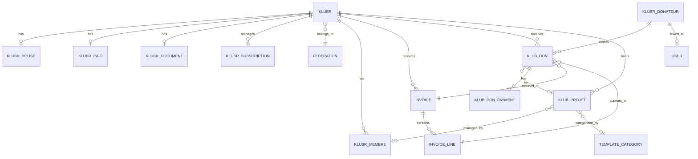

### Backend API - Donaction

> **Version**: 2.0.0 | **Last Updated**: 2025-12-18

#### Context
Strapi 5 headless CMS providing REST API for all frontend applications. Handles clubs, donations, members, projects, invoices, and integrations with Stripe, ImageKit, and Brevo.

#### Stack
- **Framework**: Strapi 5
- **Language**: TypeScript 5
- **Database**: PostgreSQL (prod), SQLite (dev)
- **Payments**: Stripe 17
- **Media**: ImageKit
- **Email**: Brevo (Sendinblue)

#### Commands
| Command | Description |
|---------|-------------|
| `npm run develop` | Dev server on port 1437 |
| `npm run build` | Production build |
| `npm run gen:types` | Generate TypeScript types |
| `npm run export-db` | Export database |
| `npm run import-db` | Import database |

#### Folder Structure
```
src/
├── api/                    # Content-type modules
│   └── {entity}/
│       ├── content-types/{entity}/
│       │   ├── schema.json     # Schema definition
│       │   └── lifecycles.ts   # Lifecycle hooks
│       ├── controllers/        # Request handlers
│       ├── services/           # Business logic
│       ├── routes/             # Route definitions
│       └── middlewares/        # Route middlewares
├── components/             # Reusable Strapi components
├── helpers/                # Utilities (emails, PDF, GCC)
├── middlewares/            # Global middlewares
└── index.ts                # Bootstrap + global lifecycles
```

#### Rules

##### Naming Conventions
See `@docs/rules/backend/naming-conventions.md` for file, function, variable, constant, and type naming standards.

##### Critical: documentId vs id
- [CRITICAL] Use `documentId` for ALL document operations, NOT `id`
- [CRITICAL] `documentId` is 24-char alphanumeric string
```typescript
// ✅ Correct
const doc = await strapi.documents('api::klubr.klubr').findOne({ documentId });
await strapi.documents('api::klubr.klubr').update({ documentId, data });

// ❌ Wrong - will fail in Strapi 5
const doc = await strapi.documents('api::klubr.klubr').findOne({ id });
```

##### Controllers
- [CTRL] Use factory pattern: `factories.createCoreController()`
- [CTRL] ALWAYS validate & sanitize in this order:
```typescript
async find(ctx) {
  // 1. Validate
  await this.validateQuery(ctx);
  // 2. Sanitize query
  const sanitizedQuery = await this.sanitizeQuery(ctx);
  // 3. Process
  const entities = await strapi.documents('api::klubr.klubr').findMany(sanitizedQuery);
  // 4. Sanitize output
  return this.sanitizeOutput(entities, ctx);
}
```
- [CTRL] Core actions: `find`, `findOne`, `create`, `update`, `delete`

##### Services
- [SVC] Use factory pattern: `factories.createCoreService()`
- [SVC] Pure business logic only - NO request/response handling
- [SVC] NO auth checks in services (do in controllers/middlewares)
- [SVC] Extract helpers outside factory at module level

##### Document Service API
- [DOC] Primary methods: `findMany()`, `findOne()`, `create()`, `update()`, `delete()`, `count()`
- [DOC] Draft & Publish: `publish()`, `unpublish()`, `discardDraft()`
- [DOC] Default returns draft versions in default locale
- [DOC] Published versions are immutable
```typescript
// Find with filters
const docs = await strapi.documents('api::klubr.klubr').findMany({
  filters: { status: 'active' },
  populate: ['logo', 'membres'],
  sort: ['createdAt:desc'],
  pagination: { page: 1, pageSize: 25 }
});
```

##### Middlewares (Preferred for Business Logic)
- [MW] Use middlewares instead of lifecycle hooks for business logic
- [MW] Pattern: return async function with `ctx` and `next`
```typescript
export default (config, { strapi }) => {
  return async (ctx, next) => {
    // Before: permission checks
    if (!ctx.state.user) {
      return ctx.unauthorized('Not authenticated');
    }
    await next();
    // After: response modification
  };
};
```

##### Lifecycle Hooks (Limited Use)
- [LIFE] NOT recommended for business logic → use middlewares
- [LIFE] Use ONLY for: database-level ops, users-permissions, file uploads
- [LIFE] Warning: triggers multiple times in v5 (draft + published)
```typescript
// Only when necessary
export default {
  beforeCreate(event) {
    event.params.data.slug = slugify(event.params.data.name);
  }
};
```

##### Error Handling
- [ERR] Use Koa context methods:
  - `ctx.badRequest(msg)` - 400 validation
  - `ctx.unauthorized(msg)` - 401 auth
  - `ctx.forbidden(msg)` - 403 permission
  - `ctx.notFound(msg)` - 404 missing
  - `ctx.internalServerError(msg)` - 500 server
- [ERR] Always log before returning error
- [ERR] Include descriptive messages (French)

##### Security
- [SEC] Verify `ctx.state.user` in controllers
- [SEC] Create reusable permission middlewares
- [SEC] Sanitize all outputs with `sanitizeOutput()`
- [SEC] Remove internal fields: `removeId()`, `removeCodes()`

##### Query Engine (Complex Queries)
- [QE] Use `strapi.db.query()` for direct database access
- [QE] Operators: `$eq`, `$ne`, `$gt`, `$lt`, `$in`, `$contains`, `$null`, `$and`, `$or`
```typescript
const results = await strapi.db.query('api::klubr.klubr').findMany({
  where: {
    $and: [
      { status: 'active' },
      { membres: { $gt: 0 } }
    ]
  }
});
```

##### Typing
- [TS] Define types in `src/_types.ts`
- [TS] Use `Data.ContentType<'api::entity.entity'>`
- [TS] Use `@ts-ignore` sparingly with comments

#### Anti-Patterns
| ❌ Don't | ✅ Do | Why |
|----------|-------|-----|
| Use `id` for documents | Use `documentId` | Strapi 5 breaking change |
| Skip sanitization | Always sanitize query + output | Security |
| Business logic in lifecycles | Use middlewares/services | Maintainability |
| Auth checks in services | Check in controllers/middlewares | Separation |
| Generic errors | Use `ctx.badRequest()` etc. | Proper HTTP codes |

#### Key Files
| Path | Purpose |
|------|---------|
| `config/database.ts` | Database connection |
| `config/plugins.ts` | Plugin config (upload, email, uuid) |
| `config/middlewares.ts` | Global middleware config |
| `src/index.ts` | Bootstrap + global lifecycles |
| `src/_types.ts` | Global TypeScript types |
| `src/helpers/emails/` | Email sending utilities |

#### Reference Files
| File | When to consult |
|------|-----------------|
| `API_DOCS.md` | Endpoint list, middlewares, rate limits |
| `DATABASE.md` | Entity relationships, schema, migrations |

#### Critical Strapi v5 Documentation
| File | Purpose |
|------|---------|
| `@docs/rules/backend/strapi-v5/strapi-v5-coding-rules.md` | Comprehensive patterns, breaking changes, best practices |
| `@docs/rules/backend/strapi-v5/quick-reference.md` | Fast lookup for controllers, services, Document Service API, common filters |
| `@docs/rules/backend/strapi-v5/README.md` | Overview, decision trees, version history |

**⚠️ When in doubt**: Always consult Strapi v5 rules first before implementing controllers, services, or middlewares. The comprehensive rules are the source of truth for all backend patterns.

#### Skills
Detailed patterns in `@aidd/skills/backend/`:
- `controllers.md` - Controller patterns
- `services.md` - Service patterns
- `custom-middleware.md` - Permission middlewares
- `document-service-api.md` - CRUD with documentId
- `jwt-token.md` - Authentication flow
- `stripe-payment.md` - Payment integration


---
name: api-docs
description: API endpoint reference and external integrations
argument-hint: N/A
---

### API Documentation

#### Endpoints

- Base URL: `/api` - Strapi REST API base
- Versioning: None - Single version API
- Protocol: HTTPS (production), HTTP (development)

#### Key Endpoints

##### Klubr (Clubs)
- `GET /klubrs` - List clubs with filters
- `GET /klubrs/:uuid` - Get club by UUID
- `GET /klubrs/bySlug/:slug/:preview?` - Get club by slug with preview support
- `GET /klubrs/stats-all` - Admin: Get all clubs stats
- `GET /klubrs/:uuid/stats` - Owner/Admin: Get club stats
- `POST /klubrs/new/by-leader/:memberUuid` - Create club from member
- `POST /klubrs/:code/send-invitation` - Send club invitation
- `POST /klubrs/:uuid/create-documents` - Owner/Admin: Generate documents
- `POST /klubrs/:uuid/documents` - Owner/Admin: Upload documents
- `PUT /klubrs/:uuid/documents/validate` - Admin: Validate documents
- `GET /klubrs/:uuid/documents/:doc` - Owner/Admin: Download document

##### Klubr Membres (Members)
- `GET /klubr-membres` - List members
- `GET /klubr-membres/:uuid` - Get member by UUID
- `POST /klubr-membres` - Create member
- `POST /klubr-membres/for-front` - Create member from frontend
- `PUT /klubr-membres/:uuid` - Update member
- `PUT /klubr-membres/for-front/:uuid` - Update member from frontend
- `POST /klubr-membres/link-to-user/:code` - Link member to user account
- `POST /klubr-membres/switch-to/:uuid` - Switch to member profile
- `POST /klubr-membres/switch-to-admin-editor/:klubUuid` - Admin: Switch to admin editor profile
- `POST /klubr-membres/:code/send-invitation` - Send member invitation

##### Invoices
- `GET /invoices` - List user invoices
- `GET /invoices/:id` - Get invoice by ID
- `GET /invoices/generate/:month/:year/:genPdf?/:send?` - Generate invoices for period
- `GET /invoices/:clubUuid/generate/:month/:year/:genPdf?/:send?` - Generate invoices for club
- `GET /invoices/:uuid/pdf` - Generate invoice PDF
- `GET /invoices/:uuid/send` - Send invoice email

##### Donations
- `POST /klub-don-payments/create-payment-intent` - Create Stripe payment intent
  - Body: `{ price, idempotencyKey?, donorPaysFee?, metadata: { donUuid, klubUuid, projectUuid?, donorUuid? } }`
  - Response: `{ intent: string, reused: boolean }`
  - Dual path: Stripe Connect (if klubr has connected account) or Classic Stripe
- `POST /klub-don-payments/stripe-web-hooks` - Stripe webhook handler (no auth)
- `GET /klub-don-payments/check` - Check payment status

#### Middlewares

##### Custom Middlewares
- `global::request-logger` - Logs all incoming requests
- `api::klubr.owner-or-admin` - Restricts access to club owner or admin
- `api::klubr.admin-editor-or-admin` - Restricts access to admin editor or admin
- `api::klubr.remove-unauthorized-fields` - Sanitizes response fields based on permissions
- `api::invoice.my-invoices` - Restricts invoices to user's own invoices
- `api::klubr-membre.can-create` - Validates member creation permissions
- `api::klubr-membre.can-update` - Validates member update permissions
- `api::klubr-membre.admin` - Admin-only access

##### Built-in Strapi Middlewares
- `strapi::errors` - Global error handler
- `strapi::security` - Security headers and CSP configuration
- `strapi::cors` - CORS configuration
- `strapi::body` - Body parsing with 20MB limit, multipart support

#### Rate Limiting

- Default limit: 25 records per page
- Max limit: 100 records per page
- Pagination: Enabled with count - `withCount: true`

#### External Integrations

##### Stripe
- Payment processing via Stripe SDK
- Dual payment paths:
  - **Stripe Connect**: For klubrs with connected accounts (on_behalf_of, transfer_data, application_fee)
  - **Classic Stripe**: For klubrs without connected accounts (direct payment to platform)
- Path selection: Based on `klubr.trade_policy.stripe_connect` boolean (default: true)
- Webhook endpoints:
  - `/klub-don-payments/stripe-web-hooks` - Payment intents
  - `/stripe-connect/webhooks` - Account events
- Secrets: `STRIPE_SECRET_KEY`, `STRIPE_WEBHOOK_SECRET`, `STRIPE_CONNECT_WEBHOOK_SECRET`

##### Brevo (Email)
- Email provider: Brevo SMTP relay
- Configuration: @donaction-api/config/plugins.ts
- SDK integration: `sib-api-v3-sdk`

##### ImageKit
- Upload provider: `strapi-provider-upload-imagekit`
- Configuration: @donaction-api/config/plugins.ts
- Folder management for avatars and media

##### Google Cloud
- Authentication library for Google APIs
- Used for club assessments and place data


### Database

This part provides detailed information about the database used in the project, including its type, connection details, migration strategies, and tools for seeding and mocking data.

#### Information

- **Schema path**: @donaction-api/src/api/*/content-types/*/schema.json
- **Type**: PostgreSQL (production), SQLite (dev), MySQL (supported)
- **ORM/Driver**: Strapi 5 (built on Knex.js), `pg` driver v8
- **Connection**: @donaction-api/config/database.ts with multi-client support

#### Main entities and relationships

Core entities managing club donations, memberships, projects, and invoicing:

**Club management**:
- `klubr`: Main club entity with federation relations, logo, address, members count
- `klubr-house`: OneToOne with `klubr` (club house details)
- `klubr-info`: OneToOne with `klubr` (additional club information)
- `klubr-document`: OneToOne with `klubr` (club documents)
- `klubr-membre`: Club members
- `klubr-subscription`: ManyToOne with `klubr` (subscriptions with API tokens)
- `federation`: ManyToOne relation with `klubr` (clubs can belong to federations)

**Donation system**:
- `klub-don`: Donations with relations to `klubr-donateur`, `klubr`, `klub-projet`, `invoice`, `invoice-line`
- `klubr-donateur`: Donor entity (Particulier/Organisme) with OneToOne to `klub-don` and `users-permissions.user`
- `klub-don-payment`: OneToMany with `klub-don` (payment tracking)
- `klub-projet`: Projects with OneToOne to `klubr`, funding goals, dynamic content zones

**Invoicing**:
- `invoice`: Invoices with OneToMany to `klub-dons` and `invoice-lines`, OneToOne to `klubr`
- `invoice-line`: ManyToOne with `invoice` and `klub-don`

**Content**:
- `blog`, `newsletter`: Content types
- `page-*`: Static pages (home, contact, mecenat, cookie, liste-don)
- `template-projects-*`: Project templates with categories

**Other**:
- `cgu`, `cgu-klub`: Terms and conditions
- `trade-policy`: Trade policies
- `mecenat-reassurance`: Sponsorship reassurance content

**Plugins**:
- `users-permissions`: User authentication
- `strapi-advanced-uuid`: UUID generation for entities
- `strapi-plugin-color-picker`: Color selection
- `strapi-provider-upload-imagekit`: Image storage


```mermaid
erDiagram
    KLUBR ||--o| KLUBR_HOUSE : has
    KLUBR ||--o| KLUBR_INFO : has
    KLUBR ||--o| KLUBR_DOCUMENT : has
    KLUBR ||--o{ KLUBR_SUBSCRIPTION : manages
    KLUBR }o--|| FEDERATION : belongs_to
    KLUBR ||--o{ KLUBR_MEMBRE : has
    KLUBR ||--o{ INVOICE : receives
    KLUBR ||--o{ KLUB_DON : receives
    KLUBR ||--o{ KLUB_PROJET : hosts

    KLUBR_DONATEUR ||--o{ KLUB_DON : makes
    KLUBR_DONATEUR ||--o| USER : linked_to

    KLUB_DON }o--o| KLUB_PROJET : for
    KLUB_DON ||--o{ KLUB_DON_PAYMENT : has
    KLUB_DON }o--|| INVOICE : included_in
    KLUB_DON }o--|| INVOICE_LINE : appears_in

    INVOICE ||--o{ INVOICE_LINE : contains

    KLUB_PROJET }o--o| KLUBR_MEMBRE : managed_by
    KLUB_PROJET }o--o| TEMPLATE_CATEGORY : categorized_by
```

#### Migrations

Strapi 5 built-in migrations - Auto-generated on schema changes, stored in `database/migrations/`

#### Seeding

Strapi import/export commands:
- `npm run export-db`: Export DB to `data/strapi-export`
- `npm run import-db`: Import DB from `data/strapi-export.tar.gz.enc`
- Both use encryption key for security
