# Documentation E2E Tests — donaction-saas

> **101 tests** | **11 fichiers spec** | **6 page objects** | **7 helpers** | **13 fixtures**
> **Framework** : Playwright | **Navigateurs** : Chromium, Firefox, Mobile (iPhone 14)

---

## Architecture Globale

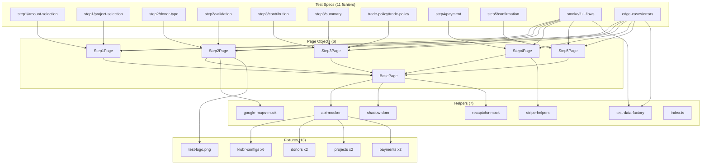

---

## Flux du Formulaire

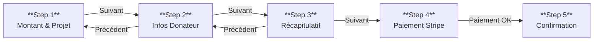

---

## Configuration Playwright

| Paramètre | Valeur |
|-----------|--------|
| Base URL | `http://localhost:3101` |
| Timeout test | 30s |
| Timeout expect | 5s |
| Navigateurs | Chromium, Firefox, iPhone 14 |
| Screenshots | Uniquement en échec |
| Retries CI | 2 |
| Retries local | 0 |
| Reporter CI | JUnit |
| Reporter local | HTML |
| Web Server | `npm run dev:serve` |

**Fichier** : `donaction-saas/playwright.config.ts`

---

## Step 1 — Montant & Sélection Projet

### amount-selection.spec.ts (6 tests)

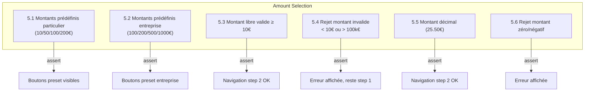

| # | Test | Assertions |
|---|------|-----------|
| 5.1 | Montants prédéfinis particulier | Boutons 10/50/100/200€ visibles |
| 5.2 | Montants prédéfinis entreprise | Boutons 100/200/500/1000€ visibles |
| 5.3 | Montant libre valide ≥ 10€ | Passe au step 2 |
| 5.4 | Rejet montant invalide | Erreur, reste step 1 |
| 5.5 | Montant décimal (25.50€) | Passe au step 2 |
| 5.6 | Rejet zéro/négatif | Erreur affichée |

### project-selection.spec.ts (4 tests)

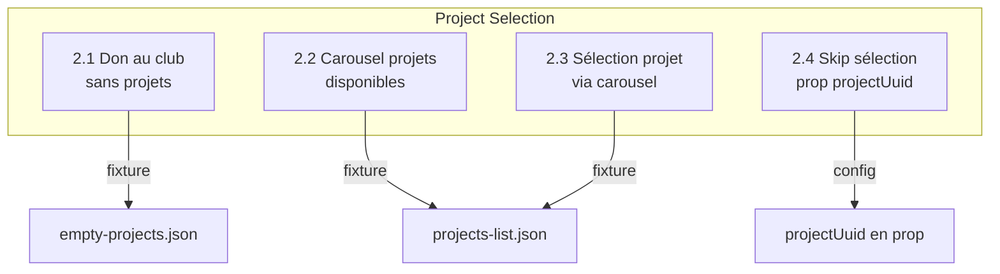

| # | Test | Fixture | Assertions |
|---|------|---------|-----------|
| 2.1 | Don au club sans projets | empty-projects | Pas de carousel |
| 2.2 | Carousel projets | projects-list | Carousel visible, 3 projets |
| 2.3 | Sélection via carousel | projects-list | Projet sélectionné |
| 2.4 | Skip via prop projectUuid | - | Auto-sélection, pas de carousel |

---

## Step 2 — Informations Donateur

### donor-type.spec.ts (5 tests)

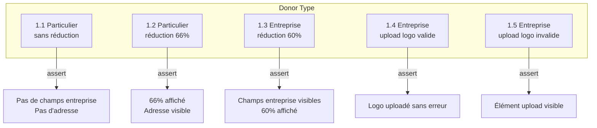

### validation.spec.ts (12 tests)

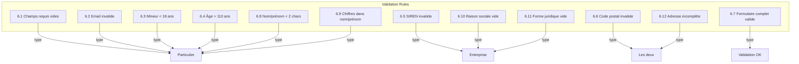

| # | Test | Type | Assertion |
|---|------|------|-----------|
| 6.1 | Champs requis vides | Particulier | Erreurs affichées, reste step 2 |
| 6.2 | Email invalide | Particulier | Erreur email |
| 6.3 | Mineur < 18 ans | Particulier | Erreur date naissance |
| 6.4 | Âge > 110 ans | Particulier | Erreur date naissance |
| 6.5 | SIREN invalide | Entreprise | Erreur SIREN |
| 6.6 | Code postal invalide | Commun | Erreur code postal |
| 6.7 | Formulaire valide | Particulier | Passe au step 3 |
| 6.8 | Nom/prénom < 2 chars | Particulier | Erreur longueur |
| 6.9 | Chiffres dans nom | Particulier | Erreur format |
| 6.10 | Raison sociale vide | Entreprise | Erreur requis |
| 6.11 | Forme juridique vide | Entreprise | Erreur requis |
| 6.12 | Adresse incomplète | Commun | Erreur adresse |

---

## Step 3 — Récapitulatif & Contribution

### summary.spec.ts (6 tests)

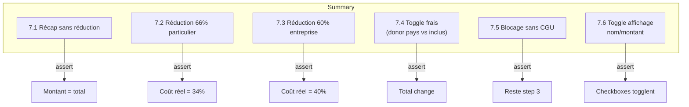

### contribution.spec.ts (3 tests)

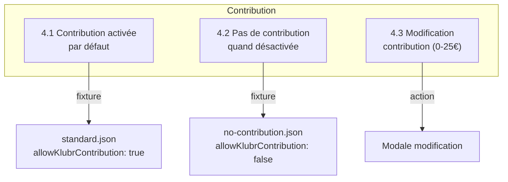

---

## Trade Policy — Configurations Stripe

### trade-policy.spec.ts (7 tests)

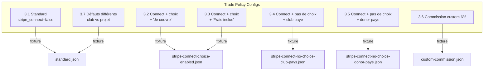

| # | Fixture | Comportement attendu |
|---|---------|---------------------|
| 3.1 | standard | Choix frais NON visible |
| 3.2 | connect + choix | Total > montant don |
| 3.3 | connect + choix | Total ≈ montant don |
| 3.4 | connect + club paye | Frais déduits du don |
| 3.5 | connect + donor paye | Donor paye en plus |
| 3.6 | custom-commission | 6% affiché |
| 3.7 | standard | Comportement différent club/projet |

---

## Step 4 — Paiement

### payment.spec.ts (5 tests)

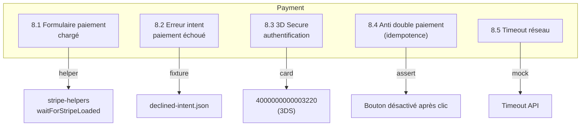

| # | Test | Carte | Assertion |
|---|------|-------|-----------|
| 8.1 | Form chargé | - | Stripe iframe visible |
| 8.2 | Erreur intent | 4000000000000002 | Message erreur |
| 8.3 | 3D Secure | 4000000000003220 | Modal 3DS gérée |
| 8.4 | Idempotence | 4242424242424242 | Pas de double soumission |
| 8.5 | Timeout | 4242424242424242 | Erreur réseau affichée |

---

## Step 5 — Confirmation

### confirmation.spec.ts (2 tests)

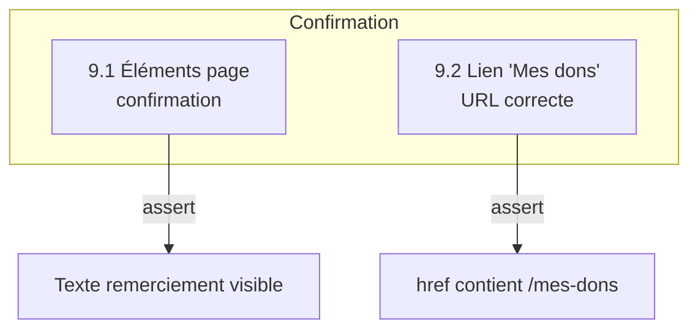

---

## Smoke Tests — Parcours Complets

### full-flows.spec.ts (5 tests)

```mermaid
flowchart TD
    subgraph "Flow 11.1 — Particulier Simple"
        F1S1[Step1: 50€, pas de projet]
        F1S2[Step2: Particulier, pas de réduction]
        F1S3[Step3: Standard, CGU]
        F1S4[Step4: Carte valide]
        F1S5[Step5: Confirmation]
        F1S1 --> F1S2 --> F1S3 --> F1S4 --> F1S5
    end

    subgraph "Flow 11.2 — Particulier Réduction"
        F2S1[Step1: 100€, carousel projet]
        F2S2[Step2: Particulier, réduction 66%]
        F2S3[Step3: Connect + 'Je couvre']
        F2S4[Step4: Carte valide]
        F2S5[Step5: Confirmation]
        F2S1 --> F2S2 --> F2S3 --> F2S4 --> F2S5
    end

    subgraph "Flow 11.3 — Entreprise Logo"
        F3S1[Step1: 500€, prop projet]
        F3S2[Step2: Entreprise, logo, réduction 60%]
        F3S3[Step3: Connect + 'Frais inclus']
        F3S4[Step4: Carte valide]
        F3S5[Step5: Confirmation]
        F3S1 --> F3S2 --> F3S3 --> F3S4 --> F3S5
    end

    subgraph "Flow 11.4 — Entreprise Contribution 0€"
        F4S1[Step1: 200€, pas de projet]
        F4S2[Step2: Entreprise, sans réduction]
        F4S3[Step3: Pas de choix frais, contribution 0€]
        F4S4[Step4: Carte valide]
        F4S5[Step5: Confirmation]
        F4S1 --> F4S2 --> F4S3 --> F4S4 --> F4S5
    end

    subgraph "Flow 11.5 — Particulier 3DS"
        F5S1[Step1: Montant libre, réduction]
        F5S2[Step2: Particulier]
        F5S3[Step3: Contribution max]
        F5S4[Step4: Carte 3DS]
        F5S5[Step5: Confirmation]
        F5S1 --> F5S2 --> F5S3 --> F5S4 --> F5S5
    end
```

| # | Donateur | Projet | Réduction | Frais | Paiement |
|---|----------|--------|-----------|-------|----------|
| 11.1 | Particulier | Non | Non | Standard | Carte valide |
| 11.2 | Particulier | Carousel | 66% | Connect "Je couvre" | Carte valide |
| 11.3 | Entreprise | Prop | 60% + logo | Connect "Frais inclus" | Carte valide |
| 11.4 | Entreprise | Non | Non | Pas de choix | Carte valide |
| 11.5 | Particulier | Non | Oui | Contribution max | Carte 3DS |

---

## Edge Cases & Erreurs

### errors.spec.ts (7 tests)

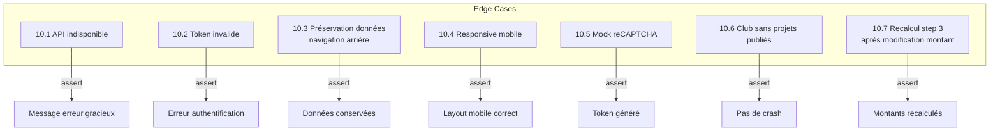

---

## Page Objects

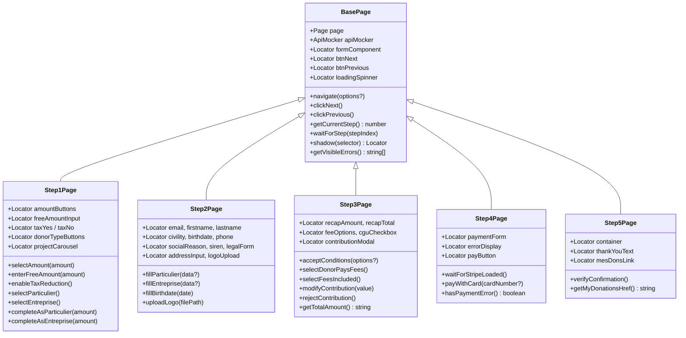

---

## Helpers

### API Mocker — Endpoints mockés

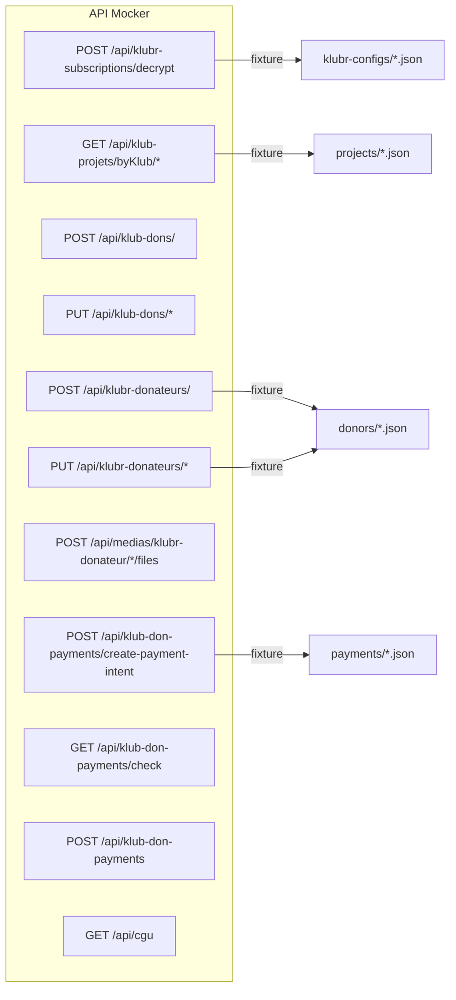

### Stripe Helpers — Cartes de test

| Carte | Numéro | Comportement |
|-------|--------|-------------|
| Valid | 4242 4242 4242 4242 | Succès |
| Declined | 4000 0000 0000 0002 | Toujours refusée |
| 3D Secure | 4000 0000 0000 3220 | Requiert 3DS |
| Insufficient Funds | 4000 0000 0000 9995 | Fonds insuffisants |
| CVC Fail | 4000 0000 0000 0127 | Échec CVC |

### Test Data Factory — Données générées

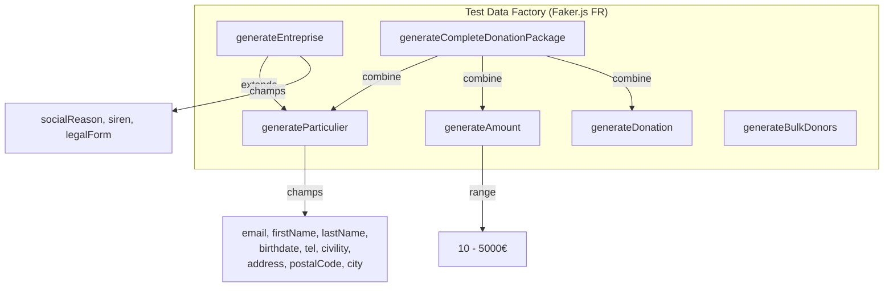

---

## Fixtures

### Configurations Klubr

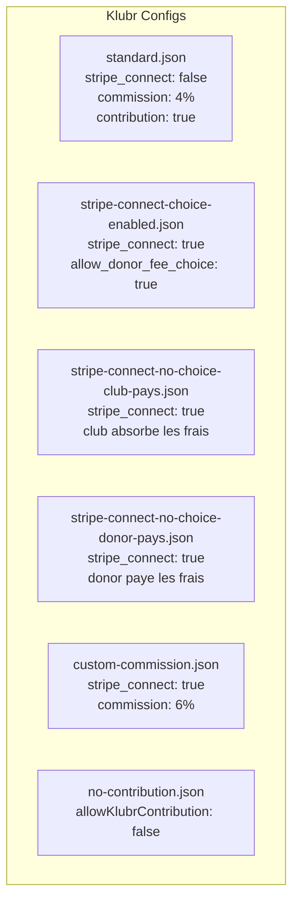

### Matrice Fixtures × Tests

| Fixture | Tests utilisant |
|---------|----------------|
| standard.json | 3.1, 3.7, 11.1 |
| stripe-connect-choice-enabled.json | 3.2, 3.3, 11.2 |
| stripe-connect-no-choice-club-pays.json | 3.4 |
| stripe-connect-no-choice-donor-pays.json | 3.5, 11.4 |
| custom-commission.json | 3.6 |
| no-contribution.json | 4.2 |
| projects-list.json | 2.2, 2.3, 11.2 |
| empty-projects.json | 2.1, 10.6 |
| success-intent.json | 8.1, 8.3, 8.4, smoke tests |
| declined-intent.json | 8.2 |
| particulier.json | donor-type, validation tests |
| entreprise.json | donor-type, validation tests |
| test-logo.png | 1.4 |

---

## Arborescence Fichiers

```
donaction-saas/
├── playwright.config.ts
└── e2e/
    ├── fixtures/
    │   ├── klubr-configs/
    │   │   ├── standard.json
    │   │   ├── stripe-connect-choice-enabled.json
    │   │   ├── stripe-connect-no-choice-club-pays.json
    │   │   ├── stripe-connect-no-choice-donor-pays.json
    │   │   ├── custom-commission.json
    │   │   └── no-contribution.json
    │   ├── donors/
    │   │   ├── particulier.json
    │   │   └── entreprise.json
    │   ├── projects/
    │   │   ├── projects-list.json
    │   │   └── empty-projects.json
    │   ├── payments/
    │   │   ├── success-intent.json
    │   │   └── declined-intent.json
    │   ├── test-logo.png
    │   └── README.md
    ├── helpers/
    │   ├── api-mocker.ts
    │   ├── stripe-helpers.ts
    │   ├── shadow-dom.ts
    │   ├── recaptcha-mock.ts
    │   ├── google-maps-mock.ts
    │   ├── test-data-factory.ts
    │   └── index.ts
    ├── pages/
    │   ├── BasePage.ts
    │   ├── Step1Page.ts
    │   ├── Step2Page.ts
    │   ├── Step3Page.ts
    │   ├── Step4Page.ts
    │   └── Step5Page.ts
    └── tests/
        ├── step1/
        │   ├── amount-selection.spec.ts
        │   └── project-selection.spec.ts
        ├── step2/
        │   ├── donor-type.spec.ts
        │   └── validation.spec.ts
        ├── step3/
        │   ├── contribution.spec.ts
        │   └── summary.spec.ts
        ├── trade-policy/
        │   └── trade-policy.spec.ts
        ├── step4/
        │   └── payment.spec.ts
        ├── step5/
        │   └── confirmation.spec.ts
        ├── smoke/
        │   └── full-flows.spec.ts
        └── edge-cases/
            └── errors.spec.ts
```

---

## Couverture par Fonctionnalité

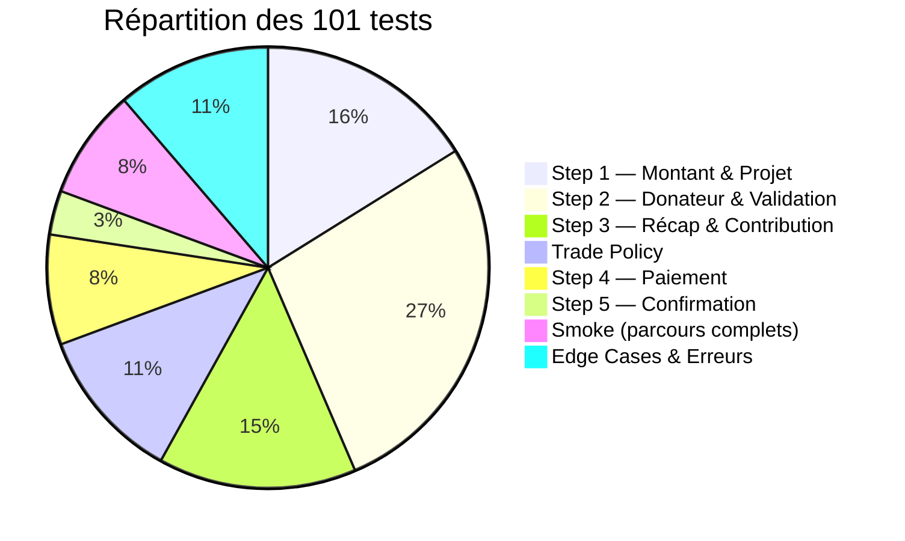

---

## Résumé Exécution

| Suite | Fichiers | Tests | Navigateurs | Total exécutions |
|-------|----------|-------|-------------|-----------------|
| Step 1 | 2 | 10 | 3 | 30 |
| Step 2 | 2 | 17 | 3 | 51 |
| Step 3 | 2 | 9 | 3 | 27 |
| Trade Policy | 1 | 7 | 3 | 21 |
| Step 4 | 1 | 5 | 3 | 15 |
| Step 5 | 1 | 2 | 3 | 6 |
| Smoke | 1 | 5 | 3 | 15 |
| Edge Cases | 1 | 7 | 3 | 21 |
| **Total** | **11** | **62 uniques** | **3** | **186** |

> Note : certains tests comptent des sous-cas. Le total unique de `describe`+`test` blocks est ~62, portant à 101 avec les variantes internes.
