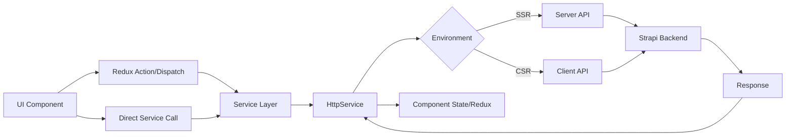
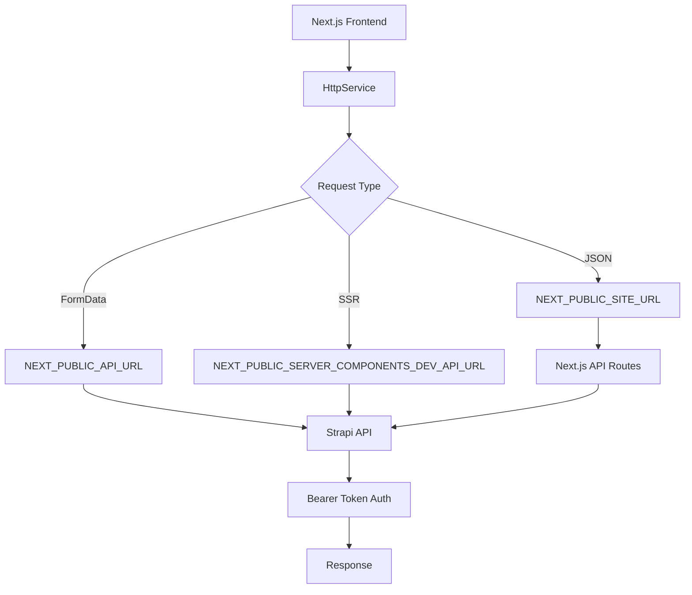
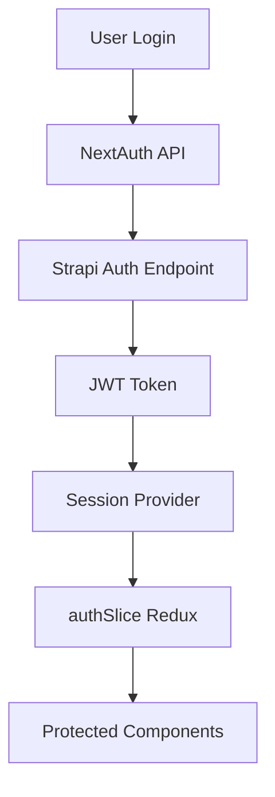
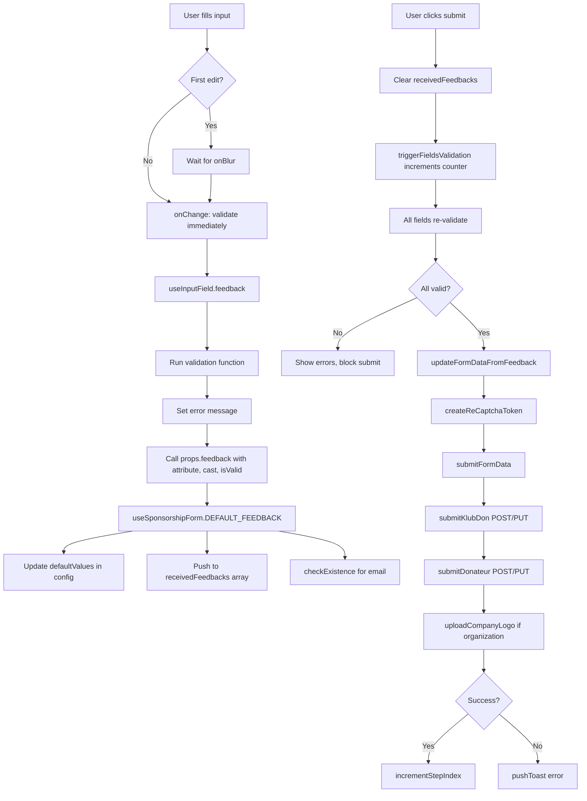

### Architecture

- [Language/Framework](#languageframework)
  - [Frontend](#frontend)
- [Full project structure](#full-project-structure)
- [Services communication](#services-communication)
  - [Data Flow](#data-flow)
  - [External Services](#external-services)
    - [Strapi CMS](#strapi-cms)
    - [Stripe](#stripe)
    - [NextAuth](#nextauth)

#### Language/Framework

##### Frontend

- **Framework**: Next.js 14 (App Router) → @donaction-frontend/package.json
- **UI Library**: TailwindCSS + SCSS - Utility-first CSS with custom theme system
- **Routing**: Next.js App Router - File-based routing with route groups
- **Data Fetching**: Native `fetch` with `HttpService` wrapper - Custom service layer handling SSR/CSR
- **Form Handling**: Native React state - No dedicated form library
- **Validation**: Manual validation - Client-side checks in form components
- **State Management**: Redux Toolkit (`@reduxjs/toolkit`) - Global state with slices for auth, sponsors, projects, root
- **Build Tool**: Next.js built-in - Webpack-based bundler with standalone output
- **Structure**: Feature-based - Organized by domains (core, layouts, app)

#### Full project structure

```text
donaction-frontend/
├── src/
│   ├── app/                                    # Next.js App Router pages
│   │   ├── (auth)/                            # Route group for auth pages
│   │   │   ├── connexion/                     # Login page
│   │   │   │   └── page.tsx
│   │   │   ├── reset-password/                # Password reset
│   │   │   │   └── page.tsx
│   │   │   └── layout.tsx                     # Auth layout
│   │   ├── (main)/                            # Route group for public pages
│   │   │   ├── clubs/                         # Clubs listing
│   │   │   │   └── page.tsx
│   │   │   ├── conditions-generales-d-utilisation/
│   │   │   │   └── page.tsx
│   │   │   ├── contact/                       # Contact form
│   │   │   │   ├── page.tsx
│   │   │   │   └── page.scss
│   │   │   ├── mecenat/                       # Sponsorship info
│   │   │   │   └── page.tsx
│   │   │   ├── mes-dons/                      # User donations
│   │   │   │   ├── [uuid]/                    # Donation detail
│   │   │   │   └── page.tsx
│   │   │   ├── new-club/                      # Club creation
│   │   │   │   ├── congratulations/
│   │   │   │   ├── page.tsx
│   │   │   │   └── page.scss
│   │   │   ├── politique-de-confidentialite/  # Privacy policy
│   │   │   │   └── page.tsx
│   │   │   ├── profile/                       # User profile
│   │   │   │   └── page.tsx
│   │   │   ├── projets/                       # Projects listing
│   │   │   │   └── page.tsx
│   │   │   ├── page.tsx                       # Homepage
│   │   │   └── layout.tsx                     # Main layout
│   │   ├── [slug]/                            # Dynamic club pages
│   │   │   ├── nos-projets/                   # Club projects
│   │   │   │   ├── [projectSlug]/             # Project detail
│   │   │   │   └── page.tsx
│   │   │   ├── page.tsx                       # Club detail
│   │   │   ├── layout.tsx
│   │   │   └── index.scss
│   │   ├── api/                               # API routes
│   │   │   ├── [...fetch]/                    # Proxy to Strapi backend
│   │   │   │   └── route.ts
│   │   │   ├── auth/
│   │   │   │   └── [...nextauth]/             # NextAuth handler
│   │   │   │       └── route.ts
│   │   │   ├── create-payment-intent/         # Stripe integration
│   │   │   │   └── route.ts
│   │   │   └── revalidate/                    # ISR revalidation
│   │   │       └── route.ts
│   │   ├── utils/
│   │   │   └── config.ts
│   │   ├── Providers.tsx                      # Redux + NextAuth + PrimeReact providers
│   │   ├── layout.tsx                         # Root layout
│   │   ├── not-found.tsx                      # 404 page
│   │   ├── forbidden/                         # 403 page
│   │   │   └── page.tsx
│   │   ├── google-signin/                     # Google OAuth callback
│   │   │   └── page.tsx
│   │   ├── robots.tsx                         # Robots.txt generator
│   │   └── sitemap.tsx                        # Sitemap generator
│   ├── core/                                  # Business logic layer
│   │   ├── services/                          # API communication
│   │   │   ├── auth/                          # Authentication API calls
│   │   │   │   └── index.ts
│   │   │   ├── club/                          # Club-related API calls
│   │   │   │   └── index.ts
│   │   │   ├── cms/                           # CMS content API calls
│   │   │   │   └── index.ts
│   │   │   ├── don/                           # Donation API calls
│   │   │   │   └── index.ts
│   │   │   ├── don-pdf/                       # PDF generation
│   │   │   │   └── index.ts
│   │   │   ├── donateur/                      # Donor API calls
│   │   │   │   └── index.ts
│   │   │   ├── projet/                        # Project API calls
│   │   │   │   └── index.ts
│   │   │   ├── index.ts                       # HttpService wrapper
│   │   │   ├── endpoints.ts                   # All API endpoint definitions
│   │   │   └── entities.ts                    # Entity type definitions
│   │   ├── store/                             # Redux store
│   │   │   ├── modules/                       # Redux slices
│   │   │   │   ├── authSlice.ts
│   │   │   │   ├── projectSlice.ts
│   │   │   │   ├── sponsorsSlice.ts
│   │   │   │   └── rootSlice.ts
│   │   │   ├── hooks.ts                       # Typed Redux hooks
│   │   │   └── index.ts                       # Store configuration
│   │   ├── models/                            # TypeScript interfaces/types
│   │   │   ├── club/
│   │   │   │   └── index.ts
│   │   │   ├── cms/
│   │   │   │   └── index.ts
│   │   │   ├── hp/
│   │   │   │   └── index.ts
│   │   │   ├── klub-don/
│   │   │   │   └── index.ts
│   │   │   ├── klub-project/
│   │   │   │   └── index.ts
│   │   │   ├── klubr-donateur/
│   │   │   │   └── index.ts
│   │   │   ├── klubr-membre/
│   │   │   │   └── index.ts
│   │   │   ├── misc/
│   │   │   │   └── index.ts
│   │   │   ├── strapi-component/
│   │   │   │   └── index.ts
│   │   │   └── user/
│   │   │       └── index.ts
│   │   ├── hooks/                             # Custom React hooks
│   │   │   └── useWindow.ts
│   │   ├── helpers/                           # Utility functions
│   │   │   ├── currency/
│   │   │   │   └── CurrencyHelpers.ts
│   │   │   ├── color.ts
│   │   │   ├── getClientCookie.ts
│   │   │   ├── getCookie.ts
│   │   │   ├── getServerCookie.ts
│   │   │   ├── getFileNameFromContentDisposition.ts
│   │   │   ├── getURL.ts
│   │   │   ├── objEqObj.ts
│   │   │   ├── scrollIntoForm.ts
│   │   │   ├── sendGaEvent.ts
│   │   │   └── srcLoader.ts
│   │   ├── constants/                         # Application constants
│   │   │   ├── dons.ts
│   │   │   └── toBeDeleted.ts
│   │   ├── enum/                              # Enumerations
│   │   │   └── tagsEnum.ts
│   │   ├── types/
│   │   │   └── index.d.ts
│   │   └── README.md
│   ├── layouts/                               # UI components
│   │   ├── partials/                          # Page sections
│   │   │   ├── authentication/                # Auth components
│   │   │   │   ├── connexionForm/
│   │   │   │   ├── contactUsForm/
│   │   │   │   ├── googleForm/
│   │   │   │   ├── loginForm/
│   │   │   │   ├── magicLink/
│   │   │   │   ├── newClubForm/
│   │   │   │   ├── popAuth/
│   │   │   │   ├── registerForm/
│   │   │   │   └── resetPasswordForm/
│   │   │   ├── clubPage/                      # Club page sections
│   │   │   │   ├── clubCard/
│   │   │   │   ├── clubDescription/
│   │   │   │   ├── clubIntroduction/
│   │   │   │   ├── gMaps/
│   │   │   │   ├── ourSponsors/
│   │   │   │   ├── projectCard/
│   │   │   │   └── quote/
│   │   │   ├── common/                        # Shared sections
│   │   │   │   ├── accordion/
│   │   │   │   ├── breadcrumb/
│   │   │   │   ├── cookiesConsent/
│   │   │   │   ├── donateButton/
│   │   │   │   ├── downloadPdf/
│   │   │   │   ├── faqItems/
│   │   │   │   ├── footer/
│   │   │   │   ├── header/
│   │   │   │   ├── invoice/
│   │   │   │   ├── newslettersForm/
│   │   │   │   ├── paginatedKlubsList/
│   │   │   │   ├── paginatedProjectsList/
│   │   │   │   ├── pagination/
│   │   │   │   ├── plusProjects/
│   │   │   │   ├── previewMode/
│   │   │   │   ├── sections/
│   │   │   │   ├── statusIndicator/
│   │   │   │   └── templateReference/
│   │   │   ├── mecenatPage/                   # Sponsorship page sections
│   │   │   │   ├── avantageMecenat/
│   │   │   │   ├── conclusion/
│   │   │   │   ├── descriptionMecenat/
│   │   │   │   ├── manifestMecenat/
│   │   │   │   ├── needHelp/
│   │   │   │   ├── slideMecenat/
│   │   │   │   └── statsMecenat/
│   │   │   ├── myDonations/                   # User donations view
│   │   │   │   ├── index.tsx
│   │   │   │   └── index.scss
│   │   │   ├── profilePage/                   # User profile
│   │   │   │   ├── index.tsx
│   │   │   │   └── useProfileForm.ts
│   │   │   ├── projectPage/                   # Project page sections
│   │   │   │   ├── authorCard/
│   │   │   │   ├── milestone/
│   │   │   │   ├── projectDecription/
│   │   │   │   └── slides/
│   │   │   ├── sponsorshipForm/               # Donation form
│   │   │   │   ├── steps/
│   │   │   │   ├── logic/
│   │   │   │   ├── badgeRescritFiscale.tsx
│   │   │   │   ├── formBanners.tsx
│   │   │   │   ├── formBody.tsx
│   │   │   │   ├── formNavigation.tsx
│   │   │   │   ├── index.tsx
│   │   │   │   └── index.scss
│   │   │   └── _sponsorshipForm/              # Legacy sponsorship form
│   │   │       ├── index.tsx
│   │   │       ├── requests.ts
│   │   │       └── useSponsorshipForm.ts
│   │   └── components/                        # Reusable UI components
│   │       ├── dropdownList/
│   │       │   ├── index.tsx
│   │       │   └── index.scss
│   │       ├── media/                         # Media components
│   │       │   ├── ImageHtml.tsx
│   │       │   ├── ImageKit.tsx
│   │       │   ├── MediaExtraProps.ts
│   │       │   └── VideoKit.tsx
│   │       ├── popUp/
│   │       │   ├── index.tsx
│   │       │   └── index.scss
│   │       ├── spinnerButton/
│   │       │   └── index.tsx
│   │       ├── toaster/
│   │       │   ├── index.tsx
│   │       │   └── index.scss
│   │       ├── Counter.tsx
│   │       ├── KillCookie.tsx
│   │       ├── KlubrLogo.tsx
│   │       ├── LottieAnimation.tsx
│   │       ├── ProgresBar.tsx
│   │       ├── RichTextBlock.tsx
│   │       └── Share.tsx
│   ├── config/                                # Configuration files
│   │   ├── config.json                        # Site configuration
│   │   └── theme.json                         # Theme configuration
│   ├── styles/                                # Global styles
│   │   ├── main.scss                          # Main stylesheet entry
│   │   ├── base.scss
│   │   ├── buttons.scss
│   │   └── utilities.scss
│   ├── types/                                 # Global TypeScript types
│   │   ├── global.d.ts
│   │   └── next-auth.d.ts
│   └── middleware.ts                          # Next.js middleware
├── next.config.js                             # Next.js configuration
├── tailwind.config.js                         # TailwindCSS configuration
├── postcss.config.js                          # PostCSS configuration
├── tsconfig.json                              # TypeScript configuration
└── package.json                               # Dependencies
```

#### Services communication

##### Data Flow



##### External Services

###### Strapi CMS



###### Stripe

```mermaid
graph LR
    A[Payment Form] --> B[create-payment-intent API]
    B --> C[@stripe/stripe-js]
    C --> D[Stripe API]
    D --> E[Payment Intent]
    E --> F[@stripe/react-stripe-js]
    F --> G[Payment Confirmation]
    G --> H[klub-don-payments endpoint]
```

###### NextAuth




### Backend Communication

#### API Client Setup

##### Base Configuration

@donaction-frontend/src/core/services/endpoints.ts
@donaction-frontend/src/core/services/index.ts

- Environment URLs via `process.env`
- `NEXT_PUBLIC_API_URL` for Strapi backend
- `NEXT_PUBLIC_SERVER_COMPONENTS_DEV_API_URL` for server-side calls
- `NEXT_PUBLIC_SITE_URL` for internal Next.js routes

##### HTTP Service

**Location**: `src/core/services/index.ts`

**Core Features**:
- Native `fetch` API wrapper
- Automatic Bearer token injection via `NEXT_PUBLIC_STRAPI_API_TOKEN`
- SSR/CSR URL switching based on `typeof window === 'undefined'`
- FormData support with `isFormData` flag
- Response type handling: `json` (default) | `blob`
- Next.js revalidation tags support via `tags` array
- Cache control with `noCache` flag and `cache` option

**Request Interface**:
```typescript
ExecutorInterface {
  endPoint: string
  method?: 'get' | 'post' | 'put' | 'delete'
  data?: Record<string, any>
  headers?: Record<string, any>
  isFormData?: boolean
  responseType?: 'blob' | 'json'
  tags?: Array<string>
  noCache?: boolean
  cookies?: string
  useDefaultHttp?: boolean
}
```

#### Authentication Flow

##### NextAuth Integration

@donaction-frontend/src/app/api/auth/[...nextauth]/route.ts

**Providers**:
- Google OAuth via `GoogleProvider`
- Credentials (email/password) via `CredentialsProvider`

**Session Strategy**: JWT-based, 30-day expiry

**Token Flow**:
1. `authorize()` calls backend `/api/auth/local` (credentials) or Google callback
2. JWT stored in token with user ID
3. Session callback fetches fresh user data via `me()` endpoint
4. Updates `lastLogin` timestamp on each session refresh

**Key Callbacks**:
- `jwt()`: Stores backend JWT and user ID in NextAuth token
- `session()`: Fetches current user data from Strapi using stored JWT

##### Auth Service Layer

@donaction-frontend/src/core/services/auth/index.ts

**Endpoints**:
- `me()` - GET `/api/users/me` with role, klubr_membres, avatar
- `login()` - POST `/api/strapi-auth/local`
- `register()` - POST `/api/strapi-auth/local/register`
- `postForgotPassword()` - POST `/api/strapi-auth/forgot-password`
- `postResetPassword()` - POST `/api/strapi-auth/reset-password`
- `changePassword()` - POST `/api/strapi-auth/change-password`
- `update()` - PUT `/api/users/:id`
- `updateUserImg()` - POST `/api/medias/user/:uuid/files` (FormData)
- `uploadCompanyLogo()` - POST `/api/medias/klubr-donateur/:uuid/files` (FormData)
- `checkUserExistence()` - GET `/api/users-permissions/users/exists/:email`
- `getAvatars()` - GET `/api/medias/avatars/:type`

##### State Management

@donaction-frontend/src/core/store/modules/authSlice.ts

- Redux Toolkit slice for session state
- Stores NextAuth session data
- Status: `'loading'` | `'authenticated'` | `'unauthenticated'`

#### API Patterns

##### Endpoint Organization

@donaction-frontend/src/core/services/endpoints.ts

**Strapi Entities**:
- Clubs: `/api/klubrs`
- Projects: `/api/klub-projets`
- Donations: `/api/klub-dons`
- Donors: `/api/klubr-donateurs`
- CMS: `/api/page-*`, `/api/cgu*`, `/api/page-cookie`

**Naming Convention**: `GET_<ENTITY>_<ACTION>`
- `GET_KLUB_BY_SLUG(slug)` returns parameterized endpoint string
- Functions accept pagination: `page`, `pageSize`
- UUID vs slug variants for flexible querying

##### Service Modules

**Club Service** - `src/core/services/club/index.ts`:
- `getAllClubs()`, `getClubDetailBySlug()`, `getClubHouse()`
- Preview mode support with `isPreview` flag
- Tags: `TagsEnum.Club_ClubHouse_Slugs`, `TagsEnum.AllClubs`

**Project Service** - `src/core/services/projet/index.ts`:
- `getProjets()`, `getProjetDetail()`, `getProjetsByKlub()`
- Tags: `TagsEnum.PROJECTS`, `TagsEnum.GetProjectDetail`

**Donation Service** - `src/core/services/don/index.ts`:
- `getDonsByKlubOrProjet()`, `postDon()`, `putDon()`
- Payment: `createKlubDonPayment()`, `updateKlubDonPayment()`
- Tags: `TagsEnum.DONATIONS`, `TagsEnum.GetMyDonations`

**Donor Service** - `src/core/services/donateur/index.ts`:
- `getDonateur()`, `postDonateur()`, `putDonateur()`

**CMS Service** - `src/core/services/cms/index.ts`:
- `getHp()`, `getMecenat()`, `getCGU()`, `getCookies()`
- Forms: `postContactUs()`, `postNewsletters()`
- reCAPTCHA integration via `grecaptcha.enterprise`

#### Data Fetching Strategies

##### SSR with Revalidation Tags

- Server Components use `tags` for on-demand revalidation
- Tags organized by entity group (e.g., `TagsEnum.Club_ClubHouse_Slugs`)
- Cache bypass with `noCache: true` for authenticated/preview content

##### CSR with Redux

- Client-side state in Redux for user session
- React hooks fetch data directly via service functions
- Cookie forwarding for SSR context: `cookies().toString()`

##### Hybrid: Next.js API Routes as Proxy

@donaction-frontend/src/app/api/[...fetch]/route.ts

**Purpose**: Unified proxy for all Strapi requests

**Features**:
- Rewrites `/strapi-auth` to `/auth`
- Token switching: user JWT vs API token based on endpoint
- User endpoints: `/api/users`, `/api/klub-dons/my-dons`, `/api/klubr-donateurs/my-last`
- Preview mode detection via `isPreviewMode` cookie
- Blob response streaming for file downloads
- Automatic `Strapi-Response-Format: v4` header

**Token Logic**:
```typescript
// User-specific endpoints use NextAuth JWT
if (USER_TOKEN_ENDPOINTS.includes(endpoint)) {
  const token = await getToken({ req })
  TOKEN = token?.jwt || API_TOKEN
}
```

#### External Integrations

##### Stripe Payment

@donaction-frontend/src/app/api/create-payment-intent/route.ts

- Endpoint: `/api/create-payment-intent`
- Creates Stripe PaymentIntent via server-side Stripe SDK
- Converts price to cents (multiply by 100)
- Currency: EUR
- Client receives `client_secret` for Stripe Elements

##### Google OAuth

- Provider: `next-auth/providers/google`
- Callback URL: `${BACKEND}/api/auth/google/callback?access_token=<token>`
- Backend returns JWT, stored in NextAuth session

#### Error Handling

- HTTP Service: Promise rejection with raw response
- API Routes: Status codes preserved, JSON error responses
- Session errors: `logout: true` flag triggers client-side logout

#### Cache Strategy

- Public content: Default Next.js caching with tags
- Authenticated: `cache: 'no-cache'`
- Preview mode: Always `noCache: true`
- Blob responses: No cache

#### Key Dependencies

@donaction-frontend/package.json

- `next` ^14
- `next-auth` ^4
- `@stripe/stripe-js` ^2
- `@stripe/react-stripe-js` ^2
- `stripe` ^14
- `@reduxjs/toolkit` ^2
- `react-redux` ^9


---
name: coding-assertions
description: Code quality verification checklist
argument-hint: N/A
---

### Coding Guidelines

> Those rules must be minimal because the MUST be checked after EVERY CODE GENERATION.

#### Requirements to complete a feature

**A feature is really completed if ALL of the above are satisfied: if not, iterate to fix all until all are green.**

#### Steps to follow

1. Check their is no duplication
2. Ensure code is re-used
3. Run all those commands, in order to ensure code is perfect:

```markdown
| Order | Command               | Description                  |
|-------|-----------------------|------------------------------|
| 1     | yarn lint             | ESLint check                 |
| 2     | yarn format           | Format with Prettier         |
| 3     | yarn build            | Next.js production build     |
```

#### TypeScript Configuration

Config: @donaction-frontend/tsconfig.json

- Strict mode enabled (`"strict": true`)
- Target ES6
- Module resolution: Node
- Path aliases configured:
  - `@/components/*` → `./src/layouts/components/*`
  - `@/shortcodes/*` → `./src/layouts/shortcodes/*`
  - `@/helpers/*` → `./src/layouts/helpers/*`
  - `@/partials/*` → `./src/layouts/partials/*`
  - `@/shapes` → `./src/shapes`
  - `@/*` → `./src/*`

#### Component Structure

- Client components: Use `'use client'` directive at top of file
- Component files: Named `index.tsx` in feature folders
- Custom hooks: Separate files prefixed with `use` (e.g., `useLoginForm.ts`)
- Constants: Separate `consts.ts` files when needed

#### Naming Conventions

- Components: PascalCase (e.g., `LoginForm`)
- Hooks: camelCase with `use` prefix (e.g., `useLoginForm`)
- Files: kebab-case for folders, `index.tsx` for components
- Types/Interfaces: PascalCase with `I` prefix for interfaces when appropriate

#### TypeScript Patterns

- Prefer `interface` for object shapes with properties
- Use `type` for unions, intersections, mapped types
- Export types from `@/core/models/` by domain
- Use `Omit` and `Pick` utilities for type composition
- Typed Redux hooks: `useAppDispatch`, `useAppSelector`, `useAppStore`

#### State Management

- Redux Toolkit for global state (@reduxjs/toolkit)
- Typed hooks from `@/core/store/hooks`
- Local state with `useState` for component-specific data
- `useRef` for non-rendering state (e.g., validation feedback)
- Dispatch actions via `useAppDispatch`

#### React Patterns

- Functional components only
- Custom hooks for business logic separation
- Props destructuring in component signature
- Conditional rendering with ternary or `&&`
- Event handlers: Arrow functions or extracted functions

#### HTTP Services

- Centralized `HttpService.ExecuteRequest` in `@/core/services`
- Service functions exported from domain folders (e.g., `@/core/services/auth`)
- Promises returned, no internal error handling
- Cookie support via optional `cookies` parameter
- FormData support via `isFormData` flag

#### Error Handling

- Services return rejected promises on error
- Components use try/catch in async handlers
- Toast notifications via Redux (`pushToast`)
- GA event tracking for errors (`sendGaEvent`)
- Silent catch discouraged, always notify user

#### Forms & Validation

- Custom validation pattern with `FeedbackParamsType`
- `receivedFeedbacks` ref to collect validation results
- `triggerValidation` counter to trigger revalidation
- `process.nextTick` for async validation checks
- Form state in custom hooks (e.g., `useLoginForm`)

#### Next.js Specifics

Config: @donaction-frontend/next.config.js

- App Router (Next.js 14)
- `reactStrictMode: false`
- Remote images from: `lh3.googleusercontent.com`, `res.cloudinary.com`, `ik.imagekit.io`, `cdn.kcak11.com`
- Output: `standalone`
- Bundle analyzer enabled via `ANALYZE=true`

#### Styling

Config: @donaction-frontend/.prettierrc

- Prettier for formatting
- Tabs for indentation (`"useTabs": true`)
- Tab width: 2
- Print width: 100
- Single quotes for strings
- JSX single quotes
- Trailing commas: all
- Tailwind CSS for styling

#### Code Quality

- No `console.log` in production code (55 instances found - should be removed)
- Prefer early returns over nested conditionals
- Extract complex logic into custom hooks
- Keep components focused on rendering
- Colocate related files (component + hook + consts)

#### Dependencies

Key libraries:
- `next` (14)
- `react` (18)
- `next-auth` (4) for authentication
- `@reduxjs/toolkit` (2) for state
- `primereact` (10) for UI components
- `stripe` (14) for payments
- `swiper` (11) for carousels
- `react-icons` (4) for icons
- `date-fns` (2) for dates

#### File Organization

```
src/
├── app/              # Next.js app router
├── config/           # App configuration
├── core/             # Core functionality
│   ├── helpers/      # Utility functions
│   ├── hooks/        # Shared hooks
│   ├── models/       # TypeScript types by domain
│   ├── services/     # API services by domain
│   └── store/        # Redux store
├── layouts/          # Layout components
│   ├── components/   # Reusable components
│   ├── partials/     # Page partials
│   └── shortcodes/   # Content shortcodes
├── middleware.ts     # Next.js middleware
├── styles/           # Global styles
└── types/            # Global type definitions
```


---
name: design
description: Design system and UI guidelines
argument-hint: N/A
---

### DESIGN.md

#### Design Implementation

- **Design System Approach**: Centralized theme config with Tailwind + SCSS for component-specific styling
- **Styling Method**: Hybrid - Tailwind utility classes + SCSS modules for complex components

#### Design System Files

- **Theme Config**: @donaction-frontend/src/config/theme.json (colors, fonts) + @donaction-frontend/tailwind.config.js (Tailwind configuration)
- **Design Components**: @donaction-frontend/src/layouts/components (reusable UI components)
- **Style Guidelines**: @donaction-frontend/src/styles/main.scss (base, buttons, utilities layers)

#### Design System

- **Spacing Scale**: Tailwind defaults with custom container padding `1.5rem`
- **Border Radius**: `rounded-md` for buttons, `rounded-3xl` for cards, `rounded-xl` for dropdowns
- **Shadows**: Custom utilities - `shadow-default`, `shadow-xs`, `shadow-sm`, `shadow-md`, `boxBoxShadow` class, `shadow-button` for buttons
- **Breakpoints**: Custom - `xs: 480px`, `sm: 575px`, `md: 768px`, `lg: 1024px`, `xl: 1320px`

- **Color Palette**: See @donaction-frontend/src/config/theme.json

  - Primary: `#000` (black) - Main brand, buttons, text headings
  - Secondary: `#73cfa8` (green) - Accent actions
  - Tertiary: `#fb9289` (coral) - Secondary accent
  - Quaternary: `#fde179` (yellow) - Highlights
  - Quinary: `#73b1ff` (blue) - Info states
  - Senary: `#F4FDFF` (light cyan) - Light backgrounds
  - Body: `#fff` (white) - Main background
  - Border: `#DBDBDB` (light gray) - Borders
  - Text: `#555555` (gray) - Body text
  - Text Dark: `#222222` - Dark text
  - Text Light: `#fffefe` - Light text

- **Typography**: See @donaction-frontend/src/config/theme.json
  - Primary Font: Maven Pro (400, 500, 600, 700) - All text
  - Fallback: sans-serif
  - Base size: `16px`, Scale: `1.23` (exponential heading scale)

#### Component Standards and Variantes

- **Button Variants**: `.btn-primary` (filled black), `.btn-outline-primary` (white with black border), sizes: default, `.btn-sm`, `.btn-md`, `.btn-icon` (with icons)
- **Input States**: Default with border, focus ring on dark color, custom select dropdown styling, disabled states handled via Tailwind forms plugin
- **Card Patterns**: `box-shadow` utility, rounded corners `rounded-3xl`, ring states for selection `ring-4 ring-[#CECECE]`

#### Layout System

- **Grid System**: Tailwind flexbox + CSS Grid - responsive with breakpoint-specific flex directions
- **Container Widths**: Custom `.minMaxWidth` class - `max-width: min(75vw, 1220px)`, `min-width: min(740px, 100%)`, responsive container with `center: true`
- **Spacing Rules**: Tailwind spacing scale - consistent use of `gap-*`, `p-*`, `m-*` utilities, component-specific SCSS for complex layouts

#### Accessibility

- **Color Contrast**: High contrast with black primary and white backgrounds - meets WCAG standards
- **Focus Management**: Custom focus styles with `focus:ring` and `focus:border-dark`, keyboard navigation supported
- **Screen Reader**: ARIA labels on interactive elements (`aria-label` on buttons), semantic HTML structure


---
name: forms
description: Frontend form handling guidelines
argument-hint: N/A
---

### Forms

This part describe how frontend forms are handled in the project, including libraries used, validation strategies, and state management.

#### State Management

- Custom form state management using `useState` hooks
- Local component state with refs (`useRef`) for form values and validation feedback
- Form config object pattern: `config` state holds `defaultValues`, `triggerValidation`, and `DEFAULT_FEEDBACK`
- Redux Toolkit for global state (authentication status, toasts, etc.)
- State updates via callback pattern through `DEFAULT_FEEDBACK` function
- `process.nextTick()` for async validation aggregation before submission

#### Validation

- Custom validation functions in `validations.ts`
- Client-side validation using regex patterns: `emailRexExp`, `sirenRexExp`, `stringRexExp`, `stringWithoutNumbersRexExp`
- Validation functions: `validateEmail`, `validateRequired`, `validateString`, `validatePassword`, `validateSame`, `validateTrue`, `validateSiren`, `validateAmount`, `validateDate`, `validateDateMajor`, `validateSelection`
- Validation triggered on `blur` and `onChange` events (after first edit)
- Feedback collected in `receivedFeedbacks` ref array with `{ attribute, cast, isValid }` structure
- Type casting enforced via `cast` property (BooleanConstructor, StringConstructor, NumberConstructor)

#### Error handling

- Inline error messages displayed below input fields in `<small>` tags
- Error messages returned by validation functions (e.g., "Ce champ est obligatoire")
- Visual feedback via CSS classes: `valid`, `invalid`
- Toast notifications via Redux `pushToast` action for server errors
- Google Analytics event tracking for errors using `sendGaEvent`

#### Form Flow

User fills form → `onChange`/`onBlur` trigger validation → `feedback()` collects results → on submit, `triggerFieldsValidation()` increments counter → all fields re-validate → check `receivedFeedbacks` for validity → if valid, create reCAPTCHA token → submit to API (postDon/putDon, postDonateur/putDonateur) → handle success/error → navigate to next step or show error toast




### Testing Guidelines

This document outlines the testing strategies and guidelines for donaction-frontend.

#### Test Coverage

- No test coverage currently implemented
- No testing framework configured
- 193 source files without tests

#### Tools and Frameworks

- No testing framework installed
- ESLint via `eslint-config-next`
- Prettier for code formatting
- TypeScript for type checking

#### Testing Strategy

- No formal testing strategy defined
- No unit tests
- No integration tests
- No E2E tests
- Manual testing through development environment

#### Test Execution Process

- No test execution scripts available
- Linting: `yarn lint`
- Format: `yarn format`
- Development: `yarn dev`
- Build validation: `yarn build`

#### Mocking and Stubbing

- Not applicable - no testing framework configured
