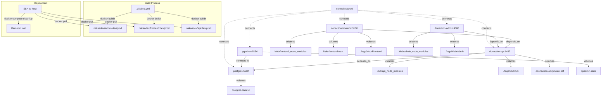

# Deployment

## CI/CD Pipeline

### GitLab CI Flow

- **Steps**:

  1. Version: Generate semantic version based on branch (`MAJOR.MINOR.PATCH`)
  2. Build: Build Docker images using `docker buildx` for each service
  3. Deploy: SSH to target host, pull images, restart containers

- **Test Automation**:

  - Unit tests: Not configured in pipeline
  - Integration tests: Not configured in pipeline
  - E2E tests: Not configured in pipeline

- **Deployment Triggers**:
  - Manual deployments: All deployments require manual trigger via `when: manual`
  - Automated deployments: Version generation manual on `release/*`, `demo/*`, `feature/*` branches

## Monitoring & Logging

- **Monitoring Tools**: Not configured

  - Application monitoring: Not configured
  - Infrastructure monitoring: Not configured
  - Performance monitoring: Not configured

- **Logging**:

  - Log aggregation: Local volume mounts to `./logs/` directory
  - Log levels: Not specified
  - Log retention: Based on host filesystem

- **Alert Configuration**:
  - Critical alerts: Not configured
  - Warning alerts: Not configured
  - Alert channels: Not configured

## Deployment Process

- **Deployment Steps**:

  - Database migration process: Not specified in CI/CD

- **Rollback Procedure**:

  1. Identify: Check logs and monitoring for issues
  2. Execute: SSH to host, pull previous image tag, restart containers
  3. Verify: Manual verification required

# Infrastructure

## Project Structure

```plaintext
/repos/klubr/klubr-front/
├── donaction-admin/          # Angular admin dashboard
├── donaction-frontend/       # Next.js frontend
├── donaction-api/            # Strapi API backend
├── donaction-saas/           # Web components
├── docker-compose.yml    # Local dev orchestration
├── .gitlab-ci.yml        # CI/CD pipeline
└── cicd/
    ├── env/              # Environment setup scripts
    └── globalDefinitions/
        └── ssh.yml       # SSH deployment template
```

## Environments Variables

### Environment Files

- @.env (root)
- @donaction-admin/.env
- @donaction-frontend/.env, @donaction-frontend/.env.prod, @donaction-frontend/.env.re7
- @donaction-api/.env.development, @donaction-api/.env.prod, @donaction-api/.env.re7
- @donaction-saas/.env.prod, @donaction-saas/.env.re7

### Required Environment Variables

- `PROJECT_SLUG`: Container prefix
- `ENVIRONMENT`: deployment, production, re7
- `DATABASE_CLIENT`: postgres
- `DATABASE_HOST`: postgres container name
- `DATABASE_NAME`: DB name
- `DATABASE_USERNAME`: DB user
- `DATABASE_PASSWORD`: DB password
- `DATABASE_PORT`: 5432
- `JWT_SECRET`: API authentication
- `NODE_ENV`: Node environment
- `PGADMIN_DEFAULT_EMAIL`: pgAdmin login
- `PGADMIN_DEFAULT_PASSWORD`: pgAdmin password
- `HOST_STG`: Staging server host
- `HOST_PROD`: Production server host
- `SSH_PRIVATE_KEY`: SSH deployment key
- `SSH_USER`: SSH username
- `CI_GITLAB_ACCESS_TOKEN`: GitLab API token
- `DOCKER_AUTH_TOKEN`: Docker Hub encoded auth

## URLs

- **Development**:

  - URL: localhost:3100 (frontend), localhost:4300 (admin), localhost:1437 (api)
  - Purpose: Local development with docker-compose

- **Production**:
  - URL: Not specified in config
  - SLA: Not specified

## Containerization


