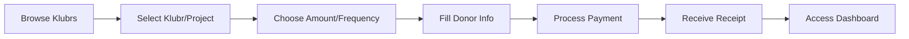
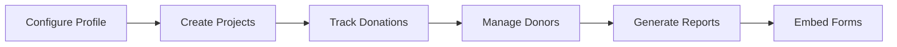

# PROJECT_BRIEF.md

Klubr is a platform enabling associations (Klubrs) to receive and manage sponsorships/donations from individuals and companies, with integrated payment processing, donor management, and administrative tools.

## Executive Summary

- **Project Name**: Klubr
- **Vision**: Streamline sponsorship and donation management for associations through a comprehensive digital platform
- **Mission**: Building an integrated web ecosystem that connects donors with associations, facilitating financial contributions through automated workflows, payment processing, and administrative oversight

### Full Description

Klubr is a multi-application platform designed to facilitate sponsorships and donations for associations. The platform consists of four main components: a public-facing frontend for donors, a headless CMS API for content and data management, embeddable web components for third-party integration, and an administrative interface for association management. The system handles the complete donation lifecycle including payment processing via Stripe, tax receipt generation, and donor relationship management.

## Context

The platform addresses the need for associations to efficiently manage financial contributions from supporters while providing donors with a seamless contribution experience.

### Core Domain

Klubr operates in the non-profit association management domain, specifically focusing on the financial relationship between donors and associations. The system manages the complete sponsorship lifecycle from initial donation through payment processing, tax documentation, and ongoing donor engagement. It integrates with payment providers, handles recurring subscriptions, and generates compliance documentation like tax receipts.

### Ubiquitous Language

| Term | Definition | Synonymes |
| -------- | -------------- | ----------- |
| Klubr | An association/organization that receives donations through the platform | Association, Organization |
| Donator | Individual or company making a financial contribution | Donor, Sponsor |
| Donation | One-time or recurring financial contribution | Don, Sponsorship, Contribution |
| Subscription | Recurring donation arrangement | Recurring donation |
| Project | Specific initiative within a Klubr that can receive targeted donations | Campaign, Initiative |
| Tax Receipt | Fiscal document generated for donors | Reçu fiscal |
| SIREN | French company identification number (9 digits) | Company ID |

## Features & Use-cases

- Donor registration and authentication via Google OAuth or credentials
- One-time and recurring donation processing via Stripe
- Customizable donation forms as embeddable web components
- Tax receipt generation and management
- Association profile management with projects and campaigns
- Donor dashboard showing contribution history
- Administrative interface for association managers
- Multi-klubr project management with targeted donations
- Logo upload and donator profile customization
- Email notifications via Brevo integration
- reCAPTCHA validation for form submissions
- Image management via ImageKit CDN

## User Journey maps

### Donor (Individual/Company)

- Discovers association via public frontend or embedded form
- Views association profile and available projects
- Role: Financial contributor seeking to support associations
- Goals: Make secure donations, receive tax documentation, track contributions

#### Primary Donation Journey

1. **Discovery**: Browse Klubrs or access embedded sponsorship form
2. **Selection**: Choose Klubr and optional project, select donation amount and frequency
3. **Information**: Complete donor profile (email, name, company details, logo)
4. **Payment**: Process payment securely via Stripe
5. **Confirmation**: Receive confirmation and tax receipt
6. **Management**: Access personal dashboard to view history and manage subscriptions

### Association Administrator

- Manages association profile, projects, and content
- Role: Association representative managing fundraising
- Goals: Configure association presence, track donations, manage donor relationships

#### Association Management Journey

1. **Setup**: Create/configure Klubr profile with projects
2. **Content**: Manage description, images, and project details
3. **Monitoring**: Track incoming donations and active subscriptions
4. **Engagement**: View donor profiles and contribution patterns
5. **Reporting**: Generate reports and export data
6. **Integration**: Embed donation forms on external websites

