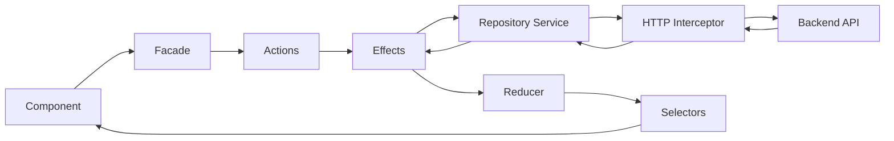

# Architecture

- [Language/Framework](#languageframework)
  - [Dashboard](#dashboard)
- [Full project structure](#full-project-structure)
- [Services communication](#services-communication)
  - [Component to API Flow](#component-to-api-flow)

## Language/Framework

### Dashboard

- **Framework**: Angular 19 → @donaction-admin/package.json
- **UI Library**: PrimeNG 19 with custom theme preset - Component library with Tailwind integration via `tailwindcss-primeui`
- **Routing**: Angular Router with lazy loading - Feature-based routing with guards (`authGuard`, `invitationCodeGuard`)
- **Data Fetching**: Angular HttpClient with interceptors - JWT auth and error handling interceptors
- **Form Handling**: Angular Reactive Forms - Template-driven and reactive forms
- **Validation**: Angular Validators with custom validators - Located in `@shared/utils/validators`
- **State Management**: NgRx Store 19 with Effects - Feature-based state organization with facades pattern
- **Build Tool**: Angular CLI with esbuild - Application builder with service worker support
- **Structure**: Feature-based architecture - Routes contain feature modules, shared contains reusable code

## Full project structure

```text
donaction-admin/
├── src/
│   ├── app/
│   │   ├── routes/                          # Feature routes (lazy loaded)
│   │   │   ├── auth/                        # Authentication feature
│   │   │   │   ├── data-access/            # NgRx state management
│   │   │   │   │   ├── +state/             # Actions, reducers, effects, selectors, facade
│   │   │   │   │   └── repositories/       # HTTP services
│   │   │   │   ├── model/                  # Feature models
│   │   │   │   └── ui/                     # Feature components
│   │   │   ├── klub/                        # Club management
│   │   │   ├── members/                     # Member management
│   │   │   ├── project/                     # Project management
│   │   │   ├── don/                         # Donations
│   │   │   ├── facturation/                 # Invoicing
│   │   │   ├── stats/                       # Statistics
│   │   │   ├── profile/                     # User profiles
│   │   │   ├── dashboard/                   # Main dashboard layout
│   │   │   └── homepage/                    # Home page
│   │   ├── shared/                          # Shared resources
│   │   │   ├── components/                  # Reusable components
│   │   │   │   ├── atoms/                   # Atomic components
│   │   │   │   ├── header/                  # Header component
│   │   │   │   ├── sidebar/                 # Sidebar component
│   │   │   │   ├── dialog/                  # Dialog components
│   │   │   │   ├── form/                    # Form components
│   │   │   │   └── ...                      # Domain-specific components
│   │   │   ├── data-access/                 # Shared state
│   │   │   │   ├── +state/                  # Shared NgRx state
│   │   │   │   └── repositories/            # Shared HTTP services
│   │   │   ├── pipes/                       # Custom pipes by domain
│   │   │   ├── services/                    # Business logic services
│   │   │   │   ├── entities/                # Entity services
│   │   │   │   ├── analytics/               # Analytics service
│   │   │   │   └── misc/                    # Utility services
│   │   │   └── utils/                       # Utilities
│   │   │       ├── guards/                  # Route guards
│   │   │       ├── interceptors/            # HTTP interceptors
│   │   │       ├── models/                  # Shared models/interfaces
│   │   │       ├── validators/              # Custom validators
│   │   │       ├── helpers/                 # Helper functions
│   │   │       ├── theme/                   # PrimeNG theme config
│   │   │       └── config/                  # Config files
│   │   ├── app.component.ts                 # Root component
│   │   ├── app.config.ts                    # Application configuration
│   │   └── app.routes.ts                    # Root routing
│   ├── environments/                        # Environment configs
│   ├── assets/                              # Static assets
│   └── styles.scss                          # Global styles
├── angular.json                             # Angular workspace config
├── tailwind.config.js                       # Tailwind configuration
├── tsconfig.json                            # TypeScript config
└── package.json                             # Dependencies
```

## Services communication

### Component to API Flow



Flow:
- Component dispatches action via `Facade`
- `Actions` trigger `Effects`
- `Effects` call `Repository Service` (HTTP service)
- `Interceptors` add auth token and handle errors
- Response updates `State` via `Reducer`
- Component observes state via `Selectors`
