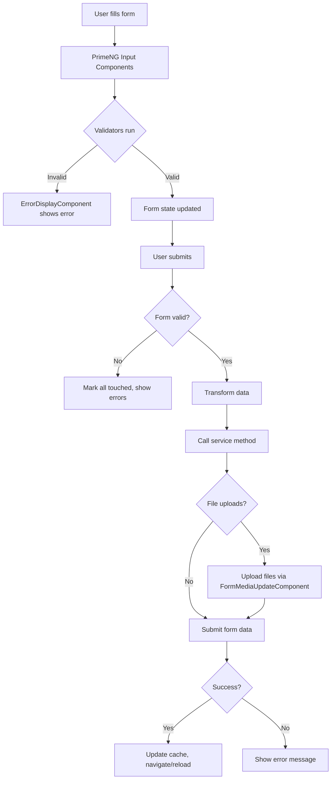

# Forms

This part describe how dashboard forms are handled in the project, including libraries used, validation strategies, and state management.

## State Management

- Angular Reactive Forms - Form state managed through `FormGroup`, `FormControl`, `FormArray`
- Local component state using signals (`WritableSignal`, `Signal`)
- Form submission tracked with `isSubmitted` signal
- Form reset via `resetForm()` method restoring initial values
- Form dirty state tracked to determine if changes exist
- No data persistence, forms reset on component destroy

## Validation

- Angular built-in validators - `Validators.required`, `Validators.email`, `Validators.minLength`, `Validators.maxLength`, `Validators.min`, `Validators.max`, `Validators.pattern`
- Custom validators in @shared/utils/validators/:
  - `passwordStrengthValidator()` - Min 8 chars, digit, special char, lower/upper case
  - `passwordMatchValidator` - Compares password and passwordConfirmation fields
  - `differentPasswordValidator` - Ensures new password differs from current
  - `minHtmlLengthValidator(minLength)` - Validates HTML content length
  - `maxHtmlLengthValidator(maxLength)` - Validates HTML content length
  - `hexColorValidator()` - Validates hex color format
  - `webSiteValidator()` - Validates URL format (http/https)
  - `dateAtLeastTomorrowValidator()` - Ensures date is at least tomorrow
  - `warn(validator)` - Transforms validator to warning instead of error
- Custom pipes for type-safe form access:
  - `FormControlPipe` - Extract typed `FormControl` from `FormGroup`
  - `FormArrayPipe` - Extract typed `FormArray` from `FormGroup`
  - `FormStatusPipe` - Access form status
- Client-side validation using reactive patterns with `statusChanges` observable

## Error handling

- `FormErrorHandlingService` - Centralized error message mapping
- `ErrorDisplayComponent` - Displays errors and warnings
  - Shows errors when control is dirty or form submitted
  - Supports warnings via `AbstractControlWarn` interface
  - Subscribes to `statusChanges` for real-time feedback
- Error messages in French, mapped from validation errors
- Custom `AbstractControlWarn` interface extends `AbstractControl` with warnings property

## GenericUpdateComponent Pattern

**Pattern CRUD** pour formulaires create/update avec gestion automatique de validation, uploads, cache et navigation.

**Location**: @donaction-admin/src/app/shared/components/generics/generic-update/generic-update.component.ts

**Documentation complète**:
- 📋 Règle: `docs/rules/admin/06-patterns/2-generic-update-component.mdc`
- 🎯 Skill: `aidd/skills/code/generic-update-component.md`

**Méthodes obligatoires**: `initForm()`, `formFields()`, `serviceUpdate()`, `serviceCreate()`

**Pattern rapide**:
```typescript
export class MemberUpdateComponent extends GenericUpdateComponent<Member> {
  protected override successMsg = 'Le profil a été mis à jour';
  protected override routePrefix = '/profile';

  constructor() {
    super();
    this.entity.set(this.config.data.profile);
  }

  protected override initForm(): void {
    const entity = untracked(this.entitySignal);
    this.entityForm = new FormGroup({
      nom: new FormControl(entity?.nom, Validators.required)
    });
  }

  protected override formFields(): { [key: string]: any } {
    return { ...this.entityForm.value };
  }

  protected override serviceUpdate(uuid: string, formValues: any): Observable<Member> {
    this.sharedFacade.updateProfile(uuid, formValues);
    return this.actions$.pipe(ofType(SharedActions.updateProfileSuccess), map(({profile}) => profile), take(1));
  }

  protected override serviceCreate(formValues: any): Observable<Member> {
    return this.profileService.createProfile(formValues).pipe(map(res => res.data as Member));
  }
}
```

**Voir la règle/skill pour exemples complets, hooks optionnels et best practices.**

## Form Flow

1. Component initializes form with `FormGroup`/`FormControl`
2. User interacts with PrimeNG form components (`p-inputtext`, `p-inputmask`, `p-datepicker`, `app-editor`)
3. Validators run on value changes, set control errors
4. `ErrorDisplayComponent` subscribes to `statusChanges`, displays errors when dirty/submitted
5. On submit: set `isSubmitted` signal to true, validate form
6. If valid: transform data via `TransformationService`, call service method
7. Service returns Observable, component handles success/error
8. On success: update cache via `CachingService`, navigate or update entity
9. File uploads handled separately via `FormMediaUpdateComponent`, merged with main form data


