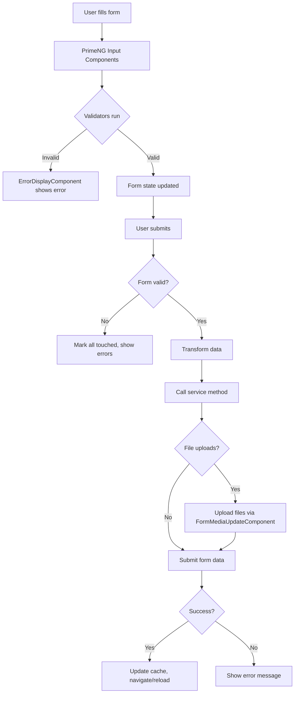

# Forms

This part describe how dashboard forms are handled in the project, including libraries used, validation strategies, and state management.

## State Management

- Angular Reactive Forms - Form state managed through `FormGroup`, `FormControl`, `FormArray`
- Local component state using signals (`WritableSignal`, `Signal`)
- Form submission tracked with `isSubmitted` signal
- Form reset via `resetForm()` method restoring initial values
- Form dirty state tracked to determine if changes exist
- No data persistence, forms reset on component destroy

## Validation

- Angular built-in validators - `Validators.required`, `Validators.email`, `Validators.minLength`, `Validators.maxLength`, `Validators.min`, `Validators.max`, `Validators.pattern`
- Custom validators in @shared/utils/validators/:
  - `passwordStrengthValidator()` - Min 8 chars, digit, special char, lower/upper case
  - `passwordMatchValidator` - Compares password and passwordConfirmation fields
  - `differentPasswordValidator` - Ensures new password differs from current
  - `minHtmlLengthValidator(minLength)` - Validates HTML content length
  - `maxHtmlLengthValidator(maxLength)` - Validates HTML content length
  - `hexColorValidator()` - Validates hex color format
  - `webSiteValidator()` - Validates URL format (http/https)
  - `dateAtLeastTomorrowValidator()` - Ensures date is at least tomorrow
  - `warn(validator)` - Transforms validator to warning instead of error
- Custom pipes for type-safe form access:
  - `FormControlPipe` - Extract typed `FormControl` from `FormGroup`
  - `FormArrayPipe` - Extract typed `FormArray` from `FormGroup`
  - `FormStatusPipe` - Access form status
- Client-side validation using reactive patterns with `statusChanges` observable

## Error handling

- `FormErrorHandlingService` - Centralized error message mapping
- `ErrorDisplayComponent` - Displays errors and warnings
  - Shows errors when control is dirty or form submitted
  - Supports warnings via `AbstractControlWarn` interface
  - Subscribes to `statusChanges` for real-time feedback
- Error messages in French, mapped from validation errors
- Custom `AbstractControlWarn` interface extends `AbstractControl` with warnings property

## GenericUpdateComponent Pattern

### Overview

`GenericUpdateComponent<T>` - Base class for CRUD forms handling both create and update operations

**Location**: @shared/components/generics/generic-update/generic-update.component.ts

### Key Features

- Automatic edit/create mode detection based on entity presence
- Form lifecycle management (init, reset, validation)
- File upload integration via `updateFile()` hook
- Cache invalidation after successful updates
- Analytics tracking with custom properties
- Loading states and error handling
- Automatic navigation after create/update

### Core Properties

**Injected Services**:
- `sharedFacade` - NgRx state management
- `router`, `route` - Navigation
- `toastService` - User notifications
- `analyticsService` - Event tracking
- `invalidateCacheService` - Cache management
- `permissionsService` - Permission checks

**Form State Signals**:
- `isSubmitted: WritableSignal<boolean>` - Tracks submission state
- `loading: WritableSignal<boolean>` - Loading indicator
- `isReady: WritableSignal<boolean>` - Form ready state
- `entitySignal: WritableSignal<T | null>` - Current entity state

**Modes**:
- `editMode: boolean` - `true` for update, `false` for create

### Methods to Override

#### Required Overrides

**`initForm(): void`** - Initialize form structure with controls and validators
```typescript
protected override initForm(): void {
  const entity = untracked(this.entitySignal);
  this.entityForm = new FormGroup({
    name: new FormControl(entity?.name, Validators.required),
    email: new FormControl(entity?.email, [Validators.required, Validators.email])
  });
}
```

**`formFields(): { [key: string]: any }`** - Transform form values before submission
```typescript
protected override formFields(): { [key: string]: any } {
  return {
    ...this.entityForm.value,
    klubr: this.sharedFacade.profile()!.klubr.uuid
  };
}
```

**`serviceUpdate(uuid: string, formValues: any): Observable<T>`** - Update API call
```typescript
protected override serviceUpdate(uuid: string, formValues: any): Observable<Member> {
  this.sharedFacade.updateProfile(uuid, formValues);
  return this.actions$.pipe(
    ofType(SharedActions.updateProfileSuccess),
    map(({profile}) => profile),
    take(1)
  );
}
```

**`serviceCreate(formValues: any): Observable<T>`** - Create API call
```typescript
protected override serviceCreate(formValues: any): Observable<Member> {
  return this.profileService.createProfile(formValues).pipe(
    map((response) => response.data as Member)
  );
}
```

#### Optional Overrides

**`getEntityForCreateMode(entity: T | null): T | null`** - Provide default values for create mode
```typescript
protected override getEntityForCreateMode(member: Member | null): Member | null {
  return {
    uuid: '',
    nom: '',
    prenom: '',
    role: 'KlubMember',
    klubr: untracked(this.sharedFacade.profile)!.klubr
  };
}
```

**`updateFile(entity: T): Observable<T>`** - Handle file uploads after form submission
```typescript
protected override updateFile(member: Member): Observable<Member> {
  if (this.entityForm.get('avatar')?.dirty && this.entityForm.get('avatar')?.value) {
    const formData = new FormData();
    formData.append('avatar', this.entityForm.get('avatar')!.value);
    return this.avatarService.newMediaProfileFile(entity.uuid, formData);
  }
  return of(member);
}
```

**`resetForm(): void`** - Reset form to initial entity values
**`preUpdateHook(formValues): any`** - Transform values before update
**`preCreateHook(formValues): any`** - Transform values before create
**`cacheToUnvalidate(entity: T): void`** - Clear relevant cache entries
**`pathsToUnvalidateDataRequest(entity: T): string[]`** - Next.js ISR paths to revalidate
**`redirectAfterCreate(entity: T): void`** - Custom navigation after create
**`redirectAfterUpdate(entity: T): void`** - Custom navigation after update
**`reloadEntity(entity: T): Observable<T>`** - Refetch entity (for Strapi components)

### Implementation Example

```typescript
@Component({
  selector: 'app-member-update',
  templateUrl: './member-update.component.html'
})
export class MemberUpdateComponent extends GenericUpdateComponent<Member> {
  protected override successMsg = 'Le profil a été mis à jour';
  protected override errorUpdateMsg = 'Le profil n\'a pas pu être modifié';
  protected override routePrefix = '/profile';

  constructor() {
    super();
    this.entity.set(this.config.data.profile); // Pass entity via DynamicDialogConfig
  }

  protected override initForm(): void {
    const entity = untracked(this.entitySignal);
    this.entityForm = new FormGroup({
      nom: new FormControl(entity?.nom, Validators.required),
      prenom: new FormControl(entity?.prenom, Validators.required),
      role: new FormControl(entity?.role, Validators.required)
    });
  }

  protected override formFields(): { [key: string]: any } {
    return {
      ...this.entityForm.value,
      klubr: this.sharedFacade.profile()!.klubr.uuid
    };
  }

  protected override serviceUpdate(uuid: string, formValues: any): Observable<Member> {
    this.sharedFacade.updateProfile(uuid, formValues);
    return this.actions$.pipe(
      ofType(SharedActions.updateProfileSuccess),
      map(({profile}) => profile),
      take(1)
    );
  }

  protected override serviceCreate(formValues: any): Observable<Member> {
    return this.profileService.createProfile(formValues).pipe(
      map((response) => response.data as Member)
    );
  }
}
```

### Submission Flow

1. User calls `onSubmit()`
2. Form validation runs, marks all controls as touched
3. If invalid, show error toast and abort
4. Get form values via `formFields()`
5. If edit mode, clean values (only dirty fields)
6. Call `preCreateHook()` or `preUpdateHook()`
7. Execute `serviceCreate()` or `serviceUpdate()`
8. Call `updateFile()` for file uploads
9. Call `reloadEntity()` to refresh entity
10. Call `cacheToUnvalidate()` and `pathsToUnvalidateDataRequest()`
11. Show success toast, reset form, redirect
12. Track analytics event

### Best Practices

- Always set `entity` model in constructor (from route data or dialog config)
- Override `successMsg`, `errorUpdateMsg`, `errorCreateMsg` for user-friendly messages
- Use `untracked()` when reading signals in form initialization
- Call `super()` in constructor before any logic
- Return only dirty fields in edit mode via `cleanFormValues()`
- Use `take(1)` with NgRx actions to prevent memory leaks
- Implement `cacheToUnvalidate()` to invalidate affected cache entries
- Set `routePrefix` for correct redirection after create

## Form Flow

1. Component initializes form with `FormGroup`/`FormControl`
2. User interacts with PrimeNG form components (`p-inputtext`, `p-inputmask`, `p-datepicker`, `app-editor`)
3. Validators run on value changes, set control errors
4. `ErrorDisplayComponent` subscribes to `statusChanges`, displays errors when dirty/submitted
5. On submit: set `isSubmitted` signal to true, validate form
6. If valid: transform data via `TransformationService`, call service method
7. Service returns Observable, component handles success/error
8. On success: update cache via `CachingService`, navigate or update entity
9. File uploads handled separately via `FormMediaUpdateComponent`, merged with main form data


