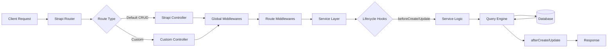
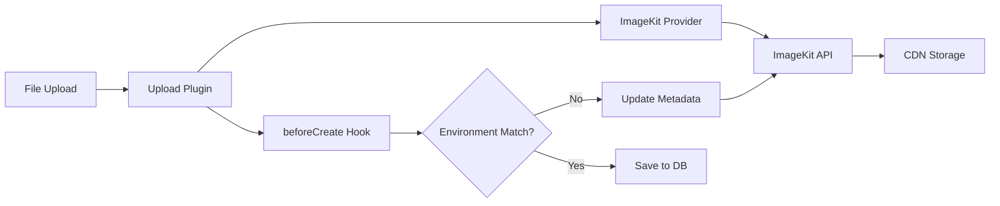

# Architecture

- [Language/Framework](#languageframework)
  - [Backend](#backend)
    - [Database](#database)
- [Full project structure](#full-project-structure)
  - [Naming Conventions](#naming-conventions)
- [Services communication](#services-communication)
  - [External Services](#external-services)
    - [ImageKit](#imagekit)
    - [Brevo (Sendinblue)](#brevo-sendinblue)
    - [Stripe](#stripe)

## Language/Framework

### Backend

- **Language/Framework**: Node.js with TypeScript / Strapi v5 → @donaction-api/package.json
- **API Style**: REST - Strapi auto-generated endpoints with custom routes
- **Architecture**: Strapi CMS with content-types, services, controllers, and lifecycles
- **ORM**: Strapi Query Engine (built-in) - database abstraction layer
- **Schema path**: `src/api/*/content-types/*/schema.json` - JSON schema definitions for content types
- **Endpoints**: `src/api/*/routes/*.ts` - custom routes + Strapi default CRUD
- **Caching**: No explicit caching layer
- **Testing**: No test framework configured

#### Database

- **Type**: PostgreSQL (production) / SQLite (development)
- **ORM/Driver**: `pg` v8 driver with Strapi Query Engine
- **Connection**: Configured via environment variables → @donaction-api/config/database.ts
- **Migration**: Strapi built-in migrations (automatic on schema changes)
- **Seeding**: `strapi import` command with encrypted exports → @donaction-api/data/
- **Mock**: No mock database configured

## Full project structure

```text
donaction-api/
├── config/                     # Strapi configuration
│   ├── admin.ts               # Admin panel config
│   ├── api.ts                 # API config
│   ├── database.ts            # Database connection config
│   ├── middlewares.ts         # Global middleware config
│   ├── plugins.ts             # Plugin configuration (users-permissions, email, upload, uuid)
│   ├── server.ts              # Server config
│   ├── cronTasks.ts           # Scheduled tasks (project status updates, etc)
│   └── logger.ts              # Logging config
├── src/
│   ├── index.ts               # Bootstrap entry point with lifecycle hooks
│   ├── constants.ts           # Global constants
│   ├── _types.ts              # Global TypeScript types
│   ├── api/                   # Content-type modules (30+ entities)
│   │   ├── klubr/             # Main club entity
│   │   │   ├── content-types/klubr/
│   │   │   │   ├── schema.json          # Content type definition
│   │   │   │   └── lifecycles.ts        # Before/after hooks
│   │   │   ├── controllers/klubr.ts     # Request handlers
│   │   │   ├── services/klubr.ts        # Business logic
│   │   │   ├── routes/
│   │   │   │   ├── klubr.ts             # Default CRUD routes
│   │   │   │   └── klubr-custom.ts      # Custom endpoints
│   │   │   └── middlewares/             # Route-specific middleware
│   │   │       ├── klubr.ts
│   │   │       ├── owner-or-admin.ts
│   │   │       ├── admin-editor-or-admin.ts
│   │   │       └── remove-unauthorized-fields.ts
│   │   ├── [entity]/          # Other entities follow same pattern
│   │   │   ├── content-types/
│   │   │   ├── controllers/
│   │   │   ├── services/
│   │   │   ├── routes/
│   │   │   └── middlewares/
│   │   └── ...                # blog, invoice, klub-don, etc
│   ├── components/            # Reusable Strapi components
│   │   ├── club-header/
│   │   ├── club-chiffres/
│   │   ├── club-presentation/
│   │   └── ...
│   ├── helpers/               # Utility functions
│   │   ├── emails/            # Email sending utilities
│   │   ├── klubrPDF/          # PDF generation (pdf-lib, qrcode)
│   │   ├── gcc/               # Google Cloud Console integration
│   │   ├── users-extensions/  # User auth extensions (register, reset password, etc)
│   │   ├── permissions.ts
│   │   ├── medias.ts
│   │   └── ...
│   ├── extensions/            # Strapi core extensions
│   ├── middlewares/           # Global middleware
│   │   └── request-logger.ts
│   └── plugins/               # Custom plugins
│       └── custom-upload/
├── types/                     # Generated TypeScript types
├── data/                      # Database exports/imports (encrypted)
└── private-pdf/               # PDF template storage
```

### Naming Conventions

- **Files**: kebab-case for routes/controllers/services, PascalCase for types
- **Functions**: camelCase
- **Variables**: camelCase
- **Constants**: UPPER_SNAKE_CASE
- **Types/Interfaces**: PascalCase with `Entity` suffix for Strapi entities

## Services communication

### Strapi Request Flow



### External Services

#### ImageKit

- **Purpose**: CDN and image storage provider
- **Integration**: Custom Strapi upload provider `strapi-provider-upload-imagekit`
- **Config**: @donaction-api/config/plugins.ts
- **Usage**: Handles all media uploads with environment-based tagging (production/staging)
- **Lifecycle**: File metadata updated on `beforeCreate` hook → @donaction-api/src/index.ts



#### Brevo (Sendinblue)

- **Purpose**: Transactional email service (invitations, newsletters)
- **Integration**: `@strapi/provider-email-nodemailer` with Brevo SMTP + `sib-api-v3-sdk` API client
- **Config**: @donaction-api/config/plugins.ts email provider
- **Usage**: `sendBrevoTransacEmail()` helper for templated emails → @donaction-api/src/helpers/emails/
- **Templates**: Predefined template IDs for member invitations, password resets, etc

#### Stripe

- **Purpose**: Payment processing for donations and subscriptions
- **Integration**: `stripe` v17 SDK
- **Config**: API keys via environment variables
- **Usage**: Invoice generation, payment handling → @donaction-api/src/api/invoice/
