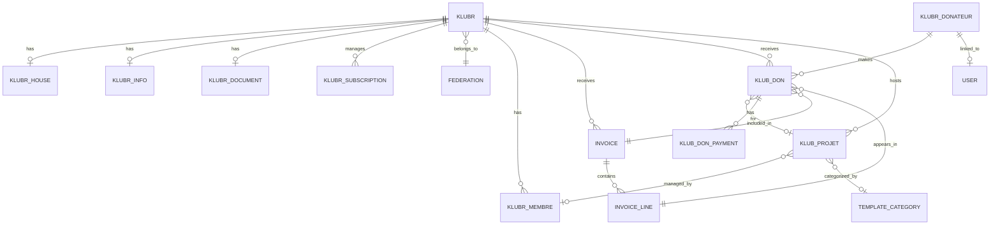

# Database

This part provides detailed information about the database used in the project, including its type, connection details, migration strategies, and tools for seeding and mocking data.

## Information

- **Schema path**: @klubr-api/src/api/*/content-types/*/schema.json
- **Type**: PostgreSQL (production), SQLite (dev), MySQL (supported)
- **ORM/Driver**: Strapi 5 (built on Knex.js), `pg` driver v8
- **Connection**: @klubr-api/config/database.ts with multi-client support

## Main entities and relationships

Core entities managing club donations, memberships, projects, and invoicing:

**Club management**:
- `klubr`: Main club entity with federation relations, logo, address, members count
- `klubr-house`: OneToOne with `klubr` (club house details)
- `klubr-info`: OneToOne with `klubr` (additional club information)
- `klubr-document`: OneToOne with `klubr` (club documents)
- `klubr-membre`: Club members
- `klubr-subscription`: ManyToOne with `klubr` (subscriptions with API tokens)
- `federation`: ManyToOne relation with `klubr` (clubs can belong to federations)

**Donation system**:
- `klub-don`: Donations with relations to `klubr-donateur`, `klubr`, `klub-projet`, `invoice`, `invoice-line`
- `klubr-donateur`: Donor entity (Particulier/Organisme) with OneToOne to `klub-don` and `users-permissions.user`
- `klub-don-payment`: OneToMany with `klub-don` (payment tracking)
- `klub-projet`: Projects with OneToOne to `klubr`, funding goals, dynamic content zones

**Invoicing**:
- `invoice`: Invoices with OneToMany to `klub-dons` and `invoice-lines`, OneToOne to `klubr`
- `invoice-line`: ManyToOne with `invoice` and `klub-don`

**Content**:
- `blog`, `newsletter`: Content types
- `page-*`: Static pages (home, contact, mecenat, cookie, liste-don)
- `template-projects-*`: Project templates with categories

**Other**:
- `cgu`, `cgu-klub`: Terms and conditions
- `trade-policy`: Trade policies
- `mecenat-reassurance`: Sponsorship reassurance content

**Plugins**:
- `users-permissions`: User authentication
- `strapi-advanced-uuid`: UUID generation for entities
- `strapi-plugin-color-picker`: Color selection
- `strapi-provider-upload-imagekit`: Image storage

## Migrations

Strapi 5 built-in migrations - Auto-generated on schema changes, stored in `database/migrations/`

## Seeding

Strapi import/export commands:
- `npm run export-db`: Export DB to `data/strapi-export`
- `npm run import-db`: Import DB from `data/strapi-export.tar.gz.enc`
- Both use encryption key for security
