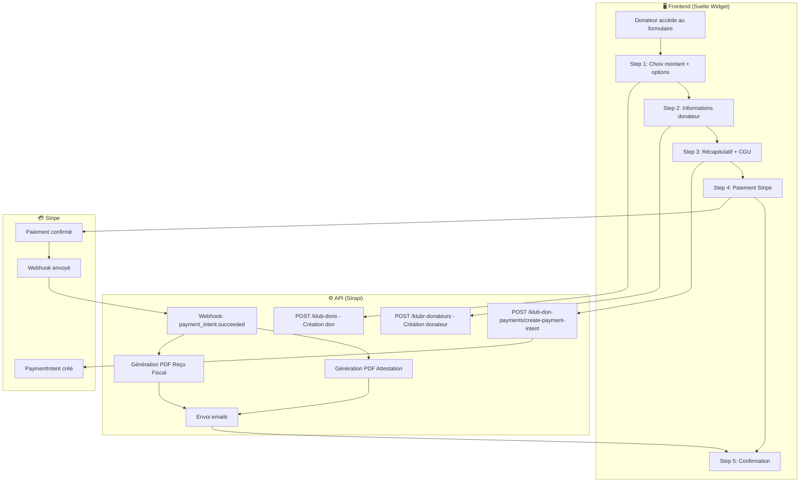
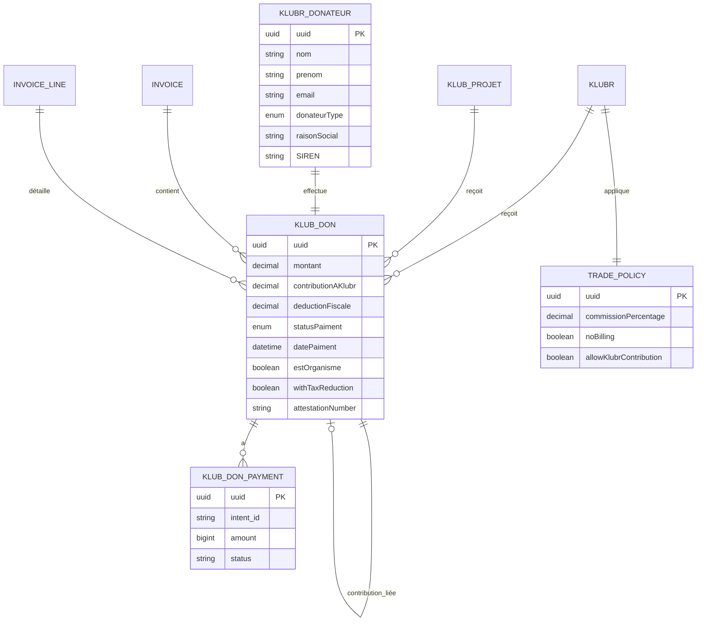
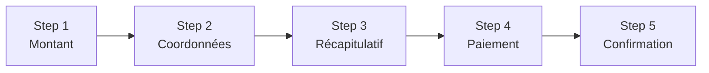
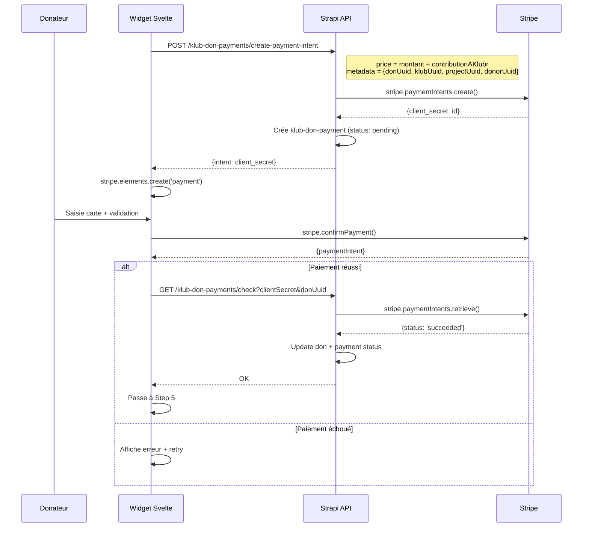
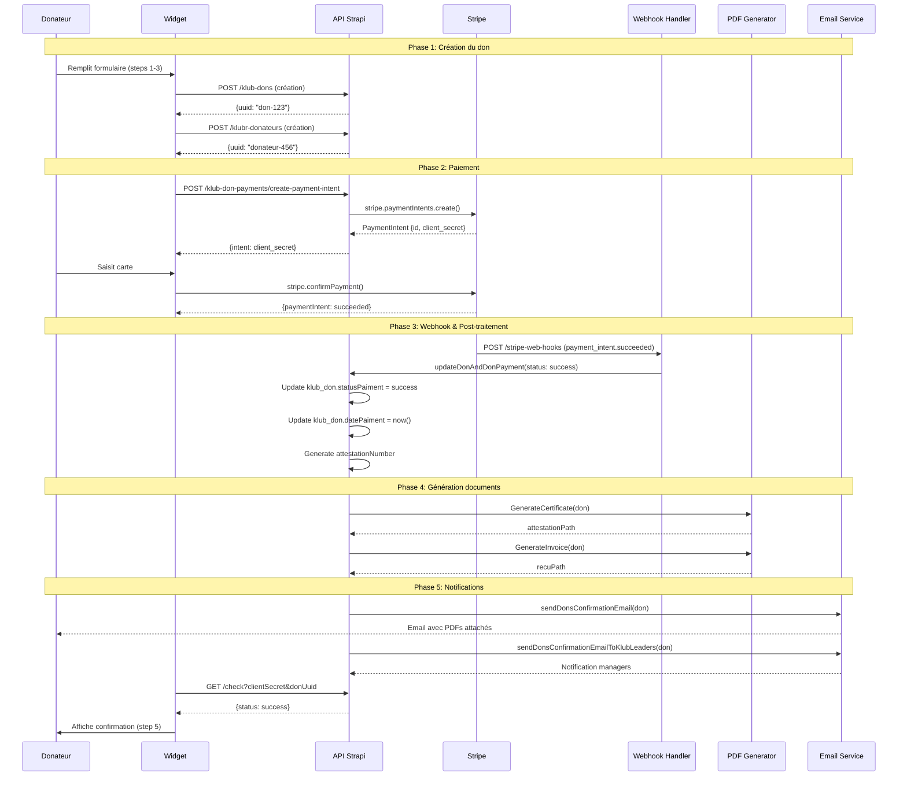
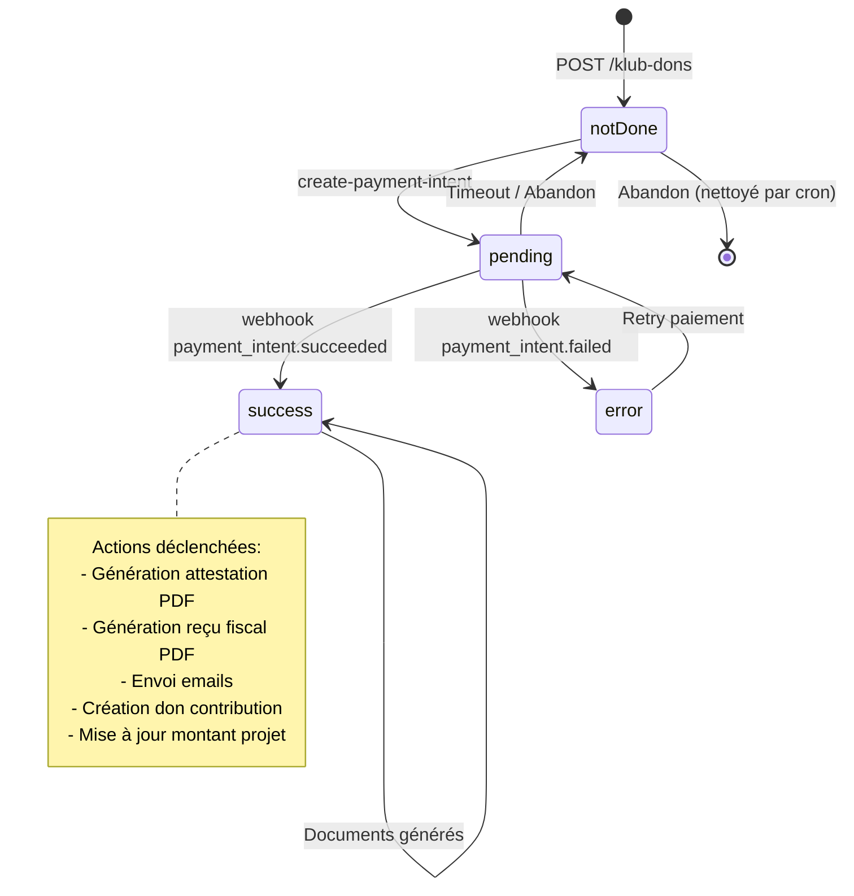
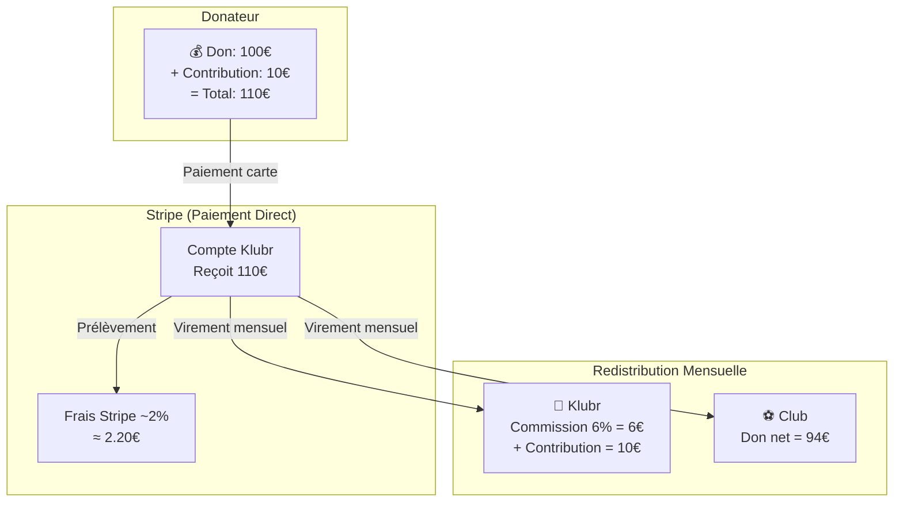

# Workflow de Collecte de Dons - Klubr/Donaction

> **Version**: 1.0.0 | **Date**: 2025-01-09 | **Statut**: Documentation de l'existant

---

## Table des Matières

1. [Vue d'Ensemble](#1-vue-densemble)
2. [Modèle de Données](#2-modèle-de-données)
3. [Configuration par Club](#3-configuration-par-club)
4. [Formulaire de Don](#4-formulaire-de-don)
5. [Flux de Paiement Stripe](#5-flux-de-paiement-stripe)
6. [Cycle de Vie d'un Don](#6-cycle-de-vie-dun-don)
7. [Actions Post-Paiement](#7-actions-post-paiement)
8. [Relances et Dons Non Terminés](#8-relances-et-dons-non-terminés)
9. [Flux Financier](#9-flux-financier)
10. [Facturation des Clubs](#10-facturation-des-clubs)
11. [Affichage dans les Interfaces](#11-affichage-dans-les-interfaces)
12. [Routes API - Référence Complète](#12-routes-api---référence-complète)
13. [Emails Envoyés](#13-emails-envoyés)
14. [Annexes](#14-annexes)

---

## 1. Vue d'Ensemble

### 1.1 Objectif du Document

Ce document décrit exhaustivement le workflow de collecte de dons de la plateforme Klubr/Donaction, une solution permettant aux associations sportives françaises de recevoir des dons de particuliers et d'entreprises avec génération automatique de reçus fiscaux.

### 1.2 Architecture Impliquée

| Application | Framework | Rôle |
|-------------|-----------|------|
| **donaction-api** | Strapi 5 (TypeScript) | Backend API, gestion des dons, webhooks Stripe |
| **donaction-frontend** | Next.js 15 | Site public, espace donateur |
| **donaction-admin** | Angular 21 | Dashboard gestionnaires d'associations |
| **donaction-saas** | Svelte 5 | Web components (formulaire de don) |

### 1.3 Flux Global



---

## 2. Modèle de Données

### 2.1 Entités Principales

#### `klub-don` (Don)

| Attribut | Type | Description |
|----------|------|-------------|
| `uuid` | UUID | Identifiant unique public |
| `montant` | decimal | Montant du don en euros |
| `contributionAKlubr` | decimal | Contribution optionnelle à la plateforme |
| `deductionFiscale` | decimal | Montant de la déduction fiscale calculée |
| `statusPaiment` | enum | `notDone`, `pending`, `success`, `error` |
| `datePaiment` | datetime | Date/heure du paiement réussi |
| `estOrganisme` | boolean | true = entreprise, false = particulier |
| `withTaxReduction` | boolean | Souhaite bénéficier de la réduction fiscale |
| `attestationNumber` | string | Numéro unique de l'attestation (ex: `ATT-2025-00001`) |
| `attestationPath` | string | Chemin du fichier PDF attestation |
| `recuPath` | string | Chemin du fichier PDF reçu fiscal |
| `emailSent` | boolean | Email de confirmation envoyé |
| `hasBeenRelaunched` | boolean | Don relancé par email |
| `relaunchCode` | integer | Code de relance (4 chiffres) |
| `isContributionDonation` | boolean | Don de contribution Klubr (auto-généré) |

**Relations:**
- `klubDonateur` → one-to-one → `klubr-donateur`
- `klubr` → one-to-one → `klubr` (association bénéficiaire)
- `klub_projet` → one-to-one → `klub-projet` (projet optionnel)
- `klub_don_payments` → one-to-many → `klub-don-payment`
- `klub_don_contribution` → one-to-one → `klub-don` (don de contribution lié)
- `invoice` → many-to-one → `invoice`
- `invoice_line` → many-to-one → `invoice-line`

#### `klubr-donateur` (Donateur)

| Attribut | Type | Description |
|----------|------|-------------|
| `uuid` | UUID | Identifiant unique public |
| `civilite` | enum | `Madame`, `Monsieur` |
| `nom` | string | Nom de famille |
| `prenom` | string | Prénom |
| `email` | email | Email du donateur |
| `donateurType` | enum | `Particulier`, `Organisme` |
| `raisonSocial` | string | Raison sociale (si organisme) |
| `SIREN` | string | Numéro SIREN (si organisme) |
| `formeJuridique` | string | Forme juridique (si organisme) |
| `adresse` | string | Adresse ligne 1 |
| `adresse2` | string | Adresse ligne 2 |
| `cp` | string | Code postal (5 caractères max) |
| `ville` | string | Ville |
| `pays` | string | Pays (défaut: France) |
| `dateNaissance` | date | Date de naissance |
| `tel` | string | Téléphone |
| `optInAffMontant` | boolean | Afficher montant publiquement |
| `optInAffNom` | boolean | Afficher nom publiquement |
| `logo` | media | Logo entreprise |
| `avatar` | media | Avatar particulier |
| `anonymized` | boolean | Données anonymisées (RGPD) |

**Relations:**
- `klubDon` → one-to-one → `klub-don`
- `users_permissions_user` → one-to-one → User (si connecté)

#### `klub-don-payment` (Paiement Stripe)

| Attribut | Type | Description |
|----------|------|-------------|
| `uuid` | UUID | Identifiant unique |
| `intent_id` | string | ID du PaymentIntent Stripe (ex: `pi_xxx`) |
| `client_secret` | string | Client secret Stripe |
| `amount` | biginteger | Montant en centimes |
| `currency` | string | Devise (`eur`) |
| `payment_method` | string | ID de la méthode de paiement |
| `status` | string | `pending`, `succeeded`, `error` |
| `error_code` | string | Code erreur Stripe (si échec) |
| `created` | biginteger | Timestamp création |

**Relations:**
- `klub_don` → many-to-one → `klub-don`

### 2.2 Diagramme ERD



---

## 3. Configuration par Club

### 3.1 Activation du Formulaire de Don

Un club peut recevoir des dons si:
- `klubr.donationEligible` = `true`
- `klubr.status` = `published`
- Le club a une `trade_policy` associée

### 3.2 Politique Commerciale (Trade Policy)

| Attribut | Type | Description | Défaut |
|----------|------|-------------|--------|
| `tradePolicyLabel` | string | Nom de la politique | - |
| `commissionPercentage` | decimal | % commission Klubr | 6% |
| `VATPercentage` | decimal | % TVA sur commission | 20% |
| `noBilling` | boolean | Pas de facturation | false |
| `allowKlubrContribution` | boolean | Autoriser contribution plateforme | true |
| `perDonationCost` | decimal | Coût fixe par don | 0 |
| `klubDonationPercentage` | decimal | % spécifique dons Klubr | 0 |
| `defaultTradePolicy` | boolean | Politique par défaut | false |

### 3.3 Attribution Automatique

À la création d'un club (`klubr.beforeCreate`), si aucune trade policy n'est définie, la politique par défaut est automatiquement assignée.

```typescript
// klubr/lifecycles.ts
if (!event.params.data?.trade_policy['connect']?.length) {
    event.params.data.trade_policy = await getDefaultTradePolicy();
}
```

---

## 4. Formulaire de Don

### 4.1 Points d'Entrée

| Source | URL | Description |
|--------|-----|-------------|
| Widget Svelte | `<donaction-form>` | Embarqué sur site externe |
| Frontend Next.js | `/[slug]?PAYEMENT_FORM=true` | Page club avec modale |
| Relance | `/[slug]?DON_UUID=xxx&RELAUNCH_CODE=1234` | Reprise don abandonné |

### 4.2 Étapes du Formulaire



#### Step 1: Choix du Montant

**Données collectées:**
- `montant`: Montant du don (min: 10€, max: 100 000€)
- `withTaxReduction`: Souhaite réduction fiscale (Oui/Non)
- `estOrganisme`: Particulier ou Entreprise
- Sélection projet (si disponible) ou don au club

**Montants suggérés:** 20€, 50€, 100€, 250€ + montant libre

**Calcul déduction fiscale affichée:**
- Particulier: 66% du montant
- Entreprise: 60% du montant

**Appels API:**
```
POST /api/klub-dons
Body: {
  data: {
    klubr: klubUuid,
    klub_projet: projectUuid | null,
    montant: number,
    withTaxReduction: boolean,
    estOrganisme: boolean,
    statusPaiment: "notDone"
  }
}
```

#### Step 2: Informations Donateur

**Données collectées (Particulier avec réduction):**
- `email` (requis)
- `civilite` (Madame/Monsieur)
- `nom`, `prenom` (requis)
- `dateNaissance` (requis, doit être majeur)
- `adresse`, `cp`, `ville`, `pays` (requis)

**Données collectées (Entreprise avec réduction):**
- `email` (requis)
- `raisonSocial` (requis)
- `SIREN` (requis, validé)
- `formeJuridique` (requis)
- `adresse`, `cp`, `ville`, `pays` (requis)
- `logo` (optionnel)

**Données collectées (Sans réduction):**
- `email` (requis)
- `nom`, `prenom` (requis)
- `dateNaissance` (requis)

**Appels API:**
```
POST /api/klubr-donateurs
Body: {
  data: {
    email, nom, prenom, civilite, dateNaissance,
    adresse, cp, ville, pays,
    donateurType: "Particulier" | "Organisme",
    raisonSocial?, SIREN?, formeJuridique?,
    klubDon: donUuid
  }
}
```

#### Step 3: Récapitulatif

**Affichage:**
- Montant du don
- Contribution Klubr (modifiable via slider, max 25€)
- Total à payer
- Coût après réduction d'impôts
- Documents reçus (Attestation + Reçu fiscal si applicable)

**Options:**
- `displayName`: Afficher nom dans liste donateurs
- `displayAmount`: Afficher montant dans liste donateurs
- `acceptConditions1`: Compréhension Fonds de dotation
- `acceptConditions2`: Acceptation CGU

**Mise à jour don:**
```
PUT /api/klub-dons/{uuid}
Body: {
  data: {
    contributionAKlubr: number
  }
}
```

#### Step 4: Paiement Stripe

**Séquence:**



**Création PaymentIntent:**
```typescript
// klub-don-payment.controller.ts
async createPaymentIntent() {
    const { price, metadata } = ctx.request.body;
    const paymentIntent = await stripe.paymentIntents.create({
        amount: Number(price) * 100, // Centimes
        currency: 'eur',
        metadata: metadata, // {donUuid, klubUuid, projectUuid, donorUuid}
    });
    // Crée entrée klub_don_payment
    await updateDonAndDonPayment({
        status: 'pending',
        donUuid: metadata.donUuid,
        intent: paymentIntent,
    });
    return { intent: paymentIntent.client_secret };
}
```

#### Step 5: Confirmation

**Affichage:**
- Message de remerciement
- Récapitulatif du don
- Liens vers les PDFs (Attestation + Reçu)
- Invitation à créer un compte

### 4.3 Don au Club vs Don à un Projet

| Type | `klubr` | `klub_projet` | Description |
|------|---------|---------------|-------------|
| Don au club | ✅ | `null` | Financement activités générales |
| Don à un projet | ✅ | ✅ | Financement projet spécifique |

Le choix se fait à l'étape 1 si le club a des projets actifs (`status: published`).

### 4.4 Contribution à Klubr

La contribution est une **donation séparée** créée automatiquement après paiement réussi:

```typescript
// klub-don.service.ts - createContributionForDon()
const donContributionEntity = await strapi.documents('api::klub-don.klub-don').create({
    data: {
        statusPaiment: 'success',
        montant: klubrDon.contributionAKlubr,
        klubr: process.env.KLUBR_UUID,           // Club Klubr
        klub_projet: process.env.KLUBR_CONTRIBUTION_UUID, // Projet contribution
        withTaxReduction: klubrDon.withTaxReduction,
        attestationNumber: `${originalAttNumber}-CONTRIBUTION`,
        isContributionDonation: true,
    }
});
```

---

## 5. Flux de Paiement Stripe

### 5.1 Création du PaymentIntent

**Endpoint:** `POST /api/klub-don-payments/create-payment-intent`

**Payload:**
```json
{
  "price": 70,
  "metadata": {
    "donUuid": "abc-123",
    "klubUuid": "def-456",
    "projectUuid": "ghi-789",
    "donorUuid": "jkl-012"
  }
}
```

**Réponse:**
```json
{
  "intent": "pi_xxx_secret_yyy"
}
```

### 5.2 Confirmation du Paiement (Client-side)

```typescript
// step4.svelte
const result = await stripe.confirmPayment({
    elements,
    confirmParams: {},
    redirect: 'if_required'
});

if (result.paymentIntent?.status === 'succeeded') {
    index.update((_) => _ + 1); // Passe à step 5
}
```

### 5.3 Webhooks Stripe

**Endpoint:** `POST /api/klub-don-payments/stripe-web-hooks`

**Configuration:** `auth: false` (pas d'authentification requise)

**Événements gérés:**

| Event | Action |
|-------|--------|
| `payment_intent.created` | Log info, update status → `pending` |
| `payment_intent.succeeded` | Update status → `success`, trigger post-payment |
| `payment_intent.payment_failed` | Update status → `error`, store error_code |

```typescript
// klub-don-payment.controller.ts
async stripeWebHooks() {
    const sig = ctx.request.headers['stripe-signature'];
    const event = stripe.webhooks.constructEvent(
        ctx.request.body[Symbol.for('unparsedBody')],
        sig,
        process.env.STRIPE_WEBHOOK_SECRET
    );

    const { donUuid, donorUuid, klubUuid, projectUuid } = event.data.object.metadata;

    switch (event.type) {
        case 'payment_intent.succeeded':
            await updateDonAndDonPayment({
                status: 'success',
                donUuid,
                intent: event.data.object
            });
            break;
        // ...
    }
}
```

### 5.4 Vérification Post-Paiement (Check)

**Endpoint:** `GET /api/klub-don-payments/check?clientSecret=xxx&donUuid=yyy`

Utilisé côté client pour vérifier le statut final du paiement après confirmation Stripe.

### 5.5 Diagramme de Séquence Complet



---

## 6. Cycle de Vie d'un Don

### 6.1 États Possibles

| État | Valeur `statusPaiment` | Description |
|------|------------------------|-------------|
| 🆕 Créé | `notDone` | Don initialisé, pas de paiement |
| ⏳ En cours | `pending` | PaymentIntent créé, paiement en cours |
| ✅ Réussi | `success` | Paiement confirmé |
| ❌ Échoué | `error` | Paiement refusé |

### 6.2 Transitions d'État



### 6.3 Actions par Transition

| Transition | Actions déclenchées |
|------------|---------------------|
| `notDone` → `pending` | Création `klub_don_payment` |
| `pending` → `success` | `afterUpdate` lifecycle: PDFs, emails, contribution |
| `pending` → `error` | Stockage `error_code`, log |
| `notDone` (>10min) | Cron: Relance email si donateur existe |

---

## 7. Actions Post-Paiement

### 7.1 Génération du Reçu Fiscal (PDF)

**Fichier:** `helpers/klubrPDF/generateInvoice/index.ts`

**Template:** Cerfa adapté selon type donateur
- `recu-template.pdf` (particulier)
- `recu-pro-template.pdf` (organisme)

**Données injectées:**
- Numéro de reçu (format: `R-{attestationNumber}`)
- Date du don
- Montant en chiffres et en lettres
- Informations donateur (nom, adresse, SIREN si applicable)
- Informations association bénéficiaire
- Articles de loi (200 ou 238 bis CGI)

**Stockage:** `/private-pdf/recus/{recuNumber}.pdf`

**Conditions:** Généré uniquement si `withTaxReduction = true`

### 7.2 Génération de l'Attestation (PDF)

**Fichier:** `helpers/klubrPDF/generateCertificate/index.ts`

**Contenu:**
- Numéro d'attestation
- Date et heure du paiement
- Montant
- Informations donateur
- Informations bénéficiaire (club/projet)
- Status: "Payé"

**Stockage:** `/private-pdf/attestations/{attestationNumber}.pdf`

**Conditions:** Généré pour tous les dons réussis

### 7.3 Envoi des Emails

**Service:** Brevo (SendinBlue) API

**Configuration:**
```typescript
// helpers/emails/sendBrevoTransacEmail.ts
const BREVO_TEMPLATES = {
    DONATION_DONOR_CONFIRMATION: 8,    // Confirmation donateur
    DONATION_ADMIN_NOTIFICATION: 7,     // Notification managers
    DONATION_DONOR_RELAUNCH: 21,        // Relance don abandonné
    CLUB_INVOICE: 13,                   // Facture club
    // ...
};
```

#### Email au Donateur

**Template:** `DONATION_DONOR_CONFIRMATION` (ID: 8)

**Pièces jointes:**
- Attestation de paiement (PDF)
- Reçu fiscal (PDF) si `withTaxReduction`
- Reçu contribution Klubr (PDF) si `contributionAKlubr > 0`

**Paramètres:**
```json
{
  "RECEIVER_FULLNAME": "Jean Dupont",
  "CLUB_DENOMINATION": "FC Lyon",
  "CLUB_LOGO_URL": "https://...",
  "PROJECT_TITLE": "Nouveau terrain",
  "DONATION_AMOUNT": 100,
  "DONATION_CONTRIBUTION": 10,
  "DONATION_DATE": "09/01/2025"
}
```

#### Email aux Managers du Club

**Template:** `DONATION_ADMIN_NOTIFICATION` (ID: 7)

**Destinataires:**
- Responsable du projet (si don à un projet)
- Leader du club
- Admin Klubr (copie)

**Paramètres:** Informations don + donateur

### 7.4 Mise à Jour des Statistiques

**Projet (si applicable):**
```typescript
// klub-don/lifecycles.ts - afterUpdate
if (result.statusPaiment === 'success') {
    await strapi.documents('api::klub-projet.klub-projet').update({
        documentId: projekt.documentId,
        data: {
            montantTotalDonations: currentTotal + result.montant,
            nbDons: currentNbDons + 1
        }
    });
    // Marquer comme compté
    await strapi.documents('api::klub-don.klub-don').update({
        documentId: result.documentId,
        data: { montantAjouteAuMontantTotalDuProjet: true }
    });
}
```

---

## 8. Relances et Dons Non Terminés

### 8.1 Détection des Abandons

**Critères:**
- `statusPaiment` = `notDone` ou `pending`
- `updatedAt` < (now - 10 minutes)
- `hasBeenRelaunched` = `false`
- `relaunchCode` existe ou sera généré
- `klubDonateur.email` existe

### 8.2 Mécanisme de Relance

**Cron:** `relaunchPendingDonations` - Toutes les 10 minutes

```typescript
// klub-don.service.ts - relaunchPendingDonations()
const entries = await strapi.db.query('api::klub-don.klub-don').findMany({
    where: {
        statusPaiment: { $in: ['notDone', 'pending'] },
        updatedAt: { $lt: new Date(Date.now() - 10 * 60 * 1000) },
        hasBeenRelaunched: false,
        relaunchCode: { $notNull: true }
    },
    populate: { klubDonateur: true, klubr: true, klub_projet: true }
});

for (const entry of entries) {
    const relaunchCode = entry.relaunchCode || Math.floor(1000 + Math.random() * 9000);
    const link = `${NEXTAUTH_URL}/${entry.klubr.slug}${
        entry.klub_projet ? '/nos-projets/' + entry.klub_projet.slug : ''
    }?PAYEMENT_FORM=true&DON_UUID=${entry.uuid}&RELAUNCH_CODE=${relaunchCode}`;
    
    await sendBrevoTransacEmail({
        to: [{ email: entry.klubDonateur.email }],
        templateId: BREVO_TEMPLATES.DONATION_DONOR_RELAUNCH,
        params: {
            RECEIVER_FULLNAME: `${entry.klubDonateur.prenom} ${entry.klubDonateur.nom}`,
            RELAUNCH_LINK: link
        }
    });
    
    await strapi.documents('api::klub-don.klub-don').update({
        documentId: entry.documentId,
        data: { hasBeenRelaunched: true, relaunchCode }
    });
}
```

### 8.3 Cron Jobs Associés

| Cron | Fréquence | Action |
|------|-----------|--------|
| `relaunchPendingDonations` | */10 * * * * | Relance dons abandonnés |
| `cleanAllKlubDons` | 0 * * * * | Nettoyage dons orphelins |
| `anonymizeData` | Au démarrage (non-prod) | Anonymisation RGPD |

---

## 9. Flux Financier

### 9.1 Description du Circuit de l'Argent



### 9.2 Répartition des Fonds

**Pour un don de 100€ avec contribution de 10€:**

| Destinataire | Montant | Calcul |
|--------------|---------|--------|
| **Club/Association** | 94€ | 100€ - 6% commission |
| **Klubr (commission)** | 6€ | 6% de 100€ |
| **Klubr (contribution)** | 10€ | Contribution volontaire |
| **Stripe (frais)** | ~2.20€ | ~2% du total |

> **Note:** Les frais Stripe sont actuellement supportés par Klubr. La migration vers Stripe Connect changera ce modèle.

### 9.3 Taux de Déduction Fiscale

```typescript
// constants.ts
export const TAUX_DEDUCTION_FISCALE_PART = 0.66; // 66% pour particuliers
export const TAUX_DEDUCTION_FISCALE_PRO = 0.60;  // 60% pour entreprises
```

**Calcul côté API:**
```typescript
// klub-don.service.ts
updateBodyWithDeductionFiscale(body, don) {
    const montant = body?.data?.montant || don?.montant;
    const estOrganisme = body?.data?.estOrganisme || don?.estOrganisme;
    const withTaxReduction = body?.data?.withTaxReduction || don?.withTaxReduction;
    
    if (withTaxReduction) {
        const deductionFiscale = montant * (estOrganisme 
            ? TAUX_DEDUCTION_FISCALE_PRO 
            : TAUX_DEDUCTION_FISCALE_PART);
        body.data.deductionFiscale = deductionFiscale;
    }
    return body;
}
```

---

## 10. Facturation des Clubs

### 10.1 Modèle de Facturation

**Entité `invoice`:**

| Attribut | Type | Description |
|----------|------|-------------|
| `invoiceNumber` | string | Numéro unique (ex: `FAC-2025-001`) |
| `dateInvoice` | date | Date de facturation |
| `billingPeriod` | string | Période (ex: "Janvier 2025") |
| `klubr` | relation | Club facturé |
| `amountExcludingTax` | decimal | Montant HT |
| `VAT` | decimal | TVA |
| `amountIncludingTax` | decimal | Montant TTC |
| `creditTotalAmount` | decimal | Total dons (crédit) |
| `commissionPercentage` | decimal | % commission appliqué |
| `invoicePdfPath` | string | Chemin PDF généré |

### 10.2 Génération des Factures

**Service:** `invoice.service.ts - createInvoices()`

**Processus:**
1. Récupère tous les clubs avec `trade_policy.noBilling = false`
2. Pour chaque club, récupère les dons du mois (`statusPaiment = success`)
3. Groupe les dons par type (club / projets)
4. Calcule les commissions selon la `trade_policy`
5. Crée les `invoice_lines`
6. Génère le PDF
7. Envoie par email aux leaders du club

**Calcul des lignes:**
```typescript
// Ligne crédit: Dons au club
{
    reference: "DONS CLUB",
    description: `Financement des activités d'intérêt général - ${month}/${year}`,
    isCreditLine: true
}

// Ligne crédit: Dons par projet
{
    reference: "DONS PROJET",
    description: `${project.titre} - ${month}/${year}`,
    isCreditLine: true,
    klub_projet: project.id
}

// Ligne débit: Commission
{
    reference: tradePolicy.reference,
    description: tradePolicy.billingDescription,
    amountExcludingTax: commissionTotalAmount
}
```

### 10.3 Cycle de Facturation

| Étape | Timing | Action |
|-------|--------|--------|
| 1 | Fin de mois | Admin déclenche génération |
| 2 | J+1 | Création invoices pour chaque club |
| 3 | J+2 | Génération PDFs |
| 4 | J+3 | Envoi emails aux leaders |
| 5 | J+30 | Virement aux clubs |

---

## 11. Affichage dans les Interfaces

### 11.1 Dashboard Admin (donaction-admin)

**Route:** `/dons`

**Colonnes affichées:**
- Date paiement
- Donateur (nom ou raison sociale)
- Club bénéficiaire
- Projet (si applicable)
- Montant
- Contribution Klubr
- Statut paiement
- Actions (PDF, détails)

**Filtres disponibles:**
- Par club
- Par projet
- Par statut
- Par période

### 11.2 Espace Donateur (donaction-frontend)

**Route:** `/mes-dons`

**Endpoint:** `GET /api/klub-dons/my-dons`

**Affichage:**
- Liste des dons de l'utilisateur connecté
- Lien vers Attestation PDF
- Lien vers Reçu Fiscal PDF
- Statut de chaque don

### 11.3 Liste des Donateurs (Public)

**Route:** `/{club-slug}` ou `/{club-slug}/nos-projets/{project-slug}`

**Endpoint:** `GET /api/klubr-donateurs/byKlub`

**Affichage (si opt-in):**
- Nom/Prénom ou Raison sociale
- Montant (si `optInAffMontant = true`)
- Avatar/Logo

---

## 12. Routes API - Référence Complète

### 12.1 Endpoints Dons (`/api/klub-dons`)

| Méthode | Route | Handler | Description |
|---------|-------|---------|-------------|
| GET | `/klub-dons` | find | Liste tous les dons (admin) |
| POST | `/klub-dons` | create | Crée un don |
| PUT | `/klub-dons/:id` | update | Met à jour un don |
| DELETE | `/klub-dons/:id` | delete | Supprime un don |
| GET | `/klub-dons/byKlub` | findByKlubForFront | Dons d'un club (public) |
| GET | `/klub-dons/byProject` | findByProjectForFront | Dons d'un projet |
| GET | `/klub-dons/my-dons` | findForCtxUser | Mes dons (connecté) |
| GET | `/klub-dons/received-dons` | findReceivedForCtxUser | Dons reçus (manager) |
| GET | `/klub-dons/:id/att-pdf` | attPdf | Télécharge attestation |
| GET | `/klub-dons/:id/recu-pdf` | recuPdf | Télécharge reçu fiscal |
| GET | `/klub-dons/relaunch/:id` | findOne + middleware | Accès don via relance |

### 12.2 Endpoints Donateurs (`/api/klubr-donateurs`)

| Méthode | Route | Handler | Description |
|---------|-------|---------|-------------|
| GET | `/klubr-donateurs` | find | Liste donateurs |
| GET | `/klubr-donateurs/:id` | findOne | Détail donateur |
| POST | `/klubr-donateurs` | create | Crée donateur |
| PUT | `/klubr-donateurs/:id` | update | Met à jour donateur |
| GET | `/klubr-donateurs/byKlub` | findByKlubForFront | Donateurs d'un club |
| GET | `/klubr-donateurs/my-last` | findLastDonateurForCtxUser | Dernier profil donateur |

### 12.3 Endpoints Paiements (`/api/klub-don-payments`)

| Méthode | Route | Handler | Auth | Description |
|---------|-------|---------|------|-------------|
| POST | `/klub-don-payments` | create | ✅ | Crée enregistrement paiement |
| GET | `/klub-don-payments/check` | check | ✅ | Vérifie statut paiement |
| POST | `/klub-don-payments/create-payment-intent` | createPaymentIntent | ✅ | Crée PaymentIntent Stripe |
| POST | `/klub-don-payments/stripe-web-hooks` | stripeWebHooks | ❌ | Webhook Stripe |

### 12.4 Endpoints Factures (`/api/invoices`)

| Méthode | Route | Handler | Description |
|---------|-------|---------|-------------|
| GET | `/invoices` | find | Liste factures |
| GET | `/invoices/:uuid/pdf` | generateInvoicePdf | Génère/télécharge PDF |
| POST | `/invoices/generate` | createInvoices | Génère factures du mois |

---

## 13. Emails Envoyés

### 13.1 Liste des Templates Brevo

| ID | Nom | Usage |
|----|-----|-------|
| 7 | DONATION_ADMIN_NOTIFICATION | Notification managers nouveau don |
| 8 | DONATION_DONOR_CONFIRMATION | Confirmation don au donateur |
| 21 | DONATION_DONOR_RELAUNCH | Relance don abandonné |
| 13 | CLUB_INVOICE | Envoi facture club |
| 27 | ADMIN_ALERT | Alerte admin (erreurs) |

### 13.2 Déclencheurs par Email

| Email | Déclencheur | Destinataires |
|-------|-------------|---------------|
| Confirmation don | `statusPaiment` → `success` | Donateur |
| Notification don | `statusPaiment` → `success` | Manager club + auteur projet + admin |
| Relance don | Cron 10min, don abandonné | Donateur |
| Facture club | Génération facture mensuelle | Leaders club |
| Alerte admin | Erreur critique | Super admin |

### 13.3 Données Injectées

**Commun à tous:**
- `NEXT_URL`: URL frontend
- `SHOW_SOCIAL_MEDIA_LINKS`: Afficher liens réseaux sociaux

**Confirmation don:**
```json
{
  "RECEIVER_FULLNAME": "Jean Dupont",
  "CLUB_DENOMINATION": "FC Lyon",
  "CLUB_LOGO_URL": "https://...",
  "CLUB_LOGO_ALT": "Logo FC Lyon",
  "PROJECT_TITLE": "Nouveau terrain",
  "DONATION_AMOUNT": 100,
  "DONATION_CONTRIBUTION": 10,
  "DONOR_IMAGE_URL": "https://...",
  "DONOR_FULLNAME": "Jean Dupont",
  "DONOR_ADDRESS": "1 rue du Stade",
  "DONOR_ADDRESS_2": "69000 Lyon, France"
}
```

---

## 14. Annexes

### 14.1 Variables d'Environnement Liées

```env
# Stripe
STRIPE_SECRET_KEY=sk_xxx
STRIPE_WEBHOOK_SECRET=whsec_xxx

# Brevo (emails)
EMAIL_BREVO_API_KEY=xxx
EMAIL_BREVO_ENV=prod|staging

# URLs
NEXTAUTH_URL=https://donaction.fr

# Klubr contribution
KLUBR_UUID=xxx           # UUID du club Klubr
KLUBR_CONTRIBUTION_UUID=xxx  # UUID du projet contribution

# Admin
SUPER_ADMIN_EMAIL=admin@donaction.fr
```

### 14.2 Dépendances Techniques

| Package | Version | Usage |
|---------|---------|-------|
| `stripe` | ^14.x | API Stripe |
| `sib-api-v3-sdk` | ^8.x | API Brevo |
| `pdf-lib` | ^1.x | Génération PDF |
| `date-fns` | ^3.x | Formatage dates |

### 14.3 Points d'Attention pour la Migration Stripe Connect

| Aspect Actuel | Migration Connect |
|---------------|-------------------|
| Paiement direct compte Klubr | Paiement vers compte connecté association |
| Commission prélevée manuellement | Commission automatique via `application_fee` |
| Reçu émis par Klubr | Reçu émis par association |
| Un compte Stripe | Comptes Express par association |
| Webhooks globaux | Webhooks par compte + plateforme |

### 14.4 Constantes Métier

```typescript
// Taux déduction fiscale
TAUX_DEDUCTION_FISCALE_PART = 0.66  // 66%
TAUX_DEDUCTION_FISCALE_PRO = 0.60   // 60%

// Limites formulaire
MONTANT_MIN = 10      // €
MONTANT_MAX = 100000  // €
CONTRIBUTION_MAX = 25 // €

// Relance
RELAUNCH_DELAY = 10   // minutes
RELAUNCH_CODE_MIN = 1000
RELAUNCH_CODE_MAX = 9999
```

---

> **Document généré le:** 2025-01-09  
> **Source:** Analyse du code source donaction-api, donaction-saas  
> **Auteur:** Claude (Anthropic)
