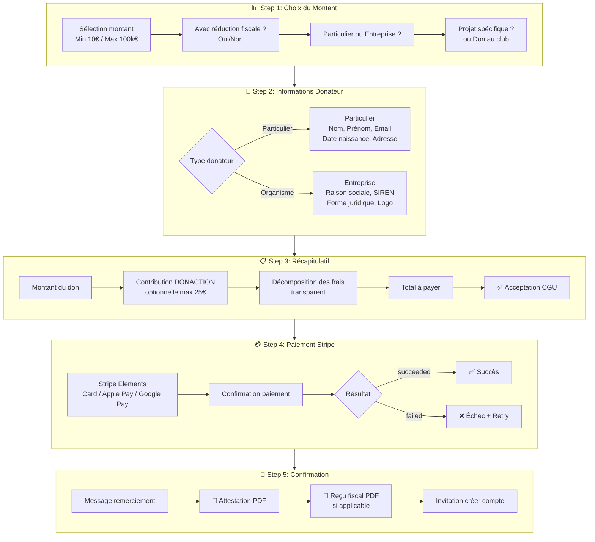
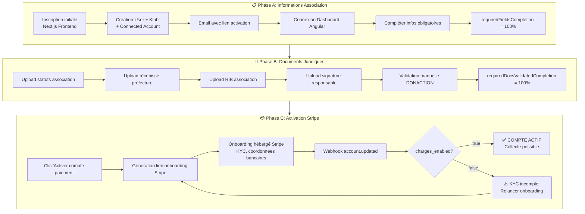
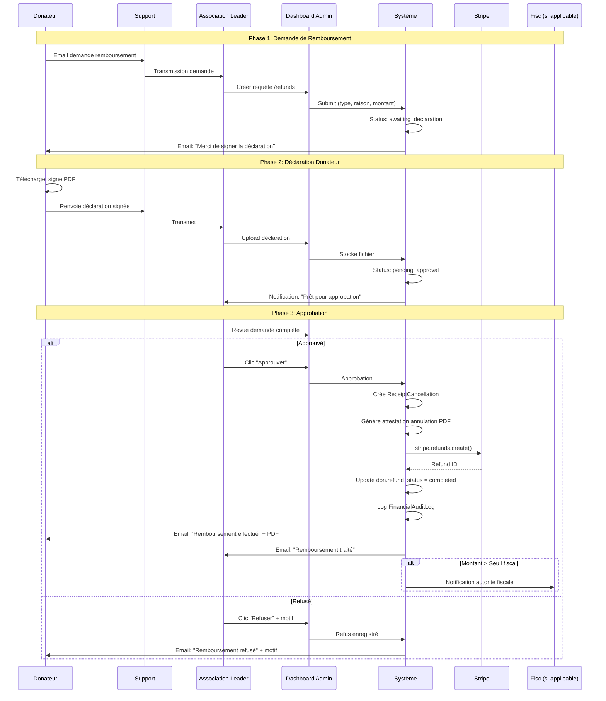
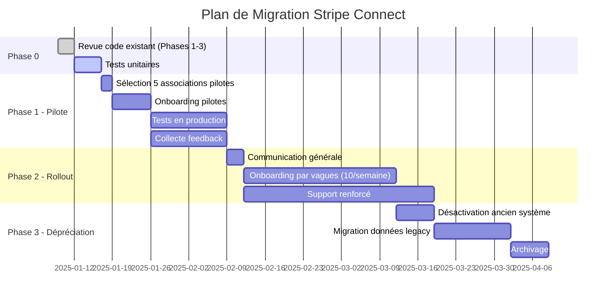
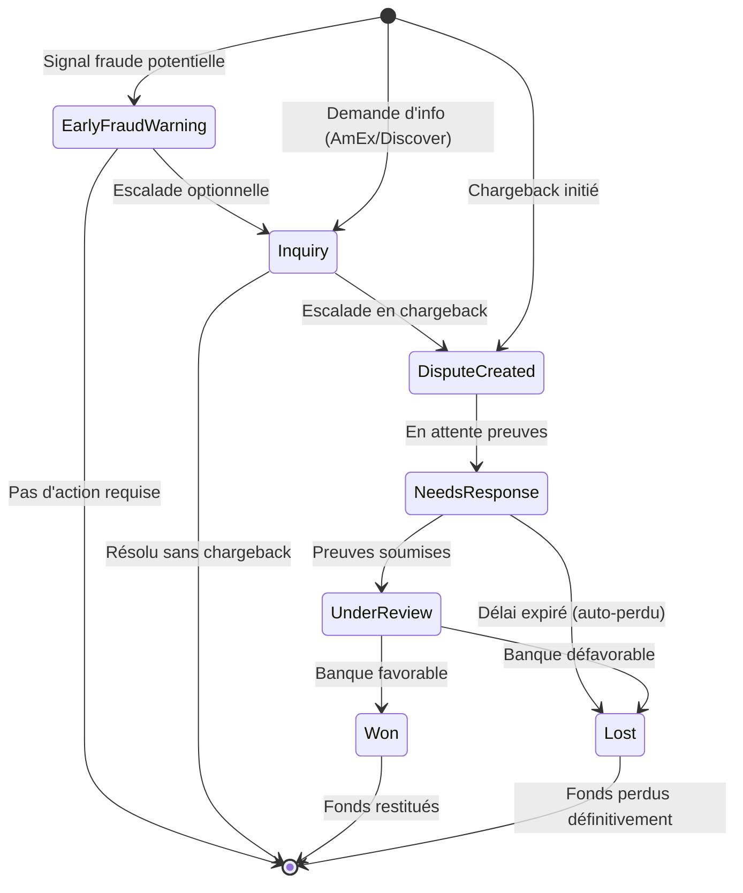
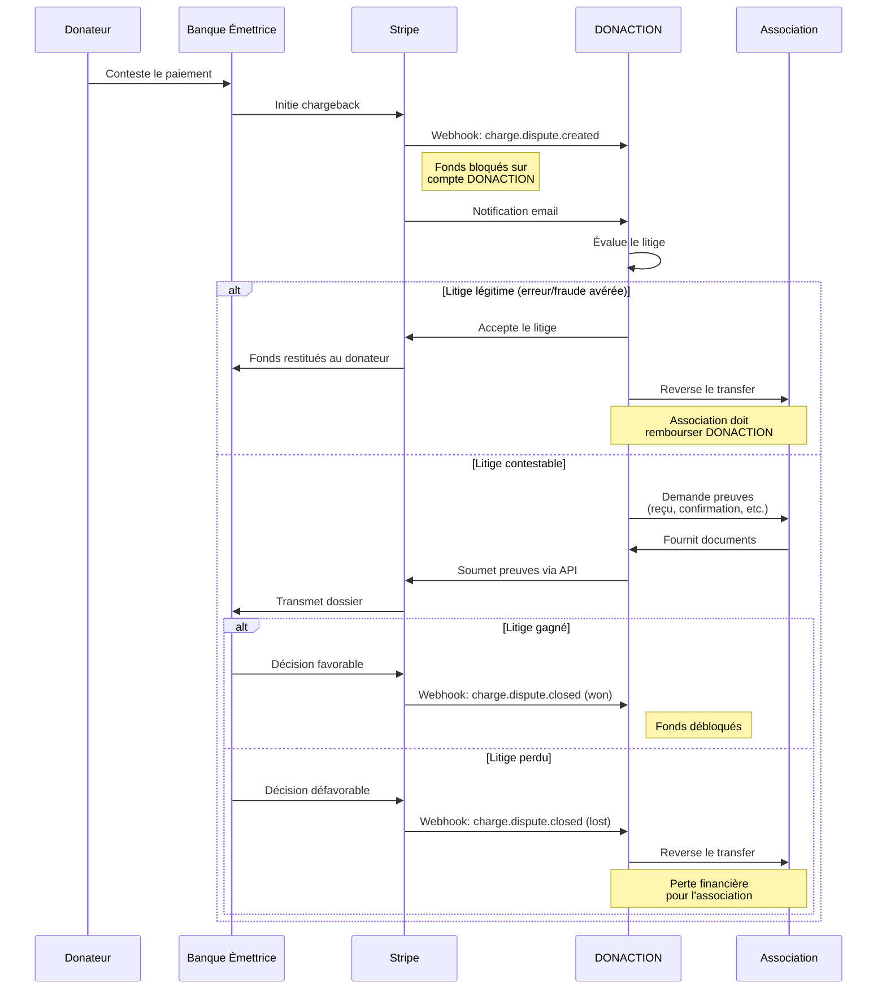

# Stratégie de Collecte de Dons DONACTION — Stripe Connect

> **Version**: 1.0.0 | **Date**: 2025-01-09 | **Statut**: Document Stratégique Final

---

## 1. Executive Summary

DONACTION migre d'un modèle Stripe Standard (compte unique Fond Klubr) vers **Stripe Connect Express** pour permettre aux associations sportives françaises de recevoir les dons directement sur leurs comptes connectés. Cette transformation apporte :

- **Transparence financière** : Les associations reçoivent 100% du montant intentionnel du don
- **Conformité fiscale** : Reçus émis au nom de l'association (non plus DONACTION)
- **Modèle "Donor Pays Fee"** : Le donateur prend en charge les frais Stripe (~1.5% + 0.25€) et la commission plateforme (4%)
- **Automatisation** : Prélèvement automatique via `application_fee_amount`
- **Simplification KYC** : Onboarding hébergé par Stripe (Express accounts)

L'implémentation backend est déjà réalisée (Phases 1-3). Ce document consolide la stratégie complète et identifie les ajustements nécessaires pour garantir la cohérence du système.

---

## 2. Architecture du Flux de Paiement

### 2.1 Parcours Donateur (5 étapes)



### 2.2 Calcul des Frais — Modèle "Donor Pays Fee"

#### 2.2.1 Paramètres de Configuration

Basé sur le schéma `trade_policy` existant, **avec évolutions** :

| Paramètre | Type | Valeur par défaut | Description |
|-----------|------|-------------------|-------------|
| `fee_model` | enum | `percentage_only` | Mode de calcul des frais |
| `commissionPercentage` | decimal | 6% → **4%** | Commission plateforme DONACTION |
| `fixed_amount` | decimal | 0€ | Montant fixe par transaction |
| ~~`donor_pays_fee`~~ | ~~boolean~~ | ~~false~~ | **REMPLACÉ** par les 2 champs ci-dessous |
| `donor_pays_fee_project` | boolean | **`true`** | **NOUVEAU** - Défaut pour dons à un projet |
| `donor_pays_fee_club` | boolean | **`false`** | **NOUVEAU** - Défaut pour dons au club |
| `allow_donor_fee_choice` | boolean | **`true`** | **NOUVEAU** - Autoriser le donateur à choisir |
| `stripe_connect` | boolean | `true` | Utiliser Stripe Connect |

**Évolutions clés :**
1. **Différenciation projet/club** : Deux paramètres distincts permettent de configurer des comportements différents selon le type de don
2. **Choix donateur** : Si `allow_donor_fee_choice = true`, le donateur peut modifier le comportement par défaut à l'étape 3

**Note importante** : La commission actuelle de 6% doit être revue à **4%** selon les spécifications du nouveau modèle.

#### 2.2.2 Logique de Détermination du `donorPaysFee`

```typescript
// helpers/fee-calculation-helper.ts
interface FeeContext {
    tradePolicy: TradePolicyEntity;
    isProjectDonation: boolean;       // true si don à un projet
    donorChoice: boolean | null;      // Choix explicite du donateur (null = pas de choix)
}

function determineDonorPaysFee(context: FeeContext): boolean {
    const { tradePolicy, isProjectDonation, donorChoice } = context;
    
    // 1. Si le donateur a fait un choix explicite ET que c'est autorisé
    if (donorChoice !== null && tradePolicy.allow_donor_fee_choice) {
        return donorChoice;
    }
    
    // 2. Sinon, utiliser la valeur par défaut selon le type de don
    return isProjectDonation 
        ? tradePolicy.donor_pays_fee_project 
        : tradePolicy.donor_pays_fee_club;
}
```

**Exemples de configurations :**

| Scénario | `donor_pays_fee_project` | `donor_pays_fee_club` | `allow_donor_fee_choice` | Résultat |
|----------|--------------------------|----------------------|--------------------------|----------|
| **Standard** | `true` | `false` | `true` | Projet: donateur paie (modifiable) / Club: frais déduits (modifiable) |
| **Tout transparent** | `true` | `true` | `false` | Tous les dons: donateur paie (non modifiable) |
| **Tout intégré** | `false` | `false` | `false` | Tous les dons: frais déduits (non modifiable) |
| **Flexible total** | `true` | `false` | `true` | Défauts différents, donateur choisit toujours |

#### 2.2.3 Formules de Calcul

**Variables :**
- `MONTANT_SAISI` = Montant saisi par le donateur dans le formulaire
- `CONTRIBUTION_DONACTION` = Contribution optionnelle à la plateforme (0-25€)
- `TAUX_COMMISSION` = 4% (commission DONACTION)
- `TAUX_STRIPE` = 1.5% + 0.25€ (frais Stripe standard EU)

---

**Scénario A : Donor Pays Fee = TRUE** (défaut projets)
> *"Je donne 100€, l'association reçoit 100€, je paie les frais en plus"*

```
MONTANT_DON_REEL = MONTANT_SAISI (inchangé)
Commission DONACTION = MONTANT_DON_REEL × 4%
Frais Stripe estimés = (MONTANT_DON_REEL + CONTRIBUTION) × 1.5% + 0.25€
Application Fee = Commission + Frais Stripe

TOTAL_PRELEVE = MONTANT_DON_REEL + CONTRIBUTION + Application Fee
NET_ASSOCIATION = MONTANT_DON_REEL (100%)
MONTANT_RECU_FISCAL = MONTANT_DON_REEL (100€)
```

**Exemple (Don 100€ + Contribution 10€, Donor Pays Fee = TRUE) :**

```
┌─────────────────────────────────────────────────────────────┐
│  💳 CE QUE LE DONATEUR PAIE                                 │
├─────────────────────────────────────────────────────────────┤
│  Montant du don                    : 100,00 €               │
│  Contribution DONACTION            :  10,00 €               │
│  ─────────────────────────────────────────────              │
│  Sous-total                        : 110,00 €               │
│                                                             │
│  + Frais de traitement (4% + Stripe)                        │
│    Commission plateforme (4%)      :   4,00 €               │
│    Frais bancaires (~1.5% + 0.25€) :   1,90 €               │
│  ─────────────────────────────────────────────              │
│  TOTAL DÉBITÉ                      : 115,90 €               │
└─────────────────────────────────────────────────────────────┘

┌─────────────────────────────────────────────────────────────┐
│  📊 RÉPARTITION                                             │
├─────────────────────────────────────────────────────────────┤
│  → Association reçoit     : 100,00 € (100% de votre don)    │
│  → DONACTION reçoit       :  14,00 € (contribution + comm.) │
│  → Stripe prélève         :  ~1,90 € (frais bancaires)      │
├─────────────────────────────────────────────────────────────┤
│  📄 REÇU FISCAL           : 100,00 €                        │
│     Réduction d'impôts    :  66,00 € (particulier)          │
│     Coût réel du don      :  49,90 € (115,90 - 66)          │
└─────────────────────────────────────────────────────────────┘
```

---

**Scénario B : Donor Pays Fee = FALSE** (défaut club)
> *"Je donne 100€ tout compris, l'association reçoit le net après frais"*

```
MONTANT_DON_BRUT = MONTANT_SAISI
Commission DONACTION = MONTANT_DON_BRUT × 4%
Application Fee = Commission (pas de surcharge Stripe visible)

TOTAL_PRELEVE = MONTANT_DON_BRUT + CONTRIBUTION
NET_ASSOCIATION = MONTANT_DON_BRUT - Application Fee (96%)
MONTANT_RECU_FISCAL = NET_ASSOCIATION (96€)
```

**Exemple (Don 100€ + Contribution 10€, Donor Pays Fee = FALSE) :**

```
┌─────────────────────────────────────────────────────────────┐
│  💳 CE QUE LE DONATEUR PAIE                                 │
├─────────────────────────────────────────────────────────────┤
│  Montant du don (frais inclus)     : 100,00 €               │
│  Contribution DONACTION            :  10,00 €               │
│  ─────────────────────────────────────────────              │
│  TOTAL DÉBITÉ                      : 110,00 €               │
└─────────────────────────────────────────────────────────────┘

┌─────────────────────────────────────────────────────────────┐
│  📊 RÉPARTITION                                             │
├─────────────────────────────────────────────────────────────┤
│  → Association reçoit     :  96,00 € (don - 4% commission)  │
│  → DONACTION reçoit       :  14,00 € (contribution + 4€)    │
│  → Stripe prélève         :  ~1,90 € (sur DONACTION)        │
├─────────────────────────────────────────────────────────────┤
│  📄 REÇU FISCAL           :  96,00 € (montant net reçu)     │
│     Réduction d'impôts    :  63,36 € (particulier)          │
│     Coût réel du don      :  46,64 € (110 - 63,36)          │
└─────────────────────────────────────────────────────────────┘
```

---

**⚠️ Point clé : Impact sur le Reçu Fiscal**

| Scénario | Montant reçu fiscal | Justification |
|----------|---------------------|---------------|
| **Donor Pays Fee = TRUE** | 100% du montant saisi | L'association reçoit l'intégralité |
| **Donor Pays Fee = FALSE** | Montant net (96%) | Le reçu doit refléter ce que l'association reçoit réellement |

Le reçu fiscal doit **toujours** correspondre au montant effectivement reçu par l'association pour être conforme aux exigences Cerfa.

### 2.3 UX Formulaire — Choix Donor Pays Fee (Step 3)

#### 2.3.1 Condition d'Affichage

Le choix n'est affiché que si `trade_policy.allow_donor_fee_choice = true`. Sinon, la valeur par défaut (projet ou club) s'applique automatiquement.

#### 2.3.2 Maquette UI

```
┌─────────────────────────────────────────────────────────────────────┐
│  📋 RÉCAPITULATIF DE VOTRE DON                                      │
├─────────────────────────────────────────────────────────────────────┤
│                                                                     │
│  Bénéficiaire : FC Lyon                                             │
│  Projet : Nouveau terrain synthétique (ou "Fonctionnement général") │
│                                                                     │
│  ─────────────────────────────────────────────────────────────────  │
│                                                                     │
│  Montant de votre don                              100,00 €         │
│  Contribution à DONACTION (optionnel)        [━━━━○━━] 10,00 €      │
│                                                                     │
│  ─────────────────────────────────────────────────────────────────  │
│                                                                     │
│  💡 COMMENT SOUHAITEZ-VOUS GÉRER LES FRAIS DE TRAITEMENT ?          │
│                                                                     │
│  ┌─────────────────────────────────────────────────────────────┐    │
│  │ ◉ Je paie les frais en plus de mon don                      │    │
│  │   ─────────────────────────────────────────────────────     │    │
│  │   L'association reçoit 100% de votre don (100,00€)          │    │
│  │   Frais de traitement : +4,00€                              │    │
│  │   ┌───────────────────────────────────────────────────┐     │    │
│  │   │ Reçu fiscal : 100,00€ • Total débité : 114,00€   │     │    │
│  │   └───────────────────────────────────────────────────┘     │    │
│  └─────────────────────────────────────────────────────────────┘    │
│                                                                     │
│  ┌─────────────────────────────────────────────────────────────┐    │
│  │ ○ J'intègre les frais au montant de mon don                 │    │
│  │   ─────────────────────────────────────────────────────     │    │
│  │   L'association reçoit votre don moins les frais (96,00€)   │    │
│  │   Frais de traitement : -4,00€ (déduits)                    │    │
│  │   ┌───────────────────────────────────────────────────┐     │    │
│  │   │ Reçu fiscal : 96,00€ • Total débité : 110,00€    │     │    │
│  │   └───────────────────────────────────────────────────┘     │    │
│  └─────────────────────────────────────────────────────────────┘    │
│                                                                     │
│  ℹ️  Les frais (4%) couvrent les coûts bancaires et le             │
│     fonctionnement de la plateforme DONACTION.                      │
│                                                                     │
│  ─────────────────────────────────────────────────────────────────  │
│                                                                     │
│  ☑️ J'accepte les CGU                                               │
│  ☑️ Je comprends que mon don sera versé au Fonds de dotation        │
│                                                                     │
│  ═══════════════════════════════════════════════════════════════    │
│  │ TOTAL À PAYER                                      114,00€ │    │
│  │ Réduction d'impôts (66%)                           -66,00€ │    │
│  │ COÛT RÉEL DE VOTRE DON                              48,00€ │    │
│  ═══════════════════════════════════════════════════════════════    │
│                                                                     │
│                    [ ← Retour ]      [ Payer 114,00€ → ]            │
│                                                                     │
└─────────────────────────────────────────────────────────────────────┘
```

#### 2.3.3 Implémentation Svelte (Step 3)

```svelte
<!-- step3.svelte -->
<script lang="ts">
    import { DEFAULT_VALUES, SUBSCRIPTION } from '../logic/useSponsorshipForm.svelte';
    
    // Déterminer si c'est un don projet ou club
    $: isProjectDonation = SUBSCRIPTION.project?.uuid 
        && SUBSCRIPTION.project.uuid !== SUBSCRIPTION.klubr.uuid;
    
    // Récupérer la trade policy
    $: tradePolicy = SUBSCRIPTION.klubr?.trade_policy;
    
    // Valeur par défaut selon type de don
    $: defaultDonorPaysFee = isProjectDonation 
        ? tradePolicy?.donor_pays_fee_project ?? true
        : tradePolicy?.donor_pays_fee_club ?? false;
    
    // Choix du donateur (initialisé au défaut)
    let donorPaysFee = $state(defaultDonorPaysFee);
    
    // Afficher le choix ?
    $: showFeeChoice = tradePolicy?.allow_donor_fee_choice ?? true;
    
    // Calculs dynamiques
    $: commission = DEFAULT_VALUES.montant * 0.04;
    
    $: feeBreakdown = {
        commission,
        totalWithFee: DEFAULT_VALUES.montant + DEFAULT_VALUES.contributionAKlubr + commission,
        totalWithoutFee: DEFAULT_VALUES.montant + DEFAULT_VALUES.contributionAKlubr,
        receiptWithFee: DEFAULT_VALUES.montant,
        receiptWithoutFee: DEFAULT_VALUES.montant - commission,
    };
    
    $: totalToPay = donorPaysFee 
        ? feeBreakdown.totalWithFee 
        : feeBreakdown.totalWithoutFee;
    
    $: receiptAmount = donorPaysFee 
        ? feeBreakdown.receiptWithFee 
        : feeBreakdown.receiptWithoutFee;
    
    // Exporter le choix pour le paiement
    $: DEFAULT_VALUES.donorPaysFee = donorPaysFee;
</script>

{#if showFeeChoice}
    <div class="fee-choice-section">
        <h4>💡 Comment souhaitez-vous gérer les frais de traitement ?</h4>
        
        <label class="fee-option" class:selected={donorPaysFee}>
            <input type="radio" bind:group={donorPaysFee} value={true} />
            <div class="fee-option-content">
                <strong>Je paie les frais en plus de mon don</strong>
                <p>L'association reçoit 100% de votre don ({feeBreakdown.receiptWithFee.toFixed(2)}€)</p>
                <div class="fee-summary">
                    <span>Reçu fiscal : {feeBreakdown.receiptWithFee.toFixed(2)}€</span>
                    <span>Total débité : {feeBreakdown.totalWithFee.toFixed(2)}€</span>
                </div>
            </div>
        </label>
        
        <label class="fee-option" class:selected={!donorPaysFee}>
            <input type="radio" bind:group={donorPaysFee} value={false} />
            <div class="fee-option-content">
                <strong>J'intègre les frais au montant de mon don</strong>
                <p>L'association reçoit votre don moins les frais ({feeBreakdown.receiptWithoutFee.toFixed(2)}€)</p>
                <div class="fee-summary">
                    <span>Reçu fiscal : {feeBreakdown.receiptWithoutFee.toFixed(2)}€</span>
                    <span>Total débité : {feeBreakdown.totalWithoutFee.toFixed(2)}€</span>
                </div>
            </div>
        </label>
        
        <p class="fee-info">
            ℹ️ Les frais (4%) couvrent les coûts bancaires et le fonctionnement de DONACTION.
        </p>
    </div>
{/if}
```

#### 2.3.4 Mise à jour du Schéma `klub-don`

Ajouter le champ pour stocker le choix du donateur :

```typescript
// api/klub-don/content-types/klub-don/schema.json
{
    "donor_pays_fee": {
        "type": "boolean",
        "required": false,
        "default": null  // null = utiliser la valeur par défaut de trade_policy
    }
}
```

#### 2.3.5 Implémentation Backend (Contrôleur mis à jour)

Le code dans `klub-don-payment.controller.ts` doit être mis à jour pour gérer la nouvelle logique :

```typescript
// helpers/stripe-connect-helper.ts

/**
 * Détermine si le donateur paie les frais
 * Prend en compte : choix explicite du donateur > défaut selon type de don
 */
export function determineDonorPaysFee(
    klubDon: KlubDonEntity,
    tradePolicy: TradePolicyEntity
): boolean {
    // 1. Si le donateur a fait un choix explicite (stocké dans klub_don)
    if (klubDon.donor_pays_fee !== null && klubDon.donor_pays_fee !== undefined) {
        // Vérifier que le choix est autorisé
        if (tradePolicy.allow_donor_fee_choice) {
            return klubDon.donor_pays_fee;
        }
    }
    
    // 2. Sinon, utiliser la valeur par défaut selon le type de don
    const isProjectDonation = klubDon.klub_projet !== null;
    
    return isProjectDonation 
        ? tradePolicy.donor_pays_fee_project 
        : tradePolicy.donor_pays_fee_club;
}

export function calculateApplicationFee(
    amountInCents: number,
    tradePolicy: TradePolicyEntity
): number {
    const { fee_model, commissionPercentage, fixed_amount } = tradePolicy;
    
    switch (fee_model) {
        case 'percentage_only':
            return Math.round(amountInCents * (commissionPercentage / 100));
            
        case 'fixed_only':
            return Math.round((fixed_amount || 0) * 100);
            
        case 'percentage_plus_fixed':
            const percentageFee = amountInCents * (commissionPercentage / 100);
            const fixedFee = (fixed_amount || 0) * 100;
            return Math.round(percentageFee + fixedFee);
            
        default:
            return Math.round(amountInCents * 0.04); // Fallback 4%
    }
}
```

```typescript
// klub-don-payment.controller.ts - createPaymentIntent() mis à jour
async createPaymentIntent() {
    const ctx = strapi.requestContext.get();
    try {
        const { price, metadata, idempotencyKey } = ctx.request.body;
        // Note: donorPaysFee n'est plus passé directement, on le récupère du don

        // ... validations existantes ...

        // Récupérer le don avec son choix donor_pays_fee
        const klubDon = await strapi.db.query('api::klub-don.klub-don').findOne({
            where: { uuid: metadata.donUuid },
            populate: { klub_projet: true },
        });

        // Fetch klubr with trade_policy and connected_account
        const klubr: KlubrEntity = await strapi.db.query('api::klubr.klubr').findOne({
            where: { uuid: metadata.klubUuid },
            populate: { trade_policy: true, connected_account: true },
        });

        const tradePolicy = klubr.trade_policy as TradePolicyEntity;
        const connectedAccount = klubr.connected_account as ConnectedAccountEntity;

        // Déterminer le donor_pays_fee effectif
        const actualDonorPaysFee = determineDonorPaysFee(klubDon, tradePolicy);

        // Calculate base amount in cents
        let amountInCents = Number(price) * 100;
        let applicationFeeAmount = 0;

        if (tradePolicy?.stripe_connect && connectedAccount?.charges_enabled) {
            // Calculate application fee
            applicationFeeAmount = calculateApplicationFee(amountInCents, tradePolicy);

            // If donor pays fee, add it to total amount
            if (actualDonorPaysFee) {
                amountInCents += applicationFeeAmount;
            }

            console.log('\n💳 ════════════════════════════════════════');
            console.log('💳 CRÉATION PAYMENT INTENT (STRIPE CONNECT)');
            console.log(`💳 Montant base: ${price}€`);
            console.log(`💳 Type don: ${klubDon.klub_projet ? 'Projet' : 'Club'}`);
            console.log(`💳 Donor pays fee: ${actualDonorPaysFee}`);
            console.log(`💳 Application fee: ${applicationFeeAmount / 100}€`);
            console.log(`💳 Total prélevé: ${amountInCents / 100}€`);
            console.log('💳 ════════════════════════════════════════\n');

            // Create PaymentIntent
            const paymentIntentParams: Stripe.PaymentIntentCreateParams = {
                amount: amountInCents,
                currency: 'eur',
                metadata: {
                    ...metadata,
                    payment_method: 'stripe_connect',
                    donor_pays_fee: String(actualDonorPaysFee),
                    is_project_donation: String(!!klubDon.klub_projet),
                },
                on_behalf_of: connectedAccount.stripe_account_id,
                transfer_data: {
                    destination: connectedAccount.stripe_account_id,
                },
                application_fee_amount: applicationFeeAmount,
            };

            const paymentIntent = await stripe.paymentIntents.create(
                paymentIntentParams,
                { idempotencyKey: idempotencyKey || undefined }
            );

            // ... reste du code ...
        }
    }
}
```

### 2.4 Organisation des Champs `trade_policy`

Le champ `stripe_connect` détermine deux modes de fonctionnement radicalement différents :

| Mode | `stripe_connect` | Flux Financier | Facturation |
|------|------------------|----------------|-------------|
| **Stripe Connect** | `true` | Paiement direct vers association, frais prélevés automatiquement via `application_fee_amount` | **Aucune** - Relevé de frais informatif uniquement |
| **Stripe Classic (Legacy)** | `false` | Paiement vers compte unique DONACTION, redistribution mensuelle | **Facturation mensuelle** aux associations |

#### 2.4.1 Champs COMMUNS (les deux modes)

| Champ | Type | Défaut | Description |
|-------|------|--------|-------------|
| `uuid` | UUID | auto | Identifiant unique |
| `tradePolicyLabel` | string | - | Nom de la politique (ex: "Standard", "Partenaire", "Premium") |
| `defaultTradePolicy` | boolean | `false` | Politique par défaut pour les nouveaux clubs |
| `allowKlubrContribution` | boolean | `true` | Autoriser la contribution optionnelle à DONACTION (0-25€) |
| `stripe_connect` | boolean | `true` | **Switch principal** : `true` = Connect, `false` = Classic |

#### 2.4.2 Champs STRIPE CONNECT (`stripe_connect = true`)

Ces champs gèrent le prélèvement automatique des frais via Stripe.

| Champ | Type | Défaut | Description |
|-------|------|--------|-------------|
| `fee_model` | enum | `percentage_only` | Mode de calcul : `percentage_only`, `fixed_only`, `percentage_plus_fixed` |
| `commissionPercentage` | decimal | 4 | % de commission DONACTION (utilisé si fee_model inclut percentage) |
| `fixed_amount` | decimal | 0 | Montant fixe en € (utilisé si fee_model inclut fixed) |
| `donor_pays_fee_project` | boolean | `true` | **NOUVEAU** - Défaut pour dons projet : donateur paie les frais |
| `donor_pays_fee_club` | boolean | `false` | **NOUVEAU** - Défaut pour dons club : frais déduits du don |
| `allow_donor_fee_choice` | boolean | `true` | **NOUVEAU** - Autoriser le donateur à modifier le défaut |

**Logique Stripe Connect :**
- Les frais sont calculés selon `fee_model` + `commissionPercentage` + `fixed_amount`
- Le mode `donor_pays_fee` est déterminé par : choix donateur > défaut projet/club
- Pas de facturation : Stripe prélève automatiquement via `application_fee_amount`
- Relevé de frais mensuel **informatif** (pas une facture)

#### 2.4.3 Champs STRIPE CLASSIC / LEGACY (`stripe_connect = false`)

Ces champs gèrent la facturation mensuelle traditionnelle.

| Champ | Type | Défaut | Description |
|-------|------|--------|-------------|
| `noBilling` | boolean | `false` | Si `true`, pas de facturation (club exonéré) |
| `commissionPercentage` | decimal | 6 | % de commission sur les dons (pour facturation) |
| `VATPercentage` | decimal | 20 | % TVA appliquée sur la commission |
| `reference` | string | - | Référence affichée sur la facture |
| `billingDescription` | string | - | Description ligne de facturation |
| `perDonationCost` | decimal | 0 | Coût fixe par don (en plus du %) |
| `klubDonationReference` | string | - | Référence pour la ligne contribution Klubr |
| `klubDonationDescription` | string | - | Description ligne contribution Klubr |
| `klubDonationPercentage` | decimal | 0 | % spécifique pour contributions Klubr |

**Logique Stripe Classic :**
- DONACTION collecte tous les paiements sur son compte unique
- Facture mensuelle générée pour chaque club
- Redistribution après paiement de la facture

#### 2.4.4 Champ Partagé avec Usage Différent

| Champ | Stripe Connect | Stripe Classic |
|-------|----------------|----------------|
| `commissionPercentage` | Utilisé pour `application_fee_amount` (prélèvement auto, défaut 4%) | Utilisé pour calcul facture mensuelle (défaut 6%) |

#### 2.4.5 Schéma Visuel

```
┌─────────────────────────────────────────────────────────────────────────┐
│                        TRADE POLICY SCHEMA                              │
├─────────────────────────────────────────────────────────────────────────┤
│                                                                         │
│  ┌─────────────────────────────────────────────────────────────────┐    │
│  │                    COMMUNS (tous modes)                         │    │
│  ├─────────────────────────────────────────────────────────────────┤    │
│  │  uuid, tradePolicyLabel, defaultTradePolicy,                    │    │
│  │  allowKlubrContribution, stripe_connect                         │    │
│  └─────────────────────────────────────────────────────────────────┘    │
│                              │                                          │
│               ┌──────────────┴──────────────┐                           │
│               ▼                              ▼                          │
│  ┌─────────────────────────┐    ┌─────────────────────────────────┐    │
│  │   STRIPE CONNECT        │    │      STRIPE CLASSIC (Legacy)    │    │
│  │   stripe_connect=true   │    │      stripe_connect=false       │    │
│  ├─────────────────────────┤    ├─────────────────────────────────┤    │
│  │  fee_model              │    │  noBilling                      │    │
│  │  commissionPercentage*  │    │  commissionPercentage*          │    │
│  │  fixed_amount           │    │  VATPercentage                  │    │
│  │  donor_pays_fee_project │    │  reference                      │    │
│  │  donor_pays_fee_club    │    │  billingDescription             │    │
│  │  allow_donor_fee_choice │    │  perDonationCost                │    │
│  │                         │    │  klubDonationReference          │    │
│  │                         │    │  klubDonationDescription        │    │
│  │                         │    │  klubDonationPercentage         │    │
│  └─────────────────────────┘    └─────────────────────────────────┘    │
│                                                                         │
│  * commissionPercentage : usage différent selon le mode                 │
│                                                                         │
└─────────────────────────────────────────────────────────────────────────┘
```

#### 2.4.6 Recommandations d'Implémentation

1. **Conserver tous les champs legacy** pour la rétrocompatibilité (clubs non migrés vers Connect)
2. **Supprimer l'ancien `donor_pays_fee`** unique et le remplacer par les 3 nouveaux champs
3. **Dashboard Admin** : Masquer dynamiquement les champs non pertinents selon `stripe_connect`
4. **Valeur par défaut** : Nouveaux clubs créés avec `stripe_connect = true`
5. **Migration** : Script pour migrer les `trade_policy` existantes (voir section 9.5)

---

### 2.5 Configuration Stripe Connect

#### 2.5.1 Type de Charge : Destination Charges

**Choix retenu : Destination Charges** (confirmé par l'implémentation actuelle)

| Type | Avantages | Inconvénients |
|------|-----------|---------------|
| **Direct Charges** | Association gère tout | Complexe pour non-tech |
| **Destination Charges** ✅ | Simple, DONACTION contrôle | Moins de flexibilité |
| **Separate Charges & Transfers** | Contrôle total | Plus complexe à implémenter |

**Justification du choix :**
1. DONACTION reste le "merchant of record" (responsable légal)
2. L'`application_fee_amount` est prélevé automatiquement
3. Stripe gère les soldes négatifs (paramètre `controller.losses.payments`)
4. Simplification du reporting et de la réconciliation

#### 2.5.2 Paramètres de l'appel API PaymentIntent.create()

```typescript
// Implémentation confirmée dans klub-don-payment.controller.ts
const paymentIntentParams: Stripe.PaymentIntentCreateParams = {
    amount: amountInCents, // Montant total (avec frais si donorPaysFee)
    currency: 'eur',
    metadata: {
        donUuid: metadata.donUuid,
        klubUuid: metadata.klubUuid,
        projectUuid: metadata.projectUuid || null,
        donorUuid: metadata.donorUuid,
        payment_method: 'stripe_connect',
        donor_pays_fee: String(actualDonorPaysFee),
    },
    // Destination Charges parameters
    on_behalf_of: connectedAccount.stripe_account_id,
    transfer_data: {
        destination: connectedAccount.stripe_account_id,
    },
    application_fee_amount: applicationFeeAmount,
};

const paymentIntent = await stripe.paymentIntents.create(
    paymentIntentParams,
    {
        idempotencyKey: idempotencyKey || undefined,
    }
);
```

#### 2.5.3 Gestion des Soldes Négatifs

Lors de la création du compte Express, configurer :

```typescript
// Lors de account.create
const account = await stripe.accounts.create({
    type: 'express',
    country: 'FR',
    capabilities: {
        card_payments: { requested: true },
        transfers: { requested: true },
    },
    business_type: 'non_profit', // ou 'company' selon le cas
    settings: {
        payouts: {
            schedule: {
                interval: 'manual', // ou 'weekly'
            },
        },
    },
    controller: {
        losses: {
            payments: 'stripe', // Stripe supporte les pertes
        },
        fees: {
            payer: 'application', // DONACTION paie les frais Stripe
        },
        stripe_dashboard: {
            type: 'express',
        },
    },
});
```

---

## 3. Webhooks et Idempotence

### 3.1 Matrice des Événements Webhook

#### 3.1.1 Événements Compte Connecté

| Événement | Source | Action Backend | Criticité | Retry |
|-----------|--------|----------------|-----------|-------|
| `account.updated` | Connect | Sync statut KYC, `charges_enabled`, `payouts_enabled` | **Haute** | Oui |
| `account.application.deauthorized` | Connect | Désactiver compte, notifier admin | **Haute** | Oui |
| `capability.updated` | Connect | Mettre à jour `capabilities` JSON | Moyenne | Oui |
| `person.created` | Connect | Log audit (KYC progression) | Basse | Non |
| `person.updated` | Connect | Log audit | Basse | Non |

#### 3.1.2 Événements Paiement

| Événement | Source | Action Backend | Criticité | Retry |
|-----------|--------|----------------|-----------|-------|
| `payment_intent.created` | Plateforme | Update `klub_don_payment` status → `pending` | Moyenne | Oui |
| `payment_intent.succeeded` | Plateforme | **CRITIQUE** : Update status → `success`, générer PDFs, envoyer emails | **Critique** | Oui |
| `payment_intent.payment_failed` | Plateforme | Update status → `error`, stocker `error_code` | **Haute** | Oui |
| `charge.refunded` | Plateforme | **CRITIQUE** : Workflow remboursement exceptionnel | **Critique** | Oui |
| `charge.dispute.created` | Plateforme | Alerter admin, geler remboursement | **Haute** | Oui |
| `transfer.created` | Connect | Log transfert vers association | Moyenne | Non |
| `payout.paid` | Connect | Log virement bancaire association | Moyenne | Non |
| `payout.failed` | Connect | Alerter admin + association | **Haute** | Oui |

### 3.2 Stratégie d'Idempotence

#### 3.2.1 Format de la Clé d'Idempotence

**Pattern recommandé :**

```
{donUuid}-{timestamp}-{action}
```

**Exemples :**
- `abc123-1704812400000-create` (création initiale)
- `abc123-1704812400000-retry-1` (première tentative retry)
- `abc123-1704812400000-retry-2` (deuxième tentative retry)

#### 3.2.2 Implémentation

```typescript
// helpers/idempotency-helper.ts

export function generateIdempotencyKey(
    donUuid: string,
    action: 'create' | 'retry' = 'create',
    retryCount: number = 0
): string {
    const timestamp = Date.now();
    const base = `${donUuid}-${timestamp}-${action}`;
    return retryCount > 0 ? `${base}-${retryCount}` : base;
}

export function isValidIdempotencyKey(key: string): boolean {
    // Format: uuid-timestamp-action(-retryCount)?
    const pattern = /^[a-f0-9-]{36}-\d{13}-(create|retry)(-\d+)?$/;
    return pattern.test(key);
}

export async function findExistingPaymentByIdempotencyKey(
    idempotencyKey: string
): Promise<KlubDonPaymentEntity | null> {
    return await strapi.db
        .query('api::klub-don-payment.klub-don-payment')
        .findOne({
            where: { idempotency_key: idempotencyKey },
            select: ['client_secret', 'status', 'intent_id'],
        });
}
```

#### 3.2.3 Durée de Validité

- **PaymentIntent** : 24 heures (durée standard Stripe)
- **Réutilisation du `client_secret`** : Autorisée si PaymentIntent non expiré
- **Clé d'idempotence Stripe** : 24 heures (limite Stripe)

### 3.3 Schéma de la Table `webhook_logs`

```typescript
// Nouveau content-type à créer: api::webhook-log.webhook-log

// schema.json
{
  "kind": "collectionType",
  "collectionName": "webhook_logs",
  "info": {
    "singularName": "webhook-log",
    "pluralName": "webhook-logs",
    "displayName": "Webhook Log"
  },
  "options": {
    "draftAndPublish": false
  },
  "attributes": {
    "event_id": {
      "type": "string",
      "required": true,
      "unique": true
    },
    "event_type": {
      "type": "string",
      "required": true
    },
    "source": {
      "type": "enumeration",
      "enum": ["platform", "connect"],
      "required": true
    },
    "stripe_account_id": {
      "type": "string"
    },
    "payload": {
      "type": "json",
      "required": true
    },
    "status": {
      "type": "enumeration",
      "enum": ["received", "processing", "processed", "failed", "ignored"],
      "default": "received"
    },
    "processing_error": {
      "type": "text"
    },
    "retry_count": {
      "type": "integer",
      "default": 0
    },
    "processed_at": {
      "type": "datetime"
    },
    "related_don": {
      "type": "relation",
      "relation": "manyToOne",
      "target": "api::klub-don.klub-don"
    },
    "related_klubr": {
      "type": "relation",
      "relation": "manyToOne",
      "target": "api::klubr.klubr"
    }
  }
}
```

**Index recommandés :**
```sql
CREATE INDEX idx_webhook_logs_event_id ON webhook_logs(event_id);
CREATE INDEX idx_webhook_logs_event_type ON webhook_logs(event_type);
CREATE INDEX idx_webhook_logs_status ON webhook_logs(status);
CREATE INDEX idx_webhook_logs_created ON webhook_logs(created_at);
```

### 3.4 Endpoint Webhook Connect

Créer un nouvel endpoint dédié aux webhooks des comptes connectés :

```typescript
// api/stripe-connect/routes/stripe-connect-custom.ts
export default {
    routes: [
        {
            method: 'POST',
            path: '/stripe-connect/webhook',
            handler: 'stripe-connect.handleWebhook',
            config: {
                auth: false,
            },
        },
    ],
};

// api/stripe-connect/controllers/stripe-connect.ts
async handleWebhook() {
    const ctx = strapi.requestContext.get();
    const sig = ctx.request.headers['stripe-signature'];
    
    let event;
    try {
        event = stripe.webhooks.constructEvent(
            ctx.request.body[Symbol.for('unparsedBody')],
            sig,
            process.env.STRIPE_WEBHOOK_SECRET_CONNECT
        );
    } catch (err) {
        console.error('⚠️ Webhook signature verification failed:', err.message);
        return ctx.badRequest(`Webhook Error: ${err.message}`);
    }

    // Log webhook
    await strapi.documents('api::webhook-log.webhook-log').create({
        data: {
            event_id: event.id,
            event_type: event.type,
            source: 'connect',
            stripe_account_id: event.account,
            payload: event.data.object,
            status: 'received',
        },
    });

    // Handle event
    switch (event.type) {
        case 'account.updated':
            await this.handleAccountUpdated(event);
            break;
        case 'account.application.deauthorized':
            await this.handleAccountDeauthorized(event);
            break;
        // ... autres événements
    }

    ctx.send({ received: true });
}
```

---

## 4. Onboarding Association

### 4.1 Parcours en 3 Phases



### 4.2 Phase A — Informations Association

#### 4.2.1 Champs Requis pour `requiredFieldsCompletion = 100%`

| Champ | Type | Obligatoire | Validation |
|-------|------|-------------|------------|
| `denomination` | string | ✅ | Min 3 caractères |
| `acronyme` | string | ❌ | - |
| `adresse` | string | ✅ | Adresse complète |
| `codePostal` | string | ✅ | Format FR (5 chiffres) |
| `ville` | string | ✅ | - |
| `pays` | string | ✅ | Default: France |
| `numeroRNA` | string | ✅ | Format W + 9 chiffres |
| `SIREN` | string | ✅ | 9 chiffres, validé via API |
| `legalStatus` | enum | ✅ | Association loi 1901, etc. |
| `sportType` | relation | ✅ | Type de sport |
| `email` | email | ✅ | Email de contact |
| `telephone` | string | ✅ | Format FR |
| `objetAssociation` | text | ✅ | Min 50 caractères |
| `logo` | media | ✅ | Image (PNG, JPG) |

#### 4.2.2 Calcul du Pourcentage de Complétion

```typescript
// klubr.service.ts
function calculateRequiredFieldsCompletion(klubr: KlubrEntity): number {
    const requiredFields = [
        'denomination',
        'adresse',
        'codePostal',
        'ville',
        'pays',
        'numeroRNA',
        'SIREN',
        'legalStatus',
        'sportType',
        'email',
        'telephone',
        'objetAssociation',
        'logo',
    ];
    
    const filledFields = requiredFields.filter(field => {
        const value = klubr[field];
        return value !== null && value !== undefined && value !== '';
    });
    
    return Math.round((filledFields.length / requiredFields.length) * 100);
}
```

### 4.3 Phase B — Documents Juridiques

#### 4.3.1 Liste des Documents Requis

| Document | Champ | Format | Validation |
|----------|-------|--------|------------|
| Statuts à jour | `statutsDocument` | PDF | Signature + date |
| Récépissé préfecture | `recepisseDocument` | PDF | Numéro RNA lisible |
| RIB association | `ribDocument` | PDF/Image | IBAN FR valide |
| **Signature responsable** | `managerSignature` | PNG/JPG | **NOUVEAU** - Pour reçu fiscal |
| PV dernière AG | `pvAgDocument` | PDF | Date < 2 ans |

#### 4.3.2 Nouveau Champ : `managerSignature`

```typescript
// klubr/content-types/klubr/schema.json - À AJOUTER
{
    "managerSignature": {
        "type": "media",
        "allowedTypes": ["images"],
        "required": false
    }
}
```

**Spécifications :**
- Format : PNG ou JPG avec fond transparent recommandé
- Taille : Max 500x200 pixels
- Usage : Incrustation sur le reçu fiscal Cerfa

#### 4.3.3 Processus de Validation Manuelle

1. Association uploade les documents
2. Notification email à l'admin DONACTION
3. Admin vérifie dans `/admin/klub/listing`
4. Actions possibles :
   - ✅ Valider → `requiredDocsValidatedCompletion = 100%`
   - ❌ Rejeter → Email avec motif + demande nouvelle version
   - ⏳ En attente → Demande de complément

### 4.4 Phase C — Activation Compte Stripe

#### 4.4.1 Création du Compte Express

```typescript
// api/stripe-connect/services/stripe-connect.ts
async createConnectedAccount(klubr: KlubrEntity): Promise<ConnectedAccountEntity> {
    // Vérifier pré-requis
    if (klubr.requiredFieldsCompletion < 100) {
        throw new Error('Informations association incomplètes');
    }

    // Créer compte Stripe Express
    const account = await stripe.accounts.create({
        type: 'express',
        country: 'FR',
        email: klubr.email,
        capabilities: {
            card_payments: { requested: true },
            transfers: { requested: true },
        },
        business_type: 'non_profit',
        business_profile: {
            name: klubr.denomination,
            url: `https://donaction.fr/${klubr.slug}`,
            mcc: '8398', // Charitable organizations
        },
        metadata: {
            klubr_uuid: klubr.uuid,
            klubr_siren: klubr.SIREN,
        },
    });

    // Créer entrée connected_account
    const connectedAccount = await strapi.documents('api::connected-account.connected-account').create({
        data: {
            stripe_account_id: account.id,
            klubr: klubr.id,
            account_status: 'pending',
            verification_status: 'unverified',
            onboarding_completed: false,
            charges_enabled: false,
            payouts_enabled: false,
            country: 'FR',
            business_type: 'non_profit',
            created_at_stripe: new Date(account.created * 1000),
            last_sync: new Date(),
        },
    });

    return connectedAccount;
}
```

#### 4.4.2 Génération du Lien d'Onboarding

```typescript
// api/stripe-connect/controllers/stripe-connect.ts
async generateOnboardingLink() {
    const ctx = strapi.requestContext.get();
    const { klubrId } = ctx.params;

    const klubr = await strapi.documents('api::klubr.klubr').findOne({
        documentId: klubrId,
        populate: ['connected_account'],
    });

    if (!klubr.connected_account) {
        return ctx.badRequest('Compte Stripe non créé');
    }

    const accountLink = await stripe.accountLinks.create({
        account: klubr.connected_account.stripe_account_id,
        refresh_url: `${process.env.ADMIN_URL}/payment-setup?refresh=true`,
        return_url: `${process.env.ADMIN_URL}/payment-setup?success=true`,
        type: 'account_onboarding',
    });

    return { url: accountLink.url };
}
```

### 4.5 Checklist d'Activation Complète

**Conditions pour activer la collecte de dons :**

```typescript
function canAcceptDonations(klubr: KlubrEntity): {
    eligible: boolean;
    reasons: string[];
} {
    const reasons: string[] = [];

    // Vérifications klubr
    if (klubr.requiredFieldsCompletion < 100) {
        reasons.push(`Informations incomplètes (${klubr.requiredFieldsCompletion}%)`);
    }
    if (klubr.requiredDocsValidatedCompletion < 100) {
        reasons.push(`Documents non validés (${klubr.requiredDocsValidatedCompletion}%)`);
    }
    if (!klubr.donationEligible) {
        reasons.push('Collecte de dons non activée par admin');
    }
    if (klubr.status !== 'published') {
        reasons.push('Profil non publié');
    }

    // Vérifications Stripe Connect
    const connectedAccount = klubr.connected_account;
    if (!connectedAccount) {
        reasons.push('Compte Stripe non créé');
    } else {
        if (!connectedAccount.charges_enabled) {
            reasons.push('Paiements non activés sur Stripe');
        }
        if (connectedAccount.account_status === 'restricted') {
            reasons.push('Compte Stripe restreint');
        }
        if (connectedAccount.account_status === 'disabled') {
            reasons.push('Compte Stripe désactivé');
        }
    }

    return {
        eligible: reasons.length === 0,
        reasons,
    };
}
```

### 4.6 Widget de Progression Dashboard

**Composant Angular pour `/dashboard`** :

```typescript
// admin/routes/dashboard/ui/completion-widget.component.ts
interface CompletionStatus {
    klubInfo: {
        percentage: number;
        missingFields: string[];
    };
    documents: {
        percentage: number;
        pendingDocs: string[];
    };
    stripe: {
        status: 'not_started' | 'pending' | 'active' | 'restricted';
        chargesEnabled: boolean;
        payoutsEnabled: boolean;
    };
    overall: {
        canAcceptDonations: boolean;
        nextAction: string;
    };
}
```

**Affichage :**
```
┌─────────────────────────────────────────────────────────┐
│  📊 Statut d'Activation                                 │
├─────────────────────────────────────────────────────────┤
│  Informations Klub    ████████████░░░░  75%   [→]       │
│  Documents            ██████████░░░░░░  60%   [→]       │
│  Compte Paiement      ⏳ En attente KYC       [→]       │
├─────────────────────────────────────────────────────────┤
│  ⚠️ Action requise: Compléter les informations          │
│     [Compléter mon profil]                              │
└─────────────────────────────────────────────────────────┘
```

---

## 5. Documents Fiscaux

### 5.1 Reçu Fiscal Cerfa

#### 5.1.1 Changements Majeurs

| Aspect | Ancien Modèle | Nouveau Modèle |
|--------|---------------|----------------|
| **Émetteur** | DONACTION (Fond Klubr) | Association bénéficiaire |
| **Signature** | Signature DONACTION | `managerSignature` de l'association |
| **Montant** | Montant brut | Montant net reçu (= intentionnel si donorPaysFee) |
| **Numéro SIREN** | SIREN DONACTION | SIREN Association |

#### 5.1.2 Structure du Reçu

```
┌─────────────────────────────────────────────────────────────────┐
│                    REÇU AU TITRE DES DONS                       │
│            À UN ORGANISME D'INTÉRÊT GÉNÉRAL                     │
│                    (Article 200-1 du CGI)                       │
├─────────────────────────────────────────────────────────────────┤
│                                                                 │
│  BÉNÉFICIAIRE DU DON                                            │
│  ─────────────────────                                          │
│  Nom: [klubr.denomination]                                      │
│  Adresse: [klubr.adresse], [klubr.codePostal] [klubr.ville]     │
│  SIREN: [klubr.SIREN]                                           │
│  Objet: [klubr.objetAssociation]                                │
│                                                                 │
│  DONATEUR                                                       │
│  ────────                                                       │
│  [Si particulier]                                               │
│  Civilité: [donateur.civilite]                                  │
│  Nom: [donateur.nom] [donateur.prenom]                          │
│  Adresse: [donateur.adresse], [donateur.cp] [donateur.ville]    │
│                                                                 │
│  [Si organisme]                                                 │
│  Raison sociale: [donateur.raisonSocial]                        │
│  SIREN: [donateur.SIREN]                                        │
│  Adresse: [donateur.adresse], [donateur.cp] [donateur.ville]    │
│                                                                 │
│  DON                                                            │
│  ───                                                            │
│  Date: [don.datePaiment]                                        │
│  Montant: [montant_en_chiffres] € ([montant_en_lettres] euros)  │
│  Mode de versement: Paiement en ligne (carte bancaire)          │
│  Nature du don: Numéraire                                       │
│                                                                 │
│  ═══════════════════════════════════════════════════════════    │
│  Le bénéficiaire certifie que le don n'ouvre droit à aucune     │
│  contrepartie directe ou indirecte au profit du donateur.       │
│                                                                 │
│  Signature du responsable:                                      │
│  [Image: klubr.managerSignature]                                │
│                                                                 │
│  Numéro d'ordre: R-[attestationNumber]                          │
│  Date d'émission: [date_generation]                             │
├─────────────────────────────────────────────────────────────────┤
│  [Si particulier] Article 200 du CGI - Réduction 66%            │
│  [Si organisme]   Article 238 bis du CGI - Réduction 60%        │
└─────────────────────────────────────────────────────────────────┘
```

#### 5.1.3 Calcul du Montant sur le Reçu

```typescript
function getReceiptAmount(don: KlubDonEntity, tradePolicy: TradePolicyEntity): number {
    // Si Donor Pays Fee : le montant du reçu = montant intentionnel
    if (tradePolicy.donor_pays_fee) {
        return don.montant; // Montant original sans frais
    }
    
    // Si frais déduits : montant = ce que l'association reçoit vraiment
    const applicationFee = calculateApplicationFee(don.montant * 100, tradePolicy) / 100;
    return don.montant - applicationFee;
}
```

**Important :** Avec le modèle "Donor Pays Fee", le reçu fiscal correspond exactement au montant que le donateur a voulu donner, ce qui est plus transparent et cohérent.

#### 5.1.4 Génération PDF

```typescript
// helpers/klubrPDF/generateInvoice/index.ts - À MODIFIER
async function generateRecuFiscal(don: KlubDonEntity): Promise<string> {
    const klubr = don.klubr;
    const donateur = don.klubDonateur;
    const tradePolicy = klubr.trade_policy;
    
    // Charger le template approprié
    const templatePath = donateur.donateurType === 'Organisme'
        ? 'templates/recu-pro-template.pdf'
        : 'templates/recu-template.pdf';
    
    // Calculer le montant à afficher
    const montantRecu = getReceiptAmount(don, tradePolicy);
    
    // Charger la signature du responsable
    const signatureImage = await loadImage(klubr.managerSignature?.url);
    
    // Générer le PDF avec les données de l'ASSOCIATION (pas DONACTION)
    const pdfDoc = await PDFDocument.load(fs.readFileSync(templatePath));
    const form = pdfDoc.getForm();
    
    // Données émetteur = Association
    form.getTextField('emetteur_nom').setText(klubr.denomination);
    form.getTextField('emetteur_adresse').setText(
        `${klubr.adresse}, ${klubr.codePostal} ${klubr.ville}`
    );
    form.getTextField('emetteur_siren').setText(klubr.SIREN);
    form.getTextField('emetteur_objet').setText(klubr.objetAssociation);
    
    // Données donateur
    if (donateur.donateurType === 'Organisme') {
        form.getTextField('donateur_raison').setText(donateur.raisonSocial);
        form.getTextField('donateur_siren').setText(donateur.SIREN);
    } else {
        form.getTextField('donateur_nom').setText(
            `${donateur.civilite} ${donateur.prenom} ${donateur.nom}`
        );
    }
    form.getTextField('donateur_adresse').setText(
        `${donateur.adresse}, ${donateur.cp} ${donateur.ville}`
    );
    
    // Montant
    form.getTextField('montant_chiffres').setText(`${montantRecu.toFixed(2)} €`);
    form.getTextField('montant_lettres').setText(numberToWords(montantRecu));
    form.getTextField('date_don').setText(formatDate(don.datePaiment));
    
    // Signature
    if (signatureImage) {
        const signaturePage = pdfDoc.getPages()[0];
        signaturePage.drawImage(signatureImage, {
            x: 350,
            y: 100,
            width: 150,
            height: 60,
        });
    }
    
    // Numéro et date d'émission
    form.getTextField('numero_recu').setText(`R-${don.attestationNumber}`);
    form.getTextField('date_emission').setText(formatDate(new Date()));
    
    // Sauvegarder
    const pdfBytes = await pdfDoc.save();
    const outputPath = `private-pdf/recus/R-${don.attestationNumber}.pdf`;
    fs.writeFileSync(outputPath, pdfBytes);
    
    return outputPath;
}
```

### 5.2 Workflow Remboursement Exceptionnel

#### 5.2.1 Principe Fondamental

> **Un reçu fiscal émis est IMMUABLE.** En cas de remboursement, on ne modifie jamais le reçu original — on crée une attestation d'annulation séparée.

#### 5.2.2 Cas Déclencheurs

| Cas | Priorité | Workflow Spécifique |
|-----|----------|---------------------|
| **Fraude avérée** | P0 | Signalement TRACFIN si > 10k€, blocage donateur |
| **Litige juridique** | P1 | Gel jusqu'à décision, conservation preuves |
| **Erreur de paiement** | P2 | Fast-track si reçu non généré |
| **Demande donateur** | P3 | Circuit standard avec déclaration |
| **Rétractation 14j** | P3 | Simplifié si reçu non généré |

#### 5.2.3 Diagramme du Workflow



#### 5.2.4 Structure de l'Attestation d'Annulation

```
┌─────────────────────────────────────────────────────────────────┐
│            ATTESTATION D'ANNULATION DE REÇU FISCAL              │
│                                                                 │
│  Numéro du reçu annulé: R-[attestationNumber]                   │
│  Date d'émission du reçu: [date_recu_original]                  │
│                                                                 │
│  MOTIF DE L'ANNULATION                                          │
│  ─────────────────────                                          │
│  [X] Demande du donateur                                        │
│  [ ] Erreur de paiement                                         │
│  [ ] Fraude détectée                                            │
│  [ ] Litige juridique                                           │
│                                                                 │
│  REMBOURSEMENT                                                  │
│  ────────────                                                   │
│  Montant remboursé: [montant] €                                 │
│  Date du remboursement: [date_remboursement]                    │
│  Référence Stripe: [refund_id]                                  │
│                                                                 │
│  DÉCLARATION DU DONATEUR                                        │
│  ───────────────────────                                        │
│  Le donateur soussigné déclare:                                 │
│  - Ne pas avoir utilisé le reçu annulé pour déduction fiscale   │
│  - S'engager à ne pas utiliser le reçu annulé ultérieurement    │
│                                                                 │
│  Document de déclaration signé: [Référence pièce jointe]        │
│                                                                 │
│  ÉMETTEUR                                                       │
│  ────────                                                       │
│  [klubr.denomination]                                           │
│  SIREN: [klubr.SIREN]                                           │
│                                                                 │
│  Fait le [date], par [admin_name]                               │
│  Numéro d'annulation: ANN-[attestationNumber]                   │
└─────────────────────────────────────────────────────────────────┘
```

#### 5.2.5 Table `receipt_cancellations` (Mise à jour)

```typescript
// Schéma existant à compléter
{
    "attributes": {
        // Existants
        "original_receipt_number": { "type": "string", "required": true },
        "cancellation_reason": {
            "type": "enumeration",
            "enum": ["donor_request", "payment_error", "fraud", "legal_dispute"],
            "required": true
        },
        "donor_declaration_path": { "type": "string" },
        "cancellation_attestation_path": { "type": "string" },
        "refund_amount": { "type": "decimal", "required": true },
        "stripe_refund_id": { "type": "string" },
        
        // À AJOUTER
        "status": {
            "type": "enumeration",
            "enum": ["awaiting_declaration", "pending_approval", "approved", "denied", "processing", "completed"],
            "default": "awaiting_declaration",
            "required": true
        },
        "approved_by": {
            "type": "relation",
            "relation": "manyToOne",
            "target": "plugin::users-permissions.user"
        },
        "approved_at": { "type": "datetime" },
        "denied_by": {
            "type": "relation",
            "relation": "manyToOne",
            "target": "plugin::users-permissions.user"
        },
        "denied_at": { "type": "datetime" },
        "denial_reason": { "type": "text" },
        "tax_authority_notified": { "type": "boolean", "default": false },
        "tax_notification_date": { "type": "datetime" },
        
        // Relations
        "klub_don": {
            "type": "relation",
            "relation": "oneToOne",
            "target": "api::klub-don.klub-don"
        },
        "klubr": {
            "type": "relation",
            "relation": "manyToOne",
            "target": "api::klubr.klubr"
        }
    }
}
```

---

## 6. Gestion des Erreurs

### 6.1 Matrice des Scénarios d'Erreur

| Scénario | Détection | Action Automatique | Action Manuelle | Impact UX |
|----------|-----------|-------------------|-----------------|-----------|
| **Compte association inactif** | `charges_enabled: false` avant PaymentIntent | Bloquer formulaire don, afficher message | Admin relance onboarding Stripe | Donateur ne peut pas donner |
| **KYC incomplet** | `verification_status !== 'verified'` | Griser bouton "Finaliser", afficher statut | Association complète KYC | Association ne peut pas recevoir |
| **Paiement échoué (carte)** | Webhook `payment_failed` | Retry button + email relance | Support contacte si récurrent | Donateur peut réessayer |
| **Double paiement** | Clé idempotence existante | Retourner `client_secret` existant | - | Transparent pour donateur |
| **Remboursement post-reçu** | Demande manuelle | Workflow approbation | Validation admin + déclaration | Processus long |
| **Webhook perdu** | Cron vérifie PaymentIntents orphelins | Réconciliation automatique | Alerte si > 24h | Retard génération PDF |
| **Compte déconnecté** | Webhook `account.application.deauthorized` | Désactiver collecte, notifier | Admin contacte association | Collecte suspendue |
| **Solde négatif** | Stripe Dashboard alert | Stripe gère (controller.losses) | Monitoring admin | Aucun (Stripe absorbe) |
| **Fraude suspectée** | Analyse patterns manuels | Gel compte | Investigation + signalement | Blocage préventif |

### 6.2 Stratégie de Retry

#### 6.2.1 Retry Instantané (Côté Donateur)

```typescript
// donaction-saas/src/components/sponsorshipForm/components/step4.svelte
async function handlePaymentError(error: StripeError) {
    paymentError = error.message;
    
    // Afficher bouton retry
    showRetryButton = true;
    
    // Si le PaymentIntent est encore valide (< 24h)
    if (currentPaymentIntent && !isExpired(currentPaymentIntent)) {
        // Réutiliser le même client_secret
        canRetryWithSameIntent = true;
    } else {
        // Créer un nouveau PaymentIntent
        canRetryWithSameIntent = false;
    }
}

async function retryPayment() {
    if (canRetryWithSameIntent) {
        // Réutiliser l'intent existant
        const result = await stripe.confirmPayment({
            elements,
            confirmParams: {},
            redirect: 'if_required',
        });
    } else {
        // Nouveau PaymentIntent avec nouvelle clé idempotence
        const newKey = generateIdempotencyKey(donUuid, 'retry', retryCount++);
        const { intent } = await createPaymentIntent(price, newKey, donorPaysFee);
        currentClientSecret = intent;
        // Puis confirmer...
    }
}
```

#### 6.2.2 Cron Job de Backup

```typescript
// api/klub-don-payment/services/klub-don-payment.ts
async reconcilePendingPayments() {
    // Trouver les paiements "pending" depuis plus de 30 minutes
    const pendingPayments = await strapi.db
        .query('api::klub-don-payment.klub-don-payment')
        .findMany({
            where: {
                status: 'pending',
                updatedAt: { $lt: new Date(Date.now() - 30 * 60 * 1000) },
            },
            populate: { klub_don: true },
        });

    for (const payment of pendingPayments) {
        try {
            // Vérifier le statut réel sur Stripe
            const paymentIntent = await stripe.paymentIntents.retrieve(payment.intent_id);
            
            if (paymentIntent.status === 'succeeded') {
                // Webhook manqué - traiter maintenant
                await this.updateDonAndDonPayment({
                    status: 'success',
                    donUuid: payment.klub_don.uuid,
                    intent: paymentIntent,
                });
                
                console.log(`✅ Réconciliation: ${payment.intent_id} marqué succès`);
            } else if (['canceled', 'requires_payment_method'].includes(paymentIntent.status)) {
                // Marquer comme échoué
                await strapi.documents('api::klub-don-payment.klub-don-payment').update({
                    documentId: payment.documentId,
                    data: { status: 'error' },
                });
            }
        } catch (err) {
            console.error(`❌ Erreur réconciliation ${payment.intent_id}:`, err);
        }
    }
}

// Cron config
// 0 */15 * * * * - Toutes les 15 minutes
```

#### 6.2.3 Politique de Réutilisation du `client_secret`

| Situation | Action | Raison |
|-----------|--------|--------|
| PaymentIntent < 24h, status `requires_payment_method` | Réutiliser | Économise création |
| PaymentIntent < 24h, status `requires_confirmation` | Réutiliser | Paiement en cours |
| PaymentIntent > 24h | Nouveau PaymentIntent | Expiration Stripe |
| PaymentIntent status `succeeded` | Ne pas réutiliser | Déjà payé |
| PaymentIntent status `canceled` | Nouveau PaymentIntent | Annulé |

### 6.3 Messages d'Erreur Utilisateur

```typescript
// Mapping erreurs Stripe → Messages FR
const STRIPE_ERROR_MESSAGES: Record<string, string> = {
    'card_declined': 'Votre carte a été refusée. Veuillez essayer une autre carte.',
    'insufficient_funds': 'Fonds insuffisants. Veuillez vérifier votre solde.',
    'expired_card': 'Votre carte a expiré. Veuillez utiliser une autre carte.',
    'incorrect_cvc': 'Le code de sécurité (CVC) est incorrect.',
    'processing_error': 'Une erreur technique est survenue. Veuillez réessayer.',
    'account_inactive': 'Cette association ne peut temporairement pas recevoir de dons. Veuillez réessayer plus tard.',
    'account_kyc_incomplete': 'Le compte de l\'association est en cours de vérification. Veuillez réessayer ultérieurement.',
};

function getErrorMessage(error: StripeError): string {
    return STRIPE_ERROR_MESSAGES[error.code] 
        || 'Une erreur est survenue lors du paiement. Veuillez réessayer.';
}
```

---

## 7. Reporting et Monitoring

### 7.1 Dashboard Superadmin

#### 7.1.1 Métriques Temps Réel

| Métrique | Source | Rafraîchissement | Alerte si |
|----------|--------|------------------|-----------|
| Dons en cours (pending) | `klub_don_payment.status` | 1 min | > 50 |
| Dons échoués (24h) | `klub_don_payment.status = error` | 5 min | > 10% |
| Volume total (jour) | `klub_don.montant` agrégé | 5 min | - |
| Commissions (jour) | `application_fee_amount` | 5 min | - |
| Webhooks en erreur | `webhook_logs.status = failed` | 1 min | > 5 |
| Comptes restreints | `connected_account.account_status` | 1h | > 0 |
| KYC incomplets | `connected_account.charges_enabled = false` | 1h | - |

#### 7.1.2 Écran `/admin/monitoring`

```
┌─────────────────────────────────────────────────────────────────────┐
│  📊 DONACTION - Monitoring Temps Réel                               │
├─────────────────────────────────────────────────────────────────────┤
│                                                                     │
│  💰 AUJOURD'HUI                    📈 TENDANCE (7j)                 │
│  ────────────────                  ─────────────────                │
│  Dons réussis: 47                  [Graphique sparkline]            │
│  Volume: 3 450 €                   +12% vs semaine dernière         │
│  Commissions: 138 €                                                 │
│                                                                     │
│  ⚠️ ALERTES                        🔄 WEBHOOKS                      │
│  ────────                          ─────────                        │
│  [!] 2 paiements pending > 30min   Reçus (1h): 156                  │
│  [!] 1 compte restreint            Traités: 154                     │
│      → FC Lyon (voir)              Erreurs: 2 (1.3%)                │
│                                                                     │
│  🏦 COMPTES STRIPE                                                  │
│  ────────────────                                                   │
│  Actifs: 145 | Pending KYC: 12 | Restreints: 1 | Total: 158        │
│                                                                     │
└─────────────────────────────────────────────────────────────────────┘
```

#### 7.1.3 Alertes Automatiques

```typescript
// Notifications Slack/Discord + Email
interface AlertConfig {
    type: 'slack' | 'discord' | 'email';
    conditions: {
        pending_payments_count?: number;      // Alerte si > X
        failed_payments_percentage?: number;  // Alerte si > X%
        restricted_accounts_count?: number;   // Alerte si > 0
        webhook_failures_count?: number;      // Alerte si > X
    };
    recipients: string[];
}

const ALERT_CONFIG: AlertConfig[] = [
    {
        type: 'slack',
        conditions: {
            pending_payments_count: 50,
            webhook_failures_count: 5,
        },
        recipients: ['#donaction-alerts'],
    },
    {
        type: 'email',
        conditions: {
            restricted_accounts_count: 1,
        },
        recipients: ['admin@donaction.fr'],
    },
];
```

### 7.2 Relevé de Frais Mensuel Association

#### 7.2.1 Contenu du Document

```
┌─────────────────────────────────────────────────────────────────────┐
│                     RELEVÉ DE FRAIS MENSUEL                         │
│                         Janvier 2025                                │
├─────────────────────────────────────────────────────────────────────┤
│                                                                     │
│  ASSOCIATION                                                        │
│  ───────────                                                        │
│  FC Lyon                                                            │
│  SIREN: 123 456 789                                                 │
│  12 rue du Stade, 69001 Lyon                                        │
│                                                                     │
│  PÉRIODE                                                            │
│  ───────                                                            │
│  Du 01/01/2025 au 31/01/2025                                        │
│                                                                     │
│  RÉCAPITULATIF                                                      │
│  ─────────────                                                      │
│  Nombre de dons reçus: 47                                           │
│  Montant total collecté: 3 450,00 €                                 │
│                                                                     │
│  DÉTAIL DES FRAIS                                                   │
│  ───────────────                                                    │
│  ┌──────────┬────────────┬────────────┬────────────┬──────────────┐ │
│  │ Date     │ Donateur   │ Montant    │ Commission │ Mode frais   │ │
│  ├──────────┼────────────┼────────────┼────────────┼──────────────┤ │
│  │ 02/01/25 │ J. Dupont  │ 100,00 €   │ 4,00 €     │ Donor Pays   │ │
│  │ 05/01/25 │ SAS Martin │ 500,00 €   │ 20,00 €    │ Donor Pays   │ │
│  │ ...      │ ...        │ ...        │ ...        │ ...          │ │
│  └──────────┴────────────┴────────────┴────────────┴──────────────┘ │
│                                                                     │
│  TOTAL COMMISSIONS: 138,00 €                                        │
│  Mode de prélèvement: Prélevé au donateur (Donor Pays Fee)          │
│                                                                     │
│  ═══════════════════════════════════════════════════════════════    │
│  Ce document est un relevé d'information.                           │
│  Il ne constitue pas une facture.                                   │
│  Les commissions ont été prélevées automatiquement lors de chaque   │
│  transaction via Stripe Connect.                                    │
│                                                                     │
│  Généré le: 01/02/2025                                              │
│  Référence: REL-2025-01-FCLYON                                      │
└─────────────────────────────────────────────────────────────────────┘
```

#### 7.2.2 Génération et Distribution

```typescript
// api/fee-statement/services/fee-statement.ts
async generateMonthlyStatements(month: number, year: number) {
    // Récupérer tous les klubrs avec dons ce mois
    const klubrsWithDons = await strapi.db.query('api::klubr.klubr').findMany({
        where: {
            klub_dons: {
                statusPaiment: 'success',
                datePaiment: {
                    $gte: new Date(year, month - 1, 1),
                    $lt: new Date(year, month, 1),
                },
            },
        },
        populate: {
            klub_dons: {
                filters: {
                    statusPaiment: 'success',
                    datePaiment: {
                        $gte: new Date(year, month - 1, 1),
                        $lt: new Date(year, month, 1),
                    },
                },
                populate: ['klubDonateur', 'klub_don_payments'],
            },
            trade_policy: true,
            leaders: true,
        },
    });

    for (const klubr of klubrsWithDons) {
        // Calculer les totaux
        const summary = calculateStatementSummary(klubr.klub_dons, klubr.trade_policy);
        
        // Générer PDF
        const pdfPath = await generateStatementPDF({
            klubr,
            month,
            year,
            dons: klubr.klub_dons,
            summary,
        });

        // Sauvegarder l'enregistrement
        await strapi.documents('api::fee-statement.fee-statement').create({
            data: {
                klubr: klubr.id,
                period: `${year}-${String(month).padStart(2, '0')}`,
                total_donations: summary.totalDonations,
                total_commissions: summary.totalCommissions,
                pdf_path: pdfPath,
            },
        });

        // Envoyer par email aux leaders
        for (const leader of klubr.leaders) {
            await sendBrevoTransacEmail({
                to: [{ email: leader.email }],
                templateId: BREVO_TEMPLATES.FEE_STATEMENT,
                params: {
                    LEADER_NAME: `${leader.prenom} ${leader.nom}`,
                    CLUB_NAME: klubr.denomination,
                    PERIOD: `${getMonthName(month)} ${year}`,
                    TOTAL_DONATIONS: formatCurrency(summary.totalDonations),
                    TOTAL_COMMISSIONS: formatCurrency(summary.totalCommissions),
                },
                attachment: [{ content: pdfPath, name: `releve-${year}-${month}.pdf` }],
            });
        }
    }
}
```

---

## 8. Plan de Migration

### 8.1 Phases de Déploiement



### 8.2 Détail des Phases

#### Phase 0 : Préparation (Semaine 1-2)

| Tâche | Responsable | Livrable |
|-------|-------------|----------|
| Revue du code Phases 1-3 | Tech Lead | Liste corrections |
| Ajout tests unitaires | Dev Backend | Coverage > 80% |
| Test intégration Stripe sandbox | Dev Backend | Rapport tests |
| Création environnement staging | DevOps | Env fonctionnel |
| Documentation API interne | Dev Backend | OpenAPI spec |
| Formation équipe support | Product Owner | Guide support |

#### Phase 1 : Pilote (Semaine 3-6)

**Critères de sélection des pilotes :**
- Association avec volume > 10 dons/mois
- Leader technophile et réactif
- Représentativité : 1 grand club, 2 moyens, 2 petits
- Accord de participation au pilote

**Actions :**
1. Contact personnalisé des 5 associations
2. Session d'onboarding individuelle (visio)
3. Suivi quotidien pendant 2 semaines
4. Collecte de feedback structuré
5. Correction des bugs identifiés

#### Phase 2 : Rollout (Semaine 7-14)

**Communication :**
- Email d'annonce à toutes les associations
- FAQ dédiée sur le site
- Webinaire de présentation (enregistré)
- Tutoriel vidéo étape par étape

**Rythme d'onboarding :**
- Semaine 7-8 : 10 associations
- Semaine 9-10 : 20 associations
- Semaine 11-12 : 30 associations
- Semaine 13-14 : Reste des associations

#### Phase 3 : Dépréciation (Semaine 15-18)

**Désactivation de l'ancien système :**
1. Blocage des nouveaux dons via ancien système
2. Migration des dons en cours vers nouveau système
3. Archivage des données legacy
4. Redirection des webhooks

### 8.3 KPIs de Succès

| KPI | Cible | Mesure |
|-----|-------|--------|
| **Taux d'onboarding** | > 90% associations actives en 8 semaines | `connected_accounts.charges_enabled / klubrs.donationEligible` |
| **Taux de conversion formulaire** | ≥ taux actuel (-2% max) | Dons réussis / Formulaires ouverts |
| **Temps moyen onboarding** | < 48h | Création compte → charges_enabled |
| **Taux d'erreur paiement** | < 5% | Erreurs / Total tentatives |
| **NPS Associations** | > 40 | Enquête post-onboarding |
| **Volume dons** | Pas de baisse | Comparaison M-1, M-12 |
| **Tickets support** | < 10/semaine après rollout | Zendesk/Email |

### 8.4 Plan de Rollback

En cas de problème critique :

```typescript
// Configuration feature flag
const STRIPE_CONNECT_ENABLED = process.env.STRIPE_CONNECT_ENABLED === 'true';

// Dans le contrôleur
async createPaymentIntent() {
    const klubr = await getKlubr(klubrUuid);
    const useStripeConnect = STRIPE_CONNECT_ENABLED 
        && klubr.trade_policy?.stripe_connect 
        && klubr.connected_account?.charges_enabled;
    
    if (useStripeConnect) {
        // Nouveau flow Stripe Connect
        return this.createConnectPaymentIntent(...);
    } else {
        // Fallback ancien flow
        return this.createClassicPaymentIntent(...);
    }
}
```

**Procédure de rollback :**
1. Désactiver `STRIPE_CONNECT_ENABLED` en variable d'environnement
2. Redéployer l'API
3. Communiquer aux associations impactées
4. Investiguer et corriger
5. Réactiver progressivement

---

## 9. Annexes

### 9.1 Exemples de Payloads API

#### 9.1.1 Création PaymentIntent (Stripe Connect)

**Request :**
```json
POST /api/klub-don-payments/create-payment-intent
Content-Type: application/json

{
    "price": 100,
    "idempotencyKey": "abc123-1704812400000-create",
    "donorPaysFee": true,
    "metadata": {
        "donUuid": "abc123",
        "klubUuid": "def456",
        "projectUuid": "ghi789",
        "donorUuid": "jkl012"
    }
}
```

**Response (succès) :**
```json
{
    "intent": "pi_3QfXXXXXXXXXXXXX_secret_XXXXXXXXX",
    "reused": false
}
```

**Response (réutilisation idempotence) :**
```json
{
    "intent": "pi_3QfXXXXXXXXXXXXX_secret_XXXXXXXXX",
    "reused": true
}
```

#### 9.1.2 Webhook `payment_intent.succeeded`

```json
{
    "id": "evt_1234567890",
    "object": "event",
    "type": "payment_intent.succeeded",
    "data": {
        "object": {
            "id": "pi_3QfXXXXXXXXXXXXX",
            "object": "payment_intent",
            "amount": 10590,
            "currency": "eur",
            "status": "succeeded",
            "metadata": {
                "donUuid": "abc123",
                "klubUuid": "def456",
                "projectUuid": "ghi789",
                "donorUuid": "jkl012",
                "payment_method": "stripe_connect",
                "donor_pays_fee": "true"
            },
            "on_behalf_of": "acct_1234567890",
            "transfer_data": {
                "destination": "acct_1234567890"
            },
            "application_fee_amount": 590
        }
    }
}
```

#### 9.1.3 Création Compte Express

**Request :**
```json
POST /api/stripe-connect/create-account
Content-Type: application/json

{
    "klubrId": "abc123"
}
```

**Response :**
```json
{
    "stripeAccountId": "acct_1234567890",
    "onboardingUrl": "https://connect.stripe.com/express/onboarding/..."
}
```

### 9.2 Templates de Documents

#### 9.2.1 Email Template : Confirmation Don

**ID Brevo : 8** (à mettre à jour)

```html
Objet : Merci pour votre don à {{CLUB_DENOMINATION}} 🎉

Bonjour {{RECEIVER_FULLNAME}},

Nous avons le plaisir de vous confirmer la réception de votre don.

📋 Récapitulatif :
• Association : {{CLUB_DENOMINATION}}
{{#if PROJECT_TITLE}}• Projet : {{PROJECT_TITLE}}{{/if}}
• Montant du don : {{DONATION_AMOUNT}} €
{{#if DONATION_CONTRIBUTION}}• Contribution DONACTION : {{DONATION_CONTRIBUTION}} €{{/if}}
• Date : {{DONATION_DATE}}

📎 Vos documents sont joints à cet email :
• Attestation de paiement
{{#if WITH_TAX_REDUCTION}}• Reçu fiscal (à conserver pour votre déclaration d'impôts){{/if}}

💡 Votre don permet à {{CLUB_DENOMINATION}} de poursuivre ses activités d'intérêt général.

Sportivement,
L'équipe DONACTION
```

#### 9.2.2 Email Template : Relance Onboarding

**ID Brevo : Nouveau**

```html
Objet : Finalisez votre compte de collecte {{CLUB_NAME}}

Bonjour {{LEADER_NAME}},

Votre association {{CLUB_NAME}} a commencé son inscription sur DONACTION, mais l'activation du compte de paiement n'est pas terminée.

📊 Statut actuel :
• Informations association : {{CLUB_INFO_PERCENT}}%
• Documents : {{DOCS_PERCENT}}%
• Compte paiement : En attente

➡️ Pour finaliser et commencer à recevoir des dons :
{{ONBOARDING_LINK}}

Cette étape prend environ 5 minutes et nécessite :
• Un justificatif d'identité du responsable
• Les coordonnées bancaires de l'association

Besoin d'aide ? Répondez à cet email.

L'équipe DONACTION
```

### 9.3 Glossaire

| Terme | Définition |
|-------|------------|
| **Application Fee** | Commission prélevée par DONACTION sur chaque transaction |
| **Connected Account** | Compte Stripe Express d'une association, lié à la plateforme DONACTION |
| **Destination Charges** | Type de flux Stripe où le paiement arrive sur le compte plateforme puis est transféré |
| **Donor Pays Fee** | Modèle où le donateur prend en charge les frais (Stripe + commission) |
| **Express Account** | Type de compte Stripe avec onboarding hébergé par Stripe |
| **Idempotency Key** | Clé unique empêchant les double-facturations |
| **KYC** | Know Your Customer - Vérification d'identité |
| **PaymentIntent** | Objet Stripe représentant une intention de paiement |
| **Reçu Fiscal** | Document Cerfa permettant la déduction fiscale |
| **Trade Policy** | Configuration des frais et commissions par association |
| **Webhook** | Notification HTTP envoyée par Stripe lors d'un événement |

### 9.4 Points d'Attention Identifiés dans le Code Actuel

Après analyse du code fourni (Documents 14, 16, 33, 37), voici les ajustements recommandés :

| Fichier | Constat | Recommandation |
|---------|---------|----------------|
| `trade_policy/schema.json` | `commissionPercentage` default = 6% | Ajuster à 4% pour nouveau modèle |
| `trade_policy/schema.json` | Champ unique `donor_pays_fee` | **REMPLACER** par `donor_pays_fee_project` + `donor_pays_fee_club` + `allow_donor_fee_choice` |
| `klub-don/schema.json` | Pas de champ `donor_pays_fee` | **AJOUTER** pour stocker le choix du donateur |
| `klub-don-payment.controller.ts` | Calcul frais ne gère pas tous les `fee_model` | Implémenter les 3 modes |
| `connected-account/schema.json` | Pas de champ `business_profile` | Ajouter pour enrichir données |
| `api.ts` (Svelte) | Pas de gestion erreur détaillée | Ajouter mapping erreurs FR |
| - | Manque `webhook_logs` content-type | Créer pour audit trail |
| - | Manque `receipt_cancellations` complet | Compléter schéma |
| - | Manque endpoint webhook Connect | Créer `/stripe-connect/webhook` |

### 9.5 Évolution du Schéma `trade_policy`

**Modifications à apporter au fichier `trade_policy/schema.json` :**

```json
{
  "kind": "collectionType",
  "collectionName": "trade_policies",
  "info": {
    "singularName": "trade-policy",
    "pluralName": "trade-policies",
    "displayName": "Trade policy"
  },
  "attributes": {
    // ... attributs existants ...
    
    // SUPPRIMER ce champ
    // "donor_pays_fee": { ... }
    
    // AJOUTER ces 3 nouveaux champs
    "donor_pays_fee_project": {
      "type": "boolean",
      "default": true,
      "required": true
    },
    "donor_pays_fee_club": {
      "type": "boolean",
      "default": false,
      "required": true
    },
    "allow_donor_fee_choice": {
      "type": "boolean",
      "default": true,
      "required": true
    }
  }
}
```

**Migration de données (si des trade_policies existantes) :**

```typescript
// Script de migration
async function migrateDonorPaysFeeFields() {
    const tradePolicies = await strapi.db.query('api::trade-policy.trade-policy').findMany();
    
    for (const policy of tradePolicies) {
        await strapi.db.query('api::trade-policy.trade-policy').update({
            where: { id: policy.id },
            data: {
                donor_pays_fee_project: policy.donor_pays_fee ?? true,
                donor_pays_fee_club: policy.donor_pays_fee ?? false,
                allow_donor_fee_choice: true,
            },
        });
    }
    
    console.log(`✅ Migré ${tradePolicies.length} trade policies`);
}
```

### 9.6 Évolution du Schéma `klub-don`

**Ajout du champ pour stocker le choix du donateur :**

```json
// À ajouter dans klub-don/schema.json
{
  "donor_pays_fee": {
    "type": "boolean",
    "required": false
  }
}
```

**Note :** Si `null`, le système utilisera la valeur par défaut de la `trade_policy` selon le type de don (projet ou club).

---

## 10. Checklist de Validation

### Avant Mise en Production

- [ ] Tests unitaires coverage > 80%
- [ ] Tests d'intégration Stripe sandbox OK
- [ ] Calcul des frais validé avec comptable
- [ ] Templates PDF reçu fiscal validés
- [ ] Webhooks testés (tous les événements)
- [ ] Stratégie d'idempotence testée
- [ ] Rollback testé en staging
- [ ] Documentation support rédigée
- [ ] Équipe support formée
- [ ] KPIs de monitoring configurés
- [ ] Alertes Slack/Discord configurées
- [ ] Feature flag fonctionnel
- [ ] Plan de communication prêt

### Pour Chaque Association Onboardée

- [ ] `requiredFieldsCompletion` = 100%
- [ ] `requiredDocsValidatedCompletion` = 100%
- [ ] `managerSignature` uploadée
- [ ] Connected Account créé
- [ ] `charges_enabled` = true
- [ ] `payouts_enabled` = true
- [ ] Premier don test réussi
- [ ] Reçu fiscal généré correctement
- [ ] Email confirmation reçu

---

## 11. Configuration du Compte Stripe pour Connect

### 11.1 Prérequis

Avant de configurer Stripe Connect, vérifiez que vous disposez de :

| Élément | Statut | Description |
|---------|--------|-------------|
| Compte Stripe activé | ✅ Requis | Compte live avec vérification d'identité complète |
| Entreprise en France | ✅ Requis | DONACTION doit être une entité française |
| Site web HTTPS | ✅ Requis | URLs de production accessibles en HTTPS |
| Conditions d'utilisation | ✅ Requis | CGU mentionnant Stripe (sous-traitant de paiement) |

### 11.2 Accès aux Paramètres Connect

**Chemin :** Dashboard Stripe → Plus (+) → Connect

Si Connect n'est pas visible :
1. Aller dans **Settings** → **Product settings** → **Connect**
2. Activer Connect pour votre compte
3. Compléter le **Platform Profile** (questionnaire sur votre modèle)

### 11.3 Configuration du Platform Profile

Lors de la première activation, Stripe pose des questions pour configurer votre plateforme :

| Question | Réponse pour DONACTION |
|----------|------------------------|
| **Type de plateforme** | Marketplace / Plateforme de dons |
| **Qui sont vos utilisateurs ?** | Associations / Non-profits |
| **Comment collectez-vous les paiements ?** | Au nom des associations |
| **Qui gère les remboursements ?** | La plateforme (DONACTION) |
| **Pays des comptes connectés** | France (FR) uniquement pour v1 |

### 11.4 Paramètres Connect Settings

**Chemin :** Dashboard → Connect → Settings

#### 11.4.1 Account Types (Types de comptes)

```
┌─────────────────────────────────────────────────────────────┐
│  ⚙️ CONFIGURATION DES COMPTES CONNECTÉS                     │
├─────────────────────────────────────────────────────────────┤
│                                                             │
│  Type de compte : ◉ Express  ○ Custom  ○ Standard           │
│                                                             │
│  ▸ Express = Stripe gère l'onboarding KYC                   │
│  ▸ Associations redirigées vers formulaire Stripe           │
│  ▸ Express Dashboard pour voir leurs paiements              │
│                                                             │
└─────────────────────────────────────────────────────────────┘
```

**Choix recommandé : Express**
- Stripe gère la vérification d'identité (KYC)
- Onboarding hébergé par Stripe (moins de développement)
- Associations ont accès à l'Express Dashboard
- Conformité automatique aux évolutions réglementaires

#### 11.4.2 Capabilities (Fonctionnalités)

**Chemin :** Connect → Settings → Capabilities

Activer les capabilities suivantes pour les nouveaux comptes :

| Capability | Activer | Description |
|------------|---------|-------------|
| `card_payments` | ✅ Oui | Accepter les paiements par carte |
| `transfers` | ✅ Oui | Recevoir des transferts de la plateforme |
| `cartes_bancaires` | ⚠️ Optionnel | Cartes Bancaires françaises (ajoute des vérifications) |

> **Note France :** Pour accepter Cartes Bancaires, l'association doit fournir son numéro SIREN dans le formulaire d'onboarding.

#### 11.4.3 Payout Settings (Virements)

**Chemin :** Connect → Settings → Payouts

| Paramètre | Valeur recommandée | Description |
|-----------|-------------------|-------------|
| **Payout schedule** | `daily` ou `weekly` | Fréquence des virements |
| **Delay days** | `7` (minimum légal FR) | Délai avant virement |
| **Allow manual payouts** | ✅ Activé | Associations peuvent déclencher un virement |
| **Debit negative balances** | ✅ Activé | Débiter le compte en cas de solde négatif |

#### 11.4.4 Branding (Personnalisation)

**Chemin :** Connect → Settings → Branding

```
┌─────────────────────────────────────────────────────────────┐
│  🎨 BRANDING DE LA PLATEFORME                               │
├─────────────────────────────────────────────────────────────┤
│                                                             │
│  Business name :  DONACTION                                 │
│  Icon :           [📤 Upload logo 512x512 PNG]              │
│  Primary color :  #73cfa8 (vert DONACTION)                  │
│  Secondary color: #fb9289 (corail)                          │
│                                                             │
│  ✅ Copy platform branding to connected accounts            │
│                                                             │
└─────────────────────────────────────────────────────────────┘
```

Ce branding apparaît :
- Sur le formulaire d'onboarding Stripe des associations
- Dans l'Express Dashboard des associations
- Sur les emails envoyés par Stripe aux associations

### 11.5 Configuration des Webhooks

Stripe Connect nécessite **2 types de webhooks** distincts :

#### 11.5.1 Webhook Account (Paiements)

**Chemin :** Developers → Webhooks → Add endpoint

| Paramètre | Valeur |
|-----------|--------|
| **Endpoint URL** | `https://www.donaction.fr/service/api/klub-don-payments/stripe-web-hooks` |
| **Listen to** | ◉ Events on your account |
| **Events** | `payment_intent.succeeded`, `payment_intent.payment_failed`, `charge.refunded` |

#### 11.5.2 Webhook Connect (Comptes connectés)

**Chemin :** Developers → Webhooks → Add endpoint

| Paramètre | Valeur |
|-----------|--------|
| **Endpoint URL** | `https://www.donaction.fr/service/api/stripe-connect/webhook` |
| **Listen to** | ◉ Events on Connected accounts |
| **Events sélectionnés** | Voir liste ci-dessous |

**Événements Connect à écouter :**

| Événement | Description |
|-----------|-------------|
| `account.updated` | Statut KYC mis à jour |
| `account.application.deauthorized` | Association déconnectée |
| `capability.updated` | Capability activée/désactivée |
| `person.created` | Représentant légal ajouté |
| `person.updated` | Infos représentant mises à jour |
| `payout.created` | Virement initié |
| `payout.paid` | Virement effectué |
| `payout.failed` | Échec virement |
| `charge.dispute.created` | **Litige ouvert** |
| `charge.dispute.updated` | **Litige mis à jour** |
| `charge.dispute.closed` | **Litige fermé** |

#### 11.5.3 Récupération des Webhook Secrets

Après création de chaque webhook :

1. Cliquer sur le webhook créé
2. Dans **Signing secret**, cliquer **Reveal**
3. Copier la clé `whsec_...`

```bash
# Variables d'environnement à configurer
STRIPE_WEBHOOK_SECRET=whsec_xxx...      # Webhook Account (paiements)
STRIPE_WEBHOOK_SECRET_CONNECT=whsec_yyy... # Webhook Connect (comptes)
```

### 11.6 Clés API

**Chemin :** Developers → API keys

#### 11.6.1 Clés Disponibles

| Type | Format | Usage |
|------|--------|-------|
| **Publishable key** | `pk_live_...` | Frontend (Svelte, Next.js) |
| **Secret key** | `sk_live_...` | Backend (Strapi) - ⚠️ NE JAMAIS EXPOSER |

#### 11.6.2 Variables d'Environnement

```bash
# Backend (donaction-api/.env.prod)
STRIPE_SECRET_KEY=sk_live_...
STRIPE_WEBHOOK_SECRET=whsec_...
STRIPE_WEBHOOK_SECRET_CONNECT=whsec_...

# Frontend (donaction-frontend/.env.prod)
NEXT_PUBLIC_STRIPE_PUBLISHABLE_KEY=pk_live_...

# SaaS Widget (donaction-saas/.env.prod)
VITE_STRIPE_PUBLISHABLE_KEY=pk_live_...
```

#### 11.6.3 Clés de Test (Sandbox)

Pour l'environnement staging (`re7.donaction.fr`), utiliser les clés test :

| Type | Format |
|------|--------|
| **Publishable key** | `pk_test_...` |
| **Secret key** | `sk_test_...` |

> **Basculer Test/Live :** Toggle en haut à droite du Dashboard Stripe

### 11.7 Configuration Onboarding Express

**Chemin :** Connect → Settings → Express

#### 11.7.1 Onboarding Interface

| Paramètre | Configuration |
|-----------|---------------|
| **Countries** | ✅ France uniquement |
| **Business types** | ✅ Non-profit, ✅ Company |
| **Individual accounts** | ❌ Désactivé (associations uniquement) |

#### 11.7.2 Information Collection

| Information | Requis | Description |
|-------------|--------|-------------|
| **External account** | ✅ Oui | IBAN pour les virements |
| **Statement descriptor** | ✅ Oui | Nom affiché sur relevés bancaires donateurs |
| **Support info** | ✅ Oui | Email/téléphone support association |

#### 11.7.3 Express Dashboard Features

| Feature | Activer | Description |
|---------|---------|-------------|
| **View transactions** | ✅ | Voir les paiements reçus |
| **View payouts** | ✅ | Voir les virements |
| **Manage payout schedule** | ⚠️ Optionnel | Laisser associations changer fréquence |
| **Issue refunds** | ❌ Non | DONACTION gère les remboursements |
| **View disputes** | ✅ | Voir les litiges |

### 11.8 Tarification Stripe Connect

#### 11.8.1 Frais de Traitement des Paiements (France)

| Type de carte | Frais Stripe | Notes |
|---------------|--------------|-------|
| **Cartes européennes** | 1.5% + 0.25€ | Visa, Mastercard, CB domestiques |
| **Cartes UK post-Brexit** | 2.5% + 0.25€ | Cartes émises au Royaume-Uni |
| **Cartes internationales** | 2.9% + 0.25€ | Hors Europe |
| **Cartes Bancaires (CB)** | 1.5% + 0.25€ | Réseau français, nécessite SIREN |

#### 11.8.2 Frais Connect Spécifiques

| Service | Tarif | Description |
|---------|-------|-------------|
| **Compte Express actif** | 2€/mois/compte* | Comptes ayant reçu ≥1 payout dans le mois |
| **Virements (payouts)** | 0.25€/virement | Virement vers compte bancaire |
| **Virements intra-zone euro** | 0€ cross-border | Pas de frais supplémentaires |
| **Instant Payouts** | 1% (min 0.50€) | Virements instantanés (optionnel) |

*Note : Le tarif exact des comptes Express peut varier. Vérifier sur [stripe.com/connect/pricing](https://stripe.com/connect/pricing).

#### 11.8.3 Frais de Litiges (Disputes)

| Événement | Frais | Remboursable ? |
|-----------|-------|----------------|
| **Litige ouvert (chargeback)** | 15€ | Non (sauf Mexique) |
| **Litige contesté** | +15€ additionnel | Non |
| **CB (Cartes Bancaires)** | 0€ | Zone SEPA exemptée |

#### 11.8.4 Synthèse des Frais pour un Don Type

**Exemple : Don de 100€ (carte européenne)**

```
┌───────────────────────────────────────────────────────────────────────┐
│  💳 DÉCOMPOSITION FRAIS - DON 100€                                    │
├───────────────────────────────────────────────────────────────────────┤
│                                                                       │
│  Montant intentionnel du don :            100.00 €                    │
│                                                                       │
│  ─── Si "Donor Pays Fee" = true ───                                   │
│                                                                       │
│  + Frais Stripe (1.5% + 0.25€) :          +  1.75 €                   │
│  + Commission DONACTION (4%) :            +  4.00 €                   │
│  ═══════════════════════════════════════════════════                  │
│  Total débité au donateur :               105.75 €                    │
│                                                                       │
│  → Association reçoit :                   100.00 € ✅                 │
│  → DONACTION reçoit :                       4.00 € (application_fee)  │
│  → Stripe prélève :                         1.75 € (sur plateforme)   │
│                                                                       │
│  ─── Si "Donor Pays Fee" = false ───                                  │
│                                                                       │
│  Total débité au donateur :               100.00 €                    │
│                                                                       │
│  → Association reçoit :                    94.25 € (100 - 5.75)       │
│  → DONACTION reçoit :                       4.00 €                    │
│  → Stripe prélève :                         1.75 €                    │
│                                                                       │
└───────────────────────────────────────────────────────────────────────┘
```

#### 11.8.5 Estimation Mensuelle des Coûts

| Volume mensuel | Frais Stripe (~1.8%) | Comptes actifs | Total estimé |
|----------------|---------------------|----------------|--------------|
| 10 000€ (50 dons) | ~180€ | ~5 × 2€ = 10€ | ~190€ |
| 50 000€ (250 dons) | ~900€ | ~25 × 2€ = 50€ | ~950€ |
| 100 000€ (500 dons) | ~1 800€ | ~50 × 2€ = 100€ | ~1 900€ |

> **Important :** Dans le modèle "Donor Pays Fee", ces frais Stripe sont inclus dans le montant payé par le donateur. DONACTION ne supporte que les frais des comptes Express actifs.

### 11.9 Gestion des Disputes (Chargebacks)

#### 11.9.1 Responsabilités avec Destination Charges

Avec les **destination charges** utilisées par DONACTION :

```
┌────────────────────────────────────────────────────────────────────────┐
│  ⚖️ RESPONSABILITÉ DES LITIGES - DESTINATION CHARGES                  │
├────────────────────────────────────────────────────────────────────────┤
│                                                                        │
│  La charge est créée sur le compte PLATEFORME (DONACTION)              │
│  puis transférée vers le compte ASSOCIATION (connected account)        │
│                                                                        │
│  En cas de litige :                                                    │
│                                                                        │
│  1️⃣ Stripe débite le montant du compte PLATEFORME                     │
│  2️⃣ DONACTION doit reverser le transfer vers l'association            │
│  3️⃣ DONACTION est responsable des soldes négatifs                     │
│                                                                        │
│  ⚠️ DONACTION EST ULTIMEMENT RESPONSABLE                               │
│     (même si l'association a un solde positif)                         │
│                                                                        │
└────────────────────────────────────────────────────────────────────────┘
```

#### 11.9.2 Cycle de Vie d'un Litige



#### 11.9.3 Délais de Réponse

| Phase | Délai | Action requise |
|-------|-------|----------------|
| **Early Fraud Warning** | N/A | Optionnel : rembourser préventivement |
| **Inquiry** | 7-14 jours | Fournir informations demandées |
| **Dispute (chargeback)** | **7-21 jours** | Soumettre preuves via Dashboard/API |
| **Arbitration** | 10-45 jours | Dernier recours (frais supplémentaires) |

> **Critique :** Les litiges non contestés dans les délais sont **automatiquement perdus**.

#### 11.9.4 Flux de Gestion des Litiges



#### 11.9.5 Preuves à Collecter pour Contester

Pour les **dons**, les preuves suivantes sont pertinentes :

| Preuve | Description | Poids |
|--------|-------------|-------|
| **Confirmation email** | Email envoyé au donateur après le don | ⭐⭐⭐ |
| **Reçu fiscal PDF** | Preuve de la transaction et du destinataire | ⭐⭐⭐ |
| **Attestation de don** | Document signé si don en personne | ⭐⭐ |
| **IP address** | Adresse IP lors du paiement | ⭐⭐ |
| **AVS/CVC check** | Résultat des vérifications carte | ⭐⭐ |
| **3D Secure** | Authentification forte (SCA) | ⭐⭐⭐ |
| **Logs d'activité** | Historique des actions du donateur | ⭐ |
| **Correspondance** | Échanges avec le donateur | ⭐⭐ |

> **Avantage dons :** Les transactions avec 3D Secure (obligatoire en France via SCA/PSD2) bénéficient d'un **liability shift** : la responsabilité fraude passe à la banque émettrice.

#### 11.9.6 Implémentation Backend

**Webhook Handler pour les Disputes :**

```typescript
// api/stripe-connect/controllers/webhook.ts

async handleDisputeEvent(event: Stripe.Event) {
    const dispute = event.data.object as Stripe.Dispute;
    const paymentIntentId = dispute.payment_intent as string;
    
    // Récupérer le don associé
    const klubDonPayment = await strapi.db
        .query('api::klub-don-payment.klub-don-payment')
        .findOne({
            where: { intent_id: paymentIntentId },
            populate: { klub_don: { populate: ['klubr', 'klubDonateur'] } }
        });
    
    if (!klubDonPayment) {
        console.error(`❌ Dispute: PaymentIntent ${paymentIntentId} non trouvé`);
        return;
    }
    
    const klubDon = klubDonPayment.klub_don;
    
    switch (event.type) {
        case 'charge.dispute.created':
            console.log(`⚠️ LITIGE OUVERT - Don ${klubDon.uuid}`);
            
            // 1. Logger l'événement
            await logFinancialAction(
                'dispute_created',
                klubDon.klubr.id,
                klubDon.id,
                dispute.amount,
                paymentIntentId,
                {
                    dispute_id: dispute.id,
                    reason: dispute.reason,
                    status: dispute.status
                }
            );
            
            // 2. Mettre à jour le statut du don
            await strapi.documents('api::klub-don.klub-don').update({
                documentId: klubDon.documentId,
                data: { 
                    disputeStatus: 'open',
                    disputeId: dispute.id,
                    disputeReason: dispute.reason
                }
            });
            
            // 3. Notifier l'équipe DONACTION
            await sendDisputeAlert({
                type: 'dispute_opened',
                don: klubDon,
                dispute: dispute,
                deadline: new Date(dispute.evidence_details.due_by * 1000)
            });
            
            // 4. Notifier l'association
            await sendDisputeNotificationToKlub({
                klubr: klubDon.klubr,
                don: klubDon,
                dispute: dispute
            });
            break;
            
        case 'charge.dispute.updated':
            console.log(`📝 LITIGE MIS À JOUR - ${dispute.status}`);
            
            await strapi.documents('api::klub-don.klub-don').update({
                documentId: klubDon.documentId,
                data: { disputeStatus: dispute.status }
            });
            break;
            
        case 'charge.dispute.closed':
            const won = dispute.status === 'won';
            console.log(`${won ? '✅' : '❌'} LITIGE FERMÉ - ${dispute.status}`);
            
            await strapi.documents('api::klub-don.klub-don').update({
                documentId: klubDon.documentId,
                data: { 
                    disputeStatus: dispute.status,
                    disputeClosedAt: new Date()
                }
            });
            
            await logFinancialAction(
                won ? 'dispute_won' : 'dispute_lost',
                klubDon.klubr.id,
                klubDon.id,
                dispute.amount,
                paymentIntentId,
                { dispute_id: dispute.id }
            );
            
            if (!won) {
                // Reverser le transfer vers l'association
                await reverseTransferForDispute(klubDon, dispute);
            }
            break;
    }
}
```

**Service de Reverse Transfer :**

```typescript
// helpers/stripe-connect-helper.ts

export async function reverseTransferForDispute(
    klubDon: KlubDonEntity,
    dispute: Stripe.Dispute
): Promise<void> {
    // Récupérer le transfer original
    const paymentIntent = await stripe.paymentIntents.retrieve(
        dispute.payment_intent as string,
        { expand: ['latest_charge.transfer'] }
    );
    
    const transfer = (paymentIntent.latest_charge as Stripe.Charge)?.transfer;
    
    if (!transfer) {
        console.error(`❌ Pas de transfer trouvé pour le dispute ${dispute.id}`);
        return;
    }
    
    try {
        // Reverser le transfer
        const reversal = await stripe.transfers.createReversal(
            typeof transfer === 'string' ? transfer : transfer.id,
            {
                amount: dispute.amount,
                description: `Reversal suite au litige ${dispute.id}`
            }
        );
        
        console.log(`✅ Transfer reversé: ${reversal.id}`);
        
        // Logger l'action
        await logFinancialAction(
            'transfer_reversed_dispute',
            klubDon.klubr.id,
            klubDon.id,
            dispute.amount,
            dispute.payment_intent as string,
            { 
                reversal_id: reversal.id,
                dispute_id: dispute.id
            }
        );
        
    } catch (error) {
        console.error(`❌ Échec reversal transfer:`, error);
        // Alerter l'équipe pour intervention manuelle
        await sendDisputeAlert({
            type: 'reversal_failed',
            don: klubDon,
            dispute: dispute,
            error: error.message
        });
    }
}
```

#### 11.9.7 Évolutions Schéma pour les Disputes

**Ajouts dans `klub-don/schema.json` :**

```json
{
  "disputeStatus": {
    "type": "enumeration",
    "enum": ["none", "warning_received", "open", "under_review", "won", "lost"],
    "default": "none"
  },
  "disputeId": {
    "type": "string"
  },
  "disputeReason": {
    "type": "string"
  },
  "disputeClosedAt": {
    "type": "datetime"
  }
}
```

#### 11.9.8 Prévention des Litiges

| Mesure | Description | Efficacité |
|--------|-------------|------------|
| **3D Secure (SCA)** | Authentification forte obligatoire en France | ⭐⭐⭐ |
| **AVS/CVC checks** | Vérification adresse + code de sécurité | ⭐⭐ |
| **Email confirmation** | Envoi immédiat après le don | ⭐⭐⭐ |
| **Statement descriptor clair** | `DONACTION - NomAssociation` | ⭐⭐ |
| **Radar for Fraud Teams** | Règles ML anti-fraude Stripe | ⭐⭐⭐ |
| **Blocklist** | Bloquer donateurs frauduleux récidivistes | ⭐⭐ |

> **Statistique :** Les plateformes de dons ont généralement un taux de dispute < 0.1% grâce à la nature volontaire des transactions.

#### 11.9.9 Tableau de Bord Disputes (Admin)

Prévoir une section dans le dashboard admin pour :

| Fonctionnalité | Priorité |
|----------------|----------|
| Liste des litiges en cours | ✅ P1 |
| Statut et deadline de chaque litige | ✅ P1 |
| Bouton "Voir dans Stripe Dashboard" | ✅ P1 |
| Historique des litiges fermés | ⚠️ P2 |
| Statistiques (taux de dispute, wins/losses) | ⚠️ P2 |
| Upload de preuves directement (embedded component) | ❌ P3 |

### 11.10 Test en Mode Sandbox

#### 11.10.1 Créer un Compte Test

```bash
# Via Stripe CLI
stripe accounts create \
  --type=express \
  --country=FR \
  --capabilities[card_payments][requested]=true \
  --capabilities[transfers][requested]=true \
  --business_type=non_profit
```

#### 11.10.2 Simuler l'Onboarding

```bash
# Générer lien d'onboarding
stripe account_links create \
  --account=acct_xxx \
  --refresh_url="https://re7.donaction.fr/onboarding/refresh" \
  --return_url="https://re7.donaction.fr/onboarding/complete" \
  --type=account_onboarding
```

#### 11.10.3 Tester les Webhooks Localement

```bash
# Écouter les webhooks en local
stripe listen --forward-to localhost:1437/api/klub-don-payments/stripe-web-hooks

# Pour les événements Connect
stripe listen --forward-connect-to localhost:1437/api/stripe-connect/webhook

# Déclencher un événement test
stripe trigger payment_intent.succeeded
stripe trigger charge.dispute.created
```

#### 11.10.4 Cartes de Test

| Numéro | Résultat |
|--------|----------|
| `4242 4242 4242 4242` | Paiement réussi |
| `4000 0000 0000 0002` | Carte refusée |
| `4000 0025 0000 3155` | Requiert 3D Secure |
| `4000 0000 0000 9995` | Fonds insuffisants |
| `4000 0000 0000 0259` | **Génère un dispute** |

### 11.11 Checklist de Configuration

```
□ Platform Profile complété
□ Account type = Express
□ Capabilities configurées (card_payments, transfers)
□ Branding configuré (logo, couleurs, nom)
□ Webhook Account créé + secret récupéré
□ Webhook Connect créé + secret récupéré (incluant dispute events)
□ Clés API Live récupérées
□ Variables d'environnement configurées
□ Test création compte Express en mode test
□ Test paiement avec destination charge en mode test
□ Test réception webhooks en mode test
□ Test simulation dispute en mode test
□ Handler dispute implémenté
□ Alertes dispute configurées
```

### 11.12 Ressources et Liens Utiles

| Ressource | URL |
|-----------|-----|
| Dashboard Stripe | https://dashboard.stripe.com |
| Connect Settings | https://dashboard.stripe.com/settings/connect |
| Webhooks | https://dashboard.stripe.com/webhooks |
| API Keys | https://dashboard.stripe.com/apikeys |
| Documentation Connect | https://docs.stripe.com/connect |
| Express Accounts | https://docs.stripe.com/connect/express-accounts |
| Destination Charges | https://docs.stripe.com/connect/destination-charges |
| Disputes Connect | https://docs.stripe.com/connect/disputes |
| Tarification Connect | https://stripe.com/connect/pricing |
| Stripe CLI | https://docs.stripe.com/stripe-cli |

---

> **Document généré le :** 2025-01-10  
> **Auteur :** Claude (Anthropic) - Architecte Solution  
> **Statut :** Prêt pour revue et implémentation
