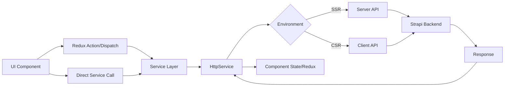
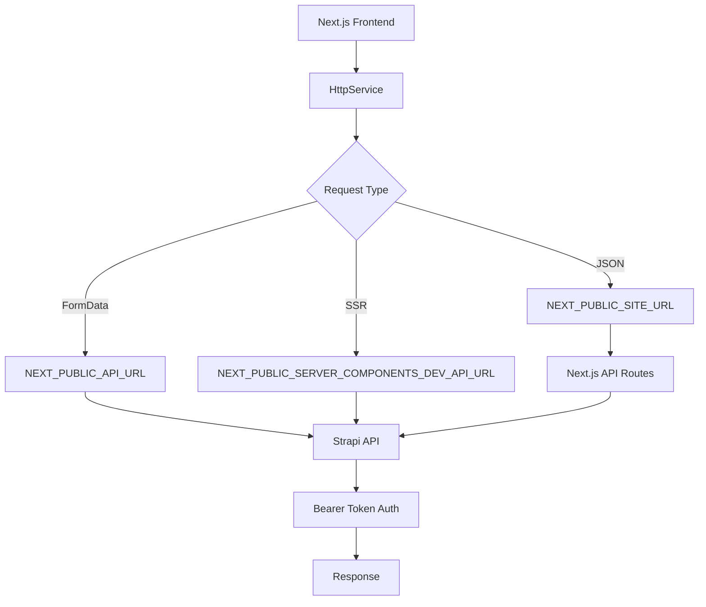
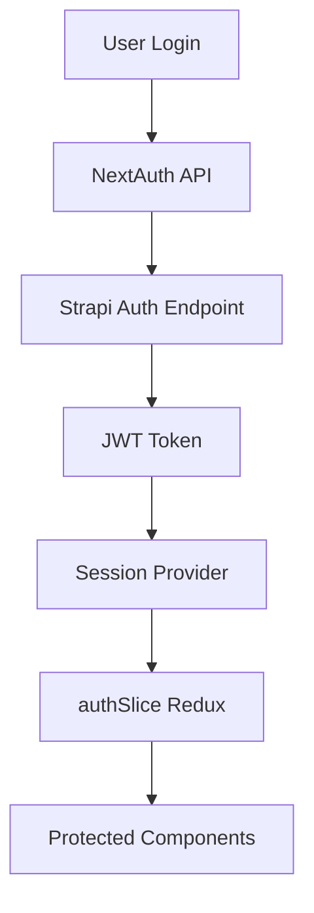

# Architecture

- [Language/Framework](#languageframework)
  - [Frontend](#frontend)
- [Full project structure](#full-project-structure)
- [Services communication](#services-communication)
  - [Data Flow](#data-flow)
  - [External Services](#external-services)
    - [Strapi CMS](#strapi-cms)
    - [Stripe](#stripe)
    - [NextAuth](#nextauth)

## Language/Framework

### Frontend

- **Framework**: Next.js 14 (App Router) → @donaction-frontend/package.json
- **UI Library**: TailwindCSS + SCSS - Utility-first CSS with custom theme system
- **Routing**: Next.js App Router - File-based routing with route groups
- **Data Fetching**: Native `fetch` with `HttpService` wrapper - Custom service layer handling SSR/CSR
- **Form Handling**: Native React state - No dedicated form library
- **Validation**: Manual validation - Client-side checks in form components
- **State Management**: Redux Toolkit (`@reduxjs/toolkit`) - Global state with slices for auth, sponsors, projects, root
- **Build Tool**: Next.js built-in - Webpack-based bundler with standalone output
- **Structure**: Feature-based - Organized by domains (core, layouts, app)

## Full project structure

```text
donaction-frontend/
├── src/
│   ├── app/                                    # Next.js App Router pages
│   │   ├── (auth)/                            # Route group for auth pages
│   │   │   ├── connexion/                     # Login page
│   │   │   │   └── page.tsx
│   │   │   ├── reset-password/                # Password reset
│   │   │   │   └── page.tsx
│   │   │   └── layout.tsx                     # Auth layout
│   │   ├── (main)/                            # Route group for public pages
│   │   │   ├── clubs/                         # Clubs listing
│   │   │   │   └── page.tsx
│   │   │   ├── conditions-generales-d-utilisation/
│   │   │   │   └── page.tsx
│   │   │   ├── contact/                       # Contact form
│   │   │   │   ├── page.tsx
│   │   │   │   └── page.scss
│   │   │   ├── mecenat/                       # Sponsorship info
│   │   │   │   └── page.tsx
│   │   │   ├── mes-dons/                      # User donations
│   │   │   │   ├── [uuid]/                    # Donation detail
│   │   │   │   └── page.tsx
│   │   │   ├── new-club/                      # Club creation
│   │   │   │   ├── congratulations/
│   │   │   │   ├── page.tsx
│   │   │   │   └── page.scss
│   │   │   ├── politique-de-confidentialite/  # Privacy policy
│   │   │   │   └── page.tsx
│   │   │   ├── profile/                       # User profile
│   │   │   │   └── page.tsx
│   │   │   ├── projets/                       # Projects listing
│   │   │   │   └── page.tsx
│   │   │   ├── page.tsx                       # Homepage
│   │   │   └── layout.tsx                     # Main layout
│   │   ├── [slug]/                            # Dynamic club pages
│   │   │   ├── nos-projets/                   # Club projects
│   │   │   │   ├── [projectSlug]/             # Project detail
│   │   │   │   └── page.tsx
│   │   │   ├── page.tsx                       # Club detail
│   │   │   ├── layout.tsx
│   │   │   └── index.scss
│   │   ├── api/                               # API routes
│   │   │   ├── [...fetch]/                    # Proxy to Strapi backend
│   │   │   │   └── route.ts
│   │   │   ├── auth/
│   │   │   │   └── [...nextauth]/             # NextAuth handler
│   │   │   │       └── route.ts
│   │   │   ├── create-payment-intent/         # Stripe integration
│   │   │   │   └── route.ts
│   │   │   └── revalidate/                    # ISR revalidation
│   │   │       └── route.ts
│   │   ├── utils/
│   │   │   └── config.ts
│   │   ├── Providers.tsx                      # Redux + NextAuth + PrimeReact providers
│   │   ├── layout.tsx                         # Root layout
│   │   ├── not-found.tsx                      # 404 page
│   │   ├── forbidden/                         # 403 page
│   │   │   └── page.tsx
│   │   ├── google-signin/                     # Google OAuth callback
│   │   │   └── page.tsx
│   │   ├── robots.tsx                         # Robots.txt generator
│   │   └── sitemap.tsx                        # Sitemap generator
│   ├── core/                                  # Business logic layer
│   │   ├── services/                          # API communication
│   │   │   ├── auth/                          # Authentication API calls
│   │   │   │   └── index.ts
│   │   │   ├── club/                          # Club-related API calls
│   │   │   │   └── index.ts
│   │   │   ├── cms/                           # CMS content API calls
│   │   │   │   └── index.ts
│   │   │   ├── don/                           # Donation API calls
│   │   │   │   └── index.ts
│   │   │   ├── don-pdf/                       # PDF generation
│   │   │   │   └── index.ts
│   │   │   ├── donateur/                      # Donor API calls
│   │   │   │   └── index.ts
│   │   │   ├── projet/                        # Project API calls
│   │   │   │   └── index.ts
│   │   │   ├── index.ts                       # HttpService wrapper
│   │   │   ├── endpoints.ts                   # All API endpoint definitions
│   │   │   └── entities.ts                    # Entity type definitions
│   │   ├── store/                             # Redux store
│   │   │   ├── modules/                       # Redux slices
│   │   │   │   ├── authSlice.ts
│   │   │   │   ├── projectSlice.ts
│   │   │   │   ├── sponsorsSlice.ts
│   │   │   │   └── rootSlice.ts
│   │   │   ├── hooks.ts                       # Typed Redux hooks
│   │   │   └── index.ts                       # Store configuration
│   │   ├── models/                            # TypeScript interfaces/types
│   │   │   ├── club/
│   │   │   │   └── index.ts
│   │   │   ├── cms/
│   │   │   │   └── index.ts
│   │   │   ├── hp/
│   │   │   │   └── index.ts
│   │   │   ├── klub-don/
│   │   │   │   └── index.ts
│   │   │   ├── klub-project/
│   │   │   │   └── index.ts
│   │   │   ├── klubr-donateur/
│   │   │   │   └── index.ts
│   │   │   ├── klubr-membre/
│   │   │   │   └── index.ts
│   │   │   ├── misc/
│   │   │   │   └── index.ts
│   │   │   ├── strapi-component/
│   │   │   │   └── index.ts
│   │   │   └── user/
│   │   │       └── index.ts
│   │   ├── hooks/                             # Custom React hooks
│   │   │   └── useWindow.ts
│   │   ├── helpers/                           # Utility functions
│   │   │   ├── currency/
│   │   │   │   └── CurrencyHelpers.ts
│   │   │   ├── color.ts
│   │   │   ├── getClientCookie.ts
│   │   │   ├── getCookie.ts
│   │   │   ├── getServerCookie.ts
│   │   │   ├── getFileNameFromContentDisposition.ts
│   │   │   ├── getURL.ts
│   │   │   ├── objEqObj.ts
│   │   │   ├── scrollIntoForm.ts
│   │   │   ├── sendGaEvent.ts
│   │   │   └── srcLoader.ts
│   │   ├── constants/                         # Application constants
│   │   │   ├── dons.ts
│   │   │   └── toBeDeleted.ts
│   │   ├── enum/                              # Enumerations
│   │   │   └── tagsEnum.ts
│   │   ├── types/
│   │   │   └── index.d.ts
│   │   └── README.md
│   ├── layouts/                               # UI components
│   │   ├── partials/                          # Page sections
│   │   │   ├── authentication/                # Auth components
│   │   │   │   ├── connexionForm/
│   │   │   │   ├── contactUsForm/
│   │   │   │   ├── googleForm/
│   │   │   │   ├── loginForm/
│   │   │   │   ├── magicLink/
│   │   │   │   ├── newClubForm/
│   │   │   │   ├── popAuth/
│   │   │   │   ├── registerForm/
│   │   │   │   └── resetPasswordForm/
│   │   │   ├── clubPage/                      # Club page sections
│   │   │   │   ├── clubCard/
│   │   │   │   ├── clubDescription/
│   │   │   │   ├── clubIntroduction/
│   │   │   │   ├── gMaps/
│   │   │   │   ├── ourSponsors/
│   │   │   │   ├── projectCard/
│   │   │   │   └── quote/
│   │   │   ├── common/                        # Shared sections
│   │   │   │   ├── accordion/
│   │   │   │   ├── breadcrumb/
│   │   │   │   ├── cookiesConsent/
│   │   │   │   ├── donateButton/
│   │   │   │   ├── downloadPdf/
│   │   │   │   ├── faqItems/
│   │   │   │   ├── footer/
│   │   │   │   ├── header/
│   │   │   │   ├── invoice/
│   │   │   │   ├── newslettersForm/
│   │   │   │   ├── paginatedKlubsList/
│   │   │   │   ├── paginatedProjectsList/
│   │   │   │   ├── pagination/
│   │   │   │   ├── plusProjects/
│   │   │   │   ├── previewMode/
│   │   │   │   ├── sections/
│   │   │   │   ├── statusIndicator/
│   │   │   │   └── templateReference/
│   │   │   ├── mecenatPage/                   # Sponsorship page sections
│   │   │   │   ├── avantageMecenat/
│   │   │   │   ├── conclusion/
│   │   │   │   ├── descriptionMecenat/
│   │   │   │   ├── manifestMecenat/
│   │   │   │   ├── needHelp/
│   │   │   │   ├── slideMecenat/
│   │   │   │   └── statsMecenat/
│   │   │   ├── myDonations/                   # User donations view
│   │   │   │   ├── index.tsx
│   │   │   │   └── index.scss
│   │   │   ├── profilePage/                   # User profile
│   │   │   │   ├── index.tsx
│   │   │   │   └── useProfileForm.ts
│   │   │   ├── projectPage/                   # Project page sections
│   │   │   │   ├── authorCard/
│   │   │   │   ├── milestone/
│   │   │   │   ├── projectDecription/
│   │   │   │   └── slides/
│   │   │   ├── sponsorshipForm/               # Donation form
│   │   │   │   ├── steps/
│   │   │   │   ├── logic/
│   │   │   │   ├── badgeRescritFiscale.tsx
│   │   │   │   ├── formBanners.tsx
│   │   │   │   ├── formBody.tsx
│   │   │   │   ├── formNavigation.tsx
│   │   │   │   ├── index.tsx
│   │   │   │   └── index.scss
│   │   │   └── _sponsorshipForm/              # Legacy sponsorship form
│   │   │       ├── index.tsx
│   │   │       ├── requests.ts
│   │   │       └── useSponsorshipForm.ts
│   │   └── components/                        # Reusable UI components
│   │       ├── dropdownList/
│   │       │   ├── index.tsx
│   │       │   └── index.scss
│   │       ├── media/                         # Media components
│   │       │   ├── ImageHtml.tsx
│   │       │   ├── ImageKit.tsx
│   │       │   ├── MediaExtraProps.ts
│   │       │   └── VideoKit.tsx
│   │       ├── popUp/
│   │       │   ├── index.tsx
│   │       │   └── index.scss
│   │       ├── spinnerButton/
│   │       │   └── index.tsx
│   │       ├── toaster/
│   │       │   ├── index.tsx
│   │       │   └── index.scss
│   │       ├── Counter.tsx
│   │       ├── KillCookie.tsx
│   │       ├── KlubrLogo.tsx
│   │       ├── LottieAnimation.tsx
│   │       ├── ProgresBar.tsx
│   │       ├── RichTextBlock.tsx
│   │       └── Share.tsx
│   ├── config/                                # Configuration files
│   │   ├── config.json                        # Site configuration
│   │   └── theme.json                         # Theme configuration
│   ├── styles/                                # Global styles
│   │   ├── main.scss                          # Main stylesheet entry
│   │   ├── base.scss
│   │   ├── buttons.scss
│   │   └── utilities.scss
│   ├── types/                                 # Global TypeScript types
│   │   ├── global.d.ts
│   │   └── next-auth.d.ts
│   └── middleware.ts                          # Next.js middleware
├── next.config.js                             # Next.js configuration
├── tailwind.config.js                         # TailwindCSS configuration
├── postcss.config.js                          # PostCSS configuration
├── tsconfig.json                              # TypeScript configuration
└── package.json                               # Dependencies
```

## Services communication

### Data Flow



### External Services

#### Strapi CMS



#### Stripe

```mermaid
graph LR
    A[Payment Form] --> B[create-payment-intent API]
    B --> C[@stripe/stripe-js]
    C --> D[Stripe API]
    D --> E[Payment Intent]
    E --> F[@stripe/react-stripe-js]
    F --> G[Payment Confirmation]
    G --> H[klub-don-payments endpoint]
```

#### NextAuth


