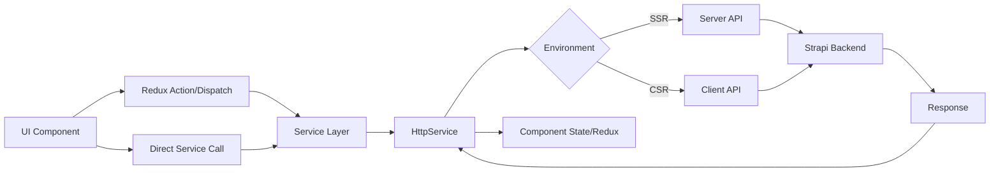
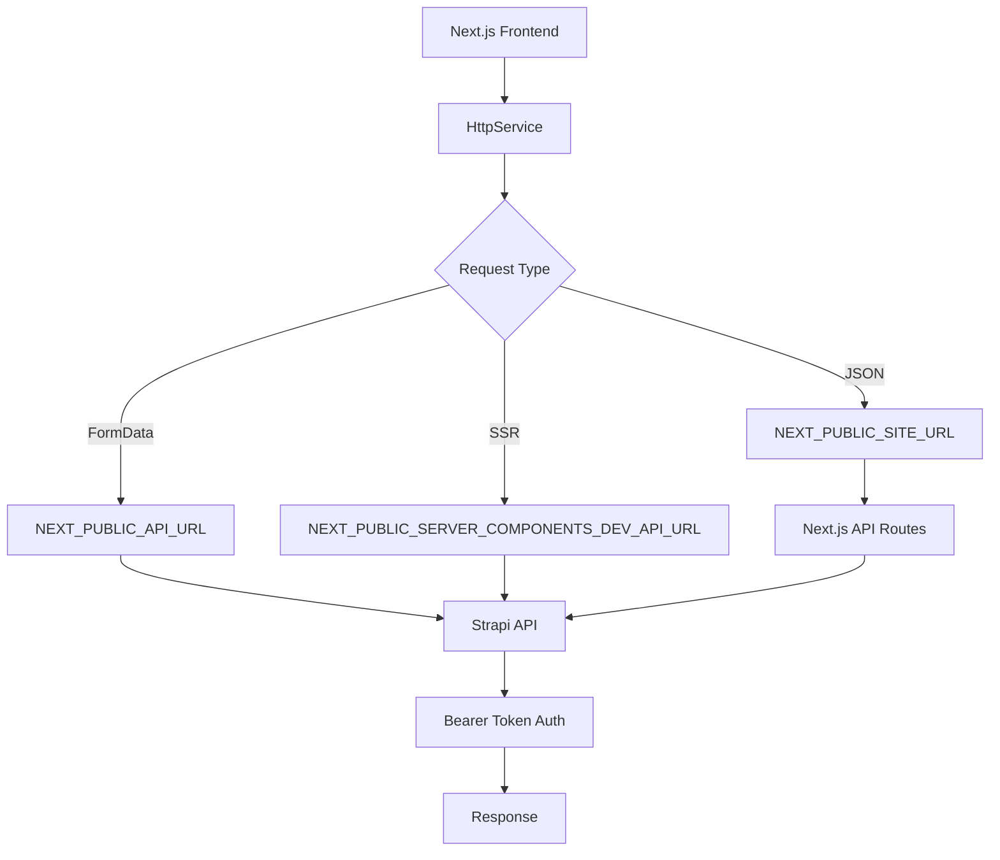
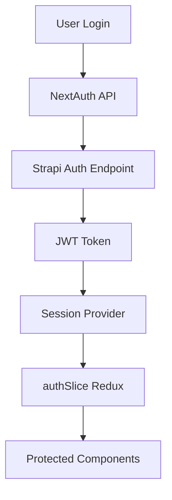

# Architecture

- [Language/Framework](#languageframework)
  - [Frontend](#frontend)
- [Full project structure](#full-project-structure)
  - [Naming Conventions](#naming-conventions)
- [Services communication](#services-communication)
  - [Data Flow](#data-flow)
  - [External Services](#external-services)
    - [Strapi CMS](#strapi-cms)
    - [Stripe](#stripe)
    - [NextAuth](#nextauth)

## Language/Framework

### Frontend

- **Framework**: Next.js 14 (App Router) → @donaction-frontend/package.json
- **UI Library**: TailwindCSS + SCSS - Utility-first CSS with custom theme system
- **Routing**: Next.js App Router - File-based routing with route groups
- **Data Fetching**: Native `fetch` with `HttpService` wrapper - Custom service layer handling SSR/CSR
- **Form Handling**: Native React state - No dedicated form library
- **Validation**: Manual validation - Client-side checks in form components
- **State Management**: Redux Toolkit (`@reduxjs/toolkit`) - Global state with slices for auth, sponsors, projects, root
- **Build Tool**: Next.js built-in - Webpack-based bundler with standalone output
- **Structure**: Feature-based - Organized by domains (core, layouts, app)

## Full project structure

```text
donaction-frontend/
├── src/
│   ├── app/                      # Next.js App Router pages
│   │   ├── (main)/              # Route group for public pages
│   │   │   ├── clubs/           # Clubs listing
│   │   │   ├── projets/         # Projects listing
│   │   │   ├── mecenat/         # Sponsorship info
│   │   │   ├── mes-dons/        # User donations
│   │   │   └── page.tsx         # Homepage
│   │   ├── (auth)/              # Route group for auth pages
│   │   ├── [slug]/              # Dynamic club pages
│   │   ├── api/                 # API routes
│   │   │   ├── auth/[...nextauth]/  # NextAuth handler
│   │   │   ├── create-payment-intent/  # Stripe integration
│   │   │   └── [...fetch]/      # Proxy to backend
│   │   ├── layout.tsx           # Root layout with providers
│   │   └── Providers.tsx        # Redux + NextAuth + PrimeReact providers
│   ├── core/                    # Business logic layer
│   │   ├── services/            # API communication
│   │   │   ├── club/            # Club-related API calls
│   │   │   ├── don/             # Donation API calls
│   │   │   ├── projet/          # Project API calls
│   │   │   ├── auth/            # Authentication API calls
│   │   │   ├── donateur/        # Donor API calls
│   │   │   ├── cms/             # CMS content API calls
│   │   │   ├── index.ts         # HttpService wrapper
│   │   │   └── endpoints.ts     # All API endpoint definitions
│   │   ├── store/               # Redux store
│   │   │   ├── modules/         # Redux slices
│   │   │   │   ├── authSlice.ts
│   │   │   │   ├── projectSlice.ts
│   │   │   │   ├── sponsorsSlice.ts
│   │   │   │   └── rootSlice.ts
│   │   │   └── index.ts         # Store configuration
│   │   ├── models/              # TypeScript interfaces/types
│   │   │   ├── club/
│   │   │   ├── klub-don/
│   │   │   ├── klub-project/
│   │   │   ├── klubr-donateur/
│   │   │   ├── user/
│   │   │   └── cms/
│   │   ├── hooks/               # Custom React hooks
│   │   ├── helpers/             # Utility functions
│   │   ├── constants/           # Application constants
│   │   └── enum/                # Enumerations
│   ├── layouts/                 # UI components
│   │   ├── partials/            # Page sections
│   │   │   ├── clubPage/
│   │   │   ├── projectPage/
│   │   │   ├── mecenatPage/
│   │   │   ├── profilePage/
│   │   │   ├── sponsorshipForm/
│   │   │   ├── authentication/
│   │   │   └── common/
│   │   └── components/          # Reusable UI components
│   │       ├── dropdownList/
│   │       ├── popUp/
│   │       ├── toaster/
│   │       └── media/
│   ├── config/                  # Configuration files
│   │   ├── config.json          # Site configuration
│   │   └── theme.json           # Theme configuration
│   ├── styles/                  # Global styles
│   │   ├── main.scss            # Main stylesheet entry
│   │   ├── base.scss
│   │   ├── buttons.scss
│   │   └── utilities.scss
│   └── types/                   # Global TypeScript types
├── next.config.js               # Next.js configuration
├── tailwind.config.js           # TailwindCSS configuration
└── tsconfig.json                # TypeScript configuration
```

### Naming Conventions

- **Files**: kebab-case for pages, camelCase for components
- **Components**: PascalCase
- **Functions**: camelCase
- **Variables**: camelCase
- **Constants**: UPPER_CASE
- **Types/Interfaces**: PascalCase

## Services communication

### Data Flow



### External Services

#### Strapi CMS



#### Stripe

```mermaid
graph LR
    A[Payment Form] --> B[create-payment-intent API]
    B --> C[@stripe/stripe-js]
    C --> D[Stripe API]
    D --> E[Payment Intent]
    E --> F[@stripe/react-stripe-js]
    F --> G[Payment Confirmation]
    G --> H[klub-don-payments endpoint]
```

#### NextAuth


