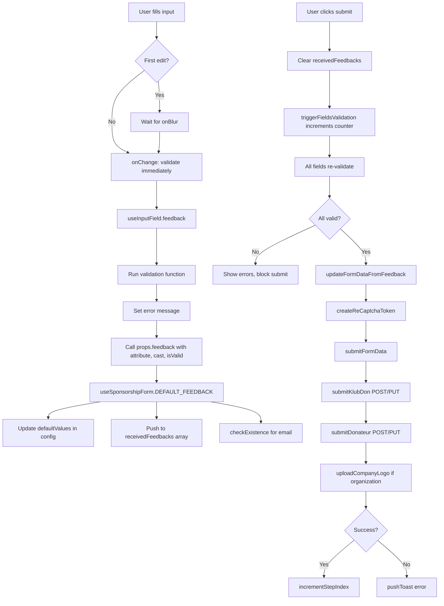

# Forms

This part describe how frontend forms are handled in the project, including libraries used, validation strategies, and state management.

## State Management

- Custom form state management using `useState` hooks
- Local component state with refs (`useRef`) for form values and validation feedback
- Form config object pattern: `config` state holds `defaultValues`, `triggerValidation`, and `DEFAULT_FEEDBACK`
- Redux Toolkit for global state (authentication status, toasts, etc.)
- State updates via callback pattern through `DEFAULT_FEEDBACK` function
- `process.nextTick()` for async validation aggregation before submission

## Validation

- Custom validation functions in `validations.ts`
- Client-side validation using regex patterns: `emailRexExp`, `sirenRexExp`, `stringRexExp`, `stringWithoutNumbersRexExp`
- Validation functions: `validateEmail`, `validateRequired`, `validateString`, `validatePassword`, `validateSame`, `validateTrue`, `validateSiren`, `validateAmount`, `validateDate`, `validateDateMajor`, `validateSelection`
- Validation triggered on `blur` and `onChange` events (after first edit)
- Feedback collected in `receivedFeedbacks` ref array with `{ attribute, cast, isValid }` structure
- Type casting enforced via `cast` property (BooleanConstructor, StringConstructor, NumberConstructor)

## Error handling

- Inline error messages displayed below input fields in `<small>` tags
- Error messages returned by validation functions (e.g., "Ce champ est obligatoire")
- Visual feedback via CSS classes: `valid`, `invalid`
- Toast notifications via Redux `pushToast` action for server errors
- Google Analytics event tracking for errors using `sendGaEvent`

## Form Flow

User fills form → `onChange`/`onBlur` trigger validation → `feedback()` collects results → on submit, `triggerFieldsValidation()` increments counter → all fields re-validate → check `receivedFeedbacks` for validity → if valid, create reCAPTCHA token → submit to API (postDon/putDon, postDonateur/putDonateur) → handle success/error → navigate to next step or show error toast

