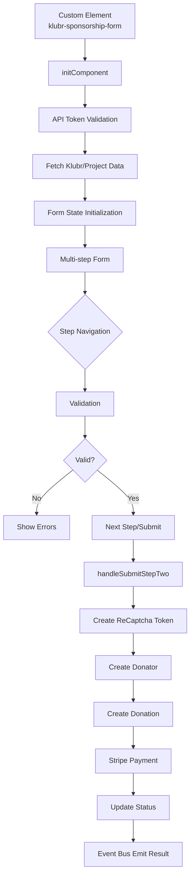

# Architecture

- [Language/Framework](#languageframework)
  - [Frontend](#frontend)
- [Full project structure](#full-project-structure)
- [Services communication](#services-communication)
  - [Form Workflow](#form-workflow)
  - [External Services](#external-services)
    - [Stripe](#stripe)
    - [Google Services](#google-services)
    - [Analytics](#analytics)

## Language/Framework

### Frontend

- **Framework**: Svelte 5 → @donaction-saas/package.json
- **Component Type**: Web Components (Custom Elements)
- **Routing**: N/A - Single component module
- **Data Fetching**: Custom fetch util with event bus pattern
- **Form Handling**: Multi-step form with reactive state
- **Validation**: Custom validators with Svelte directives
- **State Management**: Svelte stores (`writable`) + Svelte 5 `$state` reactivity
- **Build Tool**: Vite with individual component builds
- **Structure**: Component-based with logic separation

## Full project structure

```text
donaction-saas/
├── src/
│   ├── assets/           # Static assets
│   │   ├── animations/   # Lottie JSON files
│   │   ├── fonts/        # Custom fonts
│   │   └── icons/        # SVG icons
│   ├── components/       # Web components
│   │   └── sponsorshipForm/
│   │       ├── components/     # Sub-components (breadcrumb, formBanner, formBody, formNavigation, etc)
│   │       ├── logic/          # Business logic (api, stripe, validator, state management)
│   │       ├── index.svelte    # Main component entry
│   │       └── index.scss      # Component styles
│   ├── types/            # TypeScript type definitions
│   ├── utils/            # Shared utilities (eventBus, fetch, analytics)
│   └── main.ts           # Entry point
├── build/                # Build output
│   └── donaction-web-components/
│       └── components/   # Individual component builds
├── vite.config.ts              # Production build config
└── vite.config.development.ts  # Development build config
```

## Services communication

### Form Workflow



### External Services

#### Stripe

- **Purpose**: Payment processing
- **Integration**: `@stripe/stripe-js` library
- **Flow**: Stripe Elements injected via slot → Payment creation → Confirmation
- **Files**: `logic/stripe.ts`

#### Google Services

- **ReCAPTCHA Enterprise**: Bot protection for form submission
- **Google Maps API**: Address autocomplete with Places library
- **Integration**: Script tags loaded in main component
- **Config**: Environment variables `VITE_GOOGLE_RECAPTCHA_SITE_KEY`, `VITE_GOOGLE_MAPS_KEY`

#### Analytics

- **Plausible**: Privacy-focused analytics tracking
- **Google Analytics**: Event tracking via `sendGaEvent`
- **Events**: Form navigation, open/close, step transitions
- **Config**: `VITE_ACTIVATE_ANALYTICS` flag
