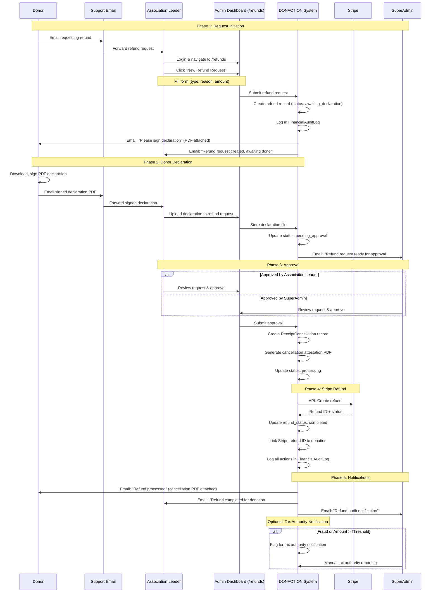
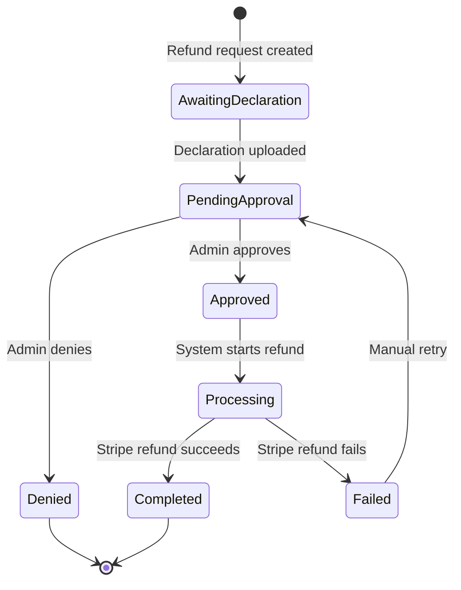
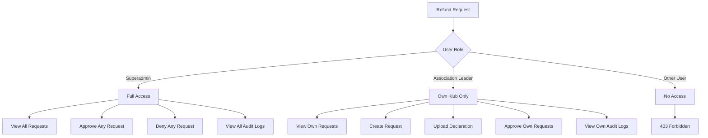
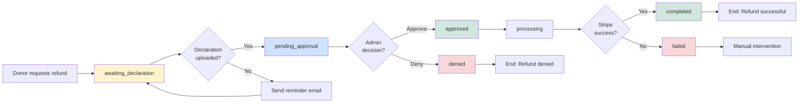
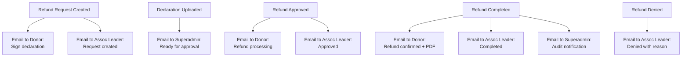
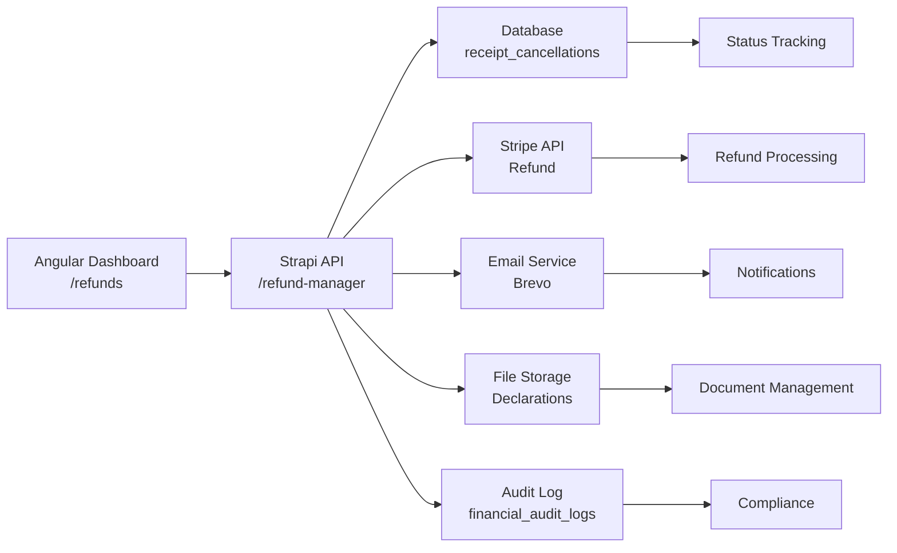

# Exceptional Refund Workflow - Visual Guide

## Complete Process Flow

## Simplified State Machine

## Access Control Matrix

## Refund Request Status Flow

## Key Decision Points

| Phase | Decision Point | Actors | Outcome |
|-------|---------------|--------|---------|
| **Initiation** | Is refund eligible? | Association Leader | Create request or reject |
| **Declaration** | Declaration valid? | Association Leader (upload) | Accept or request resubmission |
| **Approval** | Approve or deny? | Superadmin OR Association Leader | Approve → process / Deny → end |
| **Processing** | Stripe refund success? | System (automated) | Success → complete / Fail → manual intervention |
| **Completion** | Notify tax authorities? | System (auto) + Superadmin (manual) | Flag if fraud or > threshold |

## Email Notification Flow

## Technical Architecture

