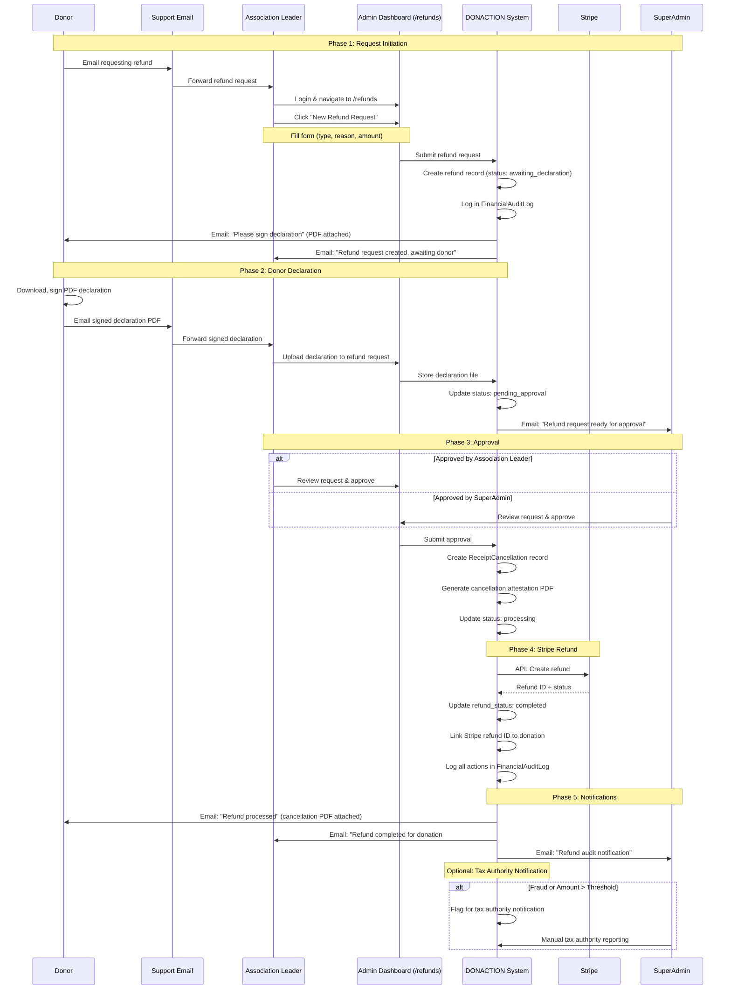

# Stripe Connect Migration - Requirements Discussion

**Project:** DONACTION  
**Epic:** Migration from Stripe Standard to Stripe Connect  
**Date:** 2025-12-03  
**Status:** Requirements Approved - Ready for Technical Planning

---

## Stripe Connect Account Type Recommendation

**Recommended: Express Accounts**

| Type | Pros | Cons | Recommendation |
|------|------|------|----------------|
| **Standard** | Association owns relationship with Stripe, full control | Associations leave Stripe ecosystem when offboarding, complex setup | ❌ Too complex for non-tech associations |
| **Express** | Stripe-hosted onboarding, DONACTION maintains relationship, simpler KYC | Less customization on onboarding UI | ✅ **BEST FIT** - Balance of simplicity + control |
| **Custom** | Full UI control, embedded experience | You handle all compliance/KYC UI, most development effort | ❌ Overkill for this use case |

**Why Express?**
- Stripe handles KYC UI (less dev work)
- DONACTION keeps control of relationship
- Associations don't need separate Stripe accounts
- Easy to monitor all accounts from platform
- Built-in compliance checks

---

## Approved Decisions for Open Questions

### 1. Idempotency for PaymentIntent Creation ✅
**Decision:** YES - Implement idempotency keys

**Implementation:**
- Generate unique idempotency key per donation attempt (e.g., `${donationId}-${timestamp}`)
- Store key in donation record
- Pass to Stripe API in `Idempotency-Key` header
- Prevents duplicate charges if donor double-clicks submit or network retry occurs

**Benefits:**
- Prevents accidental duplicate charges
- Safe retry mechanism for network failures
- Required for production payment systems

### 2. Audit Trail Depth ✅
**Decision:** Full log table implementation

**Justification:**
- Essential for debugging payment issues
- Compliance requirement (financial traceability)
- Helpful for fraud detection and dispute resolution
- Stripe Dashboard alone lacks donation context

### 3. Fee Justificatif (Proof Document) ✅
**Decision:** YES - Generate monthly fee statement for associations

**Purpose:**
- French accounting compliance
- Associations need proof of fees paid for their books
- Not an invoice (Stripe handles collection), but a "relevé de frais"

**Format:**
- PDF statement with:
  - Period covered
  - List of donations with fees
  - Total fees paid to DONACTION
  - Association details (SIREN, name, address)
  - Generated by admin or downloadable by association

### 4. Refund Edge Case with Tax Receipts ✅
**Decision:** Implement exceptional refund workflow with receipt cancellation

**Key Principles:**
1. **Immutability:** Never modify original tax receipt
2. **Cancellation Document:** Create separate "attestation d'annulation"
3. **Donor Engagement:** Require written declaration before refund
4. **Audit Trail:** Log all actions with timestamps and approvers

**See detailed workflow in:** `docs/roadmap/2025-12-stripe-connect-migration/refund-edge-case-tax-receipts.md`

---

## Refined Feature Requirements (Final Version)

### Project Context
- **Project Name:** DONACTION
- **Migration Type:** Fresh start (delete old donations, rebuild on Stripe Connect)
- **Scope:** EUR only, French residents, single-tenant (multi-tenant deferred)

---

### 1. Association Onboarding & Account Management

#### 1.1 Registration Flow (Next.js → Email → Angular)

**Next.js Registration Page (Already Exists):**

- **Step 1 - Association Leader Info:**
  - nom, prenom, birthDate, tel, email

- **Step 2 - Association Info:**
  - clubName, acronyme, adresse, legalStatus, sportType
  - acceptConditions1, acceptConditions2

- **On Submit:**
  - Create: User account + Klubr profile + **Stripe Express Account**
  - Send: Email with activation link to Angular (contains token to auto-link user account to profile)

**Email Link Behavior:**
- Auto-authenticate user in Angular Dashboard **(TO IMPLEMENT)**
- Connect user account to klubr profile **(ALREADY IMPLEMENTED)**
- Redirect to "Complete Your Profile" page **(PARTIAL - TO COMPLETE)**

**Angular Dashboard Completion:**

- **Dashboard Homepage Enhancement (NEW):**
  - Add completion status summary widget with 3 sections:
    1. **Klub Info** - Progress bar showing `requiredFieldsCompletion` %
    2. **Document Upload** - Progress bar showing `requiredDocsValidatedCompletion` %
    3. **Stripe Account** - Status badge (pending/verified/restricted)
  - Visual indicators (✅/⚠️/❌) for each section
  - Quick action buttons: "Complete Info", "Upload Docs", "Setup Stripe"

- **Klub Info Page:** Complete all required fields (`requiredFieldsCompletion` → 100%)
- **Document Upload:** Upload required legal docs (`requiredDocsValidatedCompletion` → 100%)
  - Add new field: **`managerSignature`** (image upload) in `klubr` table for tax receipt signing
- **Stripe Connect KYC:** Link to continue Stripe Express onboarding (hosted by Stripe)
- **Manual Validation:** DONACTION admin validates docs (sets validation flag)
- **Page Activation:** Enable only when:
  - `klubr-info.requiredDocsValidatedCompletion === 100`
  - `klubr-info.requiredFieldsCompletion === 100`
  - Stripe Connect account status = `charges_enabled: true`


#### 1.2 Stripe Connect Integration (Backend - Strapi)

**New Content Type: `connected_account`**
- Relation to klubr (OneToOne)
- Stripe account ID, status, KYC requirements
- Onboarding link, last synced timestamp

**New Strapi Routes:**
- `POST /klubr/:id/stripe/create-account`
- `POST /klubr/:id/stripe/onboarding-link`
- `GET /klubr/:id/stripe/status`
- `POST /stripe/webhook`

**Required Webhooks:**
- `account.updated` - Sync KYC status
- `account.application.deauthorized` - Handle disconnection
- `payment_intent.succeeded` - Confirm donation
- `payment_intent.payment_failed` - Mark failed
- `charge.refunded` - Log warning (special workflow needed)

#### 1.3 Angular Dashboard Features

**New Screens:**

1. **Dashboard Homepage Enhancement**
   - Klub completion status widget (3 sections: info/docs/stripe)
   - Trade policy display (read-only for association leaders)
   - Quick stats: total donations, pending refunds

2. **Payment Account Activation** (`/payment-setup`)
   - Display Stripe onboarding status
   - Button: "Complete Stripe Setup" → Opens Stripe-hosted onboarding
   - Show requirements still due

3. **Payment Account Status** (`/payment-status`)
   - Visual indicator: KYC status (pending/verified/restricted)
   - Charges enabled: ✅/❌
   - Payouts enabled: ✅/❌

4. **Trade Policy Configuration** (`/trade-policy`)
   - **Access:** Superadmin ONLY
   - Fee models: percentage / fixed+percentage / fixed only
   - Toggle: "Donor pays fee"
   - Preview calculation example

5. **Enhanced Donation Dashboard** (`/dons`)
   - Filter by association (superadmin: global view)
   - Columns: Date, Donor, Amount, Fee, Net, Status, Receipt, Refund Status
   - Export to CSV (accounting format)

6. **Superadmin Monitoring**
   - `/admin/connected-accounts` (NEW dedicated screen)
   - `/admin/klub/listing` (ENHANCED with Stripe Connect filters)
     - Filters: KYC complete/incomplete, charges enabled/disabled
     - Column: Stripe Account Status
     - Bulk actions: Send KYC reminder emails

7. **Fee Statement Generation** (`/fee-statements`)
   - **Note:** Requires facturation module refactoring
   - Select month/year
   - Generate PDF "Relevé de frais"
   - Download button

8. **Exceptional Refund Management** (`/refunds`)
   - **Access:** Superadmin + Association Leader (own donations only)
   - Accessible from `/admin/klub/listing` (via action button per klub)
   - List refund requests with status filters
   - Refund request form with file upload
   - Approval workflow (see section 8 for detailed process)

---

### 2. Donation Flow (Svelte Web Component)

#### 2.1 Payment Creation with Idempotency

**Flow:**
1. Generate idempotency key client-side
2. Check for existing donation with key
3. Calculate fees based on trade policy
4. Create donation record FIRST
5. Create PaymentIntent with Stripe
6. Store PaymentIntent details in donation
7. Return clientSecret to Svelte

#### 2.2 Error Handling

**Critical Validation (Backend):**
- Check `charges_enabled: true` BEFORE allowing donation form display
- This prevents donations when account is inactive or KYC incomplete

**Defensive Error Handling (Svelte):**
- `account_inactive` → "Association temporarily unable to accept donations"
  - **Note:** Should rarely happen due to backend validation, but handle as safety net
- `account_kyc_incomplete` → Gray out form with status message
  - **Note:** Should rarely happen due to backend validation, but handle as safety net
- `payment_failed` → Retry button + cron backup

#### 2.3 Improved Retry
- Instant retry button on failed payment page
- Reuse clientSecret for 24 hours
- Cron job as backup only

---

### 3. Tax Receipt Generation

**Changes:**
- Use association details (not DONACTION)
- Include manager signature image
- Net or gross amount depending on `donorPayFee`
- Cerfa-compliant format

---

### 4. Database Schema Changes

**New Tables:**
- `connected_accounts` - Stripe account tracking
- `webhook_logs` - All webhook events
- `financial_audit_logs` - All financial events with actor, metadata
- `receipt_cancellations` - Refund workflow with donor declarations

**Modified Tables:**
- `klubrs` + `manager_signature` field
- `trade_policies` + fee_model, fixed_amount, donor_pays_fee
- `klub_dons` + idempotency_key, payment_intent_id, refund_status

---

### 5. Compliance & Legal

**GDPR:** Data processing agreement with Stripe in TOS  
**Cerfa:** Association name, SIREN, signature, amount, date  
**Accounting:** Monthly fee statements for associations  
**Audit Trail:** Full log table with all events  

---

### 6. Migration Strategy

1. Deploy to staging
2. Onboard 3-5 pilot associations
3. Email all existing associations
4. Go live with monitoring
5. Deprecate old flow

---

### 7. Testing Acceptance Criteria

✅ Association flow (registration → KYC → activation)  
✅ Donation flow with idempotency  
✅ Tax receipts with manager signature  
✅ Refund workflow with cancellation attestation  
✅ Superadmin monitoring and reports  
✅ Audit logs for all financial events  

---

### 8. Exceptional Refund Workflow

**Important Note:**
- Manual process for now (mentioned in FAQ)
- Future automation planned
- Users request refunds via email to support team
- This feature adds admin interface to manage the manual workflow

#### 8.1 Refund Request Process

**Step 1: Donor Initiates Request**
- Donor sends email to support team (association leader)
- Includes: donation reference, reason for refund

**Step 2: Association Leader Creates Refund Request**
- From `/admin/klub/listing` → click "Manage Refunds" for their klub
- Or from `/dons` → select donation → "Request Refund"
- Navigate to `/refunds` screen
- Fill refund request form:
  - Refund type: fraud / legal dispute / donor request / payment error
  - Reason (text area, min 50 chars)
  - Tax authority notification needed: checkbox (auto-checked > threshold)
- Submit request → Status: "Pending - Awaiting Donor Declaration"

**Step 3: Email to Donor**
- System sends email to donor requesting signed declaration
- Email template: "Please sign and return this declaration stating you will not use the tax receipt for tax purposes"
- Attachment: PDF declaration template

**Step 4: Donor Returns Signed Declaration**
- Donor sends signed PDF to support email

**Step 5: Association Leader Uploads Declaration**
- From `/refunds` → find request → "Upload Declaration"
- Upload signed donor declaration PDF
- Status changes to: "Pending Approval"

**Step 6: Admin Approval**
- Authorized admins (Superadmin OR Association Leader) review request
- Approval screen shows:
  - Donation details
  - Tax receipt status
  - Refund reason
  - Preview of uploaded donor declaration
- Actions: Approve / Deny (with comment field)

**Step 7: System Processing (On Approval)**
1. Create `ReceiptCancellation` record
2. Generate cancellation attestation PDF
3. Process Stripe refund via API
4. Update donation: `refund_status = 'completed'`
5. Log in `FinancialAuditLog`
6. Send email notifications:
   - Donor: refund confirmation + cancellation attestation
   - Association leader: refund processed
   - Superadmin: refund audit notification

#### 8.2 Refund Management Features

**Dashboard: `/refunds`**
- **Access Control:**
  - Superadmin: see ALL refund requests
  - Association Leader: see ONLY their klub's refunds
- **List View:**
  - Columns: Donation ID, Donor, Amount, Refund Type, Status, Date Requested, Actions
  - Filters: Status (pending/awaiting_declaration/pending_approval/approved/denied/processed)
  - Search: by donation ID, donor email
- **Actions:**
  - View details
  - Upload declaration (if status = awaiting_declaration)
  - Approve/Deny (if status = pending_approval AND user authorized)
  - View audit trail

**Security Measures:**
- Role-based access control (RBAC)
  - Superadmin: full access to all refunds
  - Association Leader: access only to their klub's refunds
- Audit logging of all actions (who, what, when, IP address)
- File upload validation (PDF only, max size)
- Email verification before processing

**Reporting:**
- Export refund requests to CSV
- Monthly refund summary report
- Financial review dashboard with refund metrics

**Special Cases Handling:**

| Situation | Workflow |
|-----------|----------|
| **Fraude avérée** | - Signalement TRACFIN if > 10,000€<br>- Block donor from future donations (add to blacklist)<br>- Notify tax authorities<br>- Full audit log with fraud flag |
| **Litige juridique** | - Freeze refund until legal decision<br>- Require court document upload<br>- Preserve all evidence in system |
| **Erreur de paiement** | - Fast-track approval if receipt not yet generated<br>- Simple refund without cancellation doc |
| **Rétractation (14j)** | - Simple cancellation if receipt not generated<br>- No donor declaration needed |

#### 8.3 Exceptional Refund Workflow Diagram



#### 8.4 Database Updates for Refunds

**Modified Table: `receipt_cancellations`**
```sql
ALTER TABLE receipt_cancellations
  ADD COLUMN status VARCHAR(50) DEFAULT 'awaiting_declaration',
  -- Status: awaiting_declaration, pending_approval, approved, denied, processing, completed
  ADD COLUMN denial_reason TEXT,
  ADD COLUMN denied_by INT REFERENCES users(id),
  ADD COLUMN denied_at TIMESTAMP;
```

**Modified Table: `financial_audit_logs`**
```sql
-- Add new event types:
-- 'refund_requested', 'declaration_uploaded', 'refund_approved',
-- 'refund_denied', 'refund_processing', 'refund_completed'
```

---

## Summary of Key Decisions

| Topic | Decision |
|-------|----------|
| **Stripe Account Type** | Express (Stripe-hosted onboarding) |
| **Fee Models** | 3 options: percentage, fixed+percentage, fixed only |
| **Fee Payment** | Configurable: deducted OR paid by donor |
| **Migration** | Fresh start (delete old donations) |
| **Activation Gates** | 100% fields + docs + Stripe KYC + manual validation |
| **Tax Receipt** | Association's name + manager signature |
| **Retry Mechanism** | Instant button + cron backup |
| **Idempotency** | ✅ Full implementation |
| **Audit Trail** | ✅ Full log table |
| **Fee Justificatif** | ✅ Monthly PDF statements |
| **Refund Process** | ✅ Exceptional workflow with cancellation |

---

## Next Steps

✅ **Requirements Approved - Ready for Technical Planning**

1. Generate detailed technical implementation plan using `/ide:03_plan/plan`
2. Break down into user stories with Gherkin acceptance criteria
3. Create GitHub issues with proper Epic linking
4. Estimate effort and prioritize stories
5. Begin Phase 1: Staging deployment

---

## Reference Documents

- Refund edge case: `docs/roadmap/2025-12-stripe-connect-migration/refund-edge-case-tax-receipts.md`
- Original epic: `docs/roadmap/from GPT/epic_migration_stripe_connect.md`
