```mermaid
flowchart TB
    subgraph Step1["📊 Step 1: Choix du Montant"]
        A1[Sélection montant<br/>Min 10€ / Max 100k€]
        A2[Avec réduction fiscale ?<br/>Oui/Non]
        A3[Particulier ou Entreprise ?]
        A4[Projet spécifique ?<br/>ou Don au club]
        A1 --> A2 --> A3 --> A4
    end

    subgraph Step2["👤 Step 2: Informations Donateur"]
        B1{Type donateur}
        B2[Particulier<br/>Nom, Prénom, Email<br/>Date naissance, Adresse]
        B3[Entreprise<br/>Raison sociale, SIREN<br/>Forme juridique, Logo]
        B1 -->|Particulier| B2
        B1 -->|Organisme| B3
    end

    subgraph Step3["📋 Step 3: Récapitulatif"]
        C1[Montant du don]
        C2[Contribution DONACTION<br/>optionnelle max 25€]
        C3[Décomposition des frais<br/>transparent]
        C4[Total à payer]
        C5[✅ Acceptation CGU]
        C1 --> C2 --> C3 --> C4 --> C5
    end

    subgraph Step4["💳 Step 4: Paiement Stripe"]
        D1[Stripe Elements<br/>Card / Apple Pay / Google Pay]
        D2[Confirmation paiement]
        D3{Résultat}
        D4[✅ Succès]
        D5[❌ Échec + Retry]
        D1 --> D2 --> D3
        D3 -->|succeeded| D4
        D3 -->|failed| D5
    end

    subgraph Step5["🎉 Step 5: Confirmation"]
        E1[Message remerciement]
        E2[📄 Attestation PDF]
        E3[📄 Reçu fiscal PDF<br/>si applicable]
        E4[Invitation créer compte]
        E1 --> E2 --> E3 --> E4
    end

    Step1 --> Step2 --> Step3 --> Step4 --> Step5
```

```mermaid
gantt
    title Plan de Migration Stripe Connect
    dateFormat  YYYY-MM-DD
    section Phase 0
    Revue code existant (Phases 1-3)    :done, p0, 2026-01-11, 3d
    Tests unitaires                      :active, p0t, after p0, 5d
    
    section Phase 1 - Pilote
    Sélection 5 associations pilotes    :p1a, after p0t, 2d
    Onboarding pilotes                  :p1b, after p1a, 7d
    Tests en production                 :p1c, after p1b, 14d
    Collecte feedback                   :p1d, after p1b, 14d
    
    section Phase 2 - Rollout
    Communication générale              :p2a, after p1c, 3d
    Onboarding par vagues (10/semaine)  :p2b, after p2a, 28d
    Support renforcé                    :p2c, after p2a, 35d
    
    section Phase 3 - Dépréciation
    Désactivation ancien système        :p3a, after p2b, 7d
    Migration données legacy            :p3b, after p3a, 14d
    Archivage                           :p3c, after p3b, 7d
```

# Strat├Г┬йgie de Collecte de Dons DONACTION ├втВмтАЭ Stripe Connect

> **Version**: 2.0.0 | **Date**: 2026-01-11 | **Statut**: Document Strat├Г┬йgique Final

---

## 1. Executive Summary

DONACTION migre d'un mod├Г┬иle Stripe Standard (compte unique Fond Klubr) vers **Stripe Connect Express** pour permettre aux associations sportives fran├Г┬зaises de recevoir les dons directement sur leurs comptes connect├Г┬йs. Cette transformation apporte :

- **Transparence financi├Г┬иre** : Les associations re├Г┬зoivent 100% du montant intentionnel du don
- **Conformit├Г┬й fiscale** : Re├Г┬зus ├Г┬йmis au nom de l'association (non plus DONACTION)
- **Mod├Г┬иle "Donor Pays Fee"** : Le donateur prend en charge les frais Stripe (~1.5% + 0.25├втАЪ┬м) et la commission plateforme (4%)
- **Automatisation** : Pr├Г┬йl├Г┬иvement automatique via `application_fee_amount`
- **Simplification KYC** : Onboarding h├Г┬йberg├Г┬й par Stripe (Express accounts)

L'impl├Г┬йmentation backend est d├Г┬йj├Г┬а r├Г┬йalis├Г┬йe (Phases 1-3). Ce document consolide la strat├Г┬йgie compl├Г┬иte et identifie les ajustements n├Г┬йcessaires pour garantir la coh├Г┬йrence du syst├Г┬иme.

---

## 2. Architecture du Flux de Paiement

### 2.1 Parcours Donateur (5 ├Г┬йtapes)



### 2.2 Calcul des Frais ├втВмтАЭ Mod├Г┬иle "Donor Pays Fee"

#### 2.2.1 Param├Г┬иtres de Configuration

Bas├Г┬й sur le sch├Г┬йma `trade_policy` existant, **avec ├Г┬йvolutions** :

| Param├Г┬иtre | Type | Valeur par d├Г┬йfaut | Description |
|-----------|------|-------------------|-------------|
| `fee_model` | enum | `percentage_only` | Mode de calcul des frais |
| `commissionPercentage` | decimal | 6% ├втАатАЩ **4%** | Commission plateforme DONACTION |
| `fixed_amount` | decimal | 0├втАЪ┬м | Montant fixe par transaction |
| ~~`donor_pays_fee`~~ | ~~boolean~~ | ~~false~~ | **REMPLAC├ГтА░** par les 2 champs ci-dessous |
| `donor_pays_fee_project` | boolean | **`true`** | **NOUVEAU** - D├Г┬йfaut pour dons ├Г┬а un projet |
| `donor_pays_fee_club` | boolean | **`false`** | **NOUVEAU** - D├Г┬йfaut pour dons au club |
| `allow_donor_fee_choice` | boolean | **`true`** | **NOUVEAU** - Autoriser le donateur ├Г┬а choisir |
| `stripe_connect` | boolean | `true` | Utiliser Stripe Connect |

**├ГтА░volutions cl├Г┬йs :**
1. **Diff├Г┬йrenciation projet/club** : Deux param├Г┬иtres distincts permettent de configurer des comportements diff├Г┬йrents selon le type de don
2. **Choix donateur** : Si `allow_donor_fee_choice = true`, le donateur peut modifier le comportement par d├Г┬йfaut ├Г┬а l'├Г┬йtape 3

**Note importante** : La commission actuelle de 6% doit ├Г┬кtre revue ├Г┬а **4%** selon les sp├Г┬йcifications du nouveau mod├Г┬иle.

#### 2.2.2 Logique de D├Г┬йtermination du `donorPaysFee`

```typescript
// helpers/fee-calculation-helper.ts
interface FeeContext {
    tradePolicy: TradePolicyEntity;
    isProjectDonation: boolean;       // true si don ├Г┬а un projet
    donorChoice: boolean | null;      // Choix explicite du donateur (null = pas de choix)
}

function determineDonorPaysFee(context: FeeContext): boolean {
    const { tradePolicy, isProjectDonation, donorChoice } = context;
    
    // 1. Si le donateur a fait un choix explicite ET que c'est autoris├Г┬й
    if (donorChoice !== null && tradePolicy.allow_donor_fee_choice) {
        return donorChoice;
    }
    
    // 2. Sinon, utiliser la valeur par d├Г┬йfaut selon le type de don
    return isProjectDonation 
        ? tradePolicy.donor_pays_fee_project 
        : tradePolicy.donor_pays_fee_club;
}
```

**Exemples de configurations :**

| Sc├Г┬йnario | `donor_pays_fee_project` | `donor_pays_fee_club` | `allow_donor_fee_choice` | R├Г┬йsultat |
|----------|--------------------------|----------------------|--------------------------|----------|
| **Standard** | `true` | `false` | `true` | Projet: donateur paie (modifiable) / Club: frais d├Г┬йduits (modifiable) |
| **Tout transparent** | `true` | `true` | `false` | Tous les dons: donateur paie (non modifiable) |
| **Tout int├Г┬йgr├Г┬й** | `false` | `false` | `false` | Tous les dons: frais d├Г┬йduits (non modifiable) |
| **Flexible total** | `true` | `false` | `true` | D├Г┬йfauts diff├Г┬йrents, donateur choisit toujours |

#### 2.2.3 Formules de Calcul

**Variables :**
- `MONTANT_SAISI` = Montant saisi par le donateur dans le formulaire
- `CONTRIBUTION_DONACTION` = Contribution optionnelle ├Г┬а la plateforme (0-25├втАЪ┬м)
- `TAUX_COMMISSION` = 4% (commission DONACTION)
- `TAUX_STRIPE` = 1.5% + 0.25├втАЪ┬м (frais Stripe standard EU)

---

**Sc├Г┬йnario A : Donor Pays Fee = TRUE** (d├Г┬йfaut projets)
> *"Je donne 100├втАЪ┬м, l'association re├Г┬зoit 100├втАЪ┬м, je paie les frais en plus"*

```
MONTANT_DON_REEL = MONTANT_SAISI (inchang├Г┬й)
Commission DONACTION = MONTANT_DON_REEL ├ГтАФ 4%
Frais Stripe estim├Г┬йs = (MONTANT_DON_REEL + CONTRIBUTION) ├ГтАФ 1.5% + 0.25├втАЪ┬м
Application Fee = Commission + Frais Stripe

TOTAL_PRELEVE = MONTANT_DON_REEL + CONTRIBUTION + Application Fee
NET_ASSOCIATION = MONTANT_DON_REEL (100%)
MONTANT_RECU_FISCAL = MONTANT_DON_REEL (100├втАЪ┬м)
```

**Exemple (Don 100├втАЪ┬м + Contribution 10├втАЪ┬м, Donor Pays Fee = TRUE) :**

```
├втАЭ┼Т├втАЭтВм├втАЭтВм├втАЭтВм├втАЭтВм├втАЭтВм├втАЭтВм├втАЭтВм├втАЭтВм├втАЭтВм├втАЭтВм├втАЭтВм├втАЭтВм├втАЭтВм├втАЭтВм├втАЭтВм├втАЭтВм├втАЭтВм├втАЭтВм├втАЭтВм├втАЭтВм├втАЭтВм├втАЭтВм├втАЭтВм├втАЭтВм├втАЭтВм├втАЭтВм├втАЭтВм├втАЭтВм├втАЭтВм├втАЭтВм├втАЭтВм├втАЭтВм├втАЭтВм├втАЭтВм├втАЭтВм├втАЭтВм├втАЭтВм├втАЭтВм├втАЭтВм├втАЭтВм├втАЭтВм├втАЭтВм├втАЭтВм├втАЭтВм├втАЭтВм├втАЭтВм├втАЭтВм├втАЭтВм├втАЭтВм├втАЭтВм├втАЭтВм├втАЭтВм├втАЭтВм├втАЭтВм├втАЭтВм├втАЭтВм├втАЭтВм├втАЭтВм├втАЭтВм├втАЭтВм├втАЭтВм├втАЭ┬Р
├втАЭтАЪ  ├░┼╕тАЩ┬│ CE QUE LE DONATEUR PAIE                                 ├втАЭтАЪ
├втАЭ┼У├втАЭтВм├втАЭтВм├втАЭтВм├втАЭтВм├втАЭтВм├втАЭтВм├втАЭтВм├втАЭтВм├втАЭтВм├втАЭтВм├втАЭтВм├втАЭтВм├втАЭтВм├втАЭтВм├втАЭтВм├втАЭтВм├втАЭтВм├втАЭтВм├втАЭтВм├втАЭтВм├втАЭтВм├втАЭтВм├втАЭтВм├втАЭтВм├втАЭтВм├втАЭтВм├втАЭтВм├втАЭтВм├втАЭтВм├втАЭтВм├втАЭтВм├втАЭтВм├втАЭтВм├втАЭтВм├втАЭтВм├втАЭтВм├втАЭтВм├втАЭтВм├втАЭтВм├втАЭтВм├втАЭтВм├втАЭтВм├втАЭтВм├втАЭтВм├втАЭтВм├втАЭтВм├втАЭтВм├втАЭтВм├втАЭтВм├втАЭтВм├втАЭтВм├втАЭтВм├втАЭтВм├втАЭтВм├втАЭтВм├втАЭтВм├втАЭтВм├втАЭтВм├втАЭтВм├втАЭтВм├втАЭтВм├втАЭ┬д
├втАЭтАЪ  Montant du don                    : 100,00 ├втАЪ┬м               ├втАЭтАЪ
├втАЭтАЪ  Contribution DONACTION            :  10,00 ├втАЪ┬м               ├втАЭтАЪ
├втАЭтАЪ  ├втАЭтВм├втАЭтВм├втАЭтВм├втАЭтВм├втАЭтВм├втАЭтВм├втАЭтВм├втАЭтВм├втАЭтВм├втАЭтВм├втАЭтВм├втАЭтВм├втАЭтВм├втАЭтВм├втАЭтВм├втАЭтВм├втАЭтВм├втАЭтВм├втАЭтВм├втАЭтВм├втАЭтВм├втАЭтВм├втАЭтВм├втАЭтВм├втАЭтВм├втАЭтВм├втАЭтВм├втАЭтВм├втАЭтВм├втАЭтВм├втАЭтВм├втАЭтВм├втАЭтВм├втАЭтВм├втАЭтВм├втАЭтВм├втАЭтВм├втАЭтВм├втАЭтВм├втАЭтВм├втАЭтВм├втАЭтВм├втАЭтВм├втАЭтВм├втАЭтВм              ├втАЭтАЪ
├втАЭтАЪ  Sous-total                        : 110,00 ├втАЪ┬м               ├втАЭтАЪ
├втАЭтАЪ                                                             ├втАЭтАЪ
├втАЭтАЪ  + Frais de traitement (4% + Stripe)                        ├втАЭтАЪ
├втАЭтАЪ    Commission plateforme (4%)      :   4,00 ├втАЪ┬м               ├втАЭтАЪ
├втАЭтАЪ    Frais bancaires (~1.5% + 0.25├втАЪ┬м) :   1,90 ├втАЪ┬м               ├втАЭтАЪ
├втАЭтАЪ  ├втАЭтВм├втАЭтВм├втАЭтВм├втАЭтВм├втАЭтВм├втАЭтВм├втАЭтВм├втАЭтВм├втАЭтВм├втАЭтВм├втАЭтВм├втАЭтВм├втАЭтВм├втАЭтВм├втАЭтВм├втАЭтВм├втАЭтВм├втАЭтВм├втАЭтВм├втАЭтВм├втАЭтВм├втАЭтВм├втАЭтВм├втАЭтВм├втАЭтВм├втАЭтВм├втАЭтВм├втАЭтВм├втАЭтВм├втАЭтВм├втАЭтВм├втАЭтВм├втАЭтВм├втАЭтВм├втАЭтВм├втАЭтВм├втАЭтВм├втАЭтВм├втАЭтВм├втАЭтВм├втАЭтВм├втАЭтВм├втАЭтВм├втАЭтВм├втАЭтВм              ├втАЭтАЪ
├втАЭтАЪ  TOTAL D├ГтА░BIT├ГтА░                      : 115,90 ├втАЪ┬м               ├втАЭтАЪ
├втАЭтАЭ├втАЭтВм├втАЭтВм├втАЭтВм├втАЭтВм├втАЭтВм├втАЭтВм├втАЭтВм├втАЭтВм├втАЭтВм├втАЭтВм├втАЭтВм├втАЭтВм├втАЭтВм├втАЭтВм├втАЭтВм├втАЭтВм├втАЭтВм├втАЭтВм├втАЭтВм├втАЭтВм├втАЭтВм├втАЭтВм├втАЭтВм├втАЭтВм├втАЭтВм├втАЭтВм├втАЭтВм├втАЭтВм├втАЭтВм├втАЭтВм├втАЭтВм├втАЭтВм├втАЭтВм├втАЭтВм├втАЭтВм├втАЭтВм├втАЭтВм├втАЭтВм├втАЭтВм├втАЭтВм├втАЭтВм├втАЭтВм├втАЭтВм├втАЭтВм├втАЭтВм├втАЭтВм├втАЭтВм├втАЭтВм├втАЭтВм├втАЭтВм├втАЭтВм├втАЭтВм├втАЭтВм├втАЭтВм├втАЭтВм├втАЭтВм├втАЭтВм├втАЭтВм├втАЭтВм├втАЭтВм├втАЭтВм├втАЭ╦Ь

├втАЭ┼Т├втАЭтВм├втАЭтВм├втАЭтВм├втАЭтВм├втАЭтВм├втАЭтВм├втАЭтВм├втАЭтВм├втАЭтВм├втАЭтВм├втАЭтВм├втАЭтВм├втАЭтВм├втАЭтВм├втАЭтВм├втАЭтВм├втАЭтВм├втАЭтВм├втАЭтВм├втАЭтВм├втАЭтВм├втАЭтВм├втАЭтВм├втАЭтВм├втАЭтВм├втАЭтВм├втАЭтВм├втАЭтВм├втАЭтВм├втАЭтВм├втАЭтВм├втАЭтВм├втАЭтВм├втАЭтВм├втАЭтВм├втАЭтВм├втАЭтВм├втАЭтВм├втАЭтВм├втАЭтВм├втАЭтВм├втАЭтВм├втАЭтВм├втАЭтВм├втАЭтВм├втАЭтВм├втАЭтВм├втАЭтВм├втАЭтВм├втАЭтВм├втАЭтВм├втАЭтВм├втАЭтВм├втАЭтВм├втАЭтВм├втАЭтВм├втАЭтВм├втАЭтВм├втАЭтВм├втАЭтВм├втАЭтВм├втАЭ┬Р
├втАЭтАЪ  ├░┼╕тАЬ┼а R├ГтА░PARTITION                                             ├втАЭтАЪ
├втАЭ┼У├втАЭтВм├втАЭтВм├втАЭтВм├втАЭтВм├втАЭтВм├втАЭтВм├втАЭтВм├втАЭтВм├втАЭтВм├втАЭтВм├втАЭтВм├втАЭтВм├втАЭтВм├втАЭтВм├втАЭтВм├втАЭтВм├втАЭтВм├втАЭтВм├втАЭтВм├втАЭтВм├втАЭтВм├втАЭтВм├втАЭтВм├втАЭтВм├втАЭтВм├втАЭтВм├втАЭтВм├втАЭтВм├втАЭтВм├втАЭтВм├втАЭтВм├втАЭтВм├втАЭтВм├втАЭтВм├втАЭтВм├втАЭтВм├втАЭтВм├втАЭтВм├втАЭтВм├втАЭтВм├втАЭтВм├втАЭтВм├втАЭтВм├втАЭтВм├втАЭтВм├втАЭтВм├втАЭтВм├втАЭтВм├втАЭтВм├втАЭтВм├втАЭтВм├втАЭтВм├втАЭтВм├втАЭтВм├втАЭтВм├втАЭтВм├втАЭтВм├втАЭтВм├втАЭтВм├втАЭтВм├втАЭтВм├втАЭ┬д
├втАЭтАЪ  ├втАатАЩ Association re├Г┬зoit     : 100,00 ├втАЪ┬м (100% de votre don)    ├втАЭтАЪ
├втАЭтАЪ  ├втАатАЩ DONACTION re├Г┬зoit       :  14,00 ├втАЪ┬м (contribution + comm.) ├втАЭтАЪ
├втАЭтАЪ  ├втАатАЩ Stripe pr├Г┬йl├Г┬иve         :  ~1,90 ├втАЪ┬м (frais bancaires)      ├втАЭтАЪ
├втАЭ┼У├втАЭтВм├втАЭтВм├втАЭтВм├втАЭтВм├втАЭтВм├втАЭтВм├втАЭтВм├втАЭтВм├втАЭтВм├втАЭтВм├втАЭтВм├втАЭтВм├втАЭтВм├втАЭтВм├втАЭтВм├втАЭтВм├втАЭтВм├втАЭтВм├втАЭтВм├втАЭтВм├втАЭтВм├втАЭтВм├втАЭтВм├втАЭтВм├втАЭтВм├втАЭтВм├втАЭтВм├втАЭтВм├втАЭтВм├втАЭтВм├втАЭтВм├втАЭтВм├втАЭтВм├втАЭтВм├втАЭтВм├втАЭтВм├втАЭтВм├втАЭтВм├втАЭтВм├втАЭтВм├втАЭтВм├втАЭтВм├втАЭтВм├втАЭтВм├втАЭтВм├втАЭтВм├втАЭтВм├втАЭтВм├втАЭтВм├втАЭтВм├втАЭтВм├втАЭтВм├втАЭтВм├втАЭтВм├втАЭтВм├втАЭтВм├втАЭтВм├втАЭтВм├втАЭтВм├втАЭтВм├втАЭтВм├втАЭ┬д
├втАЭтАЪ  ├░┼╕тАЬтАЮ RE├ГтАбU FISCAL           : 100,00 ├втАЪ┬м                        ├втАЭтАЪ
├втАЭтАЪ     R├Г┬йduction d'imp├Г┬┤ts    :  66,00 ├втАЪ┬м (particulier)          ├втАЭтАЪ
├втАЭтАЪ     Co├Г┬╗t r├Г┬йel du don      :  49,90 ├втАЪ┬м (115,90 - 66)          ├втАЭтАЪ
├втАЭтАЭ├втАЭтВм├втАЭтВм├втАЭтВм├втАЭтВм├втАЭтВм├втАЭтВм├втАЭтВм├втАЭтВм├втАЭтВм├втАЭтВм├втАЭтВм├втАЭтВм├втАЭтВм├втАЭтВм├втАЭтВм├втАЭтВм├втАЭтВм├втАЭтВм├втАЭтВм├втАЭтВм├втАЭтВм├втАЭтВм├втАЭтВм├втАЭтВм├втАЭтВм├втАЭтВм├втАЭтВм├втАЭтВм├втАЭтВм├втАЭтВм├втАЭтВм├втАЭтВм├втАЭтВм├втАЭтВм├втАЭтВм├втАЭтВм├втАЭтВм├втАЭтВм├втАЭтВм├втАЭтВм├втАЭтВм├втАЭтВм├втАЭтВм├втАЭтВм├втАЭтВм├втАЭтВм├втАЭтВм├втАЭтВм├втАЭтВм├втАЭтВм├втАЭтВм├втАЭтВм├втАЭтВм├втАЭтВм├втАЭтВм├втАЭтВм├втАЭтВм├втАЭтВм├втАЭтВм├втАЭтВм├втАЭтВм├втАЭ╦Ь
```

---

**Sc├йnario B : Donor Pays Fee = FALSE** (d├йfaut club)
> *"Je donne 100тВм tout compris, l'association re├зoit le net apr├иs frais"*

**тЪая╕П Point technique critique : Gestion des frais Stripe**

Avec Stripe Connect en mode **Destination Charges**, les frais Stripe sont toujours d├йduits du solde de la **plateforme** (DONACTION), pas du compte connect├й. Pour que DONACTION maintienne sa commission de 4% net, l'`application_fee_amount` doit inclure les frais Stripe estim├йs.

```
MONTANT_DON_BRUT = MONTANT_SAISI
Commission DONACTION = MONTANT_DON_BRUT ├Ч 4%
Frais Stripe estim├йs = (TOTAL_PRELEVE ├Ч 1.5%) + 0.25тВм

// L'application_fee inclut commission + frais Stripe pour garantir 4% net ├а DONACTION
Application Fee = Commission + Frais Stripe estim├йs

TOTAL_PRELEVE = MONTANT_DON_BRUT + CONTRIBUTION
NET_ASSOCIATION = MONTANT_DON_BRUT - Application Fee
MONTANT_RECU_FISCAL = NET_ASSOCIATION
```

**Exemple (Don 100тВм + Contribution 10тВм, Donor Pays Fee = FALSE) :**

```
тФМтФАтФАтФАтФАтФАтФАтФАтФАтФАтФАтФАтФАтФАтФАтФАтФАтФАтФАтФАтФАтФАтФАтФАтФАтФАтФАтФАтФАтФАтФАтФАтФАтФАтФАтФАтФАтФАтФАтФАтФАтФАтФАтФАтФАтФАтФАтФАтФАтФАтФАтФАтФАтФАтФАтФАтФАтФАтФАтФАтФАтФАтФР
тФВ  ЁЯТ│ CE QUE LE DONATEUR PAIE                                 тФВ
тФЬтФАтФАтФАтФАтФАтФАтФАтФАтФАтФАтФАтФАтФАтФАтФАтФАтФАтФАтФАтФАтФАтФАтФАтФАтФАтФАтФАтФАтФАтФАтФАтФАтФАтФАтФАтФАтФАтФАтФАтФАтФАтФАтФАтФАтФАтФАтФАтФАтФАтФАтФАтФАтФАтФАтФАтФАтФАтФАтФАтФАтФАтФд
тФВ  Montant du don (frais inclus)     : 100,00 тВм               тФВ
тФВ  Contribution DONACTION            :  10,00 тВм               тФВ
тФВ  тФАтФАтФАтФАтФАтФАтФАтФАтФАтФАтФАтФАтФАтФАтФАтФАтФАтФАтФАтФАтФАтФАтФАтФАтФАтФАтФАтФАтФАтФАтФАтФАтФАтФАтФАтФАтФАтФАтФАтФАтФАтФАтФАтФАтФА              тФВ
тФВ  TOTAL D├ЙBIT├Й                      : 110,00 тВм               тФВ
тФФтФАтФАтФАтФАтФАтФАтФАтФАтФАтФАтФАтФАтФАтФАтФАтФАтФАтФАтФАтФАтФАтФАтФАтФАтФАтФАтФАтФАтФАтФАтФАтФАтФАтФАтФАтФАтФАтФАтФАтФАтФАтФАтФАтФАтФАтФАтФАтФАтФАтФАтФАтФАтФАтФАтФАтФАтФАтФАтФАтФАтФАтФШ

тФМтФАтФАтФАтФАтФАтФАтФАтФАтФАтФАтФАтФАтФАтФАтФАтФАтФАтФАтФАтФАтФАтФАтФАтФАтФАтФАтФАтФАтФАтФАтФАтФАтФАтФАтФАтФАтФАтФАтФАтФАтФАтФАтФАтФАтФАтФАтФАтФАтФАтФАтФАтФАтФАтФАтФАтФАтФАтФАтФАтФАтФАтФР
тФВ  ЁЯУК CALCUL DE L'APPLICATION FEE                             тФВ
тФЬтФАтФАтФАтФАтФАтФАтФАтФАтФАтФАтФАтФАтФАтФАтФАтФАтФАтФАтФАтФАтФАтФАтФАтФАтФАтФАтФАтФАтФАтФАтФАтФАтФАтФАтФАтФАтФАтФАтФАтФАтФАтФАтФАтФАтФАтФАтФАтФАтФАтФАтФАтФАтФАтФАтФАтФАтФАтФАтФАтФАтФАтФд
тФВ  Commission DONACTION (4%)         :   4,00 тВм               тФВ
тФВ  Frais Stripe estim├йs              :   1,90 тВм               тФВ
тФВ  (110тВм ├Ч 1.5% + 0.25тВм)                                      тФВ
тФВ  тФАтФАтФАтФАтФАтФАтФАтФАтФАтФАтФАтФАтФАтФАтФАтФАтФАтФАтФАтФАтФАтФАтФАтФАтФАтФАтФАтФАтФАтФАтФАтФАтФАтФАтФАтФАтФАтФАтФАтФАтФАтФАтФАтФАтФА              тФВ
тФВ  application_fee_amount            :   5,90 тВм               тФВ
тФФтФАтФАтФАтФАтФАтФАтФАтФАтФАтФАтФАтФАтФАтФАтФАтФАтФАтФАтФАтФАтФАтФАтФАтФАтФАтФАтФАтФАтФАтФАтФАтФАтФАтФАтФАтФАтФАтФАтФАтФАтФАтФАтФАтФАтФАтФАтФАтФАтФАтФАтФАтФАтФАтФАтФАтФАтФАтФАтФАтФАтФАтФШ

тФМтФАтФАтФАтФАтФАтФАтФАтФАтФАтФАтФАтФАтФАтФАтФАтФАтФАтФАтФАтФАтФАтФАтФАтФАтФАтФАтФАтФАтФАтФАтФАтФАтФАтФАтФАтФАтФАтФАтФАтФАтФАтФАтФАтФАтФАтФАтФАтФАтФАтФАтФАтФАтФАтФАтФАтФАтФАтФАтФАтФАтФАтФР
тФВ  ЁЯУК R├ЙPARTITION FINALE                                      тФВ
тФЬтФАтФАтФАтФАтФАтФАтФАтФАтФАтФАтФАтФАтФАтФАтФАтФАтФАтФАтФАтФАтФАтФАтФАтФАтФАтФАтФАтФАтФАтФАтФАтФАтФАтФАтФАтФАтФАтФАтФАтФАтФАтФАтФАтФАтФАтФАтФАтФАтФАтФАтФАтФАтФАтФАтФАтФАтФАтФАтФАтФАтФАтФд
тФВ  тЖТ Association re├зoit     :  94,10 тВм (100 - 5,90тВм)          тФВ
тФВ  тЖТ DONACTION re├зoit brut  :  15,90 тВм (contribution + 5,90тВм) тФВ
тФВ  тЖТ Stripe pr├йl├иve         :  ~1,90 тВм (sur DONACTION)        тФВ
тФВ  тЖТ DONACTION net          :  14,00 тВм (4тВм commission + 10тВм)  тФВ
тФЬтФАтФАтФАтФАтФАтФАтФАтФАтФАтФАтФАтФАтФАтФАтФАтФАтФАтФАтФАтФАтФАтФАтФАтФАтФАтФАтФАтФАтФАтФАтФАтФАтФАтФАтФАтФАтФАтФАтФАтФАтФАтФАтФАтФАтФАтФАтФАтФАтФАтФАтФАтФАтФАтФАтФАтФАтФАтФАтФАтФАтФАтФд
тФВ  ЁЯУД RE├ЗU FISCAL           :  94,10 тВм (montant net re├зu)     тФВ
тФВ     R├йduction d'imp├┤ts    :  62,11 тВм (particulier)          тФВ
тФВ     Co├╗t r├йel du don      :  47,89 тВм (110 - 62,11)          тФВ
тФФтФАтФАтФАтФАтФАтФАтФАтФАтФАтФАтФАтФАтФАтФАтФАтФАтФАтФАтФАтФАтФАтФАтФАтФАтФАтФАтФАтФАтФАтФАтФАтФАтФАтФАтФАтФАтФАтФАтФАтФАтФАтФАтФАтФАтФАтФАтФАтФАтФАтФАтФАтФАтФАтФАтФАтФАтФАтФАтФАтФАтФАтФШ
```

**Note importante** : Dans ce sc├йnario, l'association re├зoit moins (94,10тВм au lieu de 96тВм) mais DONACTION garantit sa commission de 4% net. Le re├зu fiscal refl├иte exactement ce que l'association re├зoit r├йellement.


---

**├в┼б┬а├п┬╕┬П Point cl├Г┬й : Impact sur le Re├Г┬зu Fiscal**

| Sc├Г┬йnario | Montant re├Г┬зu fiscal | Justification |
|----------|---------------------|---------------|
| **Donor Pays Fee = TRUE** | 100% du montant saisi | L'association re├Г┬зoit l'int├Г┬йgralit├Г┬й |
| **Donor Pays Fee = FALSE** | Montant net (~94%) | Le re├Г┬зu doit refl├Г┬йter ce que l'association re├Г┬зoit r├Г┬йellement |

Le re├Г┬зu fiscal doit **toujours** correspondre au montant effectivement re├Г┬зu par l'association pour ├Г┬кtre conforme aux exigences Cerfa.

### 2.3 UX Formulaire ├втВмтАЭ Choix Donor Pays Fee (Step 3)

#### 2.3.1 Condition d'Affichage

Le choix n'est affich├Г┬й que si `trade_policy.allow_donor_fee_choice = true`. Sinon, la valeur par d├Г┬йfaut (projet ou club) s'applique automatiquement.

#### 2.3.2 Maquette UI

```
├втАЭ┼Т├втАЭтВм├втАЭтВм├втАЭтВм├втАЭтВм├втАЭтВм├втАЭтВм├втАЭтВм├втАЭтВм├втАЭтВм├втАЭтВм├втАЭтВм├втАЭтВм├втАЭтВм├втАЭтВм├втАЭтВм├втАЭтВм├втАЭтВм├втАЭтВм├втАЭтВм├втАЭтВм├втАЭтВм├втАЭтВм├втАЭтВм├втАЭтВм├втАЭтВм├втАЭтВм├втАЭтВм├втАЭтВм├втАЭтВм├втАЭтВм├втАЭтВм├втАЭтВм├втАЭтВм├втАЭтВм├втАЭтВм├втАЭтВм├втАЭтВм├втАЭтВм├втАЭтВм├втАЭтВм├втАЭтВм├втАЭтВм├втАЭтВм├втАЭтВм├втАЭтВм├втАЭтВм├втАЭтВм├втАЭтВм├втАЭтВм├втАЭтВм├втАЭтВм├втАЭтВм├втАЭтВм├втАЭтВм├втАЭтВм├втАЭтВм├втАЭтВм├втАЭтВм├втАЭтВм├втАЭтВм├втАЭтВм├втАЭтВм├втАЭтВм├втАЭтВм├втАЭтВм├втАЭтВм├втАЭтВм├втАЭтВм├втАЭтВм├втАЭ┬Р
├втАЭтАЪ  ├░┼╕тАЬтА╣ R├ГтА░CAPITULATIF DE VOTRE DON                                      ├втАЭтАЪ
├втАЭ┼У├втАЭтВм├втАЭтВм├втАЭтВм├втАЭтВм├втАЭтВм├втАЭтВм├втАЭтВм├втАЭтВм├втАЭтВм├втАЭтВм├втАЭтВм├втАЭтВм├втАЭтВм├втАЭтВм├втАЭтВм├втАЭтВм├втАЭтВм├втАЭтВм├втАЭтВм├втАЭтВм├втАЭтВм├втАЭтВм├втАЭтВм├втАЭтВм├втАЭтВм├втАЭтВм├втАЭтВм├втАЭтВм├втАЭтВм├втАЭтВм├втАЭтВм├втАЭтВм├втАЭтВм├втАЭтВм├втАЭтВм├втАЭтВм├втАЭтВм├втАЭтВм├втАЭтВм├втАЭтВм├втАЭтВм├втАЭтВм├втАЭтВм├втАЭтВм├втАЭтВм├втАЭтВм├втАЭтВм├втАЭтВм├втАЭтВм├втАЭтВм├втАЭтВм├втАЭтВм├втАЭтВм├втАЭтВм├втАЭтВм├втАЭтВм├втАЭтВм├втАЭтВм├втАЭтВм├втАЭтВм├втАЭтВм├втАЭтВм├втАЭтВм├втАЭтВм├втАЭтВм├втАЭтВм├втАЭтВм├втАЭтВм├втАЭтВм├втАЭ┬д
├втАЭтАЪ                                                                     ├втАЭтАЪ
├втАЭтАЪ  B├Г┬йn├Г┬йficiaire : FC Lyon                                             ├втАЭтАЪ
├втАЭтАЪ  Projet : Nouveau terrain synth├Г┬йtique (ou "Fonctionnement g├Г┬йn├Г┬йral") ├втАЭтАЪ
├втАЭтАЪ                                                                     ├втАЭтАЪ
├втАЭтАЪ  ├втАЭтВм├втАЭтВм├втАЭтВм├втАЭтВм├втАЭтВм├втАЭтВм├втАЭтВм├втАЭтВм├втАЭтВм├втАЭтВм├втАЭтВм├втАЭтВм├втАЭтВм├втАЭтВм├втАЭтВм├втАЭтВм├втАЭтВм├втАЭтВм├втАЭтВм├втАЭтВм├втАЭтВм├втАЭтВм├втАЭтВм├втАЭтВм├втАЭтВм├втАЭтВм├втАЭтВм├втАЭтВм├втАЭтВм├втАЭтВм├втАЭтВм├втАЭтВм├втАЭтВм├втАЭтВм├втАЭтВм├втАЭтВм├втАЭтВм├втАЭтВм├втАЭтВм├втАЭтВм├втАЭтВм├втАЭтВм├втАЭтВм├втАЭтВм├втАЭтВм├втАЭтВм├втАЭтВм├втАЭтВм├втАЭтВм├втАЭтВм├втАЭтВм├втАЭтВм├втАЭтВм├втАЭтВм├втАЭтВм├втАЭтВм├втАЭтВм├втАЭтВм├втАЭтВм├втАЭтВм├втАЭтВм├втАЭтВм├втАЭтВм├втАЭтВм├втАЭтВм  ├втАЭтАЪ
├втАЭтАЪ                                                                     ├втАЭтАЪ
├втАЭтАЪ  Montant de votre don                              100,00 ├втАЪ┬м         ├втАЭтАЪ
├втАЭтАЪ  Contribution ├Г┬а DONACTION (optionnel)        [├втАЭ┬Б├втАЭ┬Б├втАЭ┬Б├втАЭ┬Б├втАФтА╣├втАЭ┬Б├втАЭ┬Б] 10,00 ├втАЪ┬м      ├втАЭтАЪ
├втАЭтАЪ                                                                     ├втАЭтАЪ
├втАЭтАЪ  ├втАЭтВм├втАЭтВм├втАЭтВм├втАЭтВм├втАЭтВм├втАЭтВм├втАЭтВм├втАЭтВм├втАЭтВм├втАЭтВм├втАЭтВм├втАЭтВм├втАЭтВм├втАЭтВм├втАЭтВм├втАЭтВм├втАЭтВм├втАЭтВм├втАЭтВм├втАЭтВм├втАЭтВм├втАЭтВм├втАЭтВм├втАЭтВм├втАЭтВм├втАЭтВм├втАЭтВм├втАЭтВм├втАЭтВм├втАЭтВм├втАЭтВм├втАЭтВм├втАЭтВм├втАЭтВм├втАЭтВм├втАЭтВм├втАЭтВм├втАЭтВм├втАЭтВм├втАЭтВм├втАЭтВм├втАЭтВм├втАЭтВм├втАЭтВм├втАЭтВм├втАЭтВм├втАЭтВм├втАЭтВм├втАЭтВм├втАЭтВм├втАЭтВм├втАЭтВм├втАЭтВм├втАЭтВм├втАЭтВм├втАЭтВм├втАЭтВм├втАЭтВм├втАЭтВм├втАЭтВм├втАЭтВм├втАЭтВм├втАЭтВм├втАЭтВм├втАЭтВм  ├втАЭтАЪ
├втАЭтАЪ                                                                     ├втАЭтАЪ
├втАЭтАЪ  ├░┼╕тАЩ┬б COMMENT SOUHAITEZ-VOUS G├ГтА░RER LES FRAIS DE TRAITEMENT ?          ├втАЭтАЪ
├втАЭтАЪ                                                                     ├втАЭтАЪ
├втАЭтАЪ  ├втАЭ┼Т├втАЭтВм├втАЭтВм├втАЭтВм├втАЭтВм├втАЭтВм├втАЭтВм├втАЭтВм├втАЭтВм├втАЭтВм├втАЭтВм├втАЭтВм├втАЭтВм├втАЭтВм├втАЭтВм├втАЭтВм├втАЭтВм├втАЭтВм├втАЭтВм├втАЭтВм├втАЭтВм├втАЭтВм├втАЭтВм├втАЭтВм├втАЭтВм├втАЭтВм├втАЭтВм├втАЭтВм├втАЭтВм├втАЭтВм├втАЭтВм├втАЭтВм├втАЭтВм├втАЭтВм├втАЭтВм├втАЭтВм├втАЭтВм├втАЭтВм├втАЭтВм├втАЭтВм├втАЭтВм├втАЭтВм├втАЭтВм├втАЭтВм├втАЭтВм├втАЭтВм├втАЭтВм├втАЭтВм├втАЭтВм├втАЭтВм├втАЭтВм├втАЭтВм├втАЭтВм├втАЭтВм├втАЭтВм├втАЭтВм├втАЭтВм├втАЭтВм├втАЭтВм├втАЭтВм├втАЭтВм├втАЭтВм├втАЭ┬Р    ├втАЭтАЪ
├втАЭтАЪ  ├втАЭтАЪ ├втАФтА░ Je paie les frais en plus de mon don                      ├втАЭтАЪ    ├втАЭтАЪ
├втАЭтАЪ  ├втАЭтАЪ   ├втАЭтВм├втАЭтВм├втАЭтВм├втАЭтВм├втАЭтВм├втАЭтВм├втАЭтВм├втАЭтВм├втАЭтВм├втАЭтВм├втАЭтВм├втАЭтВм├втАЭтВм├втАЭтВм├втАЭтВм├втАЭтВм├втАЭтВм├втАЭтВм├втАЭтВм├втАЭтВм├втАЭтВм├втАЭтВм├втАЭтВм├втАЭтВм├втАЭтВм├втАЭтВм├втАЭтВм├втАЭтВм├втАЭтВм├втАЭтВм├втАЭтВм├втАЭтВм├втАЭтВм├втАЭтВм├втАЭтВм├втАЭтВм├втАЭтВм├втАЭтВм├втАЭтВм├втАЭтВм├втАЭтВм├втАЭтВм├втАЭтВм├втАЭтВм├втАЭтВм├втАЭтВм├втАЭтВм├втАЭтВм├втАЭтВм├втАЭтВм├втАЭтВм├втАЭтВм├втАЭтВм     ├втАЭтАЪ    ├втАЭтАЪ
├втАЭтАЪ  ├втАЭтАЪ   L'association re├Г┬зoit 100% de votre don (100,00├втАЪ┬м)          ├втАЭтАЪ    ├втАЭтАЪ
├втАЭтАЪ  ├втАЭтАЪ   Frais de traitement : +4,00├втАЪ┬м                              ├втАЭтАЪ    ├втАЭтАЪ
├втАЭтАЪ  ├втАЭтАЪ   ├втАЭ┼Т├втАЭтВм├втАЭтВм├втАЭтВм├втАЭтВм├втАЭтВм├втАЭтВм├втАЭтВм├втАЭтВм├втАЭтВм├втАЭтВм├втАЭтВм├втАЭтВм├втАЭтВм├втАЭтВм├втАЭтВм├втАЭтВм├втАЭтВм├втАЭтВм├втАЭтВм├втАЭтВм├втАЭтВм├втАЭтВм├втАЭтВм├втАЭтВм├втАЭтВм├втАЭтВм├втАЭтВм├втАЭтВм├втАЭтВм├втАЭтВм├втАЭтВм├втАЭтВм├втАЭтВм├втАЭтВм├втАЭтВм├втАЭтВм├втАЭтВм├втАЭтВм├втАЭтВм├втАЭтВм├втАЭтВм├втАЭтВм├втАЭтВм├втАЭтВм├втАЭтВм├втАЭтВм├втАЭтВм├втАЭтВм├втАЭтВм├втАЭтВм├втАЭтВм├втАЭ┬Р     ├втАЭтАЪ    ├втАЭтАЪ
├втАЭтАЪ  ├втАЭтАЪ   ├втАЭтАЪ Re├Г┬зu fiscal : 100,00├втАЪ┬м ├втВм┬в Total d├Г┬йbit├Г┬й : 114,00├втАЪ┬м   ├втАЭтАЪ     ├втАЭтАЪ    ├втАЭтАЪ
├втАЭтАЪ  ├втАЭтАЪ   ├втАЭтАЭ├втАЭтВм├втАЭтВм├втАЭтВм├втАЭтВм├втАЭтВм├втАЭтВм├втАЭтВм├втАЭтВм├втАЭтВм├втАЭтВм├втАЭтВм├втАЭтВм├втАЭтВм├втАЭтВм├втАЭтВм├втАЭтВм├втАЭтВм├втАЭтВм├втАЭтВм├втАЭтВм├втАЭтВм├втАЭтВм├втАЭтВм├втАЭтВм├втАЭтВм├втАЭтВм├втАЭтВм├втАЭтВм├втАЭтВм├втАЭтВм├втАЭтВм├втАЭтВм├втАЭтВм├втАЭтВм├втАЭтВм├втАЭтВм├втАЭтВм├втАЭтВм├втАЭтВм├втАЭтВм├втАЭтВм├втАЭтВм├втАЭтВм├втАЭтВм├втАЭтВм├втАЭтВм├втАЭтВм├втАЭтВм├втАЭтВм├втАЭтВм├втАЭтВм├втАЭ╦Ь     ├втАЭтАЪ    ├втАЭтАЪ
├втАЭтАЪ  ├втАЭтАЭ├втАЭтВм├втАЭтВм├втАЭтВм├втАЭтВм├втАЭтВм├втАЭтВм├втАЭтВм├втАЭтВм├втАЭтВм├втАЭтВм├втАЭтВм├втАЭтВм├втАЭтВм├втАЭтВм├втАЭтВм├втАЭтВм├втАЭтВм├втАЭтВм├втАЭтВм├втАЭтВм├втАЭтВм├втАЭтВм├втАЭтВм├втАЭтВм├втАЭтВм├втАЭтВм├втАЭтВм├втАЭтВм├втАЭтВм├втАЭтВм├втАЭтВм├втАЭтВм├втАЭтВм├втАЭтВм├втАЭтВм├втАЭтВм├втАЭтВм├втАЭтВм├втАЭтВм├втАЭтВм├втАЭтВм├втАЭтВм├втАЭтВм├втАЭтВм├втАЭтВм├втАЭтВм├втАЭтВм├втАЭтВм├втАЭтВм├втАЭтВм├втАЭтВм├втАЭтВм├втАЭтВм├втАЭтВм├втАЭтВм├втАЭтВм├втАЭтВм├втАЭтВм├втАЭтВм├втАЭтВм├втАЭтВм├втАЭ╦Ь    ├втАЭтАЪ
├втАЭтАЪ                                                                     ├втАЭтАЪ
├втАЭтАЪ  ├втАЭ┼Т├втАЭтВм├втАЭтВм├втАЭтВм├втАЭтВм├втАЭтВм├втАЭтВм├втАЭтВм├втАЭтВм├втАЭтВм├втАЭтВм├втАЭтВм├втАЭтВм├втАЭтВм├втАЭтВм├втАЭтВм├втАЭтВм├втАЭтВм├втАЭтВм├втАЭтВм├втАЭтВм├втАЭтВм├втАЭтВм├втАЭтВм├втАЭтВм├втАЭтВм├втАЭтВм├втАЭтВм├втАЭтВм├втАЭтВм├втАЭтВм├втАЭтВм├втАЭтВм├втАЭтВм├втАЭтВм├втАЭтВм├втАЭтВм├втАЭтВм├втАЭтВм├втАЭтВм├втАЭтВм├втАЭтВм├втАЭтВм├втАЭтВм├втАЭтВм├втАЭтВм├втАЭтВм├втАЭтВм├втАЭтВм├втАЭтВм├втАЭтВм├втАЭтВм├втАЭтВм├втАЭтВм├втАЭтВм├втАЭтВм├втАЭтВм├втАЭтВм├втАЭтВм├втАЭтВм├втАЭтВм├втАЭтВм├втАЭ┬Р    ├втАЭтАЪ
├втАЭтАЪ  ├втАЭтАЪ ├втАФтА╣ J'int├Г┬иgre les frais au montant de mon don                 ├втАЭтАЪ    ├втАЭтАЪ
├втАЭтАЪ  ├втАЭтАЪ   ├втАЭтВм├втАЭтВм├втАЭтВм├втАЭтВм├втАЭтВм├втАЭтВм├втАЭтВм├втАЭтВм├втАЭтВм├втАЭтВм├втАЭтВм├втАЭтВм├втАЭтВм├втАЭтВм├втАЭтВм├втАЭтВм├втАЭтВм├втАЭтВм├втАЭтВм├втАЭтВм├втАЭтВм├втАЭтВм├втАЭтВм├втАЭтВм├втАЭтВм├втАЭтВм├втАЭтВм├втАЭтВм├втАЭтВм├втАЭтВм├втАЭтВм├втАЭтВм├втАЭтВм├втАЭтВм├втАЭтВм├втАЭтВм├втАЭтВм├втАЭтВм├втАЭтВм├втАЭтВм├втАЭтВм├втАЭтВм├втАЭтВм├втАЭтВм├втАЭтВм├втАЭтВм├втАЭтВм├втАЭтВм├втАЭтВм├втАЭтВм├втАЭтВм├втАЭтВм├втАЭтВм     ├втАЭтАЪ    ├втАЭтАЪ
├втАЭтАЪ  ├втАЭтАЪ   L'association re├Г┬зoit votre don moins les frais (96,00├втАЪ┬м)   ├втАЭтАЪ    ├втАЭтАЪ
├втАЭтАЪ  ├втАЭтАЪ   Frais de traitement : -4,00├втАЪ┬м (d├Г┬йduits)                    ├втАЭтАЪ    ├втАЭтАЪ
├втАЭтАЪ  ├втАЭтАЪ   ├втАЭ┼Т├втАЭтВм├втАЭтВм├втАЭтВм├втАЭтВм├втАЭтВм├втАЭтВм├втАЭтВм├втАЭтВм├втАЭтВм├втАЭтВм├втАЭтВм├втАЭтВм├втАЭтВм├втАЭтВм├втАЭтВм├втАЭтВм├втАЭтВм├втАЭтВм├втАЭтВм├втАЭтВм├втАЭтВм├втАЭтВм├втАЭтВм├втАЭтВм├втАЭтВм├втАЭтВм├втАЭтВм├втАЭтВм├втАЭтВм├втАЭтВм├втАЭтВм├втАЭтВм├втАЭтВм├втАЭтВм├втАЭтВм├втАЭтВм├втАЭтВм├втАЭтВм├втАЭтВм├втАЭтВм├втАЭтВм├втАЭтВм├втАЭтВм├втАЭтВм├втАЭтВм├втАЭтВм├втАЭтВм├втАЭтВм├втАЭтВм├втАЭтВм├втАЭтВм├втАЭ┬Р     ├втАЭтАЪ    ├втАЭтАЪ
├втАЭтАЪ  ├втАЭтАЪ   ├втАЭтАЪ Re├Г┬зu fiscal : 96,00├втАЪ┬м ├втВм┬в Total d├Г┬йbit├Г┬й : 110,00├втАЪ┬м    ├втАЭтАЪ     ├втАЭтАЪ    ├втАЭтАЪ
├втАЭтАЪ  ├втАЭтАЪ   ├втАЭтАЭ├втАЭтВм├втАЭтВм├втАЭтВм├втАЭтВм├втАЭтВм├втАЭтВм├втАЭтВм├втАЭтВм├втАЭтВм├втАЭтВм├втАЭтВм├втАЭтВм├втАЭтВм├втАЭтВм├втАЭтВм├втАЭтВм├втАЭтВм├втАЭтВм├втАЭтВм├втАЭтВм├втАЭтВм├втАЭтВм├втАЭтВм├втАЭтВм├втАЭтВм├втАЭтВм├втАЭтВм├втАЭтВм├втАЭтВм├втАЭтВм├втАЭтВм├втАЭтВм├втАЭтВм├втАЭтВм├втАЭтВм├втАЭтВм├втАЭтВм├втАЭтВм├втАЭтВм├втАЭтВм├втАЭтВм├втАЭтВм├втАЭтВм├втАЭтВм├втАЭтВм├втАЭтВм├втАЭтВм├втАЭтВм├втАЭтВм├втАЭтВм├втАЭтВм├втАЭ╦Ь     ├втАЭтАЪ    ├втАЭтАЪ
├втАЭтАЪ  ├втАЭтАЭ├втАЭтВм├втАЭтВм├втАЭтВм├втАЭтВм├втАЭтВм├втАЭтВм├втАЭтВм├втАЭтВм├втАЭтВм├втАЭтВм├втАЭтВм├втАЭтВм├втАЭтВм├втАЭтВм├втАЭтВм├втАЭтВм├втАЭтВм├втАЭтВм├втАЭтВм├втАЭтВм├втАЭтВм├втАЭтВм├втАЭтВм├втАЭтВм├втАЭтВм├втАЭтВм├втАЭтВм├втАЭтВм├втАЭтВм├втАЭтВм├втАЭтВм├втАЭтВм├втАЭтВм├втАЭтВм├втАЭтВм├втАЭтВм├втАЭтВм├втАЭтВм├втАЭтВм├втАЭтВм├втАЭтВм├втАЭтВм├втАЭтВм├втАЭтВм├втАЭтВм├втАЭтВм├втАЭтВм├втАЭтВм├втАЭтВм├втАЭтВм├втАЭтВм├втАЭтВм├втАЭтВм├втАЭтВм├втАЭтВм├втАЭтВм├втАЭтВм├втАЭтВм├втАЭтВм├втАЭтВм├втАЭтВм├втАЭ╦Ь    ├втАЭтАЪ
├втАЭтАЪ                                                                     ├втАЭтАЪ
├втАЭтАЪ  ├втАЮ┬╣├п┬╕┬П  Les frais (4%) couvrent les co├Г┬╗ts bancaires et le             ├втАЭтАЪ
├втАЭтАЪ     fonctionnement de la plateforme DONACTION.                      ├втАЭтАЪ
├втАЭтАЪ                                                                     ├втАЭтАЪ
├втАЭтАЪ  ├втАЭтВм├втАЭтВм├втАЭтВм├втАЭтВм├втАЭтВм├втАЭтВм├втАЭтВм├втАЭтВм├втАЭтВм├втАЭтВм├втАЭтВм├втАЭтВм├втАЭтВм├втАЭтВм├втАЭтВм├втАЭтВм├втАЭтВм├втАЭтВм├втАЭтВм├втАЭтВм├втАЭтВм├втАЭтВм├втАЭтВм├втАЭтВм├втАЭтВм├втАЭтВм├втАЭтВм├втАЭтВм├втАЭтВм├втАЭтВм├втАЭтВм├втАЭтВм├втАЭтВм├втАЭтВм├втАЭтВм├втАЭтВм├втАЭтВм├втАЭтВм├втАЭтВм├втАЭтВм├втАЭтВм├втАЭтВм├втАЭтВм├втАЭтВм├втАЭтВм├втАЭтВм├втАЭтВм├втАЭтВм├втАЭтВм├втАЭтВм├втАЭтВм├втАЭтВм├втАЭтВм├втАЭтВм├втАЭтВм├втАЭтВм├втАЭтВм├втАЭтВм├втАЭтВм├втАЭтВм├втАЭтВм├втАЭтВм├втАЭтВм├втАЭтВм├втАЭтВм  ├втАЭтАЪ
├втАЭтАЪ                                                                     ├втАЭтАЪ
├втАЭтАЪ  ├в╦ЬтАШ├п┬╕┬П J'accepte les CGU                                               ├втАЭтАЪ
├втАЭтАЪ  ├в╦ЬтАШ├п┬╕┬П Je comprends que mon don sera vers├Г┬й au Fonds de dotation        ├втАЭтАЪ
├втАЭтАЪ                                                                     ├втАЭтАЪ
├втАЭтАЪ  ├втАв┬Р├втАв┬Р├втАв┬Р├втАв┬Р├втАв┬Р├втАв┬Р├втАв┬Р├втАв┬Р├втАв┬Р├втАв┬Р├втАв┬Р├втАв┬Р├втАв┬Р├втАв┬Р├втАв┬Р├втАв┬Р├втАв┬Р├втАв┬Р├втАв┬Р├втАв┬Р├втАв┬Р├втАв┬Р├втАв┬Р├втАв┬Р├втАв┬Р├втАв┬Р├втАв┬Р├втАв┬Р├втАв┬Р├втАв┬Р├втАв┬Р├втАв┬Р├втАв┬Р├втАв┬Р├втАв┬Р├втАв┬Р├втАв┬Р├втАв┬Р├втАв┬Р├втАв┬Р├втАв┬Р├втАв┬Р├втАв┬Р├втАв┬Р├втАв┬Р├втАв┬Р├втАв┬Р├втАв┬Р├втАв┬Р├втАв┬Р├втАв┬Р├втАв┬Р├втАв┬Р├втАв┬Р├втАв┬Р├втАв┬Р├втАв┬Р├втАв┬Р├втАв┬Р├втАв┬Р├втАв┬Р├втАв┬Р├втАв┬Р    ├втАЭтАЪ
├втАЭтАЪ  ├втАЭтАЪ TOTAL ├ГтВм PAYER                                      114,00├втАЪ┬м ├втАЭтАЪ    ├втАЭтАЪ
├втАЭтАЪ  ├втАЭтАЪ R├Г┬йduction d'imp├Г┬┤ts (66%)                           -66,00├втАЪ┬м ├втАЭтАЪ    ├втАЭтАЪ
├втАЭтАЪ  ├втАЭтАЪ CO├ГтА║T R├ГтА░EL DE VOTRE DON                              48,00├втАЪ┬м ├втАЭтАЪ    ├втАЭтАЪ
├втАЭтАЪ  ├втАв┬Р├втАв┬Р├втАв┬Р├втАв┬Р├втАв┬Р├втАв┬Р├втАв┬Р├втАв┬Р├втАв┬Р├втАв┬Р├втАв┬Р├втАв┬Р├втАв┬Р├втАв┬Р├втАв┬Р├втАв┬Р├втАв┬Р├втАв┬Р├втАв┬Р├втАв┬Р├втАв┬Р├втАв┬Р├втАв┬Р├втАв┬Р├втАв┬Р├втАв┬Р├втАв┬Р├втАв┬Р├втАв┬Р├втАв┬Р├втАв┬Р├втАв┬Р├втАв┬Р├втАв┬Р├втАв┬Р├втАв┬Р├втАв┬Р├втАв┬Р├втАв┬Р├втАв┬Р├втАв┬Р├втАв┬Р├втАв┬Р├втАв┬Р├втАв┬Р├втАв┬Р├втАв┬Р├втАв┬Р├втАв┬Р├втАв┬Р├втАв┬Р├втАв┬Р├втАв┬Р├втАв┬Р├втАв┬Р├втАв┬Р├втАв┬Р├втАв┬Р├втАв┬Р├втАв┬Р├втАв┬Р├втАв┬Р├втАв┬Р    ├втАЭтАЪ
├втАЭтАЪ                                                                     ├втАЭтАЪ
├втАЭтАЪ                    [ ├втАа┬Р Retour ]      [ Payer 114,00├втАЪ┬м ├втАатАЩ ]            ├втАЭтАЪ
├втАЭтАЪ                                                                     ├втАЭтАЪ
├втАЭтАЭ├втАЭтВм├втАЭтВм├втАЭтВм├втАЭтВм├втАЭтВм├втАЭтВм├втАЭтВм├втАЭтВм├втАЭтВм├втАЭтВм├втАЭтВм├втАЭтВм├втАЭтВм├втАЭтВм├втАЭтВм├втАЭтВм├втАЭтВм├втАЭтВм├втАЭтВм├втАЭтВм├втАЭтВм├втАЭтВм├втАЭтВм├втАЭтВм├втАЭтВм├втАЭтВм├втАЭтВм├втАЭтВм├втАЭтВм├втАЭтВм├втАЭтВм├втАЭтВм├втАЭтВм├втАЭтВм├втАЭтВм├втАЭтВм├втАЭтВм├втАЭтВм├втАЭтВм├втАЭтВм├втАЭтВм├втАЭтВм├втАЭтВм├втАЭтВм├втАЭтВм├втАЭтВм├втАЭтВм├втАЭтВм├втАЭтВм├втАЭтВм├втАЭтВм├втАЭтВм├втАЭтВм├втАЭтВм├втАЭтВм├втАЭтВм├втАЭтВм├втАЭтВм├втАЭтВм├втАЭтВм├втАЭтВм├втАЭтВм├втАЭтВм├втАЭтВм├втАЭтВм├втАЭтВм├втАЭтВм├втАЭтВм├втАЭтВм├втАЭ╦Ь
```

#### 2.3.3 Impl├Г┬йmentation Svelte (Step 3)

```svelte
<!-- step3.svelte -->
<script lang="ts">
    import { DEFAULT_VALUES, SUBSCRIPTION } from '../logic/useSponsorshipForm.svelte';
    
    // D├Г┬йterminer si c'est un don projet ou club
    $: isProjectDonation = SUBSCRIPTION.project?.uuid 
        && SUBSCRIPTION.project.uuid !== SUBSCRIPTION.klubr.uuid;
    
    // R├Г┬йcup├Г┬йrer la trade policy
    $: tradePolicy = SUBSCRIPTION.klubr?.trade_policy;
    
    // Valeur par d├Г┬йfaut selon type de don
    $: defaultDonorPaysFee = isProjectDonation 
        ? tradePolicy?.donor_pays_fee_project ?? true
        : tradePolicy?.donor_pays_fee_club ?? false;
    
    // Choix du donateur (initialis├Г┬й au d├Г┬йfaut)
    let donorPaysFee = $state(defaultDonorPaysFee);
    
    // Afficher le choix ?
    $: showFeeChoice = tradePolicy?.allow_donor_fee_choice ?? true;
    
    // Calculs dynamiques
    $: commission = DEFAULT_VALUES.montant * 0.04;
    
    $: feeBreakdown = {
        commission,
        totalWithFee: DEFAULT_VALUES.montant + DEFAULT_VALUES.contributionAKlubr + commission,
        totalWithoutFee: DEFAULT_VALUES.montant + DEFAULT_VALUES.contributionAKlubr,
        receiptWithFee: DEFAULT_VALUES.montant,
        receiptWithoutFee: DEFAULT_VALUES.montant - commission,
    };
    
    $: totalToPay = donorPaysFee 
        ? feeBreakdown.totalWithFee 
        : feeBreakdown.totalWithoutFee;
    
    $: receiptAmount = donorPaysFee 
        ? feeBreakdown.receiptWithFee 
        : feeBreakdown.receiptWithoutFee;
    
    // Exporter le choix pour le paiement
    $: DEFAULT_VALUES.donorPaysFee = donorPaysFee;
</script>

{#if showFeeChoice}
    <div class="fee-choice-section">
        <h4>├░┼╕тАЩ┬б Comment souhaitez-vous g├Г┬йrer les frais de traitement ?</h4>
        
        <label class="fee-option" class:selected={donorPaysFee}>
            <input type="radio" bind:group={donorPaysFee} value={true} />
            <div class="fee-option-content">
                <strong>Je paie les frais en plus de mon don</strong>
                <p>L'association re├Г┬зoit 100% de votre don ({feeBreakdown.receiptWithFee.toFixed(2)}├втАЪ┬м)</p>
                <div class="fee-summary">
                    <span>Re├Г┬зu fiscal : {feeBreakdown.receiptWithFee.toFixed(2)}├втАЪ┬м</span>
                    <span>Total d├Г┬йbit├Г┬й : {feeBreakdown.totalWithFee.toFixed(2)}├втАЪ┬м</span>
                </div>
            </div>
        </label>
        
        <label class="fee-option" class:selected={!donorPaysFee}>
            <input type="radio" bind:group={donorPaysFee} value={false} />
            <div class="fee-option-content">
                <strong>J'int├Г┬иgre les frais au montant de mon don</strong>
                <p>L'association re├Г┬зoit votre don moins les frais ({feeBreakdown.receiptWithoutFee.toFixed(2)}├втАЪ┬м)</p>
                <div class="fee-summary">
                    <span>Re├Г┬зu fiscal : {feeBreakdown.receiptWithoutFee.toFixed(2)}├втАЪ┬м</span>
                    <span>Total d├Г┬йbit├Г┬й : {feeBreakdown.totalWithoutFee.toFixed(2)}├втАЪ┬м</span>
                </div>
            </div>
        </label>
        
        <p class="fee-info">
            ├втАЮ┬╣├п┬╕┬П Les frais (4%) couvrent les co├Г┬╗ts bancaires et le fonctionnement de DONACTION.
        </p>
    </div>
{/if}
```

#### 2.3.4 Mise ├Г┬а jour du Sch├Г┬йma `klub-don`

Ajouter le champ pour stocker le choix du donateur :

```typescript
// api/klub-don/content-types/klub-don/schema.json
{
    "donor_pays_fee": {
        "type": "boolean",
        "required": false,
        "default": null  // null = utiliser la valeur par d├Г┬йfaut de trade_policy
    }
}
```

#### 2.3.5 Impl├Г┬йmentation Backend (Contr├Г┬┤leur mis ├Г┬а jour)

Le code dans `klub-don-payment.controller.ts` doit ├Г┬кtre mis ├Г┬а jour pour g├Г┬йrer la nouvelle logique :

```typescript
// helpers/stripe-connect-helper.ts

/**
 * D├Г┬йtermine si le donateur paie les frais
 * Prend en compte : choix explicite du donateur > d├Г┬йfaut selon type de don
 */
export function determineDonorPaysFee(
    klubDon: KlubDonEntity,
    tradePolicy: TradePolicyEntity
): boolean {
    // 1. Si le donateur a fait un choix explicite (stock├Г┬й dans klub_don)
    if (klubDon.donor_pays_fee !== null && klubDon.donor_pays_fee !== undefined) {
        // V├Г┬йrifier que le choix est autoris├Г┬й
        if (tradePolicy.allow_donor_fee_choice) {
            return klubDon.donor_pays_fee;
        }
    }
    
    // 2. Sinon, utiliser la valeur par d├Г┬йfaut selon le type de don
    const isProjectDonation = klubDon.klub_projet !== null;
    
    return isProjectDonation 
        ? tradePolicy.donor_pays_fee_project 
        : tradePolicy.donor_pays_fee_club;
}

export function calculateApplicationFee(
    amountInCents: number,
    tradePolicy: TradePolicyEntity
): number {
    const { fee_model, commissionPercentage, fixed_amount } = tradePolicy;
    
    switch (fee_model) {
        case 'percentage_only':
            return Math.round(amountInCents * (commissionPercentage / 100));
            
        case 'fixed_only':
            return Math.round((fixed_amount || 0) * 100);
            
        case 'percentage_plus_fixed':
            const percentageFee = amountInCents * (commissionPercentage / 100);
            const fixedFee = (fixed_amount || 0) * 100;
            return Math.round(percentageFee + fixedFee);
            
        default:
            return Math.round(amountInCents * 0.04); // Fallback 4%
    }
}
```

```typescript
// klub-don-payment.controller.ts - createPaymentIntent() mis ├Г┬а jour
async createPaymentIntent() {
    const ctx = strapi.requestContext.get();
    try {
        const { price, metadata, idempotencyKey } = ctx.request.body;
        // Note: donorPaysFee n'est plus pass├Г┬й directement, on le r├Г┬йcup├Г┬иre du don

        // ... validations existantes ...

        // R├Г┬йcup├Г┬йrer le don avec son choix donor_pays_fee
        const klubDon = await strapi.db.query('api::klub-don.klub-don').findOne({
            where: { uuid: metadata.donUuid },
            populate: { klub_projet: true },
        });

        // Fetch klubr with trade_policy and connected_account
        const klubr: KlubrEntity = await strapi.db.query('api::klubr.klubr').findOne({
            where: { uuid: metadata.klubUuid },
            populate: { trade_policy: true, connected_account: true },
        });

        const tradePolicy = klubr.trade_policy as TradePolicyEntity;
        const connectedAccount = klubr.connected_account as ConnectedAccountEntity;

        // D├Г┬йterminer le donor_pays_fee effectif
        const actualDonorPaysFee = determineDonorPaysFee(klubDon, tradePolicy);

        // Calculate base amount in cents
        let amountInCents = Number(price) * 100;
        let applicationFeeAmount = 0;

        if (tradePolicy?.stripe_connect && connectedAccount?.charges_enabled) {
            // Calculate application fee
            applicationFeeAmount = calculateApplicationFee(amountInCents, tradePolicy);

            // If donor pays fee, add it to total amount
            if (actualDonorPaysFee) {
                amountInCents += applicationFeeAmount;
            }

            console.log('\n├░┼╕тАЩ┬│ ├втАв┬Р├втАв┬Р├втАв┬Р├втАв┬Р├втАв┬Р├втАв┬Р├втАв┬Р├втАв┬Р├втАв┬Р├втАв┬Р├втАв┬Р├втАв┬Р├втАв┬Р├втАв┬Р├втАв┬Р├втАв┬Р├втАв┬Р├втАв┬Р├втАв┬Р├втАв┬Р├втАв┬Р├втАв┬Р├втАв┬Р├втАв┬Р├втАв┬Р├втАв┬Р├втАв┬Р├втАв┬Р├втАв┬Р├втАв┬Р├втАв┬Р├втАв┬Р├втАв┬Р├втАв┬Р├втАв┬Р├втАв┬Р├втАв┬Р├втАв┬Р├втАв┬Р├втАв┬Р');
            console.log('├░┼╕тАЩ┬│ CR├ГтА░ATION PAYMENT INTENT (STRIPE CONNECT)');
            console.log(`├░┼╕тАЩ┬│ Montant base: ${price}├втАЪ┬м`);
            console.log(`├░┼╕тАЩ┬│ Type don: ${klubDon.klub_projet ? 'Projet' : 'Club'}`);
            console.log(`├░┼╕тАЩ┬│ Donor pays fee: ${actualDonorPaysFee}`);
            console.log(`├░┼╕тАЩ┬│ Application fee: ${applicationFeeAmount / 100}├втАЪ┬м`);
            console.log(`├░┼╕тАЩ┬│ Total pr├Г┬йlev├Г┬й: ${amountInCents / 100}├втАЪ┬м`);
            console.log('├░┼╕тАЩ┬│ ├втАв┬Р├втАв┬Р├втАв┬Р├втАв┬Р├втАв┬Р├втАв┬Р├втАв┬Р├втАв┬Р├втАв┬Р├втАв┬Р├втАв┬Р├втАв┬Р├втАв┬Р├втАв┬Р├втАв┬Р├втАв┬Р├втАв┬Р├втАв┬Р├втАв┬Р├втАв┬Р├втАв┬Р├втАв┬Р├втАв┬Р├втАв┬Р├втАв┬Р├втАв┬Р├втАв┬Р├втАв┬Р├втАв┬Р├втАв┬Р├втАв┬Р├втАв┬Р├втАв┬Р├втАв┬Р├втАв┬Р├втАв┬Р├втАв┬Р├втАв┬Р├втАв┬Р├втАв┬Р\n');

            // Create PaymentIntent
            const paymentIntentParams: Stripe.PaymentIntentCreateParams = {
                amount: amountInCents,
                currency: 'eur',
                metadata: {
                    ...metadata,
                    payment_method: 'stripe_connect',
                    donor_pays_fee: String(actualDonorPaysFee),
                    is_project_donation: String(!!klubDon.klub_projet),
                },
                on_behalf_of: connectedAccount.stripe_account_id,
                transfer_data: {
                    destination: connectedAccount.stripe_account_id,
                },
                application_fee_amount: applicationFeeAmount,
            };

            const paymentIntent = await stripe.paymentIntents.create(
                paymentIntentParams,
                { idempotencyKey: idempotencyKey || undefined }
            );

            // ... reste du code ...
        }
    }
}
```

### 2.4 Organisation des Champs `trade_policy`

Le champ `stripe_connect` d├Г┬йtermine deux modes de fonctionnement radicalement diff├Г┬йrents :

| Mode | `stripe_connect` | Flux Financier | Facturation |
|------|------------------|----------------|-------------|
| **Stripe Connect** | `true` | Paiement direct vers association, frais pr├Г┬йlev├Г┬йs automatiquement via `application_fee_amount` | **Aucune** - Relev├Г┬й de frais informatif uniquement |
| **Stripe Classic (Legacy)** | `false` | Paiement vers compte unique DONACTION, redistribution mensuelle | **Facturation mensuelle** aux associations |

#### 2.4.1 Champs COMMUNS (les deux modes)

| Champ | Type | D├Г┬йfaut | Description |
|-------|------|--------|-------------|
| `uuid` | UUID | auto | Identifiant unique |
| `tradePolicyLabel` | string | - | Nom de la politique (ex: "Standard", "Partenaire", "Premium") |
| `defaultTradePolicy` | boolean | `false` | Politique par d├Г┬йfaut pour les nouveaux clubs |
| `allowKlubrContribution` | boolean | `true` | Autoriser la contribution optionnelle ├Г┬а DONACTION (0-25├втАЪ┬м) |
| `stripe_connect` | boolean | `true` | **Switch principal** : `true` = Connect, `false` = Classic |

#### 2.4.2 Champs STRIPE CONNECT (`stripe_connect = true`)

Ces champs g├Г┬иrent le pr├Г┬йl├Г┬иvement automatique des frais via Stripe.

| Champ | Type | D├Г┬йfaut | Description |
|-------|------|--------|-------------|
| `fee_model` | enum | `percentage_only` | Mode de calcul : `percentage_only`, `fixed_only`, `percentage_plus_fixed` |
| `commissionPercentage` | decimal | 4 | % de commission DONACTION (utilis├Г┬й si fee_model inclut percentage) |
| `fixed_amount` | decimal | 0 | Montant fixe en ├втАЪ┬м (utilis├Г┬й si fee_model inclut fixed) |
| `donor_pays_fee_project` | boolean | `true` | **NOUVEAU** - D├Г┬йfaut pour dons projet : donateur paie les frais |
| `donor_pays_fee_club` | boolean | `false` | **NOUVEAU** - D├Г┬йfaut pour dons club : frais d├Г┬йduits du don |
| `allow_donor_fee_choice` | boolean | `true` | **NOUVEAU** - Autoriser le donateur ├Г┬а modifier le d├Г┬йfaut |

**Logique Stripe Connect :**
- Les frais sont calcul├Г┬йs selon `fee_model` + `commissionPercentage` + `fixed_amount`
- Le mode `donor_pays_fee` est d├Г┬йtermin├Г┬й par : choix donateur > d├Г┬йfaut projet/club
- Pas de facturation : Stripe pr├Г┬йl├Г┬иve automatiquement via `application_fee_amount`
- Relev├Г┬й de frais mensuel **informatif** (pas une facture)

#### 2.4.3 Champs STRIPE CLASSIC / LEGACY (`stripe_connect = false`)

Ces champs g├Г┬иrent la facturation mensuelle traditionnelle.

| Champ | Type | D├Г┬йfaut | Description |
|-------|------|--------|-------------|
| `noBilling` | boolean | `false` | Si `true`, pas de facturation (club exon├Г┬йr├Г┬й) |
| `commissionPercentage` | decimal | 6 | % de commission sur les dons (pour facturation) |
| `VATPercentage` | decimal | 20 | % TVA appliqu├Г┬йe sur la commission |
| `reference` | string | - | R├Г┬йf├Г┬йrence affich├Г┬йe sur la facture |
| `billingDescription` | string | - | Description ligne de facturation |
| `perDonationCost` | decimal | 0 | Co├Г┬╗t fixe par don (en plus du %) |
| `klubDonationReference` | string | - | R├Г┬йf├Г┬йrence pour la ligne contribution Klubr |
| `klubDonationDescription` | string | - | Description ligne contribution Klubr |
| `klubDonationPercentage` | decimal | 0 | % sp├Г┬йcifique pour contributions Klubr |

**Logique Stripe Classic :**
- DONACTION collecte tous les paiements sur son compte unique
- Facture mensuelle g├Г┬йn├Г┬йr├Г┬йe pour chaque club
- Redistribution apr├Г┬иs paiement de la facture

#### 2.4.4 Champ Partag├Г┬й avec Usage Diff├Г┬йrent

| Champ | Stripe Connect | Stripe Classic |
|-------|----------------|----------------|
| `commissionPercentage` | Utilis├Г┬й pour `application_fee_amount` (pr├Г┬йl├Г┬иvement auto, d├Г┬йfaut 4%) | Utilis├Г┬й pour calcul facture mensuelle (d├Г┬йfaut 6%) |

#### 2.4.5 Sch├Г┬йma Visuel

```
├втАЭ┼Т├втАЭтВм├втАЭтВм├втАЭтВм├втАЭтВм├втАЭтВм├втАЭтВм├втАЭтВм├втАЭтВм├втАЭтВм├втАЭтВм├втАЭтВм├втАЭтВм├втАЭтВм├втАЭтВм├втАЭтВм├втАЭтВм├втАЭтВм├втАЭтВм├втАЭтВм├втАЭтВм├втАЭтВм├втАЭтВм├втАЭтВм├втАЭтВм├втАЭтВм├втАЭтВм├втАЭтВм├втАЭтВм├втАЭтВм├втАЭтВм├втАЭтВм├втАЭтВм├втАЭтВм├втАЭтВм├втАЭтВм├втАЭтВм├втАЭтВм├втАЭтВм├втАЭтВм├втАЭтВм├втАЭтВм├втАЭтВм├втАЭтВм├втАЭтВм├втАЭтВм├втАЭтВм├втАЭтВм├втАЭтВм├втАЭтВм├втАЭтВм├втАЭтВм├втАЭтВм├втАЭтВм├втАЭтВм├втАЭтВм├втАЭтВм├втАЭтВм├втАЭтВм├втАЭтВм├втАЭтВм├втАЭтВм├втАЭтВм├втАЭтВм├втАЭтВм├втАЭтВм├втАЭтВм├втАЭтВм├втАЭтВм├втАЭтВм├втАЭтВм├втАЭтВм├втАЭтВм├втАЭтВм├втАЭ┬Р
├втАЭтАЪ                        TRADE POLICY SCHEMA                              ├втАЭтАЪ
├втАЭ┼У├втАЭтВм├втАЭтВм├втАЭтВм├втАЭтВм├втАЭтВм├втАЭтВм├втАЭтВм├втАЭтВм├втАЭтВм├втАЭтВм├втАЭтВм├втАЭтВм├втАЭтВм├втАЭтВм├втАЭтВм├втАЭтВм├втАЭтВм├втАЭтВм├втАЭтВм├втАЭтВм├втАЭтВм├втАЭтВм├втАЭтВм├втАЭтВм├втАЭтВм├втАЭтВм├втАЭтВм├втАЭтВм├втАЭтВм├втАЭтВм├втАЭтВм├втАЭтВм├втАЭтВм├втАЭтВм├втАЭтВм├втАЭтВм├втАЭтВм├втАЭтВм├втАЭтВм├втАЭтВм├втАЭтВм├втАЭтВм├втАЭтВм├втАЭтВм├втАЭтВм├втАЭтВм├втАЭтВм├втАЭтВм├втАЭтВм├втАЭтВм├втАЭтВм├втАЭтВм├втАЭтВм├втАЭтВм├втАЭтВм├втАЭтВм├втАЭтВм├втАЭтВм├втАЭтВм├втАЭтВм├втАЭтВм├втАЭтВм├втАЭтВм├втАЭтВм├втАЭтВм├втАЭтВм├втАЭтВм├втАЭтВм├втАЭтВм├втАЭтВм├втАЭтВм├втАЭтВм├втАЭтВм├втАЭ┬д
├втАЭтАЪ                                                                         ├втАЭтАЪ
├втАЭтАЪ  ├втАЭ┼Т├втАЭтВм├втАЭтВм├втАЭтВм├втАЭтВм├втАЭтВм├втАЭтВм├втАЭтВм├втАЭтВм├втАЭтВм├втАЭтВм├втАЭтВм├втАЭтВм├втАЭтВм├втАЭтВм├втАЭтВм├втАЭтВм├втАЭтВм├втАЭтВм├втАЭтВм├втАЭтВм├втАЭтВм├втАЭтВм├втАЭтВм├втАЭтВм├втАЭтВм├втАЭтВм├втАЭтВм├втАЭтВм├втАЭтВм├втАЭтВм├втАЭтВм├втАЭтВм├втАЭтВм├втАЭтВм├втАЭтВм├втАЭтВм├втАЭтВм├втАЭтВм├втАЭтВм├втАЭтВм├втАЭтВм├втАЭтВм├втАЭтВм├втАЭтВм├втАЭтВм├втАЭтВм├втАЭтВм├втАЭтВм├втАЭтВм├втАЭтВм├втАЭтВм├втАЭтВм├втАЭтВм├втАЭтВм├втАЭтВм├втАЭтВм├втАЭтВм├втАЭтВм├втАЭтВм├втАЭтВм├втАЭтВм├втАЭтВм├втАЭтВм├втАЭтВм├втАЭтВм├втАЭ┬Р    ├втАЭтАЪ
├втАЭтАЪ  ├втАЭтАЪ                    COMMUNS (tous modes)                         ├втАЭтАЪ    ├втАЭтАЪ
├втАЭтАЪ  ├втАЭ┼У├втАЭтВм├втАЭтВм├втАЭтВм├втАЭтВм├втАЭтВм├втАЭтВм├втАЭтВм├втАЭтВм├втАЭтВм├втАЭтВм├втАЭтВм├втАЭтВм├втАЭтВм├втАЭтВм├втАЭтВм├втАЭтВм├втАЭтВм├втАЭтВм├втАЭтВм├втАЭтВм├втАЭтВм├втАЭтВм├втАЭтВм├втАЭтВм├втАЭтВм├втАЭтВм├втАЭтВм├втАЭтВм├втАЭтВм├втАЭтВм├втАЭтВм├втАЭтВм├втАЭтВм├втАЭтВм├втАЭтВм├втАЭтВм├втАЭтВм├втАЭтВм├втАЭтВм├втАЭтВм├втАЭтВм├втАЭтВм├втАЭтВм├втАЭтВм├втАЭтВм├втАЭтВм├втАЭтВм├втАЭтВм├втАЭтВм├втАЭтВм├втАЭтВм├втАЭтВм├втАЭтВм├втАЭтВм├втАЭтВм├втАЭтВм├втАЭтВм├втАЭтВм├втАЭтВм├втАЭтВм├втАЭтВм├втАЭтВм├втАЭтВм├втАЭтВм├втАЭтВм├втАЭ┬д    ├втАЭтАЪ
├втАЭтАЪ  ├втАЭтАЪ  uuid, tradePolicyLabel, defaultTradePolicy,                    ├втАЭтАЪ    ├втАЭтАЪ
├втАЭтАЪ  ├втАЭтАЪ  allowKlubrContribution, stripe_connect                         ├втАЭтАЪ    ├втАЭтАЪ
├втАЭтАЪ  ├втАЭтАЭ├втАЭтВм├втАЭтВм├втАЭтВм├втАЭтВм├втАЭтВм├втАЭтВм├втАЭтВм├втАЭтВм├втАЭтВм├втАЭтВм├втАЭтВм├втАЭтВм├втАЭтВм├втАЭтВм├втАЭтВм├втАЭтВм├втАЭтВм├втАЭтВм├втАЭтВм├втАЭтВм├втАЭтВм├втАЭтВм├втАЭтВм├втАЭтВм├втАЭтВм├втАЭтВм├втАЭтВм├втАЭтВм├втАЭтВм├втАЭтВм├втАЭтВм├втАЭтВм├втАЭтВм├втАЭтВм├втАЭтВм├втАЭтВм├втАЭтВм├втАЭтВм├втАЭтВм├втАЭтВм├втАЭтВм├втАЭтВм├втАЭтВм├втАЭтВм├втАЭтВм├втАЭтВм├втАЭтВм├втАЭтВм├втАЭтВм├втАЭтВм├втАЭтВм├втАЭтВм├втАЭтВм├втАЭтВм├втАЭтВм├втАЭтВм├втАЭтВм├втАЭтВм├втАЭтВм├втАЭтВм├втАЭтВм├втАЭтВм├втАЭтВм├втАЭтВм├втАЭтВм├втАЭ╦Ь    ├втАЭтАЪ
├втАЭтАЪ                              ├втАЭтАЪ                                          ├втАЭтАЪ
├втАЭтАЪ               ├втАЭ┼Т├втАЭтВм├втАЭтВм├втАЭтВм├втАЭтВм├втАЭтВм├втАЭтВм├втАЭтВм├втАЭтВм├втАЭтВм├втАЭтВм├втАЭтВм├втАЭтВм├втАЭтВм├втАЭтВм├втАЭ┬┤├втАЭтВм├втАЭтВм├втАЭтВм├втАЭтВм├втАЭтВм├втАЭтВм├втАЭтВм├втАЭтВм├втАЭтВм├втАЭтВм├втАЭтВм├втАЭтВм├втАЭтВм├втАЭтВм├втАЭ┬Р                           ├втАЭтАЪ
├втАЭтАЪ               ├втАУ┬╝                              ├втАУ┬╝                          ├втАЭтАЪ
├втАЭтАЪ  ├втАЭ┼Т├втАЭтВм├втАЭтВм├втАЭтВм├втАЭтВм├втАЭтВм├втАЭтВм├втАЭтВм├втАЭтВм├втАЭтВм├втАЭтВм├втАЭтВм├втАЭтВм├втАЭтВм├втАЭтВм├втАЭтВм├втАЭтВм├втАЭтВм├втАЭтВм├втАЭтВм├втАЭтВм├втАЭтВм├втАЭтВм├втАЭтВм├втАЭтВм├втАЭтВм├втАЭ┬Р    ├втАЭ┼Т├втАЭтВм├втАЭтВм├втАЭтВм├втАЭтВм├втАЭтВм├втАЭтВм├втАЭтВм├втАЭтВм├втАЭтВм├втАЭтВм├втАЭтВм├втАЭтВм├втАЭтВм├втАЭтВм├втАЭтВм├втАЭтВм├втАЭтВм├втАЭтВм├втАЭтВм├втАЭтВм├втАЭтВм├втАЭтВм├втАЭтВм├втАЭтВм├втАЭтВм├втАЭтВм├втАЭтВм├втАЭтВм├втАЭтВм├втАЭтВм├втАЭтВм├втАЭтВм├втАЭтВм├втАЭ┬Р    ├втАЭтАЪ
├втАЭтАЪ  ├втАЭтАЪ   STRIPE CONNECT        ├втАЭтАЪ    ├втАЭтАЪ      STRIPE CLASSIC (Legacy)    ├втАЭтАЪ    ├втАЭтАЪ
├втАЭтАЪ  ├втАЭтАЪ   stripe_connect=true   ├втАЭтАЪ    ├втАЭтАЪ      stripe_connect=false       ├втАЭтАЪ    ├втАЭтАЪ
├втАЭтАЪ  ├втАЭ┼У├втАЭтВм├втАЭтВм├втАЭтВм├втАЭтВм├втАЭтВм├втАЭтВм├втАЭтВм├втАЭтВм├втАЭтВм├втАЭтВм├втАЭтВм├втАЭтВм├втАЭтВм├втАЭтВм├втАЭтВм├втАЭтВм├втАЭтВм├втАЭтВм├втАЭтВм├втАЭтВм├втАЭтВм├втАЭтВм├втАЭтВм├втАЭтВм├втАЭтВм├втАЭ┬д    ├втАЭ┼У├втАЭтВм├втАЭтВм├втАЭтВм├втАЭтВм├втАЭтВм├втАЭтВм├втАЭтВм├втАЭтВм├втАЭтВм├втАЭтВм├втАЭтВм├втАЭтВм├втАЭтВм├втАЭтВм├втАЭтВм├втАЭтВм├втАЭтВм├втАЭтВм├втАЭтВм├втАЭтВм├втАЭтВм├втАЭтВм├втАЭтВм├втАЭтВм├втАЭтВм├втАЭтВм├втАЭтВм├втАЭтВм├втАЭтВм├втАЭтВм├втАЭтВм├втАЭтВм├втАЭтВм├втАЭ┬д    ├втАЭтАЪ
├втАЭтАЪ  ├втАЭтАЪ  fee_model              ├втАЭтАЪ    ├втАЭтАЪ  noBilling                      ├втАЭтАЪ    ├втАЭтАЪ
├втАЭтАЪ  ├втАЭтАЪ  commissionPercentage*  ├втАЭтАЪ    ├втАЭтАЪ  commissionPercentage*          ├втАЭтАЪ    ├втАЭтАЪ
├втАЭтАЪ  ├втАЭтАЪ  fixed_amount           ├втАЭтАЪ    ├втАЭтАЪ  VATPercentage                  ├втАЭтАЪ    ├втАЭтАЪ
├втАЭтАЪ  ├втАЭтАЪ  donor_pays_fee_project ├втАЭтАЪ    ├втАЭтАЪ  reference                      ├втАЭтАЪ    ├втАЭтАЪ
├втАЭтАЪ  ├втАЭтАЪ  donor_pays_fee_club    ├втАЭтАЪ    ├втАЭтАЪ  billingDescription             ├втАЭтАЪ    ├втАЭтАЪ
├втАЭтАЪ  ├втАЭтАЪ  allow_donor_fee_choice ├втАЭтАЪ    ├втАЭтАЪ  perDonationCost                ├втАЭтАЪ    ├втАЭтАЪ
├втАЭтАЪ  ├втАЭтАЪ                         ├втАЭтАЪ    ├втАЭтАЪ  klubDonationReference          ├втАЭтАЪ    ├втАЭтАЪ
├втАЭтАЪ  ├втАЭтАЪ                         ├втАЭтАЪ    ├втАЭтАЪ  klubDonationDescription        ├втАЭтАЪ    ├втАЭтАЪ
├втАЭтАЪ  ├втАЭтАЪ                         ├втАЭтАЪ    ├втАЭтАЪ  klubDonationPercentage         ├втАЭтАЪ    ├втАЭтАЪ
├втАЭтАЪ  ├втАЭтАЭ├втАЭтВм├втАЭтВм├втАЭтВм├втАЭтВм├втАЭтВм├втАЭтВм├втАЭтВм├втАЭтВм├втАЭтВм├втАЭтВм├втАЭтВм├втАЭтВм├втАЭтВм├втАЭтВм├втАЭтВм├втАЭтВм├втАЭтВм├втАЭтВм├втАЭтВм├втАЭтВм├втАЭтВм├втАЭтВм├втАЭтВм├втАЭтВм├втАЭтВм├втАЭ╦Ь    ├втАЭтАЭ├втАЭтВм├втАЭтВм├втАЭтВм├втАЭтВм├втАЭтВм├втАЭтВм├втАЭтВм├втАЭтВм├втАЭтВм├втАЭтВм├втАЭтВм├втАЭтВм├втАЭтВм├втАЭтВм├втАЭтВм├втАЭтВм├втАЭтВм├втАЭтВм├втАЭтВм├втАЭтВм├втАЭтВм├втАЭтВм├втАЭтВм├втАЭтВм├втАЭтВм├втАЭтВм├втАЭтВм├втАЭтВм├втАЭтВм├втАЭтВм├втАЭтВм├втАЭтВм├втАЭтВм├втАЭ╦Ь    ├втАЭтАЪ
├втАЭтАЪ                                                                         ├втАЭтАЪ
├втАЭтАЪ  * commissionPercentage : usage diff├Г┬йrent selon le mode                 ├втАЭтАЪ
├втАЭтАЪ                                                                         ├втАЭтАЪ
├втАЭтАЭ├втАЭтВм├втАЭтВм├втАЭтВм├втАЭтВм├втАЭтВм├втАЭтВм├втАЭтВм├втАЭтВм├втАЭтВм├втАЭтВм├втАЭтВм├втАЭтВм├втАЭтВм├втАЭтВм├втАЭтВм├втАЭтВм├втАЭтВм├втАЭтВм├втАЭтВм├втАЭтВм├втАЭтВм├втАЭтВм├втАЭтВм├втАЭтВм├втАЭтВм├втАЭтВм├втАЭтВм├втАЭтВм├втАЭтВм├втАЭтВм├втАЭтВм├втАЭтВм├втАЭтВм├втАЭтВм├втАЭтВм├втАЭтВм├втАЭтВм├втАЭтВм├втАЭтВм├втАЭтВм├втАЭтВм├втАЭтВм├втАЭтВм├втАЭтВм├втАЭтВм├втАЭтВм├втАЭтВм├втАЭтВм├втАЭтВм├втАЭтВм├втАЭтВм├втАЭтВм├втАЭтВм├втАЭтВм├втАЭтВм├втАЭтВм├втАЭтВм├втАЭтВм├втАЭтВм├втАЭтВм├втАЭтВм├втАЭтВм├втАЭтВм├втАЭтВм├втАЭтВм├втАЭтВм├втАЭтВм├втАЭтВм├втАЭтВм├втАЭтВм├втАЭтВм├втАЭтВм├втАЭтВм├втАЭ╦Ь
```

#### 2.4.6 Recommandations d'Impl├Г┬йmentation

1. **Conserver tous les champs legacy** pour la r├Г┬йtrocompatibilit├Г┬й (clubs non migr├Г┬йs vers Connect)
2. **Supprimer l'ancien `donor_pays_fee`** unique et le remplacer par les 3 nouveaux champs
3. **Dashboard Admin** : Masquer dynamiquement les champs non pertinents selon `stripe_connect`
4. **Valeur par d├Г┬йfaut** : Nouveaux clubs cr├Г┬й├Г┬йs avec `stripe_connect = true`
5. **Migration** : Script pour migrer les `trade_policy` existantes (voir section 9.5)

---

### 2.5 Configuration Stripe Connect

#### 2.5.1 Type de Charge : Destination Charges

**Choix retenu : Destination Charges** (confirm├Г┬й par l'impl├Г┬йmentation actuelle)

| Type | Avantages | Inconv├Г┬йnients |
|------|-----------|---------------|
| **Direct Charges** | Association g├Г┬иre tout | Complexe pour non-tech |
| **Destination Charges** ├в┼УтАж | Simple, DONACTION contr├Г┬┤le | Moins de flexibilit├Г┬й |
| **Separate Charges & Transfers** | Contr├Г┬┤le total | Plus complexe ├Г┬а impl├Г┬йmenter |

**Justification du choix :**
1. DONACTION reste le "merchant of record" (responsable l├Г┬йgal)
2. L'`application_fee_amount` est pr├Г┬йlev├Г┬й automatiquement
3. Stripe g├Г┬иre les soldes n├Г┬йgatifs (param├Г┬иtre `controller.losses.payments`)
4. Simplification du reporting et de la r├Г┬йconciliation

#### 2.5.2 Param├Г┬иtres de l'appel API PaymentIntent.create()

```typescript
// Impl├Г┬йmentation confirm├Г┬йe dans klub-don-payment.controller.ts
const paymentIntentParams: Stripe.PaymentIntentCreateParams = {
    amount: amountInCents, // Montant total (avec frais si donorPaysFee)
    currency: 'eur',
    metadata: {
        donUuid: metadata.donUuid,
        klubUuid: metadata.klubUuid,
        projectUuid: metadata.projectUuid || null,
        donorUuid: metadata.donorUuid,
        payment_method: 'stripe_connect',
        donor_pays_fee: String(actualDonorPaysFee),
    },
    // Destination Charges parameters
    on_behalf_of: connectedAccount.stripe_account_id,
    transfer_data: {
        destination: connectedAccount.stripe_account_id,
    },
    application_fee_amount: applicationFeeAmount,
};

const paymentIntent = await stripe.paymentIntents.create(
    paymentIntentParams,
    {
        idempotencyKey: idempotencyKey || undefined,
    }
);
```

#### 2.5.3 Gestion des Soldes N├Г┬йgatifs

Lors de la cr├Г┬йation du compte Express, configurer :

```typescript
// Lors de account.create
const account = await stripe.accounts.create({
    type: 'express',
    country: 'FR',
    capabilities: {
        card_payments: { requested: true },
        transfers: { requested: true },
    },
    business_type: 'non_profit', // ou 'company' selon le cas
    settings: {
        payouts: {
            schedule: {
                interval: 'manual', // ou 'weekly'
            },
        },
    },
    controller: {
        losses: {
            payments: 'stripe', // Stripe supporte les pertes
        },
        fees: {
            payer: 'application', // DONACTION paie les frais Stripe
        },
        stripe_dashboard: {
            type: 'express',
        },
    },
});
```

---

## 3. Webhooks et Idempotence

### 3.1 Matrice des ├ГтА░v├Г┬йnements Webhook

#### 3.1.1 ├ГтА░v├Г┬йnements Compte Connect├Г┬й

| ├ГтА░v├Г┬йnement | Source | Action Backend | Criticit├Г┬й | Retry |
|-----------|--------|----------------|-----------|-------|
| `account.updated` | Connect | Sync statut KYC, `charges_enabled`, `payouts_enabled` | **Haute** | Oui |
| `account.application.deauthorized` | Connect | D├Г┬йsactiver compte, notifier admin | **Haute** | Oui |
| `capability.updated` | Connect | Mettre ├Г┬а jour `capabilities` JSON | Moyenne | Oui |
| `person.created` | Connect | Log audit (KYC progression) | Basse | Non |
| `person.updated` | Connect | Log audit | Basse | Non |

#### 3.1.2 ├ГтА░v├Г┬йnements Paiement

| ├ГтА░v├Г┬йnement | Source | Action Backend | Criticit├Г┬й | Retry |
|-----------|--------|----------------|-----------|-------|
| `payment_intent.created` | Plateforme | Update `klub_don_payment` status ├втАатАЩ `pending` | Moyenne | Oui |
| `payment_intent.succeeded` | Plateforme | **CRITIQUE** : Update status ├втАатАЩ `success`, g├Г┬йn├Г┬йrer PDFs, envoyer emails | **Critique** | Oui |
| `payment_intent.payment_failed` | Plateforme | Update status ├втАатАЩ `error`, stocker `error_code` | **Haute** | Oui |
| `charge.refunded` | Plateforme | **CRITIQUE** : Workflow remboursement exceptionnel | **Critique** | Oui |
| `charge.dispute.created` | Plateforme | Alerter admin, geler remboursement | **Haute** | Oui |
| `transfer.created` | Connect | Log transfert vers association | Moyenne | Non |
| `payout.paid` | Connect | Log virement bancaire association | Moyenne | Non |
| `payout.failed` | Connect | Alerter admin + association | **Haute** | Oui |

### 3.2 Strat├Г┬йgie d'Idempotence

#### 3.2.1 Format de la Cl├Г┬й d'Idempotence

**Pattern recommand├Г┬й :**

```
{donUuid}-{timestamp}-{action}
```

**Exemples :**
- `abc123-1704812400000-create` (cr├Г┬йation initiale)
- `abc123-1704812400000-retry-1` (premi├Г┬иre tentative retry)
- `abc123-1704812400000-retry-2` (deuxi├Г┬иme tentative retry)

#### 3.2.2 Impl├Г┬йmentation

```typescript
// helpers/idempotency-helper.ts

export function generateIdempotencyKey(
    donUuid: string,
    action: 'create' | 'retry' = 'create',
    retryCount: number = 0
): string {
    const timestamp = Date.now();
    const base = `${donUuid}-${timestamp}-${action}`;
    return retryCount > 0 ? `${base}-${retryCount}` : base;
}

export function isValidIdempotencyKey(key: string): boolean {
    // Format: uuid-timestamp-action(-retryCount)?
    const pattern = /^[a-f0-9-]{36}-\d{13}-(create|retry)(-\d+)?$/;
    return pattern.test(key);
}

export async function findExistingPaymentByIdempotencyKey(
    idempotencyKey: string
): Promise<KlubDonPaymentEntity | null> {
    return await strapi.db
        .query('api::klub-don-payment.klub-don-payment')
        .findOne({
            where: { idempotency_key: idempotencyKey },
            select: ['client_secret', 'status', 'intent_id'],
        });
}
```

#### 3.2.3 Dur├Г┬йe de Validit├Г┬й

- **PaymentIntent** : 24 heures (dur├Г┬йe standard Stripe)
- **R├Г┬йutilisation du `client_secret`** : Autoris├Г┬йe si PaymentIntent non expir├Г┬й
- **Cl├Г┬й d'idempotence Stripe** : 24 heures (limite Stripe)

### 3.3 Sch├Г┬йma de la Table `webhook_logs`

```typescript
// Nouveau content-type ├Г┬а cr├Г┬йer: api::webhook-log.webhook-log

// schema.json
{
  "kind": "collectionType",
  "collectionName": "webhook_logs",
  "info": {
    "singularName": "webhook-log",
    "pluralName": "webhook-logs",
    "displayName": "Webhook Log"
  },
  "options": {
    "draftAndPublish": false
  },
  "attributes": {
    "event_id": {
      "type": "string",
      "required": true,
      "unique": true
    },
    "event_type": {
      "type": "string",
      "required": true
    },
    "source": {
      "type": "enumeration",
      "enum": ["platform", "connect"],
      "required": true
    },
    "stripe_account_id": {
      "type": "string"
    },
    "payload": {
      "type": "json",
      "required": true
    },
    "status": {
      "type": "enumeration",
      "enum": ["received", "processing", "processed", "failed", "ignored"],
      "default": "received"
    },
    "processing_error": {
      "type": "text"
    },
    "retry_count": {
      "type": "integer",
      "default": 0
    },
    "processed_at": {
      "type": "datetime"
    },
    "related_don": {
      "type": "relation",
      "relation": "manyToOne",
      "target": "api::klub-don.klub-don"
    },
    "related_klubr": {
      "type": "relation",
      "relation": "manyToOne",
      "target": "api::klubr.klubr"
    }
  }
}
```

**Index recommand├Г┬йs :**
```sql
CREATE INDEX idx_webhook_logs_event_id ON webhook_logs(event_id);
CREATE INDEX idx_webhook_logs_event_type ON webhook_logs(event_type);
CREATE INDEX idx_webhook_logs_status ON webhook_logs(status);
CREATE INDEX idx_webhook_logs_created ON webhook_logs(created_at);
```

### 3.4 Endpoint Webhook Connect

Cr├Г┬йer un nouvel endpoint d├Г┬йdi├Г┬й aux webhooks des comptes connect├Г┬йs :

```typescript
// api/stripe-connect/routes/stripe-connect-custom.ts
export default {
    routes: [
        {
            method: 'POST',
            path: '/stripe-connect/webhook',
            handler: 'stripe-connect.handleWebhook',
            config: {
                auth: false,
            },
        },
    ],
};

// api/stripe-connect/controllers/stripe-connect.ts
async handleWebhook() {
    const ctx = strapi.requestContext.get();
    const sig = ctx.request.headers['stripe-signature'];
    
    let event;
    try {
        event = stripe.webhooks.constructEvent(
            ctx.request.body[Symbol.for('unparsedBody')],
            sig,
            process.env.STRIPE_WEBHOOK_SECRET_CONNECT
        );
    } catch (err) {
        console.error('├в┼б┬а├п┬╕┬П Webhook signature verification failed:', err.message);
        return ctx.badRequest(`Webhook Error: ${err.message}`);
    }

    // Log webhook
    await strapi.documents('api::webhook-log.webhook-log').create({
        data: {
            event_id: event.id,
            event_type: event.type,
            source: 'connect',
            stripe_account_id: event.account,
            payload: event.data.object,
            status: 'received',
        },
    });

    // Handle event
    switch (event.type) {
        case 'account.updated':
            await this.handleAccountUpdated(event);
            break;
        case 'account.application.deauthorized':
            await this.handleAccountDeauthorized(event);
            break;
        // ... autres ├Г┬йv├Г┬йnements
    }

    ctx.send({ received: true });
}
```

---

## 4. Onboarding Association

### 4.1 Parcours en 3 Phases

```mermaid
flowchart TB
    subgraph PhaseA["📋 Phase A: Informations Association"]
        A1[Inscription initiale<br/>Next.js Frontend]
        A2[Création User + Klubr<br/>+ Connected Account]
        A3[Email avec lien activation]
        A4[Connexion Dashboard Angular]
        A5[Compléter infos obligatoires]
        A6[requiredFieldsCompletion = 100%]
        A1 --> A2 --> A3 --> A4 --> A5 --> A6
    end

    subgraph PhaseB["📁 Phase B: Documents Juridiques"]
        B1[Upload statuts association]
        B2[Upload récépissé préfecture]
        B3[Upload RIB association]
        B4[Upload signature responsable]
        B5[Validation manuelle DONACTION]
        B6[requiredDocsValidatedCompletion = 100%]
        B1 --> B2 --> B3 --> B4 --> B5 --> B6
    end

    subgraph PhaseC["💳 Phase C: Activation Stripe"]
        C1[Clic 'Activer compte paiement']
        C2[Génération lien onboarding Stripe]
        C3[Onboarding hébergé Stripe<br/>KYC, coordonnées bancaires]
        C4[Webhook account.updated]
        C5{charges_enabled?}
        C6[✅ COMPTE ACTIF<br/>Collecte possible]
        C7[⚠️ KYC incomplet<br/>Relancer onboarding]
        C1 --> C2 --> C3 --> C4 --> C5
        C5 -->|true| C6
        C5 -->|false| C7 --> C2
    end

    PhaseA --> PhaseB --> PhaseC
```



### 4.2 Phase A ├втВмтАЭ Informations Association

#### 4.2.1 Champs Requis pour `requiredFieldsCompletion = 100%`

| Champ | Type | Obligatoire | Validation |
|-------|------|-------------|------------|
| `denomination` | string | ├в┼УтАж | Min 3 caract├Г┬иres |
| `acronyme` | string | ├в┬Э┼Т | - |
| `adresse` | string | ├в┼УтАж | Adresse compl├Г┬иte |
| `codePostal` | string | ├в┼УтАж | Format FR (5 chiffres) |
| `ville` | string | ├в┼УтАж | - |
| `pays` | string | ├в┼УтАж | Default: France |
| `numeroRNA` | string | ├в┼УтАж | Format W + 9 chiffres |
| `SIREN` | string | ├в┼УтАж | 9 chiffres, valid├Г┬й via API |
| `legalStatus` | enum | ├в┼УтАж | Association loi 1901, etc. |
| `sportType` | relation | ├в┼УтАж | Type de sport |
| `email` | email | ├в┼УтАж | Email de contact |
| `telephone` | string | ├в┼УтАж | Format FR |
| `objetAssociation` | text | ├в┼УтАж | Min 50 caract├Г┬иres |
| `logo` | media | ├в┼УтАж | Image (PNG, JPG) |

#### 4.2.2 Calcul du Pourcentage de Compl├Г┬йtion

```typescript
// klubr.service.ts
function calculateRequiredFieldsCompletion(klubr: KlubrEntity): number {
    const requiredFields = [
        'denomination',
        'adresse',
        'codePostal',
        'ville',
        'pays',
        'numeroRNA',
        'SIREN',
        'legalStatus',
        'sportType',
        'email',
        'telephone',
        'objetAssociation',
        'logo',
    ];
    
    const filledFields = requiredFields.filter(field => {
        const value = klubr[field];
        return value !== null && value !== undefined && value !== '';
    });
    
    return Math.round((filledFields.length / requiredFields.length) * 100);
}
```

### 4.3 Phase B ├втВмтАЭ Documents Juridiques

#### 4.3.1 Liste des Documents Requis

| Document | Champ | Format | Validation |
|----------|-------|--------|------------|
| Statuts ├Г┬а jour | `statutsDocument` | PDF | Signature + date |
| R├Г┬йc├Г┬йpiss├Г┬й pr├Г┬йfecture | `recepisseDocument` | PDF | Num├Г┬йro RNA lisible |
| RIB association | `ribDocument` | PDF/Image | IBAN FR valide |
| **Signature responsable** | `managerSignature` | PNG/JPG | **NOUVEAU** - Pour re├Г┬зu fiscal |
| PV derni├Г┬иre AG | `pvAgDocument` | PDF | Date < 2 ans |

#### 4.3.2 Nouveau Champ : `managerSignature`

```typescript
// klubr/content-types/klubr/schema.json - ├ГтВм AJOUTER
{
    "managerSignature": {
        "type": "media",
        "allowedTypes": ["images"],
        "required": false
    }
}
```

**Sp├Г┬йcifications :**
- Format : PNG ou JPG avec fond transparent recommand├Г┬й
- Taille : Max 500x200 pixels
- Usage : Incrustation sur le re├Г┬зu fiscal Cerfa

#### 4.3.3 Processus de Validation Manuelle

1. Association uploade les documents
2. Notification email ├Г┬а l'admin DONACTION
3. Admin v├Г┬йrifie dans `/admin/klub/listing`
4. Actions possibles :
   - ├в┼УтАж Valider ├втАатАЩ `requiredDocsValidatedCompletion = 100%`
   - ├в┬Э┼Т Rejeter ├втАатАЩ Email avec motif + demande nouvelle version
   - ├в┬П┬│ En attente ├втАатАЩ Demande de compl├Г┬йment

### 4.4 Phase C ├втВмтАЭ Activation Compte Stripe

#### 4.4.1 Cr├Г┬йation du Compte Express

```typescript
// api/stripe-connect/services/stripe-connect.ts
async createConnectedAccount(klubr: KlubrEntity): Promise<ConnectedAccountEntity> {
    // V├Г┬йrifier pr├Г┬й-requis
    if (klubr.requiredFieldsCompletion < 100) {
        throw new Error('Informations association incompl├Г┬иtes');
    }

    // Cr├Г┬йer compte Stripe Express
    const account = await stripe.accounts.create({
        type: 'express',
        country: 'FR',
        email: klubr.email,
        capabilities: {
            card_payments: { requested: true },
            transfers: { requested: true },
        },
        business_type: 'non_profit',
        business_profile: {
            name: klubr.denomination,
            url: `https://donaction.fr/${klubr.slug}`,
            mcc: '8398', // Charitable organizations
        },
        metadata: {
            klubr_uuid: klubr.uuid,
            klubr_siren: klubr.SIREN,
        },
    });

    // Cr├Г┬йer entr├Г┬йe connected_account
    const connectedAccount = await strapi.documents('api::connected-account.connected-account').create({
        data: {
            stripe_account_id: account.id,
            klubr: klubr.id,
            account_status: 'pending',
            verification_status: 'unverified',
            onboarding_completed: false,
            charges_enabled: false,
            payouts_enabled: false,
            country: 'FR',
            business_type: 'non_profit',
            created_at_stripe: new Date(account.created * 1000),
            last_sync: new Date(),
        },
    });

    return connectedAccount;
}
```

#### 4.4.2 G├Г┬йn├Г┬йration du Lien d'Onboarding

```typescript
// api/stripe-connect/controllers/stripe-connect.ts
async generateOnboardingLink() {
    const ctx = strapi.requestContext.get();
    const { klubrId } = ctx.params;

    const klubr = await strapi.documents('api::klubr.klubr').findOne({
        documentId: klubrId,
        populate: ['connected_account'],
    });

    if (!klubr.connected_account) {
        return ctx.badRequest('Compte Stripe non cr├Г┬й├Г┬й');
    }

    const accountLink = await stripe.accountLinks.create({
        account: klubr.connected_account.stripe_account_id,
        refresh_url: `${process.env.ADMIN_URL}/payment-setup?refresh=true`,
        return_url: `${process.env.ADMIN_URL}/payment-setup?success=true`,
        type: 'account_onboarding',
    });

    return { url: accountLink.url };
}
```

### 4.5 Checklist d'Activation Compl├Г┬иte

**Conditions pour activer la collecte de dons :**

```typescript
function canAcceptDonations(klubr: KlubrEntity): {
    eligible: boolean;
    reasons: string[];
} {
    const reasons: string[] = [];

    // V├Г┬йrifications klubr
    if (klubr.requiredFieldsCompletion < 100) {
        reasons.push(`Informations incompl├Г┬иtes (${klubr.requiredFieldsCompletion}%)`);
    }
    if (klubr.requiredDocsValidatedCompletion < 100) {
        reasons.push(`Documents non valid├Г┬йs (${klubr.requiredDocsValidatedCompletion}%)`);
    }
    if (!klubr.donationEligible) {
        reasons.push('Collecte de dons non activ├Г┬йe par admin');
    }
    if (klubr.status !== 'published') {
        reasons.push('Profil non publi├Г┬й');
    }

    // V├Г┬йrifications Stripe Connect
    const connectedAccount = klubr.connected_account;
    if (!connectedAccount) {
        reasons.push('Compte Stripe non cr├Г┬й├Г┬й');
    } else {
        if (!connectedAccount.charges_enabled) {
            reasons.push('Paiements non activ├Г┬йs sur Stripe');
        }
        if (connectedAccount.account_status === 'restricted') {
            reasons.push('Compte Stripe restreint');
        }
        if (connectedAccount.account_status === 'disabled') {
            reasons.push('Compte Stripe d├Г┬йsactiv├Г┬й');
        }
    }

    return {
        eligible: reasons.length === 0,
        reasons,
    };
}
```

### 4.6 Widget de Progression Dashboard

**Composant Angular pour `/dashboard`** :

```typescript
// admin/routes/dashboard/ui/completion-widget.component.ts
interface CompletionStatus {
    klubInfo: {
        percentage: number;
        missingFields: string[];
    };
    documents: {
        percentage: number;
        pendingDocs: string[];
    };
    stripe: {
        status: 'not_started' | 'pending' | 'active' | 'restricted';
        chargesEnabled: boolean;
        payoutsEnabled: boolean;
    };
    overall: {
        canAcceptDonations: boolean;
        nextAction: string;
    };
}
```

**Affichage :**
```
├втАЭ┼Т├втАЭтВм├втАЭтВм├втАЭтВм├втАЭтВм├втАЭтВм├втАЭтВм├втАЭтВм├втАЭтВм├втАЭтВм├втАЭтВм├втАЭтВм├втАЭтВм├втАЭтВм├втАЭтВм├втАЭтВм├втАЭтВм├втАЭтВм├втАЭтВм├втАЭтВм├втАЭтВм├втАЭтВм├втАЭтВм├втАЭтВм├втАЭтВм├втАЭтВм├втАЭтВм├втАЭтВм├втАЭтВм├втАЭтВм├втАЭтВм├втАЭтВм├втАЭтВм├втАЭтВм├втАЭтВм├втАЭтВм├втАЭтВм├втАЭтВм├втАЭтВм├втАЭтВм├втАЭтВм├втАЭтВм├втАЭтВм├втАЭтВм├втАЭтВм├втАЭтВм├втАЭтВм├втАЭтВм├втАЭтВм├втАЭтВм├втАЭтВм├втАЭтВм├втАЭтВм├втАЭтВм├втАЭтВм├втАЭтВм├втАЭтВм├втАЭтВм├втАЭ┬Р
├втАЭтАЪ  ├░┼╕тАЬ┼а Statut d'Activation                                 ├втАЭтАЪ
├втАЭ┼У├втАЭтВм├втАЭтВм├втАЭтВм├втАЭтВм├втАЭтВм├втАЭтВм├втАЭтВм├втАЭтВм├втАЭтВм├втАЭтВм├втАЭтВм├втАЭтВм├втАЭтВм├втАЭтВм├втАЭтВм├втАЭтВм├втАЭтВм├втАЭтВм├втАЭтВм├втАЭтВм├втАЭтВм├втАЭтВм├втАЭтВм├втАЭтВм├втАЭтВм├втАЭтВм├втАЭтВм├втАЭтВм├втАЭтВм├втАЭтВм├втАЭтВм├втАЭтВм├втАЭтВм├втАЭтВм├втАЭтВм├втАЭтВм├втАЭтВм├втАЭтВм├втАЭтВм├втАЭтВм├втАЭтВм├втАЭтВм├втАЭтВм├втАЭтВм├втАЭтВм├втАЭтВм├втАЭтВм├втАЭтВм├втАЭтВм├втАЭтВм├втАЭтВм├втАЭтВм├втАЭтВм├втАЭтВм├втАЭтВм├втАЭтВм├втАЭтВм├втАЭ┬д
├втАЭтАЪ  Informations Klub    ├втАУ╦Ж├втАУ╦Ж├втАУ╦Ж├втАУ╦Ж├втАУ╦Ж├втАУ╦Ж├втАУ╦Ж├втАУ╦Ж├втАУ╦Ж├втАУ╦Ж├втАУ╦Ж├втАУ╦Ж├втАУтАШ├втАУтАШ├втАУтАШ├втАУтАШ  75%   [├втАатАЩ]       ├втАЭтАЪ
├втАЭтАЪ  Documents            ├втАУ╦Ж├втАУ╦Ж├втАУ╦Ж├втАУ╦Ж├втАУ╦Ж├втАУ╦Ж├втАУ╦Ж├втАУ╦Ж├втАУ╦Ж├втАУ╦Ж├втАУтАШ├втАУтАШ├втАУтАШ├втАУтАШ├втАУтАШ├втАУтАШ  60%   [├втАатАЩ]       ├втАЭтАЪ
├втАЭтАЪ  Compte Paiement      ├в┬П┬│ En attente KYC       [├втАатАЩ]       ├втАЭтАЪ
├втАЭ┼У├втАЭтВм├втАЭтВм├втАЭтВм├втАЭтВм├втАЭтВм├втАЭтВм├втАЭтВм├втАЭтВм├втАЭтВм├втАЭтВм├втАЭтВм├втАЭтВм├втАЭтВм├втАЭтВм├втАЭтВм├втАЭтВм├втАЭтВм├втАЭтВм├втАЭтВм├втАЭтВм├втАЭтВм├втАЭтВм├втАЭтВм├втАЭтВм├втАЭтВм├втАЭтВм├втАЭтВм├втАЭтВм├втАЭтВм├втАЭтВм├втАЭтВм├втАЭтВм├втАЭтВм├втАЭтВм├втАЭтВм├втАЭтВм├втАЭтВм├втАЭтВм├втАЭтВм├втАЭтВм├втАЭтВм├втАЭтВм├втАЭтВм├втАЭтВм├втАЭтВм├втАЭтВм├втАЭтВм├втАЭтВм├втАЭтВм├втАЭтВм├втАЭтВм├втАЭтВм├втАЭтВм├втАЭтВм├втАЭтВм├втАЭтВм├втАЭтВм├втАЭ┬д
├втАЭтАЪ  ├в┼б┬а├п┬╕┬П Action requise: Compl├Г┬йter les informations          ├втАЭтАЪ
├втАЭтАЪ     [Compl├Г┬йter mon profil]                              ├втАЭтАЪ
├втАЭтАЭ├втАЭтВм├втАЭтВм├втАЭтВм├втАЭтВм├втАЭтВм├втАЭтВм├втАЭтВм├втАЭтВм├втАЭтВм├втАЭтВм├втАЭтВм├втАЭтВм├втАЭтВм├втАЭтВм├втАЭтВм├втАЭтВм├втАЭтВм├втАЭтВм├втАЭтВм├втАЭтВм├втАЭтВм├втАЭтВм├втАЭтВм├втАЭтВм├втАЭтВм├втАЭтВм├втАЭтВм├втАЭтВм├втАЭтВм├втАЭтВм├втАЭтВм├втАЭтВм├втАЭтВм├втАЭтВм├втАЭтВм├втАЭтВм├втАЭтВм├втАЭтВм├втАЭтВм├втАЭтВм├втАЭтВм├втАЭтВм├втАЭтВм├втАЭтВм├втАЭтВм├втАЭтВм├втАЭтВм├втАЭтВм├втАЭтВм├втАЭтВм├втАЭтВм├втАЭтВм├втАЭтВм├втАЭтВм├втАЭтВм├втАЭтВм├втАЭтВм├втАЭ╦Ь
```

---

## 5. Documents Fiscaux

### 5.1 Re├Г┬зu Fiscal Cerfa

#### 5.1.1 Changements Majeurs

| Aspect | Ancien Mod├Г┬иle | Nouveau Mod├Г┬иle |
|--------|---------------|----------------|
| **├ГтА░metteur** | DONACTION (Fond Klubr) | Association b├Г┬йn├Г┬йficiaire |
| **Signature** | Signature DONACTION | `managerSignature` de l'association |
| **Montant** | Montant brut | Montant net re├Г┬зu (= intentionnel si donorPaysFee) |
| **Num├Г┬йro SIREN** | SIREN DONACTION | SIREN Association |

#### 5.1.2 Structure du Re├Г┬зu

```
├втАЭ┼Т├втАЭтВм├втАЭтВм├втАЭтВм├втАЭтВм├втАЭтВм├втАЭтВм├втАЭтВм├втАЭтВм├втАЭтВм├втАЭтВм├втАЭтВм├втАЭтВм├втАЭтВм├втАЭтВм├втАЭтВм├втАЭтВм├втАЭтВм├втАЭтВм├втАЭтВм├втАЭтВм├втАЭтВм├втАЭтВм├втАЭтВм├втАЭтВм├втАЭтВм├втАЭтВм├втАЭтВм├втАЭтВм├втАЭтВм├втАЭтВм├втАЭтВм├втАЭтВм├втАЭтВм├втАЭтВм├втАЭтВм├втАЭтВм├втАЭтВм├втАЭтВм├втАЭтВм├втАЭтВм├втАЭтВм├втАЭтВм├втАЭтВм├втАЭтВм├втАЭтВм├втАЭтВм├втАЭтВм├втАЭтВм├втАЭтВм├втАЭтВм├втАЭтВм├втАЭтВм├втАЭтВм├втАЭтВм├втАЭтВм├втАЭтВм├втАЭтВм├втАЭтВм├втАЭтВм├втАЭтВм├втАЭтВм├втАЭтВм├втАЭтВм├втАЭтВм├втАЭтВм├втАЭ┬Р
├втАЭтАЪ                    RE├ГтАбU AU TITRE DES DONS                       ├втАЭтАЪ
├втАЭтАЪ            ├ГтВм UN ORGANISME D'INT├ГтА░R├Г┼аT G├ГтА░N├ГтА░RAL                     ├втАЭтАЪ
├втАЭтАЪ                    (Article 200-1 du CGI)                       ├втАЭтАЪ
├втАЭ┼У├втАЭтВм├втАЭтВм├втАЭтВм├втАЭтВм├втАЭтВм├втАЭтВм├втАЭтВм├втАЭтВм├втАЭтВм├втАЭтВм├втАЭтВм├втАЭтВм├втАЭтВм├втАЭтВм├втАЭтВм├втАЭтВм├втАЭтВм├втАЭтВм├втАЭтВм├втАЭтВм├втАЭтВм├втАЭтВм├втАЭтВм├втАЭтВм├втАЭтВм├втАЭтВм├втАЭтВм├втАЭтВм├втАЭтВм├втАЭтВм├втАЭтВм├втАЭтВм├втАЭтВм├втАЭтВм├втАЭтВм├втАЭтВм├втАЭтВм├втАЭтВм├втАЭтВм├втАЭтВм├втАЭтВм├втАЭтВм├втАЭтВм├втАЭтВм├втАЭтВм├втАЭтВм├втАЭтВм├втАЭтВм├втАЭтВм├втАЭтВм├втАЭтВм├втАЭтВм├втАЭтВм├втАЭтВм├втАЭтВм├втАЭтВм├втАЭтВм├втАЭтВм├втАЭтВм├втАЭтВм├втАЭтВм├втАЭтВм├втАЭтВм├втАЭтВм├втАЭтВм├втАЭ┬д
├втАЭтАЪ                                                                 ├втАЭтАЪ
├втАЭтАЪ  B├ГтА░N├ГтА░FICIAIRE DU DON                                            ├втАЭтАЪ
├втАЭтАЪ  ├втАЭтВм├втАЭтВм├втАЭтВм├втАЭтВм├втАЭтВм├втАЭтВм├втАЭтВм├втАЭтВм├втАЭтВм├втАЭтВм├втАЭтВм├втАЭтВм├втАЭтВм├втАЭтВм├втАЭтВм├втАЭтВм├втАЭтВм├втАЭтВм├втАЭтВм├втАЭтВм├втАЭтВм                                          ├втАЭтАЪ
├втАЭтАЪ  Nom: [klubr.denomination]                                      ├втАЭтАЪ
├втАЭтАЪ  Adresse: [klubr.adresse], [klubr.codePostal] [klubr.ville]     ├втАЭтАЪ
├втАЭтАЪ  SIREN: [klubr.SIREN]                                           ├втАЭтАЪ
├втАЭтАЪ  Objet: [klubr.objetAssociation]                                ├втАЭтАЪ
├втАЭтАЪ                                                                 ├втАЭтАЪ
├втАЭтАЪ  DONATEUR                                                       ├втАЭтАЪ
├втАЭтАЪ  ├втАЭтВм├втАЭтВм├втАЭтВм├втАЭтВм├втАЭтВм├втАЭтВм├втАЭтВм├втАЭтВм                                                       ├втАЭтАЪ
├втАЭтАЪ  [Si particulier]                                               ├втАЭтАЪ
├втАЭтАЪ  Civilit├Г┬й: [donateur.civilite]                                  ├втАЭтАЪ
├втАЭтАЪ  Nom: [donateur.nom] [donateur.prenom]                          ├втАЭтАЪ
├втАЭтАЪ  Adresse: [donateur.adresse], [donateur.cp] [donateur.ville]    ├втАЭтАЪ
├втАЭтАЪ                                                                 ├втАЭтАЪ
├втАЭтАЪ  [Si organisme]                                                 ├втАЭтАЪ
├втАЭтАЪ  Raison sociale: [donateur.raisonSocial]                        ├втАЭтАЪ
├втАЭтАЪ  SIREN: [donateur.SIREN]                                        ├втАЭтАЪ
├втАЭтАЪ  Adresse: [donateur.adresse], [donateur.cp] [donateur.ville]    ├втАЭтАЪ
├втАЭтАЪ                                                                 ├втАЭтАЪ
├втАЭтАЪ  DON                                                            ├втАЭтАЪ
├втАЭтАЪ  ├втАЭтВм├втАЭтВм├втАЭтВм                                                            ├втАЭтАЪ
├втАЭтАЪ  Date: [don.datePaiment]                                        ├втАЭтАЪ
├втАЭтАЪ  Montant: [montant_en_chiffres] ├втАЪ┬м ([montant_en_lettres] euros)  ├втАЭтАЪ
├втАЭтАЪ  Mode de versement: Paiement en ligne (carte bancaire)          ├втАЭтАЪ
├втАЭтАЪ  Nature du don: Num├Г┬йraire                                       ├втАЭтАЪ
├втАЭтАЪ                                                                 ├втАЭтАЪ
├втАЭтАЪ  ├втАв┬Р├втАв┬Р├втАв┬Р├втАв┬Р├втАв┬Р├втАв┬Р├втАв┬Р├втАв┬Р├втАв┬Р├втАв┬Р├втАв┬Р├втАв┬Р├втАв┬Р├втАв┬Р├втАв┬Р├втАв┬Р├втАв┬Р├втАв┬Р├втАв┬Р├втАв┬Р├втАв┬Р├втАв┬Р├втАв┬Р├втАв┬Р├втАв┬Р├втАв┬Р├втАв┬Р├втАв┬Р├втАв┬Р├втАв┬Р├втАв┬Р├втАв┬Р├втАв┬Р├втАв┬Р├втАв┬Р├втАв┬Р├втАв┬Р├втАв┬Р├втАв┬Р├втАв┬Р├втАв┬Р├втАв┬Р├втАв┬Р├втАв┬Р├втАв┬Р├втАв┬Р├втАв┬Р├втАв┬Р├втАв┬Р├втАв┬Р├втАв┬Р├втАв┬Р├втАв┬Р├втАв┬Р├втАв┬Р├втАв┬Р├втАв┬Р├втАв┬Р├втАв┬Р    ├втАЭтАЪ
├втАЭтАЪ  Le b├Г┬йn├Г┬йficiaire certifie que le don n'ouvre droit ├Г┬а aucune     ├втАЭтАЪ
├втАЭтАЪ  contrepartie directe ou indirecte au profit du donateur.       ├втАЭтАЪ
├втАЭтАЪ                                                                 ├втАЭтАЪ
├втАЭтАЪ  Signature du responsable:                                      ├втАЭтАЪ
├втАЭтАЪ  [Image: klubr.managerSignature]                                ├втАЭтАЪ
├втАЭтАЪ                                                                 ├втАЭтАЪ
├втАЭтАЪ  Num├Г┬йro d'ordre: R-[attestationNumber]                          ├втАЭтАЪ
├втАЭтАЪ  Date d'├Г┬йmission: [date_generation]                             ├втАЭтАЪ
├втАЭ┼У├втАЭтВм├втАЭтВм├втАЭтВм├втАЭтВм├втАЭтВм├втАЭтВм├втАЭтВм├втАЭтВм├втАЭтВм├втАЭтВм├втАЭтВм├втАЭтВм├втАЭтВм├втАЭтВм├втАЭтВм├втАЭтВм├втАЭтВм├втАЭтВм├втАЭтВм├втАЭтВм├втАЭтВм├втАЭтВм├втАЭтВм├втАЭтВм├втАЭтВм├втАЭтВм├втАЭтВм├втАЭтВм├втАЭтВм├втАЭтВм├втАЭтВм├втАЭтВм├втАЭтВм├втАЭтВм├втАЭтВм├втАЭтВм├втАЭтВм├втАЭтВм├втАЭтВм├втАЭтВм├втАЭтВм├втАЭтВм├втАЭтВм├втАЭтВм├втАЭтВм├втАЭтВм├втАЭтВм├втАЭтВм├втАЭтВм├втАЭтВм├втАЭтВм├втАЭтВм├втАЭтВм├втАЭтВм├втАЭтВм├втАЭтВм├втАЭтВм├втАЭтВм├втАЭтВм├втАЭтВм├втАЭтВм├втАЭтВм├втАЭтВм├втАЭтВм├втАЭтВм├втАЭ┬д
├втАЭтАЪ  [Si particulier] Article 200 du CGI - R├Г┬йduction 66%            ├втАЭтАЪ
├втАЭтАЪ  [Si organisme]   Article 238 bis du CGI - R├Г┬йduction 60%        ├втАЭтАЪ
├втАЭтАЭ├втАЭтВм├втАЭтВм├втАЭтВм├втАЭтВм├втАЭтВм├втАЭтВм├втАЭтВм├втАЭтВм├втАЭтВм├втАЭтВм├втАЭтВм├втАЭтВм├втАЭтВм├втАЭтВм├втАЭтВм├втАЭтВм├втАЭтВм├втАЭтВм├втАЭтВм├втАЭтВм├втАЭтВм├втАЭтВм├втАЭтВм├втАЭтВм├втАЭтВм├втАЭтВм├втАЭтВм├втАЭтВм├втАЭтВм├втАЭтВм├втАЭтВм├втАЭтВм├втАЭтВм├втАЭтВм├втАЭтВм├втАЭтВм├втАЭтВм├втАЭтВм├втАЭтВм├втАЭтВм├втАЭтВм├втАЭтВм├втАЭтВм├втАЭтВм├втАЭтВм├втАЭтВм├втАЭтВм├втАЭтВм├втАЭтВм├втАЭтВм├втАЭтВм├втАЭтВм├втАЭтВм├втАЭтВм├втАЭтВм├втАЭтВм├втАЭтВм├втАЭтВм├втАЭтВм├втАЭтВм├втАЭтВм├втАЭтВм├втАЭтВм├втАЭтВм├втАЭтВм├втАЭ╦Ь
```

#### 5.1.3 Calcul du Montant sur le Re├Г┬зu

```typescript
function getReceiptAmount(don: KlubDonEntity, tradePolicy: TradePolicyEntity): number {
    // Si Donor Pays Fee : le montant du re├Г┬зu = montant intentionnel
    if (tradePolicy.donor_pays_fee) {
        return don.montant; // Montant original sans frais
    }
    
    // Si frais d├Г┬йduits : montant = ce que l'association re├Г┬зoit vraiment
    const applicationFee = calculateApplicationFee(don.montant * 100, tradePolicy) / 100;
    return don.montant - applicationFee;
}
```

**Important :** Avec le mod├Г┬иle "Donor Pays Fee", le re├Г┬зu fiscal correspond exactement au montant que le donateur a voulu donner, ce qui est plus transparent et coh├Г┬йrent.

#### 5.1.4 G├Г┬йn├Г┬йration PDF

```typescript
// helpers/klubrPDF/generateInvoice/index.ts - ├ГтВм MODIFIER
async function generateRecuFiscal(don: KlubDonEntity): Promise<string> {
    const klubr = don.klubr;
    const donateur = don.klubDonateur;
    const tradePolicy = klubr.trade_policy;
    
    // Charger le template appropri├Г┬й
    const templatePath = donateur.donateurType === 'Organisme'
        ? 'templates/recu-pro-template.pdf'
        : 'templates/recu-template.pdf';
    
    // Calculer le montant ├Г┬а afficher
    const montantRecu = getReceiptAmount(don, tradePolicy);
    
    // Charger la signature du responsable
    const signatureImage = await loadImage(klubr.managerSignature?.url);
    
    // G├Г┬йn├Г┬йrer le PDF avec les donn├Г┬йes de l'ASSOCIATION (pas DONACTION)
    const pdfDoc = await PDFDocument.load(fs.readFileSync(templatePath));
    const form = pdfDoc.getForm();
    
    // Donn├Г┬йes ├Г┬йmetteur = Association
    form.getTextField('emetteur_nom').setText(klubr.denomination);
    form.getTextField('emetteur_adresse').setText(
        `${klubr.adresse}, ${klubr.codePostal} ${klubr.ville}`
    );
    form.getTextField('emetteur_siren').setText(klubr.SIREN);
    form.getTextField('emetteur_objet').setText(klubr.objetAssociation);
    
    // Donn├Г┬йes donateur
    if (donateur.donateurType === 'Organisme') {
        form.getTextField('donateur_raison').setText(donateur.raisonSocial);
        form.getTextField('donateur_siren').setText(donateur.SIREN);
    } else {
        form.getTextField('donateur_nom').setText(
            `${donateur.civilite} ${donateur.prenom} ${donateur.nom}`
        );
    }
    form.getTextField('donateur_adresse').setText(
        `${donateur.adresse}, ${donateur.cp} ${donateur.ville}`
    );
    
    // Montant
    form.getTextField('montant_chiffres').setText(`${montantRecu.toFixed(2)} ├втАЪ┬м`);
    form.getTextField('montant_lettres').setText(numberToWords(montantRecu));
    form.getTextField('date_don').setText(formatDate(don.datePaiment));
    
    // Signature
    if (signatureImage) {
        const signaturePage = pdfDoc.getPages()[0];
        signaturePage.drawImage(signatureImage, {
            x: 350,
            y: 100,
            width: 150,
            height: 60,
        });
    }
    
    // Num├Г┬йro et date d'├Г┬йmission
    form.getTextField('numero_recu').setText(`R-${don.attestationNumber}`);
    form.getTextField('date_emission').setText(formatDate(new Date()));
    
    // Sauvegarder
    const pdfBytes = await pdfDoc.save();
    const outputPath = `private-pdf/recus/R-${don.attestationNumber}.pdf`;
    fs.writeFileSync(outputPath, pdfBytes);
    
    return outputPath;
}
```

### 5.2 Workflow Remboursement Exceptionnel

#### 5.2.1 Principe Fondamental

> **Un re├Г┬зu fiscal ├Г┬йmis est IMMUABLE.** En cas de remboursement, on ne modifie jamais le re├Г┬зu original ├втВмтАЭ on cr├Г┬йe une attestation d'annulation s├Г┬йpar├Г┬йe.

#### 5.2.2 Cas D├Г┬йclencheurs

| Cas | Priorit├Г┬й | Workflow Sp├Г┬йcifique |
|-----|----------|---------------------|
| **Fraude av├Г┬йr├Г┬йe** | P0 | Signalement TRACFIN si > 10k├втАЪ┬м, blocage donateur |
| **Litige juridique** | P1 | Gel jusqu'├Г┬а d├Г┬йcision, conservation preuves |
| **Erreur de paiement** | P2 | Fast-track si re├Г┬зu non g├Г┬йn├Г┬йr├Г┬й |
| **Demande donateur** | P3 | Circuit standard avec d├Г┬йclaration |
| **R├Г┬йtractation 14j** | P3 | Simplifi├Г┬й si re├Г┬зu non g├Г┬йn├Г┬йr├Г┬й |

#### 5.2.3 Diagramme du Workflow

```mermaid
sequenceDiagram
    participant D as Donateur
    participant S as Support
    participant AL as Association Leader
    participant Admin as Dashboard Admin
    participant Sys as Système
    participant Stripe as Stripe
    participant Tax as Fisc (si applicable)

    Note over D,Tax: Phase 1: Demande de Remboursement
    D->>S: Email demande remboursement
    S->>AL: Transmission demande
    AL->>Admin: Créer requête /refunds
    Admin->>Sys: Submit (type, raison, montant)
    Sys->>Sys: Status: awaiting_declaration
    Sys->>D: Email: "Merci de signer la déclaration"

    Note over D,Tax: Phase 2: Déclaration Donateur
    D->>D: Télécharge, signe PDF
    D->>S: Renvoie déclaration signée
    S->>AL: Transmet
    AL->>Admin: Upload déclaration
    Admin->>Sys: Stocke fichier
    Sys->>Sys: Status: pending_approval
    Sys->>AL: Notification: "Prêt pour approbation"

    Note over D,Tax: Phase 3: Approbation
    AL->>Admin: Revue demande complète
    
    alt Approuvé
        AL->>Admin: Clic "Approuver"
        Admin->>Sys: Approbation
        Sys->>Sys: Crée ReceiptCancellation
        Sys->>Sys: Génère attestation annulation PDF
        Sys->>Stripe: stripe.refunds.create()
        Stripe-->>Sys: Refund ID
        Sys->>Sys: Update don.refund_status = completed
        Sys->>Sys: Log FinancialAuditLog
        Sys->>D: Email: "Remboursement effectué" + PDF
        Sys->>AL: Email: "Remboursement traité"
        
        alt Montant > Seuil fiscal
            Sys->>Tax: Notification autorité fiscale
        end
    else Refusé
        AL->>Admin: Clic "Refuser" + motif
        Admin->>Sys: Refus enregistré
        Sys->>D: Email: "Remboursement refusé" + motif
    end
```



#### 5.2.4 Structure de l'Attestation d'Annulation

```
├втАЭ┼Т├втАЭтВм├втАЭтВм├втАЭтВм├втАЭтВм├втАЭтВм├втАЭтВм├втАЭтВм├втАЭтВм├втАЭтВм├втАЭтВм├втАЭтВм├втАЭтВм├втАЭтВм├втАЭтВм├втАЭтВм├втАЭтВм├втАЭтВм├втАЭтВм├втАЭтВм├втАЭтВм├втАЭтВм├втАЭтВм├втАЭтВм├втАЭтВм├втАЭтВм├втАЭтВм├втАЭтВм├втАЭтВм├втАЭтВм├втАЭтВм├втАЭтВм├втАЭтВм├втАЭтВм├втАЭтВм├втАЭтВм├втАЭтВм├втАЭтВм├втАЭтВм├втАЭтВм├втАЭтВм├втАЭтВм├втАЭтВм├втАЭтВм├втАЭтВм├втАЭтВм├втАЭтВм├втАЭтВм├втАЭтВм├втАЭтВм├втАЭтВм├втАЭтВм├втАЭтВм├втАЭтВм├втАЭтВм├втАЭтВм├втАЭтВм├втАЭтВм├втАЭтВм├втАЭтВм├втАЭтВм├втАЭтВм├втАЭтВм├втАЭтВм├втАЭтВм├втАЭтВм├втАЭ┬Р
├втАЭтАЪ            ATTESTATION D'ANNULATION DE RE├ГтАбU FISCAL              ├втАЭтАЪ
├втАЭтАЪ                                                                 ├втАЭтАЪ
├втАЭтАЪ  Num├Г┬йro du re├Г┬зu annul├Г┬й: R-[attestationNumber]                   ├втАЭтАЪ
├втАЭтАЪ  Date d'├Г┬йmission du re├Г┬зu: [date_recu_original]                  ├втАЭтАЪ
├втАЭтАЪ                                                                 ├втАЭтАЪ
├втАЭтАЪ  MOTIF DE L'ANNULATION                                          ├втАЭтАЪ
├втАЭтАЪ  ├втАЭтВм├втАЭтВм├втАЭтВм├втАЭтВм├втАЭтВм├втАЭтВм├втАЭтВм├втАЭтВм├втАЭтВм├втАЭтВм├втАЭтВм├втАЭтВм├втАЭтВм├втАЭтВм├втАЭтВм├втАЭтВм├втАЭтВм├втАЭтВм├втАЭтВм├втАЭтВм├втАЭтВм                                          ├втАЭтАЪ
├втАЭтАЪ  [X] Demande du donateur                                        ├втАЭтАЪ
├втАЭтАЪ  [ ] Erreur de paiement                                         ├втАЭтАЪ
├втАЭтАЪ  [ ] Fraude d├Г┬йtect├Г┬йe                                            ├втАЭтАЪ
├втАЭтАЪ  [ ] Litige juridique                                           ├втАЭтАЪ
├втАЭтАЪ                                                                 ├втАЭтАЪ
├втАЭтАЪ  REMBOURSEMENT                                                  ├втАЭтАЪ
├втАЭтАЪ  ├втАЭтВм├втАЭтВм├втАЭтВм├втАЭтВм├втАЭтВм├втАЭтВм├втАЭтВм├втАЭтВм├втАЭтВм├втАЭтВм├втАЭтВм├втАЭтВм                                                   ├втАЭтАЪ
├втАЭтАЪ  Montant rembours├Г┬й: [montant] ├втАЪ┬м                                 ├втАЭтАЪ
├втАЭтАЪ  Date du remboursement: [date_remboursement]                    ├втАЭтАЪ
├втАЭтАЪ  R├Г┬йf├Г┬йrence Stripe: [refund_id]                                  ├втАЭтАЪ
├втАЭтАЪ                                                                 ├втАЭтАЪ
├втАЭтАЪ  D├ГтА░CLARATION DU DONATEUR                                        ├втАЭтАЪ
├втАЭтАЪ  ├втАЭтВм├втАЭтВм├втАЭтВм├втАЭтВм├втАЭтВм├втАЭтВм├втАЭтВм├втАЭтВм├втАЭтВм├втАЭтВм├втАЭтВм├втАЭтВм├втАЭтВм├втАЭтВм├втАЭтВм├втАЭтВм├втАЭтВм├втАЭтВм├втАЭтВм├втАЭтВм├втАЭтВм├втАЭтВм├втАЭтВм                                        ├втАЭтАЪ
├втАЭтАЪ  Le donateur soussign├Г┬й d├Г┬йclare:                                 ├втАЭтАЪ
├втАЭтАЪ  - Ne pas avoir utilis├Г┬й le re├Г┬зu annul├Г┬й pour d├Г┬йduction fiscale   ├втАЭтАЪ
├втАЭтАЪ  - S'engager ├Г┬а ne pas utiliser le re├Г┬зu annul├Г┬й ult├Г┬йrieurement    ├втАЭтАЪ
├втАЭтАЪ                                                                 ├втАЭтАЪ
├втАЭтАЪ  Document de d├Г┬йclaration sign├Г┬й: [R├Г┬йf├Г┬йrence pi├Г┬иce jointe]        ├втАЭтАЪ
├втАЭтАЪ                                                                 ├втАЭтАЪ
├втАЭтАЪ  ├ГтА░METTEUR                                                       ├втАЭтАЪ
├втАЭтАЪ  ├втАЭтВм├втАЭтВм├втАЭтВм├втАЭтВм├втАЭтВм├втАЭтВм├втАЭтВм├втАЭтВм                                                       ├втАЭтАЪ
├втАЭтАЪ  [klubr.denomination]                                           ├втАЭтАЪ
├втАЭтАЪ  SIREN: [klubr.SIREN]                                           ├втАЭтАЪ
├втАЭтАЪ                                                                 ├втАЭтАЪ
├втАЭтАЪ  Fait le [date], par [admin_name]                               ├втАЭтАЪ
├втАЭтАЪ  Num├Г┬йro d'annulation: ANN-[attestationNumber]                   ├втАЭтАЪ
├втАЭтАЭ├втАЭтВм├втАЭтВм├втАЭтВм├втАЭтВм├втАЭтВм├втАЭтВм├втАЭтВм├втАЭтВм├втАЭтВм├втАЭтВм├втАЭтВм├втАЭтВм├втАЭтВм├втАЭтВм├втАЭтВм├втАЭтВм├втАЭтВм├втАЭтВм├втАЭтВм├втАЭтВм├втАЭтВм├втАЭтВм├втАЭтВм├втАЭтВм├втАЭтВм├втАЭтВм├втАЭтВм├втАЭтВм├втАЭтВм├втАЭтВм├втАЭтВм├втАЭтВм├втАЭтВм├втАЭтВм├втАЭтВм├втАЭтВм├втАЭтВм├втАЭтВм├втАЭтВм├втАЭтВм├втАЭтВм├втАЭтВм├втАЭтВм├втАЭтВм├втАЭтВм├втАЭтВм├втАЭтВм├втАЭтВм├втАЭтВм├втАЭтВм├втАЭтВм├втАЭтВм├втАЭтВм├втАЭтВм├втАЭтВм├втАЭтВм├втАЭтВм├втАЭтВм├втАЭтВм├втАЭтВм├втАЭтВм├втАЭтВм├втАЭтВм├втАЭтВм├втАЭтВм├втАЭ╦Ь
```

#### 5.2.5 Table `receipt_cancellations` (Mise ├Г┬а jour)

```typescript
// Sch├Г┬йma existant ├Г┬а compl├Г┬йter
{
    "attributes": {
        // Existants
        "original_receipt_number": { "type": "string", "required": true },
        "cancellation_reason": {
            "type": "enumeration",
            "enum": ["donor_request", "payment_error", "fraud", "legal_dispute"],
            "required": true
        },
        "donor_declaration_path": { "type": "string" },
        "cancellation_attestation_path": { "type": "string" },
        "refund_amount": { "type": "decimal", "required": true },
        "stripe_refund_id": { "type": "string" },
        
        // ├ГтВм AJOUTER
        "status": {
            "type": "enumeration",
            "enum": ["awaiting_declaration", "pending_approval", "approved", "denied", "processing", "completed"],
            "default": "awaiting_declaration",
            "required": true
        },
        "approved_by": {
            "type": "relation",
            "relation": "manyToOne",
            "target": "plugin::users-permissions.user"
        },
        "approved_at": { "type": "datetime" },
        "denied_by": {
            "type": "relation",
            "relation": "manyToOne",
            "target": "plugin::users-permissions.user"
        },
        "denied_at": { "type": "datetime" },
        "denial_reason": { "type": "text" },
        "tax_authority_notified": { "type": "boolean", "default": false },
        "tax_notification_date": { "type": "datetime" },
        
        // Relations
        "klub_don": {
            "type": "relation",
            "relation": "oneToOne",
            "target": "api::klub-don.klub-don"
        },
        "klubr": {
            "type": "relation",
            "relation": "manyToOne",
            "target": "api::klubr.klubr"
        }
    }
}
```

---

## 6. Gestion des Erreurs

### 6.1 Matrice des Sc├Г┬йnarios d'Erreur

| Sc├Г┬йnario | D├Г┬йtection | Action Automatique | Action Manuelle | Impact UX |
|----------|-----------|-------------------|-----------------|-----------|
| **Compte association inactif** | `charges_enabled: false` avant PaymentIntent | Bloquer formulaire don, afficher message | Admin relance onboarding Stripe | Donateur ne peut pas donner |
| **KYC incomplet** | `verification_status !== 'verified'` | Griser bouton "Finaliser", afficher statut | Association compl├Г┬иte KYC | Association ne peut pas recevoir |
| **Paiement ├Г┬йchou├Г┬й (carte)** | Webhook `payment_failed` | Retry button + email relance | Support contacte si r├Г┬йcurrent | Donateur peut r├Г┬йessayer |
| **Double paiement** | Cl├Г┬й idempotence existante | Retourner `client_secret` existant | - | Transparent pour donateur |
| **Remboursement post-re├Г┬зu** | Demande manuelle | Workflow approbation | Validation admin + d├Г┬йclaration | Processus long |
| **Webhook perdu** | Cron v├Г┬йrifie PaymentIntents orphelins | R├Г┬йconciliation automatique | Alerte si > 24h | Retard g├Г┬йn├Г┬йration PDF |
| **Compte d├Г┬йconnect├Г┬й** | Webhook `account.application.deauthorized` | D├Г┬йsactiver collecte, notifier | Admin contacte association | Collecte suspendue |
| **Solde n├Г┬йgatif** | Stripe Dashboard alert | Stripe g├Г┬иre (controller.losses) | Monitoring admin | Aucun (Stripe absorbe) |
| **Fraude suspect├Г┬йe** | Analyse patterns manuels | Gel compte | Investigation + signalement | Blocage pr├Г┬йventif |

### 6.2 Strat├Г┬йgie de Retry

#### 6.2.1 Retry Instantan├Г┬й (C├Г┬┤t├Г┬й Donateur)

```typescript
// donaction-saas/src/components/sponsorshipForm/components/step4.svelte
async function handlePaymentError(error: StripeError) {
    paymentError = error.message;
    
    // Afficher bouton retry
    showRetryButton = true;
    
    // Si le PaymentIntent est encore valide (< 24h)
    if (currentPaymentIntent && !isExpired(currentPaymentIntent)) {
        // R├Г┬йutiliser le m├Г┬кme client_secret
        canRetryWithSameIntent = true;
    } else {
        // Cr├Г┬йer un nouveau PaymentIntent
        canRetryWithSameIntent = false;
    }
}

async function retryPayment() {
    if (canRetryWithSameIntent) {
        // R├Г┬йutiliser l'intent existant
        const result = await stripe.confirmPayment({
            elements,
            confirmParams: {},
            redirect: 'if_required',
        });
    } else {
        // Nouveau PaymentIntent avec nouvelle cl├Г┬й idempotence
        const newKey = generateIdempotencyKey(donUuid, 'retry', retryCount++);
        const { intent } = await createPaymentIntent(price, newKey, donorPaysFee);
        currentClientSecret = intent;
        // Puis confirmer...
    }
}
```

#### 6.2.2 Cron Job de Backup

```typescript
// api/klub-don-payment/services/klub-don-payment.ts
async reconcilePendingPayments() {
    // Trouver les paiements "pending" depuis plus de 30 minutes
    const pendingPayments = await strapi.db
        .query('api::klub-don-payment.klub-don-payment')
        .findMany({
            where: {
                status: 'pending',
                updatedAt: { $lt: new Date(Date.now() - 30 * 60 * 1000) },
            },
            populate: { klub_don: true },
        });

    for (const payment of pendingPayments) {
        try {
            // V├Г┬йrifier le statut r├Г┬йel sur Stripe
            const paymentIntent = await stripe.paymentIntents.retrieve(payment.intent_id);
            
            if (paymentIntent.status === 'succeeded') {
                // Webhook manqu├Г┬й - traiter maintenant
                await this.updateDonAndDonPayment({
                    status: 'success',
                    donUuid: payment.klub_don.uuid,
                    intent: paymentIntent,
                });
                
                console.log(`├в┼УтАж R├Г┬йconciliation: ${payment.intent_id} marqu├Г┬й succ├Г┬иs`);
            } else if (['canceled', 'requires_payment_method'].includes(paymentIntent.status)) {
                // Marquer comme ├Г┬йchou├Г┬й
                await strapi.documents('api::klub-don-payment.klub-don-payment').update({
                    documentId: payment.documentId,
                    data: { status: 'error' },
                });
            }
        } catch (err) {
            console.error(`├в┬Э┼Т Erreur r├Г┬йconciliation ${payment.intent_id}:`, err);
        }
    }
}

// Cron config
// 0 */15 * * * * - Toutes les 15 minutes
```

#### 6.2.3 Politique de R├Г┬йutilisation du `client_secret`

| Situation | Action | Raison |
|-----------|--------|--------|
| PaymentIntent < 24h, status `requires_payment_method` | R├Г┬йutiliser | ├ГтА░conomise cr├Г┬йation |
| PaymentIntent < 24h, status `requires_confirmation` | R├Г┬йutiliser | Paiement en cours |
| PaymentIntent > 24h | Nouveau PaymentIntent | Expiration Stripe |
| PaymentIntent status `succeeded` | Ne pas r├Г┬йutiliser | D├Г┬йj├Г┬а pay├Г┬й |
| PaymentIntent status `canceled` | Nouveau PaymentIntent | Annul├Г┬й |

### 6.3 Messages d'Erreur Utilisateur

```typescript
// Mapping erreurs Stripe ├втАатАЩ Messages FR
const STRIPE_ERROR_MESSAGES: Record<string, string> = {
    'card_declined': 'Votre carte a ├Г┬йt├Г┬й refus├Г┬йe. Veuillez essayer une autre carte.',
    'insufficient_funds': 'Fonds insuffisants. Veuillez v├Г┬йrifier votre solde.',
    'expired_card': 'Votre carte a expir├Г┬й. Veuillez utiliser une autre carte.',
    'incorrect_cvc': 'Le code de s├Г┬йcurit├Г┬й (CVC) est incorrect.',
    'processing_error': 'Une erreur technique est survenue. Veuillez r├Г┬йessayer.',
    'account_inactive': 'Cette association ne peut temporairement pas recevoir de dons. Veuillez r├Г┬йessayer plus tard.',
    'account_kyc_incomplete': 'Le compte de l\'association est en cours de v├Г┬йrification. Veuillez r├Г┬йessayer ult├Г┬йrieurement.',
};

function getErrorMessage(error: StripeError): string {
    return STRIPE_ERROR_MESSAGES[error.code] 
        || 'Une erreur est survenue lors du paiement. Veuillez r├Г┬йessayer.';
}
```

---

## 7. Reporting et Monitoring

### 7.1 Dashboard Superadmin

#### 7.1.1 M├Г┬йtriques Temps R├Г┬йel

| M├Г┬йtrique | Source | Rafra├Г┬оchissement | Alerte si |
|----------|--------|------------------|-----------|
| Dons en cours (pending) | `klub_don_payment.status` | 1 min | > 50 |
| Dons ├Г┬йchou├Г┬йs (24h) | `klub_don_payment.status = error` | 5 min | > 10% |
| Volume total (jour) | `klub_don.montant` agr├Г┬йg├Г┬й | 5 min | - |
| Commissions (jour) | `application_fee_amount` | 5 min | - |
| Webhooks en erreur | `webhook_logs.status = failed` | 1 min | > 5 |
| Comptes restreints | `connected_account.account_status` | 1h | > 0 |
| KYC incomplets | `connected_account.charges_enabled = false` | 1h | - |

#### 7.1.2 ├ГтА░cran `/admin/monitoring`

```
├втАЭ┼Т├втАЭтВм├втАЭтВм├втАЭтВм├втАЭтВм├втАЭтВм├втАЭтВм├втАЭтВм├втАЭтВм├втАЭтВм├втАЭтВм├втАЭтВм├втАЭтВм├втАЭтВм├втАЭтВм├втАЭтВм├втАЭтВм├втАЭтВм├втАЭтВм├втАЭтВм├втАЭтВм├втАЭтВм├втАЭтВм├втАЭтВм├втАЭтВм├втАЭтВм├втАЭтВм├втАЭтВм├втАЭтВм├втАЭтВм├втАЭтВм├втАЭтВм├втАЭтВм├втАЭтВм├втАЭтВм├втАЭтВм├втАЭтВм├втАЭтВм├втАЭтВм├втАЭтВм├втАЭтВм├втАЭтВм├втАЭтВм├втАЭтВм├втАЭтВм├втАЭтВм├втАЭтВм├втАЭтВм├втАЭтВм├втАЭтВм├втАЭтВм├втАЭтВм├втАЭтВм├втАЭтВм├втАЭтВм├втАЭтВм├втАЭтВм├втАЭтВм├втАЭтВм├втАЭтВм├втАЭтВм├втАЭтВм├втАЭтВм├втАЭтВм├втАЭтВм├втАЭтВм├втАЭтВм├втАЭтВм├втАЭтВм├втАЭтВм├втАЭ┬Р
├втАЭтАЪ  ├░┼╕тАЬ┼а DONACTION - Monitoring Temps R├Г┬йel                               ├втАЭтАЪ
├втАЭ┼У├втАЭтВм├втАЭтВм├втАЭтВм├втАЭтВм├втАЭтВм├втАЭтВм├втАЭтВм├втАЭтВм├втАЭтВм├втАЭтВм├втАЭтВм├втАЭтВм├втАЭтВм├втАЭтВм├втАЭтВм├втАЭтВм├втАЭтВм├втАЭтВм├втАЭтВм├втАЭтВм├втАЭтВм├втАЭтВм├втАЭтВм├втАЭтВм├втАЭтВм├втАЭтВм├втАЭтВм├втАЭтВм├втАЭтВм├втАЭтВм├втАЭтВм├втАЭтВм├втАЭтВм├втАЭтВм├втАЭтВм├втАЭтВм├втАЭтВм├втАЭтВм├втАЭтВм├втАЭтВм├втАЭтВм├втАЭтВм├втАЭтВм├втАЭтВм├втАЭтВм├втАЭтВм├втАЭтВм├втАЭтВм├втАЭтВм├втАЭтВм├втАЭтВм├втАЭтВм├втАЭтВм├втАЭтВм├втАЭтВм├втАЭтВм├втАЭтВм├втАЭтВм├втАЭтВм├втАЭтВм├втАЭтВм├втАЭтВм├втАЭтВм├втАЭтВм├втАЭтВм├втАЭтВм├втАЭтВм├втАЭтВм├втАЭтВм├втАЭ┬д
├втАЭтАЪ                                                                     ├втАЭтАЪ
├втАЭтАЪ  ├░┼╕тАЩ┬░ AUJOURD'HUI                    ├░┼╕тАЬ╦Ж TENDANCE (7j)                 ├втАЭтАЪ
├втАЭтАЪ  ├втАЭтВм├втАЭтВм├втАЭтВм├втАЭтВм├втАЭтВм├втАЭтВм├втАЭтВм├втАЭтВм├втАЭтВм├втАЭтВм├втАЭтВм├втАЭтВм├втАЭтВм├втАЭтВм├втАЭтВм├втАЭтВм                  ├втАЭтВм├втАЭтВм├втАЭтВм├втАЭтВм├втАЭтВм├втАЭтВм├втАЭтВм├втАЭтВм├втАЭтВм├втАЭтВм├втАЭтВм├втАЭтВм├втАЭтВм├втАЭтВм├втАЭтВм├втАЭтВм├втАЭтВм                ├втАЭтАЪ
├втАЭтАЪ  Dons r├Г┬йussis: 47                  [Graphique sparkline]            ├втАЭтАЪ
├втАЭтАЪ  Volume: 3 450 ├втАЪ┬м                   +12% vs semaine derni├Г┬иre         ├втАЭтАЪ
├втАЭтАЪ  Commissions: 138 ├втАЪ┬м                                                 ├втАЭтАЪ
├втАЭтАЪ                                                                     ├втАЭтАЪ
├втАЭтАЪ  ├в┼б┬а├п┬╕┬П ALERTES                        ├░┼╕тАЭтАЮ WEBHOOKS                      ├втАЭтАЪ
├втАЭтАЪ  ├втАЭтВм├втАЭтВм├втАЭтВм├втАЭтВм├втАЭтВм├втАЭтВм├втАЭтВм├втАЭтВм                          ├втАЭтВм├втАЭтВм├втАЭтВм├втАЭтВм├втАЭтВм├втАЭтВм├втАЭтВм├втАЭтВм├втАЭтВм                        ├втАЭтАЪ
├втАЭтАЪ  [!] 2 paiements pending > 30min   Re├Г┬зus (1h): 156                  ├втАЭтАЪ
├втАЭтАЪ  [!] 1 compte restreint            Trait├Г┬йs: 154                     ├втАЭтАЪ
├втАЭтАЪ      ├втАатАЩ FC Lyon (voir)              Erreurs: 2 (1.3%)                ├втАЭтАЪ
├втАЭтАЪ                                                                     ├втАЭтАЪ
├втАЭтАЪ  ├░┼╕┬П┬ж COMPTES STRIPE                                                  ├втАЭтАЪ
├втАЭтАЪ  ├втАЭтВм├втАЭтВм├втАЭтВм├втАЭтВм├втАЭтВм├втАЭтВм├втАЭтВм├втАЭтВм├втАЭтВм├втАЭтВм├втАЭтВм├втАЭтВм├втАЭтВм├втАЭтВм├втАЭтВм├втАЭтВм                                                   ├втАЭтАЪ
├втАЭтАЪ  Actifs: 145 | Pending KYC: 12 | Restreints: 1 | Total: 158        ├втАЭтАЪ
├втАЭтАЪ                                                                     ├втАЭтАЪ
├втАЭтАЭ├втАЭтВм├втАЭтВм├втАЭтВм├втАЭтВм├втАЭтВм├втАЭтВм├втАЭтВм├втАЭтВм├втАЭтВм├втАЭтВм├втАЭтВм├втАЭтВм├втАЭтВм├втАЭтВм├втАЭтВм├втАЭтВм├втАЭтВм├втАЭтВм├втАЭтВм├втАЭтВм├втАЭтВм├втАЭтВм├втАЭтВм├втАЭтВм├втАЭтВм├втАЭтВм├втАЭтВм├втАЭтВм├втАЭтВм├втАЭтВм├втАЭтВм├втАЭтВм├втАЭтВм├втАЭтВм├втАЭтВм├втАЭтВм├втАЭтВм├втАЭтВм├втАЭтВм├втАЭтВм├втАЭтВм├втАЭтВм├втАЭтВм├втАЭтВм├втАЭтВм├втАЭтВм├втАЭтВм├втАЭтВм├втАЭтВм├втАЭтВм├втАЭтВм├втАЭтВм├втАЭтВм├втАЭтВм├втАЭтВм├втАЭтВм├втАЭтВм├втАЭтВм├втАЭтВм├втАЭтВм├втАЭтВм├втАЭтВм├втАЭтВм├втАЭтВм├втАЭтВм├втАЭтВм├втАЭтВм├втАЭтВм├втАЭтВм├втАЭ╦Ь
```

#### 7.1.3 Alertes Automatiques

```typescript
// Notifications Slack/Discord + Email
interface AlertConfig {
    type: 'slack' | 'discord' | 'email';
    conditions: {
        pending_payments_count?: number;      // Alerte si > X
        failed_payments_percentage?: number;  // Alerte si > X%
        restricted_accounts_count?: number;   // Alerte si > 0
        webhook_failures_count?: number;      // Alerte si > X
    };
    recipients: string[];
}

const ALERT_CONFIG: AlertConfig[] = [
    {
        type: 'slack',
        conditions: {
            pending_payments_count: 50,
            webhook_failures_count: 5,
        },
        recipients: ['#donaction-alerts'],
    },
    {
        type: 'email',
        conditions: {
            restricted_accounts_count: 1,
        },
        recipients: ['admin@donaction.fr'],
    },
];
```

### 7.2 Relev├Г┬й de Frais Mensuel Association

#### 7.2.1 Contenu du Document

```
├втАЭ┼Т├втАЭтВм├втАЭтВм├втАЭтВм├втАЭтВм├втАЭтВм├втАЭтВм├втАЭтВм├втАЭтВм├втАЭтВм├втАЭтВм├втАЭтВм├втАЭтВм├втАЭтВм├втАЭтВм├втАЭтВм├втАЭтВм├втАЭтВм├втАЭтВм├втАЭтВм├втАЭтВм├втАЭтВм├втАЭтВм├втАЭтВм├втАЭтВм├втАЭтВм├втАЭтВм├втАЭтВм├втАЭтВм├втАЭтВм├втАЭтВм├втАЭтВм├втАЭтВм├втАЭтВм├втАЭтВм├втАЭтВм├втАЭтВм├втАЭтВм├втАЭтВм├втАЭтВм├втАЭтВм├втАЭтВм├втАЭтВм├втАЭтВм├втАЭтВм├втАЭтВм├втАЭтВм├втАЭтВм├втАЭтВм├втАЭтВм├втАЭтВм├втАЭтВм├втАЭтВм├втАЭтВм├втАЭтВм├втАЭтВм├втАЭтВм├втАЭтВм├втАЭтВм├втАЭтВм├втАЭтВм├втАЭтВм├втАЭтВм├втАЭтВм├втАЭтВм├втАЭтВм├втАЭтВм├втАЭтВм├втАЭтВм├втАЭтВм├втАЭ┬Р
├втАЭтАЪ                     RELEV├ГтА░ DE FRAIS MENSUEL                         ├втАЭтАЪ
├втАЭтАЪ                         Janvier 2025                                ├втАЭтАЪ
├втАЭ┼У├втАЭтВм├втАЭтВм├втАЭтВм├втАЭтВм├втАЭтВм├втАЭтВм├втАЭтВм├втАЭтВм├втАЭтВм├втАЭтВм├втАЭтВм├втАЭтВм├втАЭтВм├втАЭтВм├втАЭтВм├втАЭтВм├втАЭтВм├втАЭтВм├втАЭтВм├втАЭтВм├втАЭтВм├втАЭтВм├втАЭтВм├втАЭтВм├втАЭтВм├втАЭтВм├втАЭтВм├втАЭтВм├втАЭтВм├втАЭтВм├втАЭтВм├втАЭтВм├втАЭтВм├втАЭтВм├втАЭтВм├втАЭтВм├втАЭтВм├втАЭтВм├втАЭтВм├втАЭтВм├втАЭтВм├втАЭтВм├втАЭтВм├втАЭтВм├втАЭтВм├втАЭтВм├втАЭтВм├втАЭтВм├втАЭтВм├втАЭтВм├втАЭтВм├втАЭтВм├втАЭтВм├втАЭтВм├втАЭтВм├втАЭтВм├втАЭтВм├втАЭтВм├втАЭтВм├втАЭтВм├втАЭтВм├втАЭтВм├втАЭтВм├втАЭтВм├втАЭтВм├втАЭтВм├втАЭтВм├втАЭтВм├втАЭтВм├втАЭ┬д
├втАЭтАЪ                                                                     ├втАЭтАЪ
├втАЭтАЪ  ASSOCIATION                                                        ├втАЭтАЪ
├втАЭтАЪ  ├втАЭтВм├втАЭтВм├втАЭтВм├втАЭтВм├втАЭтВм├втАЭтВм├втАЭтВм├втАЭтВм├втАЭтВм├втАЭтВм├втАЭтВм                                                        ├втАЭтАЪ
├втАЭтАЪ  FC Lyon                                                            ├втАЭтАЪ
├втАЭтАЪ  SIREN: 123 456 789                                                 ├втАЭтАЪ
├втАЭтАЪ  12 rue du Stade, 69001 Lyon                                        ├втАЭтАЪ
├втАЭтАЪ                                                                     ├втАЭтАЪ
├втАЭтАЪ  P├ГтА░RIODE                                                            ├втАЭтАЪ
├втАЭтАЪ  ├втАЭтВм├втАЭтВм├втАЭтВм├втАЭтВм├втАЭтВм├втАЭтВм├втАЭтВм                                                            ├втАЭтАЪ
├втАЭтАЪ  Du 01/01/2025 au 31/01/2025                                        ├втАЭтАЪ
├втАЭтАЪ                                                                     ├втАЭтАЪ
├втАЭтАЪ  R├ГтА░CAPITULATIF                                                      ├втАЭтАЪ
├втАЭтАЪ  ├втАЭтВм├втАЭтВм├втАЭтВм├втАЭтВм├втАЭтВм├втАЭтВм├втАЭтВм├втАЭтВм├втАЭтВм├втАЭтВм├втАЭтВм├втАЭтВм├втАЭтВм                                                      ├втАЭтАЪ
├втАЭтАЪ  Nombre de dons re├Г┬зus: 47                                           ├втАЭтАЪ
├втАЭтАЪ  Montant total collect├Г┬й: 3 450,00 ├втАЪ┬м                                 ├втАЭтАЪ
├втАЭтАЪ                                                                     ├втАЭтАЪ
├втАЭтАЪ  D├ГтА░TAIL DES FRAIS                                                   ├втАЭтАЪ
├втАЭтАЪ  ├втАЭтВм├втАЭтВм├втАЭтВм├втАЭтВм├втАЭтВм├втАЭтВм├втАЭтВм├втАЭтВм├втАЭтВм├втАЭтВм├втАЭтВм├втАЭтВм├втАЭтВм├втАЭтВм├втАЭтВм                                                    ├втАЭтАЪ
├втАЭтАЪ  ├втАЭ┼Т├втАЭтВм├втАЭтВм├втАЭтВм├втАЭтВм├втАЭтВм├втАЭтВм├втАЭтВм├втАЭтВм├втАЭтВм├втАЭтВм├втАЭ┬м├втАЭтВм├втАЭтВм├втАЭтВм├втАЭтВм├втАЭтВм├втАЭтВм├втАЭтВм├втАЭтВм├втАЭтВм├втАЭтВм├втАЭтВм├втАЭтВм├втАЭ┬м├втАЭтВм├втАЭтВм├втАЭтВм├втАЭтВм├втАЭтВм├втАЭтВм├втАЭтВм├втАЭтВм├втАЭтВм├втАЭтВм├втАЭтВм├втАЭтВм├втАЭ┬м├втАЭтВм├втАЭтВм├втАЭтВм├втАЭтВм├втАЭтВм├втАЭтВм├втАЭтВм├втАЭтВм├втАЭтВм├втАЭтВм├втАЭтВм├втАЭтВм├втАЭ┬м├втАЭтВм├втАЭтВм├втАЭтВм├втАЭтВм├втАЭтВм├втАЭтВм├втАЭтВм├втАЭтВм├втАЭтВм├втАЭтВм├втАЭтВм├втАЭтВм├втАЭтВм├втАЭтВм├втАЭ┬Р ├втАЭтАЪ
├втАЭтАЪ  ├втАЭтАЪ Date     ├втАЭтАЪ Donateur   ├втАЭтАЪ Montant    ├втАЭтАЪ Commission ├втАЭтАЪ Mode frais   ├втАЭтАЪ ├втАЭтАЪ
├втАЭтАЪ  ├втАЭ┼У├втАЭтВм├втАЭтВм├втАЭтВм├втАЭтВм├втАЭтВм├втАЭтВм├втАЭтВм├втАЭтВм├втАЭтВм├втАЭтВм├втАЭ┬╝├втАЭтВм├втАЭтВм├втАЭтВм├втАЭтВм├втАЭтВм├втАЭтВм├втАЭтВм├втАЭтВм├втАЭтВм├втАЭтВм├втАЭтВм├втАЭтВм├втАЭ┬╝├втАЭтВм├втАЭтВм├втАЭтВм├втАЭтВм├втАЭтВм├втАЭтВм├втАЭтВм├втАЭтВм├втАЭтВм├втАЭтВм├втАЭтВм├втАЭтВм├втАЭ┬╝├втАЭтВм├втАЭтВм├втАЭтВм├втАЭтВм├втАЭтВм├втАЭтВм├втАЭтВм├втАЭтВм├втАЭтВм├втАЭтВм├втАЭтВм├втАЭтВм├втАЭ┬╝├втАЭтВм├втАЭтВм├втАЭтВм├втАЭтВм├втАЭтВм├втАЭтВм├втАЭтВм├втАЭтВм├втАЭтВм├втАЭтВм├втАЭтВм├втАЭтВм├втАЭтВм├втАЭтВм├втАЭ┬д ├втАЭтАЪ
├втАЭтАЪ  ├втАЭтАЪ 02/01/25 ├втАЭтАЪ J. Dupont  ├втАЭтАЪ 100,00 ├втАЪ┬м   ├втАЭтАЪ 4,00 ├втАЪ┬м     ├втАЭтАЪ Donor Pays   ├втАЭтАЪ ├втАЭтАЪ
├втАЭтАЪ  ├втАЭтАЪ 05/01/25 ├втАЭтАЪ SAS Martin ├втАЭтАЪ 500,00 ├втАЪ┬м   ├втАЭтАЪ 20,00 ├втАЪ┬м    ├втАЭтАЪ Donor Pays   ├втАЭтАЪ ├втАЭтАЪ
├втАЭтАЪ  ├втАЭтАЪ ...      ├втАЭтАЪ ...        ├втАЭтАЪ ...        ├втАЭтАЪ ...        ├втАЭтАЪ ...          ├втАЭтАЪ ├втАЭтАЪ
├втАЭтАЪ  ├втАЭтАЭ├втАЭтВм├втАЭтВм├втАЭтВм├втАЭтВм├втАЭтВм├втАЭтВм├втАЭтВм├втАЭтВм├втАЭтВм├втАЭтВм├втАЭ┬┤├втАЭтВм├втАЭтВм├втАЭтВм├втАЭтВм├втАЭтВм├втАЭтВм├втАЭтВм├втАЭтВм├втАЭтВм├втАЭтВм├втАЭтВм├втАЭтВм├втАЭ┬┤├втАЭтВм├втАЭтВм├втАЭтВм├втАЭтВм├втАЭтВм├втАЭтВм├втАЭтВм├втАЭтВм├втАЭтВм├втАЭтВм├втАЭтВм├втАЭтВм├втАЭ┬┤├втАЭтВм├втАЭтВм├втАЭтВм├втАЭтВм├втАЭтВм├втАЭтВм├втАЭтВм├втАЭтВм├втАЭтВм├втАЭтВм├втАЭтВм├втАЭтВм├втАЭ┬┤├втАЭтВм├втАЭтВм├втАЭтВм├втАЭтВм├втАЭтВм├втАЭтВм├втАЭтВм├втАЭтВм├втАЭтВм├втАЭтВм├втАЭтВм├втАЭтВм├втАЭтВм├втАЭтВм├втАЭ╦Ь ├втАЭтАЪ
├втАЭтАЪ                                                                     ├втАЭтАЪ
├втАЭтАЪ  TOTAL COMMISSIONS: 138,00 ├втАЪ┬м                                        ├втАЭтАЪ
├втАЭтАЪ  Mode de pr├Г┬йl├Г┬иvement: Pr├Г┬йlev├Г┬й au donateur (Donor Pays Fee)          ├втАЭтАЪ
├втАЭтАЪ                                                                     ├втАЭтАЪ
├втАЭтАЪ  ├втАв┬Р├втАв┬Р├втАв┬Р├втАв┬Р├втАв┬Р├втАв┬Р├втАв┬Р├втАв┬Р├втАв┬Р├втАв┬Р├втАв┬Р├втАв┬Р├втАв┬Р├втАв┬Р├втАв┬Р├втАв┬Р├втАв┬Р├втАв┬Р├втАв┬Р├втАв┬Р├втАв┬Р├втАв┬Р├втАв┬Р├втАв┬Р├втАв┬Р├втАв┬Р├втАв┬Р├втАв┬Р├втАв┬Р├втАв┬Р├втАв┬Р├втАв┬Р├втАв┬Р├втАв┬Р├втАв┬Р├втАв┬Р├втАв┬Р├втАв┬Р├втАв┬Р├втАв┬Р├втАв┬Р├втАв┬Р├втАв┬Р├втАв┬Р├втАв┬Р├втАв┬Р├втАв┬Р├втАв┬Р├втАв┬Р├втАв┬Р├втАв┬Р├втАв┬Р├втАв┬Р├втАв┬Р├втАв┬Р├втАв┬Р├втАв┬Р├втАв┬Р├втАв┬Р├втАв┬Р├втАв┬Р├втАв┬Р├втАв┬Р    ├втАЭтАЪ
├втАЭтАЪ  Ce document est un relev├Г┬й d'information.                           ├втАЭтАЪ
├втАЭтАЪ  Il ne constitue pas une facture.                                   ├втАЭтАЪ
├втАЭтАЪ  Les commissions ont ├Г┬йt├Г┬й pr├Г┬йlev├Г┬йes automatiquement lors de chaque   ├втАЭтАЪ
├втАЭтАЪ  transaction via Stripe Connect.                                    ├втАЭтАЪ
├втАЭтАЪ                                                                     ├втАЭтАЪ
├втАЭтАЪ  G├Г┬йn├Г┬йr├Г┬й le: 01/02/2025                                              ├втАЭтАЪ
├втАЭтАЪ  R├Г┬йf├Г┬йrence: REL-2025-01-FCLYON                                      ├втАЭтАЪ
├втАЭтАЭ├втАЭтВм├втАЭтВм├втАЭтВм├втАЭтВм├втАЭтВм├втАЭтВм├втАЭтВм├втАЭтВм├втАЭтВм├втАЭтВм├втАЭтВм├втАЭтВм├втАЭтВм├втАЭтВм├втАЭтВм├втАЭтВм├втАЭтВм├втАЭтВм├втАЭтВм├втАЭтВм├втАЭтВм├втАЭтВм├втАЭтВм├втАЭтВм├втАЭтВм├втАЭтВм├втАЭтВм├втАЭтВм├втАЭтВм├втАЭтВм├втАЭтВм├втАЭтВм├втАЭтВм├втАЭтВм├втАЭтВм├втАЭтВм├втАЭтВм├втАЭтВм├втАЭтВм├втАЭтВм├втАЭтВм├втАЭтВм├втАЭтВм├втАЭтВм├втАЭтВм├втАЭтВм├втАЭтВм├втАЭтВм├втАЭтВм├втАЭтВм├втАЭтВм├втАЭтВм├втАЭтВм├втАЭтВм├втАЭтВм├втАЭтВм├втАЭтВм├втАЭтВм├втАЭтВм├втАЭтВм├втАЭтВм├втАЭтВм├втАЭтВм├втАЭтВм├втАЭтВм├втАЭтВм├втАЭтВм├втАЭтВм├втАЭтВм├втАЭ╦Ь
```

#### 7.2.2 G├Г┬йn├Г┬йration et Distribution

```typescript
// api/fee-statement/services/fee-statement.ts
async generateMonthlyStatements(month: number, year: number) {
    // R├Г┬йcup├Г┬йrer tous les klubrs avec dons ce mois
    const klubrsWithDons = await strapi.db.query('api::klubr.klubr').findMany({
        where: {
            klub_dons: {
                statusPaiment: 'success',
                datePaiment: {
                    $gte: new Date(year, month - 1, 1),
                    $lt: new Date(year, month, 1),
                },
            },
        },
        populate: {
            klub_dons: {
                filters: {
                    statusPaiment: 'success',
                    datePaiment: {
                        $gte: new Date(year, month - 1, 1),
                        $lt: new Date(year, month, 1),
                    },
                },
                populate: ['klubDonateur', 'klub_don_payments'],
            },
            trade_policy: true,
            leaders: true,
        },
    });

    for (const klubr of klubrsWithDons) {
        // Calculer les totaux
        const summary = calculateStatementSummary(klubr.klub_dons, klubr.trade_policy);
        
        // G├Г┬йn├Г┬йrer PDF
        const pdfPath = await generateStatementPDF({
            klubr,
            month,
            year,
            dons: klubr.klub_dons,
            summary,
        });

        // Sauvegarder l'enregistrement
        await strapi.documents('api::fee-statement.fee-statement').create({
            data: {
                klubr: klubr.id,
                period: `${year}-${String(month).padStart(2, '0')}`,
                total_donations: summary.totalDonations,
                total_commissions: summary.totalCommissions,
                pdf_path: pdfPath,
            },
        });

        // Envoyer par email aux leaders
        for (const leader of klubr.leaders) {
            await sendBrevoTransacEmail({
                to: [{ email: leader.email }],
                templateId: BREVO_TEMPLATES.FEE_STATEMENT,
                params: {
                    LEADER_NAME: `${leader.prenom} ${leader.nom}`,
                    CLUB_NAME: klubr.denomination,
                    PERIOD: `${getMonthName(month)} ${year}`,
                    TOTAL_DONATIONS: formatCurrency(summary.totalDonations),
                    TOTAL_COMMISSIONS: formatCurrency(summary.totalCommissions),
                },
                attachment: [{ content: pdfPath, name: `releve-${year}-${month}.pdf` }],
            });
        }
    }
}
```

---

## 8. Plan de Migration

### 8.1 Phases de D├Г┬йploiement



### 8.2 D├Г┬йtail des Phases

#### Phase 0 : Pr├Г┬йparation (Semaine 1-2)

| T├Г┬вche | Responsable | Livrable |
|-------|-------------|----------|
| Revue du code Phases 1-3 | Tech Lead | Liste corrections |
| Ajout tests unitaires | Dev Backend | Coverage > 80% |
| Test int├Г┬йgration Stripe sandbox | Dev Backend | Rapport tests |
| Cr├Г┬йation environnement staging | DevOps | Env fonctionnel |
| Documentation API interne | Dev Backend | OpenAPI spec |
| Formation ├Г┬йquipe support | Product Owner | Guide support |

#### Phase 1 : Pilote (Semaine 3-6)

**Crit├Г┬иres de s├Г┬йlection des pilotes :**
- Association avec volume > 10 dons/mois
- Leader technophile et r├Г┬йactif
- Repr├Г┬йsentativit├Г┬й : 1 grand club, 2 moyens, 2 petits
- Accord de participation au pilote

**Actions :**
1. Contact personnalis├Г┬й des 5 associations
2. Session d'onboarding individuelle (visio)
3. Suivi quotidien pendant 2 semaines
4. Collecte de feedback structur├Г┬й
5. Correction des bugs identifi├Г┬йs

#### Phase 2 : Rollout (Semaine 7-14)

**Communication :**
- Email d'annonce ├Г┬а toutes les associations
- FAQ d├Г┬йdi├Г┬йe sur le site
- Webinaire de pr├Г┬йsentation (enregistr├Г┬й)
- Tutoriel vid├Г┬йo ├Г┬йtape par ├Г┬йtape

**Rythme d'onboarding :**
- Semaine 7-8 : 10 associations
- Semaine 9-10 : 20 associations
- Semaine 11-12 : 30 associations
- Semaine 13-14 : Reste des associations

#### Phase 3 : D├Г┬йpr├Г┬йciation (Semaine 15-18)

**D├Г┬йsactivation de l'ancien syst├Г┬иme :**
1. Blocage des nouveaux dons via ancien syst├Г┬иme
2. Migration des dons en cours vers nouveau syst├Г┬иme
3. Archivage des donn├Г┬йes legacy
4. Redirection des webhooks

### 8.3 KPIs de Succ├Г┬иs

| KPI | Cible | Mesure |
|-----|-------|--------|
| **Taux d'onboarding** | > 90% associations actives en 8 semaines | `connected_accounts.charges_enabled / klubrs.donationEligible` |
| **Taux de conversion formulaire** | ├втА░┬е taux actuel (-2% max) | Dons r├Г┬йussis / Formulaires ouverts |
| **Temps moyen onboarding** | < 48h | Cr├Г┬йation compte ├втАатАЩ charges_enabled |
| **Taux d'erreur paiement** | < 5% | Erreurs / Total tentatives |
| **NPS Associations** | > 40 | Enqu├Г┬кte post-onboarding |
| **Volume dons** | Pas de baisse | Comparaison M-1, M-12 |
| **Tickets support** | < 10/semaine apr├Г┬иs rollout | Zendesk/Email |

### 8.4 Plan de Rollback

En cas de probl├Г┬иme critique :

```typescript
// Configuration feature flag
const STRIPE_CONNECT_ENABLED = process.env.STRIPE_CONNECT_ENABLED === 'true';

// Dans le contr├Г┬┤leur
async createPaymentIntent() {
    const klubr = await getKlubr(klubrUuid);
    const useStripeConnect = STRIPE_CONNECT_ENABLED 
        && klubr.trade_policy?.stripe_connect 
        && klubr.connected_account?.charges_enabled;
    
    if (useStripeConnect) {
        // Nouveau flow Stripe Connect
        return this.createConnectPaymentIntent(...);
    } else {
        // Fallback ancien flow
        return this.createClassicPaymentIntent(...);
    }
}
```

**Proc├Г┬йdure de rollback :**
1. D├Г┬йsactiver `STRIPE_CONNECT_ENABLED` en variable d'environnement
2. Red├Г┬йployer l'API
3. Communiquer aux associations impact├Г┬йes
4. Investiguer et corriger
5. R├Г┬йactiver progressivement

---

## 9. Annexes

### 9.1 Exemples de Payloads API

#### 9.1.1 Cr├Г┬йation PaymentIntent (Stripe Connect)

**Request :**
```json
POST /api/klub-don-payments/create-payment-intent
Content-Type: application/json

{
    "price": 100,
    "idempotencyKey": "abc123-1704812400000-create",
    "donorPaysFee": true,
    "metadata": {
        "donUuid": "abc123",
        "klubUuid": "def456",
        "projectUuid": "ghi789",
        "donorUuid": "jkl012"
    }
}
```

**Response (succ├Г┬иs) :**
```json
{
    "intent": "pi_3QfXXXXXXXXXXXXX_secret_XXXXXXXXX",
    "reused": false
}
```

**Response (r├Г┬йutilisation idempotence) :**
```json
{
    "intent": "pi_3QfXXXXXXXXXXXXX_secret_XXXXXXXXX",
    "reused": true
}
```

#### 9.1.2 Webhook `payment_intent.succeeded`

```json
{
    "id": "evt_1234567890",
    "object": "event",
    "type": "payment_intent.succeeded",
    "data": {
        "object": {
            "id": "pi_3QfXXXXXXXXXXXXX",
            "object": "payment_intent",
            "amount": 10590,
            "currency": "eur",
            "status": "succeeded",
            "metadata": {
                "donUuid": "abc123",
                "klubUuid": "def456",
                "projectUuid": "ghi789",
                "donorUuid": "jkl012",
                "payment_method": "stripe_connect",
                "donor_pays_fee": "true"
            },
            "on_behalf_of": "acct_1234567890",
            "transfer_data": {
                "destination": "acct_1234567890"
            },
            "application_fee_amount": 590
        }
    }
}
```

#### 9.1.3 Cr├Г┬йation Compte Express

**Request :**
```json
POST /api/stripe-connect/create-account
Content-Type: application/json

{
    "klubrId": "abc123"
}
```

**Response :**
```json
{
    "stripeAccountId": "acct_1234567890",
    "onboardingUrl": "https://connect.stripe.com/express/onboarding/..."
}
```

### 9.2 Templates de Documents

#### 9.2.1 Email Template : Confirmation Don

**ID Brevo : 8** (├Г┬а mettre ├Г┬а jour)

```html
Objet : Merci pour votre don ├Г┬а {{CLUB_DENOMINATION}} ├░┼╕┼╜тА░

Bonjour {{RECEIVER_FULLNAME}},

Nous avons le plaisir de vous confirmer la r├Г┬йception de votre don.

├░┼╕тАЬтА╣ R├Г┬йcapitulatif :
├втВм┬в Association : {{CLUB_DENOMINATION}}
{{#if PROJECT_TITLE}}├втВм┬в Projet : {{PROJECT_TITLE}}{{/if}}
├втВм┬в Montant du don : {{DONATION_AMOUNT}} ├втАЪ┬м
{{#if DONATION_CONTRIBUTION}}├втВм┬в Contribution DONACTION : {{DONATION_CONTRIBUTION}} ├втАЪ┬м{{/if}}
├втВм┬в Date : {{DONATION_DATE}}

├░┼╕тАЬ┼╜ Vos documents sont joints ├Г┬а cet email :
├втВм┬в Attestation de paiement
{{#if WITH_TAX_REDUCTION}}├втВм┬в Re├Г┬зu fiscal (├Г┬а conserver pour votre d├Г┬йclaration d'imp├Г┬┤ts){{/if}}

├░┼╕тАЩ┬б Votre don permet ├Г┬а {{CLUB_DENOMINATION}} de poursuivre ses activit├Г┬йs d'int├Г┬йr├Г┬кt g├Г┬йn├Г┬йral.

Sportivement,
L'├Г┬йquipe DONACTION
```

#### 9.2.2 Email Template : Relance Onboarding

**ID Brevo : Nouveau**

```html
Objet : Finalisez votre compte de collecte {{CLUB_NAME}}

Bonjour {{LEADER_NAME}},

Votre association {{CLUB_NAME}} a commenc├Г┬й son inscription sur DONACTION, mais l'activation du compte de paiement n'est pas termin├Г┬йe.

├░┼╕тАЬ┼а Statut actuel :
├втВм┬в Informations association : {{CLUB_INFO_PERCENT}}%
├втВм┬в Documents : {{DOCS_PERCENT}}%
├втВм┬в Compte paiement : En attente

├в┼╛┬б├п┬╕┬П Pour finaliser et commencer ├Г┬а recevoir des dons :
{{ONBOARDING_LINK}}

Cette ├Г┬йtape prend environ 5 minutes et n├Г┬йcessite :
├втВм┬в Un justificatif d'identit├Г┬й du responsable
├втВм┬в Les coordonn├Г┬йes bancaires de l'association

Besoin d'aide ? R├Г┬йpondez ├Г┬а cet email.

L'├Г┬йquipe DONACTION
```

### 9.3 Glossaire

| Terme | D├Г┬йfinition |
|-------|------------|
| **Application Fee** | Commission pr├Г┬йlev├Г┬йe par DONACTION sur chaque transaction |
| **Connected Account** | Compte Stripe Express d'une association, li├Г┬й ├Г┬а la plateforme DONACTION |
| **Destination Charges** | Type de flux Stripe o├Г┬╣ le paiement arrive sur le compte plateforme puis est transf├Г┬йr├Г┬й |
| **Donor Pays Fee** | Mod├Г┬иle o├Г┬╣ le donateur prend en charge les frais (Stripe + commission) |
| **Express Account** | Type de compte Stripe avec onboarding h├Г┬йberg├Г┬й par Stripe |
| **Idempotency Key** | Cl├Г┬й unique emp├Г┬кchant les double-facturations |
| **KYC** | Know Your Customer - V├Г┬йrification d'identit├Г┬й |
| **PaymentIntent** | Objet Stripe repr├Г┬йsentant une intention de paiement |
| **Re├Г┬зu Fiscal** | Document Cerfa permettant la d├Г┬йduction fiscale |
| **Trade Policy** | Configuration des frais et commissions par association |
| **Webhook** | Notification HTTP envoy├Г┬йe par Stripe lors d'un ├Г┬йv├Г┬йnement |

### 9.4 Points d'Attention Identifi├Г┬йs dans le Code Actuel

Apr├Г┬иs analyse du code fourni (Documents 14, 16, 33, 37), voici les ajustements recommand├Г┬йs :

| Fichier | Constat | Recommandation |
|---------|---------|----------------|
| `trade_policy/schema.json` | `commissionPercentage` default = 6% | Ajuster ├Г┬а 4% pour nouveau mod├Г┬иle |
| `trade_policy/schema.json` | Champ unique `donor_pays_fee` | **REMPLACER** par `donor_pays_fee_project` + `donor_pays_fee_club` + `allow_donor_fee_choice` |
| `klub-don/schema.json` | Pas de champ `donor_pays_fee` | **AJOUTER** pour stocker le choix du donateur |
| `klub-don-payment.controller.ts` | Calcul frais ne g├Г┬иre pas tous les `fee_model` | Impl├Г┬йmenter les 3 modes |
| `connected-account/schema.json` | Pas de champ `business_profile` | Ajouter pour enrichir donn├Г┬йes |
| `api.ts` (Svelte) | Pas de gestion erreur d├Г┬йtaill├Г┬йe | Ajouter mapping erreurs FR |
| - | Manque `webhook_logs` content-type | Cr├Г┬йer pour audit trail |
| - | Manque `receipt_cancellations` complet | Compl├Г┬йter sch├Г┬йma |
| - | Manque endpoint webhook Connect | Cr├Г┬йer `/stripe-connect/webhook` |

### 9.5 ├ГтА░volution du Sch├Г┬йma `trade_policy`

**Modifications ├Г┬а apporter au fichier `trade_policy/schema.json` :**

```json
{
  "kind": "collectionType",
  "collectionName": "trade_policies",
  "info": {
    "singularName": "trade-policy",
    "pluralName": "trade-policies",
    "displayName": "Trade policy"
  },
  "attributes": {
    // ... attributs existants ...
    
    // SUPPRIMER ce champ
    // "donor_pays_fee": { ... }
    
    // AJOUTER ces 3 nouveaux champs
    "donor_pays_fee_project": {
      "type": "boolean",
      "default": true,
      "required": true
    },
    "donor_pays_fee_club": {
      "type": "boolean",
      "default": false,
      "required": true
    },
    "allow_donor_fee_choice": {
      "type": "boolean",
      "default": true,
      "required": true
    }
  }
}
```

**Migration de donn├Г┬йes (si des trade_policies existantes) :**

```typescript
// Script de migration
async function migrateDonorPaysFeeFields() {
    const tradePolicies = await strapi.db.query('api::trade-policy.trade-policy').findMany();
    
    for (const policy of tradePolicies) {
        await strapi.db.query('api::trade-policy.trade-policy').update({
            where: { id: policy.id },
            data: {
                donor_pays_fee_project: policy.donor_pays_fee ?? true,
                donor_pays_fee_club: policy.donor_pays_fee ?? false,
                allow_donor_fee_choice: true,
            },
        });
    }
    
    console.log(`├в┼УтАж Migr├Г┬й ${tradePolicies.length} trade policies`);
}
```

### 9.6 ├ГтА░volution du Sch├Г┬йma `klub-don`

**Ajout du champ pour stocker le choix du donateur :**

```json
// ├ГтВм ajouter dans klub-don/schema.json
{
  "donor_pays_fee": {
    "type": "boolean",
    "required": false
  }
}
```

**Note :** Si `null`, le syst├Г┬иme utilisera la valeur par d├Г┬йfaut de la `trade_policy` selon le type de don (projet ou club).

---

## 10. Checklist de Validation

### Avant Mise en Production

- [ ] Tests unitaires coverage > 80%
- [ ] Tests d'int├Г┬йgration Stripe sandbox OK
- [ ] Calcul des frais valid├Г┬й avec comptable
- [ ] Templates PDF re├Г┬зu fiscal valid├Г┬йs
- [ ] Webhooks test├Г┬йs (tous les ├Г┬йv├Г┬йnements)
- [ ] Strat├Г┬йgie d'idempotence test├Г┬йe
- [ ] Rollback test├Г┬й en staging
- [ ] Documentation support r├Г┬йdig├Г┬йe
- [ ] ├ГтА░quipe support form├Г┬йe
- [ ] KPIs de monitoring configur├Г┬йs
- [ ] Alertes Slack/Discord configur├Г┬йes
- [ ] Feature flag fonctionnel
- [ ] Plan de communication pr├Г┬кt

### Pour Chaque Association Onboard├Г┬йe

- [ ] `requiredFieldsCompletion` = 100%
- [ ] `requiredDocsValidatedCompletion` = 100%
- [ ] `managerSignature` upload├Г┬йe
- [ ] Connected Account cr├Г┬й├Г┬й
- [ ] `charges_enabled` = true
- [ ] `payouts_enabled` = true
- [ ] Premier don test r├Г┬йussi
- [ ] Re├Г┬зu fiscal g├Г┬йn├Г┬йr├Г┬й correctement
- [ ] Email confirmation re├Г┬зu

---

## 11. Configuration du Compte Stripe pour Connect

### 11.1 Pr├Г┬йrequis

Avant de configurer Stripe Connect, v├Г┬йrifiez que vous disposez de :

| ├ГтА░l├Г┬йment | Statut | Description |
|---------|--------|-------------|
| Compte Stripe activ├Г┬й | ├в┼УтАж Requis | Compte live avec v├Г┬йrification d'identit├Г┬й compl├Г┬иte |
| Entreprise en France | ├в┼УтАж Requis | DONACTION doit ├Г┬кtre une entit├Г┬й fran├Г┬зaise |
| Site web HTTPS | ├в┼УтАж Requis | URLs de production accessibles en HTTPS |
| Conditions d'utilisation | ├в┼УтАж Requis | CGU mentionnant Stripe (sous-traitant de paiement) |

### 11.2 Acc├Г┬иs aux Param├Г┬иtres Connect

**Chemin :** Dashboard Stripe ├втАатАЩ Plus (+) ├втАатАЩ Connect

Si Connect n'est pas visible :
1. Aller dans **Settings** ├втАатАЩ **Product settings** ├втАатАЩ **Connect**
2. Activer Connect pour votre compte
3. Compl├Г┬йter le **Platform Profile** (questionnaire sur votre mod├Г┬иle)

### 11.3 Configuration du Platform Profile

Lors de la premi├Г┬иre activation, Stripe pose des questions pour configurer votre plateforme :

| Question | R├Г┬йponse pour DONACTION |
|----------|------------------------|
| **Type de plateforme** | Marketplace / Plateforme de dons |
| **Qui sont vos utilisateurs ?** | Associations / Non-profits |
| **Comment collectez-vous les paiements ?** | Au nom des associations |
| **Qui g├Г┬иre les remboursements ?** | La plateforme (DONACTION) |
| **Pays des comptes connect├Г┬йs** | France (FR) uniquement pour v1 |

### 11.4 Param├Г┬иtres Connect Settings

**Chemin :** Dashboard ├втАатАЩ Connect ├втАатАЩ Settings

#### 11.4.1 Account Types (Types de comptes)

```
├втАЭ┼Т├втАЭтВм├втАЭтВм├втАЭтВм├втАЭтВм├втАЭтВм├втАЭтВм├втАЭтВм├втАЭтВм├втАЭтВм├втАЭтВм├втАЭтВм├втАЭтВм├втАЭтВм├втАЭтВм├втАЭтВм├втАЭтВм├втАЭтВм├втАЭтВм├втАЭтВм├втАЭтВм├втАЭтВм├втАЭтВм├втАЭтВм├втАЭтВм├втАЭтВм├втАЭтВм├втАЭтВм├втАЭтВм├втАЭтВм├втАЭтВм├втАЭтВм├втАЭтВм├втАЭтВм├втАЭтВм├втАЭтВм├втАЭтВм├втАЭтВм├втАЭтВм├втАЭтВм├втАЭтВм├втАЭтВм├втАЭтВм├втАЭтВм├втАЭтВм├втАЭтВм├втАЭтВм├втАЭтВм├втАЭтВм├втАЭтВм├втАЭтВм├втАЭтВм├втАЭтВм├втАЭтВм├втАЭтВм├втАЭтВм├втАЭтВм├втАЭтВм├втАЭтВм├втАЭтВм├втАЭтВм├втАЭтВм├втАЭ┬Р
├втАЭтАЪ  ├в┼бтДв├п┬╕┬П CONFIGURATION DES COMPTES CONNECT├ГтА░S                     ├втАЭтАЪ
├втАЭ┼У├втАЭтВм├втАЭтВм├втАЭтВм├втАЭтВм├втАЭтВм├втАЭтВм├втАЭтВм├втАЭтВм├втАЭтВм├втАЭтВм├втАЭтВм├втАЭтВм├втАЭтВм├втАЭтВм├втАЭтВм├втАЭтВм├втАЭтВм├втАЭтВм├втАЭтВм├втАЭтВм├втАЭтВм├втАЭтВм├втАЭтВм├втАЭтВм├втАЭтВм├втАЭтВм├втАЭтВм├втАЭтВм├втАЭтВм├втАЭтВм├втАЭтВм├втАЭтВм├втАЭтВм├втАЭтВм├втАЭтВм├втАЭтВм├втАЭтВм├втАЭтВм├втАЭтВм├втАЭтВм├втАЭтВм├втАЭтВм├втАЭтВм├втАЭтВм├втАЭтВм├втАЭтВм├втАЭтВм├втАЭтВм├втАЭтВм├втАЭтВм├втАЭтВм├втАЭтВм├втАЭтВм├втАЭтВм├втАЭтВм├втАЭтВм├втАЭтВм├втАЭтВм├втАЭтВм├втАЭтВм├втАЭтВм├втАЭ┬д
├втАЭтАЪ                                                             ├втАЭтАЪ
├втАЭтАЪ  Type de compte : ├втАФтА░ Express  ├втАФтА╣ Custom  ├втАФтА╣ Standard           ├втАЭтАЪ
├втАЭтАЪ                                                             ├втАЭтАЪ
├втАЭтАЪ  ├втАУ┬╕ Express = Stripe g├Г┬иre l'onboarding KYC                   ├втАЭтАЪ
├втАЭтАЪ  ├втАУ┬╕ Associations redirig├Г┬йes vers formulaire Stripe           ├втАЭтАЪ
├втАЭтАЪ  ├втАУ┬╕ Express Dashboard pour voir leurs paiements              ├втАЭтАЪ
├втАЭтАЪ                                                             ├втАЭтАЪ
├втАЭтАЭ├втАЭтВм├втАЭтВм├втАЭтВм├втАЭтВм├втАЭтВм├втАЭтВм├втАЭтВм├втАЭтВм├втАЭтВм├втАЭтВм├втАЭтВм├втАЭтВм├втАЭтВм├втАЭтВм├втАЭтВм├втАЭтВм├втАЭтВм├втАЭтВм├втАЭтВм├втАЭтВм├втАЭтВм├втАЭтВм├втАЭтВм├втАЭтВм├втАЭтВм├втАЭтВм├втАЭтВм├втАЭтВм├втАЭтВм├втАЭтВм├втАЭтВм├втАЭтВм├втАЭтВм├втАЭтВм├втАЭтВм├втАЭтВм├втАЭтВм├втАЭтВм├втАЭтВм├втАЭтВм├втАЭтВм├втАЭтВм├втАЭтВм├втАЭтВм├втАЭтВм├втАЭтВм├втАЭтВм├втАЭтВм├втАЭтВм├втАЭтВм├втАЭтВм├втАЭтВм├втАЭтВм├втАЭтВм├втАЭтВм├втАЭтВм├втАЭтВм├втАЭтВм├втАЭтВм├втАЭтВм├втАЭтВм├втАЭ╦Ь
```

**Choix recommand├Г┬й : Express**
- Stripe g├Г┬иre la v├Г┬йrification d'identit├Г┬й (KYC)
- Onboarding h├Г┬йberg├Г┬й par Stripe (moins de d├Г┬йveloppement)
- Associations ont acc├Г┬иs ├Г┬а l'Express Dashboard
- Conformit├Г┬й automatique aux ├Г┬йvolutions r├Г┬йglementaires

#### 11.4.2 Capabilities (Fonctionnalit├Г┬йs)

**Chemin :** Connect ├втАатАЩ Settings ├втАатАЩ Capabilities

Activer les capabilities suivantes pour les nouveaux comptes :

| Capability | Activer | Description |
|------------|---------|-------------|
| `card_payments` | ├в┼УтАж Oui | Accepter les paiements par carte |
| `transfers` | ├в┼УтАж Oui | Recevoir des transferts de la plateforme |
| `cartes_bancaires` | ├в┼б┬а├п┬╕┬П Optionnel | Cartes Bancaires fran├Г┬зaises (ajoute des v├Г┬йrifications) |

> **Note France :** Pour accepter Cartes Bancaires, l'association doit fournir son num├Г┬йro SIREN dans le formulaire d'onboarding.

#### 11.4.3 Payout Settings (Virements)

**Chemin :** Connect ├втАатАЩ Settings ├втАатАЩ Payouts

| Param├Г┬иtre | Valeur recommand├Г┬йe | Description |
|-----------|-------------------|-------------|
| **Payout schedule** | `daily` ou `weekly` | Fr├Г┬йquence des virements |
| **Delay days** | `7` (minimum l├Г┬йgal FR) | D├Г┬йlai avant virement |
| **Allow manual payouts** | ├в┼УтАж Activ├Г┬й | Associations peuvent d├Г┬йclencher un virement |
| **Debit negative balances** | ├в┼УтАж Activ├Г┬й | D├Г┬йbiter le compte en cas de solde n├Г┬йgatif |

#### 11.4.4 Branding (Personnalisation)

**Chemin :** Connect ├втАатАЩ Settings ├втАатАЩ Branding

```
├втАЭ┼Т├втАЭтВм├втАЭтВм├втАЭтВм├втАЭтВм├втАЭтВм├втАЭтВм├втАЭтВм├втАЭтВм├втАЭтВм├втАЭтВм├втАЭтВм├втАЭтВм├втАЭтВм├втАЭтВм├втАЭтВм├втАЭтВм├втАЭтВм├втАЭтВм├втАЭтВм├втАЭтВм├втАЭтВм├втАЭтВм├втАЭтВм├втАЭтВм├втАЭтВм├втАЭтВм├втАЭтВм├втАЭтВм├втАЭтВм├втАЭтВм├втАЭтВм├втАЭтВм├втАЭтВм├втАЭтВм├втАЭтВм├втАЭтВм├втАЭтВм├втАЭтВм├втАЭтВм├втАЭтВм├втАЭтВм├втАЭтВм├втАЭтВм├втАЭтВм├втАЭтВм├втАЭтВм├втАЭтВм├втАЭтВм├втАЭтВм├втАЭтВм├втАЭтВм├втАЭтВм├втАЭтВм├втАЭтВм├втАЭтВм├втАЭтВм├втАЭтВм├втАЭтВм├втАЭтВм├втАЭтВм├втАЭтВм├втАЭ┬Р
├втАЭтАЪ  ├░┼╕┼╜┬и BRANDING DE LA PLATEFORME                               ├втАЭтАЪ
├втАЭ┼У├втАЭтВм├втАЭтВм├втАЭтВм├втАЭтВм├втАЭтВм├втАЭтВм├втАЭтВм├втАЭтВм├втАЭтВм├втАЭтВм├втАЭтВм├втАЭтВм├втАЭтВм├втАЭтВм├втАЭтВм├втАЭтВм├втАЭтВм├втАЭтВм├втАЭтВм├втАЭтВм├втАЭтВм├втАЭтВм├втАЭтВм├втАЭтВм├втАЭтВм├втАЭтВм├втАЭтВм├втАЭтВм├втАЭтВм├втАЭтВм├втАЭтВм├втАЭтВм├втАЭтВм├втАЭтВм├втАЭтВм├втАЭтВм├втАЭтВм├втАЭтВм├втАЭтВм├втАЭтВм├втАЭтВм├втАЭтВм├втАЭтВм├втАЭтВм├втАЭтВм├втАЭтВм├втАЭтВм├втАЭтВм├втАЭтВм├втАЭтВм├втАЭтВм├втАЭтВм├втАЭтВм├втАЭтВм├втАЭтВм├втАЭтВм├втАЭтВм├втАЭтВм├втАЭтВм├втАЭтВм├втАЭтВм├втАЭ┬д
├втАЭтАЪ                                                             ├втАЭтАЪ
├втАЭтАЪ  Business name :  DONACTION                                 ├втАЭтАЪ
├втАЭтАЪ  Icon :           [├░┼╕тАЬ┬д Upload logo 512x512 PNG]              ├втАЭтАЪ
├втАЭтАЪ  Primary color :  #73cfa8 (vert DONACTION)                  ├втАЭтАЪ
├втАЭтАЪ  Secondary color: #fb9289 (corail)                          ├втАЭтАЪ
├втАЭтАЪ                                                             ├втАЭтАЪ
├втАЭтАЪ  ├в┼УтАж Copy platform branding to connected accounts            ├втАЭтАЪ
├втАЭтАЪ                                                             ├втАЭтАЪ
├втАЭтАЭ├втАЭтВм├втАЭтВм├втАЭтВм├втАЭтВм├втАЭтВм├втАЭтВм├втАЭтВм├втАЭтВм├втАЭтВм├втАЭтВм├втАЭтВм├втАЭтВм├втАЭтВм├втАЭтВм├втАЭтВм├втАЭтВм├втАЭтВм├втАЭтВм├втАЭтВм├втАЭтВм├втАЭтВм├втАЭтВм├втАЭтВм├втАЭтВм├втАЭтВм├втАЭтВм├втАЭтВм├втАЭтВм├втАЭтВм├втАЭтВм├втАЭтВм├втАЭтВм├втАЭтВм├втАЭтВм├втАЭтВм├втАЭтВм├втАЭтВм├втАЭтВм├втАЭтВм├втАЭтВм├втАЭтВм├втАЭтВм├втАЭтВм├втАЭтВм├втАЭтВм├втАЭтВм├втАЭтВм├втАЭтВм├втАЭтВм├втАЭтВм├втАЭтВм├втАЭтВм├втАЭтВм├втАЭтВм├втАЭтВм├втАЭтВм├втАЭтВм├втАЭтВм├втАЭтВм├втАЭтВм├втАЭтВм├втАЭ╦Ь
```

Ce branding appara├Г┬оt :
- Sur le formulaire d'onboarding Stripe des associations
- Dans l'Express Dashboard des associations
- Sur les emails envoy├Г┬йs par Stripe aux associations

### 11.5 Configuration des Webhooks

Stripe Connect n├Г┬йcessite **2 types de webhooks** distincts :

#### 11.5.1 Webhook Account (Paiements)

**Chemin :** Developers ├втАатАЩ Webhooks ├втАатАЩ Add endpoint

| Param├Г┬иtre | Valeur |
|-----------|--------|
| **Endpoint URL** | `https://www.donaction.fr/service/api/klub-don-payments/stripe-web-hooks` |
| **Listen to** | ├втАФтА░ Events on your account |
| **Events** | `payment_intent.succeeded`, `payment_intent.payment_failed`, `charge.refunded` |

#### 11.5.2 Webhook Connect (Comptes connect├Г┬йs)

**Chemin :** Developers ├втАатАЩ Webhooks ├втАатАЩ Add endpoint

| Param├Г┬иtre | Valeur |
|-----------|--------|
| **Endpoint URL** | `https://www.donaction.fr/service/api/stripe-connect/webhook` |
| **Listen to** | ├втАФтА░ Events on Connected accounts |
| **Events s├Г┬йlectionn├Г┬йs** | Voir liste ci-dessous |

**├ГтА░v├Г┬йnements Connect ├Г┬а ├Г┬йcouter :**

| ├ГтА░v├Г┬йnement | Description |
|-----------|-------------|
| `account.updated` | Statut KYC mis ├Г┬а jour |
| `account.application.deauthorized` | Association d├Г┬йconnect├Г┬йe |
| `capability.updated` | Capability activ├Г┬йe/d├Г┬йsactiv├Г┬йe |
| `person.created` | Repr├Г┬йsentant l├Г┬йgal ajout├Г┬й |
| `person.updated` | Infos repr├Г┬йsentant mises ├Г┬а jour |
| `payout.created` | Virement initi├Г┬й |
| `payout.paid` | Virement effectu├Г┬й |
| `payout.failed` | ├ГтА░chec virement |
| `charge.dispute.created` | **Litige ouvert** |
| `charge.dispute.updated` | **Litige mis ├Г┬а jour** |
| `charge.dispute.closed` | **Litige ferm├Г┬й** |

#### 11.5.3 R├Г┬йcup├Г┬йration des Webhook Secrets

Apr├Г┬иs cr├Г┬йation de chaque webhook :

1. Cliquer sur le webhook cr├Г┬й├Г┬й
2. Dans **Signing secret**, cliquer **Reveal**
3. Copier la cl├Г┬й `whsec_...`

```bash
# Variables d'environnement ├Г┬а configurer
STRIPE_WEBHOOK_SECRET=whsec_xxx...      # Webhook Account (paiements)
STRIPE_WEBHOOK_SECRET_CONNECT=whsec_yyy... # Webhook Connect (comptes)
```

### 11.6 Cl├Г┬йs API

**Chemin :** Developers ├втАатАЩ API keys

#### 11.6.1 Cl├Г┬йs Disponibles

| Type | Format | Usage |
|------|--------|-------|
| **Publishable key** | `pk_live_...` | Frontend (Svelte, Next.js) |
| **Secret key** | `sk_live_...` | Backend (Strapi) - ├в┼б┬а├п┬╕┬П NE JAMAIS EXPOSER |

#### 11.6.2 Variables d'Environnement

```bash
# Backend (donaction-api/.env.prod)
STRIPE_SECRET_KEY=sk_live_...
STRIPE_WEBHOOK_SECRET=whsec_...
STRIPE_WEBHOOK_SECRET_CONNECT=whsec_...

# Frontend (donaction-frontend/.env.prod)
NEXT_PUBLIC_STRIPE_PUBLISHABLE_KEY=pk_live_...

# SaaS Widget (donaction-saas/.env.prod)
VITE_STRIPE_PUBLISHABLE_KEY=pk_live_...
```

#### 11.6.3 Cl├Г┬йs de Test (Sandbox)

Pour l'environnement staging (`re7.donaction.fr`), utiliser les cl├Г┬йs test :

| Type | Format |
|------|--------|
| **Publishable key** | `pk_test_...` |
| **Secret key** | `sk_test_...` |

> **Basculer Test/Live :** Toggle en haut ├Г┬а droite du Dashboard Stripe

### 11.7 Configuration Onboarding Express

**Chemin :** Connect ├втАатАЩ Settings ├втАатАЩ Express

#### 11.7.1 Onboarding Interface

| Param├Г┬иtre | Configuration |
|-----------|---------------|
| **Countries** | ├в┼УтАж France uniquement |
| **Business types** | ├в┼УтАж Non-profit, ├в┼УтАж Company |
| **Individual accounts** | ├в┬Э┼Т D├Г┬йsactiv├Г┬й (associations uniquement) |

#### 11.7.2 Information Collection

| Information | Requis | Description |
|-------------|--------|-------------|
| **External account** | ├в┼УтАж Oui | IBAN pour les virements |
| **Statement descriptor** | ├в┼УтАж Oui | Nom affich├Г┬й sur relev├Г┬йs bancaires donateurs |
| **Support info** | ├в┼УтАж Oui | Email/t├Г┬йl├Г┬йphone support association |

#### 11.7.3 Express Dashboard Features

| Feature | Activer | Description |
|---------|---------|-------------|
| **View transactions** | ├в┼УтАж | Voir les paiements re├Г┬зus |
| **View payouts** | ├в┼УтАж | Voir les virements |
| **Manage payout schedule** | ├в┼б┬а├п┬╕┬П Optionnel | Laisser associations changer fr├Г┬йquence |
| **Issue refunds** | ├в┬Э┼Т Non | DONACTION g├Г┬иre les remboursements |
| **View disputes** | ├в┼УтАж | Voir les litiges |

### 11.8 Tarification Stripe Connect

#### 11.8.1 Frais de Traitement des Paiements (France)

| Type de carte | Frais Stripe | Notes |
|---------------|--------------|-------|
| **Cartes europ├Г┬йennes** | 1.5% + 0.25├втАЪ┬м | Visa, Mastercard, CB domestiques |
| **Cartes UK post-Brexit** | 2.5% + 0.25├втАЪ┬м | Cartes ├Г┬йmises au Royaume-Uni |
| **Cartes internationales** | 2.9% + 0.25├втАЪ┬м | Hors Europe |
| **Cartes Bancaires (CB)** | 1.5% + 0.25├втАЪ┬м | R├Г┬йseau fran├Г┬зais, n├Г┬йcessite SIREN |

#### 11.8.2 Frais Connect Sp├Г┬йcifiques

| Service | Tarif | Description |
|---------|-------|-------------|
| **Compte Express actif** | 2├втАЪ┬м/mois/compte* | Comptes ayant re├Г┬зu ├втА░┬е1 payout dans le mois |
| **Virements (payouts)** | 0.25├втАЪ┬м/virement | Virement vers compte bancaire |
| **Virements intra-zone euro** | 0├втАЪ┬м cross-border | Pas de frais suppl├Г┬йmentaires |
| **Instant Payouts** | 1% (min 0.50├втАЪ┬м) | Virements instantan├Г┬йs (optionnel) |

*Note : Le tarif exact des comptes Express peut varier. V├Г┬йrifier sur [stripe.com/connect/pricing](https://stripe.com/connect/pricing).

#### 11.8.3 Frais de Litiges (Disputes)

| ├ГтА░v├Г┬йnement | Frais | Remboursable ? |
|-----------|-------|----------------|
| **Litige ouvert (chargeback)** | 15├втАЪ┬м | Non (sauf Mexique) |
| **Litige contest├Г┬й** | +15├втАЪ┬м additionnel | Non |
| **CB (Cartes Bancaires)** | 0├втАЪ┬м | Zone SEPA exempt├Г┬йe |

#### 11.8.4 Synth├Г┬иse des Frais pour un Don Type

**Exemple : Don de 100├втАЪ┬м (carte europ├Г┬йenne)**

```
├втАЭ┼Т├втАЭтВм├втАЭтВм├втАЭтВм├втАЭтВм├втАЭтВм├втАЭтВм├втАЭтВм├втАЭтВм├втАЭтВм├втАЭтВм├втАЭтВм├втАЭтВм├втАЭтВм├втАЭтВм├втАЭтВм├втАЭтВм├втАЭтВм├втАЭтВм├втАЭтВм├втАЭтВм├втАЭтВм├втАЭтВм├втАЭтВм├втАЭтВм├втАЭтВм├втАЭтВм├втАЭтВм├втАЭтВм├втАЭтВм├втАЭтВм├втАЭтВм├втАЭтВм├втАЭтВм├втАЭтВм├втАЭтВм├втАЭтВм├втАЭтВм├втАЭтВм├втАЭтВм├втАЭтВм├втАЭтВм├втАЭтВм├втАЭтВм├втАЭтВм├втАЭтВм├втАЭтВм├втАЭтВм├втАЭтВм├втАЭтВм├втАЭтВм├втАЭтВм├втАЭтВм├втАЭтВм├втАЭтВм├втАЭтВм├втАЭтВм├втАЭтВм├втАЭтВм├втАЭтВм├втАЭтВм├втАЭтВм├втАЭтВм├втАЭтВм├втАЭтВм├втАЭтВм├втАЭтВм├втАЭтВм├втАЭтВм├втАЭтВм├втАЭтВм├втАЭтВм├втАЭ┬Р
├втАЭтАЪ  ├░┼╕тАЩ┬│ D├ГтА░COMPOSITION FRAIS - DON 100├втАЪ┬м                                    ├втАЭтАЪ
├втАЭ┼У├втАЭтВм├втАЭтВм├втАЭтВм├втАЭтВм├втАЭтВм├втАЭтВм├втАЭтВм├втАЭтВм├втАЭтВм├втАЭтВм├втАЭтВм├втАЭтВм├втАЭтВм├втАЭтВм├втАЭтВм├втАЭтВм├втАЭтВм├втАЭтВм├втАЭтВм├втАЭтВм├втАЭтВм├втАЭтВм├втАЭтВм├втАЭтВм├втАЭтВм├втАЭтВм├втАЭтВм├втАЭтВм├втАЭтВм├втАЭтВм├втАЭтВм├втАЭтВм├втАЭтВм├втАЭтВм├втАЭтВм├втАЭтВм├втАЭтВм├втАЭтВм├втАЭтВм├втАЭтВм├втАЭтВм├втАЭтВм├втАЭтВм├втАЭтВм├втАЭтВм├втАЭтВм├втАЭтВм├втАЭтВм├втАЭтВм├втАЭтВм├втАЭтВм├втАЭтВм├втАЭтВм├втАЭтВм├втАЭтВм├втАЭтВм├втАЭтВм├втАЭтВм├втАЭтВм├втАЭтВм├втАЭтВм├втАЭтВм├втАЭтВм├втАЭтВм├втАЭтВм├втАЭтВм├втАЭтВм├втАЭтВм├втАЭтВм├втАЭтВм├втАЭтВм├втАЭ┬д
├втАЭтАЪ                                                                       ├втАЭтАЪ
├втАЭтАЪ  Montant intentionnel du don :            100.00 ├втАЪ┬м                    ├втАЭтАЪ
├втАЭтАЪ                                                                       ├втАЭтАЪ
├втАЭтАЪ  ├втАЭтВм├втАЭтВм├втАЭтВм Si "Donor Pays Fee" = true ├втАЭтВм├втАЭтВм├втАЭтВм                                   ├втАЭтАЪ
├втАЭтАЪ                                                                       ├втАЭтАЪ
├втАЭтАЪ  + Frais Stripe (1.5% + 0.25├втАЪ┬м) :          +  1.75 ├втАЪ┬м                   ├втАЭтАЪ
├втАЭтАЪ  + Commission DONACTION (4%) :            +  4.00 ├втАЪ┬м                   ├втАЭтАЪ
├втАЭтАЪ  ├втАв┬Р├втАв┬Р├втАв┬Р├втАв┬Р├втАв┬Р├втАв┬Р├втАв┬Р├втАв┬Р├втАв┬Р├втАв┬Р├втАв┬Р├втАв┬Р├втАв┬Р├втАв┬Р├втАв┬Р├втАв┬Р├втАв┬Р├втАв┬Р├втАв┬Р├втАв┬Р├втАв┬Р├втАв┬Р├втАв┬Р├втАв┬Р├втАв┬Р├втАв┬Р├втАв┬Р├втАв┬Р├втАв┬Р├втАв┬Р├втАв┬Р├втАв┬Р├втАв┬Р├втАв┬Р├втАв┬Р├втАв┬Р├втАв┬Р├втАв┬Р├втАв┬Р├втАв┬Р├втАв┬Р├втАв┬Р├втАв┬Р├втАв┬Р├втАв┬Р├втАв┬Р├втАв┬Р├втАв┬Р├втАв┬Р├втАв┬Р├втАв┬Р                  ├втАЭтАЪ
├втАЭтАЪ  Total d├Г┬йbit├Г┬й au donateur :               105.75 ├втАЪ┬м                    ├втАЭтАЪ
├втАЭтАЪ                                                                       ├втАЭтАЪ
├втАЭтАЪ  ├втАатАЩ Association re├Г┬зoit :                   100.00 ├втАЪ┬м ├в┼УтАж                 ├втАЭтАЪ
├втАЭтАЪ  ├втАатАЩ DONACTION re├Г┬зoit :                       4.00 ├втАЪ┬м (application_fee)  ├втАЭтАЪ
├втАЭтАЪ  ├втАатАЩ Stripe pr├Г┬йl├Г┬иve :                         1.75 ├втАЪ┬м (sur plateforme)   ├втАЭтАЪ
├втАЭтАЪ                                                                       ├втАЭтАЪ
├втАЭтАЪ  ├втАЭтВм├втАЭтВм├втАЭтВм Si "Donor Pays Fee" = false ├втАЭтВм├втАЭтВм├втАЭтВм                                  ├втАЭтАЪ
├втАЭтАЪ                                                                       ├втАЭтАЪ
├втАЭтАЪ  Total d├Г┬йbit├Г┬й au donateur :               100.00 ├втАЪ┬м                    ├втАЭтАЪ
├втАЭтАЪ                                                                       ├втАЭтАЪ
├втАЭтАЪ  ├втАатАЩ Association re├Г┬зoit :                    94.25 ├втАЪ┬м (100 - 5.75)       ├втАЭтАЪ
├втАЭтАЪ  ├втАатАЩ DONACTION re├Г┬зoit :                       4.00 ├втАЪ┬м                    ├втАЭтАЪ
├втАЭтАЪ  ├втАатАЩ Stripe pr├Г┬йl├Г┬иve :                         1.75 ├втАЪ┬м                    ├втАЭтАЪ
├втАЭтАЪ                                                                       ├втАЭтАЪ
├втАЭтАЭ├втАЭтВм├втАЭтВм├втАЭтВм├втАЭтВм├втАЭтВм├втАЭтВм├втАЭтВм├втАЭтВм├втАЭтВм├втАЭтВм├втАЭтВм├втАЭтВм├втАЭтВм├втАЭтВм├втАЭтВм├втАЭтВм├втАЭтВм├втАЭтВм├втАЭтВм├втАЭтВм├втАЭтВм├втАЭтВм├втАЭтВм├втАЭтВм├втАЭтВм├втАЭтВм├втАЭтВм├втАЭтВм├втАЭтВм├втАЭтВм├втАЭтВм├втАЭтВм├втАЭтВм├втАЭтВм├втАЭтВм├втАЭтВм├втАЭтВм├втАЭтВм├втАЭтВм├втАЭтВм├втАЭтВм├втАЭтВм├втАЭтВм├втАЭтВм├втАЭтВм├втАЭтВм├втАЭтВм├втАЭтВм├втАЭтВм├втАЭтВм├втАЭтВм├втАЭтВм├втАЭтВм├втАЭтВм├втАЭтВм├втАЭтВм├втАЭтВм├втАЭтВм├втАЭтВм├втАЭтВм├втАЭтВм├втАЭтВм├втАЭтВм├втАЭтВм├втАЭтВм├втАЭтВм├втАЭтВм├втАЭтВм├втАЭтВм├втАЭтВм├втАЭтВм├втАЭ╦Ь
```

#### 11.8.5 Estimation Mensuelle des Co├Г┬╗ts

| Volume mensuel | Frais Stripe (~1.8%) | Comptes actifs | Total estim├Г┬й |
|----------------|---------------------|----------------|--------------|
| 10 000├втАЪ┬м (50 dons) | ~180├втАЪ┬м | ~5 ├ГтАФ 2├втАЪ┬м = 10├втАЪ┬м | ~190├втАЪ┬м |
| 50 000├втАЪ┬м (250 dons) | ~900├втАЪ┬м | ~25 ├ГтАФ 2├втАЪ┬м = 50├втАЪ┬м | ~950├втАЪ┬м |
| 100 000├втАЪ┬м (500 dons) | ~1 800├втАЪ┬м | ~50 ├ГтАФ 2├втАЪ┬м = 100├втАЪ┬м | ~1 900├втАЪ┬м |

> **Important :** Dans le mod├Г┬иle "Donor Pays Fee", ces frais Stripe sont inclus dans le montant pay├Г┬й par le donateur. DONACTION ne supporte que les frais des comptes Express actifs.

### 11.9 Gestion des Disputes (Chargebacks)

#### 11.9.1 Responsabilit├Г┬йs avec Destination Charges

Avec les **destination charges** utilis├Г┬йes par DONACTION :

```
├втАЭ┼Т├втАЭтВм├втАЭтВм├втАЭтВм├втАЭтВм├втАЭтВм├втАЭтВм├втАЭтВм├втАЭтВм├втАЭтВм├втАЭтВм├втАЭтВм├втАЭтВм├втАЭтВм├втАЭтВм├втАЭтВм├втАЭтВм├втАЭтВм├втАЭтВм├втАЭтВм├втАЭтВм├втАЭтВм├втАЭтВм├втАЭтВм├втАЭтВм├втАЭтВм├втАЭтВм├втАЭтВм├втАЭтВм├втАЭтВм├втАЭтВм├втАЭтВм├втАЭтВм├втАЭтВм├втАЭтВм├втАЭтВм├втАЭтВм├втАЭтВм├втАЭтВм├втАЭтВм├втАЭтВм├втАЭтВм├втАЭтВм├втАЭтВм├втАЭтВм├втАЭтВм├втАЭтВм├втАЭтВм├втАЭтВм├втАЭтВм├втАЭтВм├втАЭтВм├втАЭтВм├втАЭтВм├втАЭтВм├втАЭтВм├втАЭтВм├втАЭтВм├втАЭтВм├втАЭтВм├втАЭтВм├втАЭтВм├втАЭтВм├втАЭтВм├втАЭтВм├втАЭтВм├втАЭтВм├втАЭтВм├втАЭтВм├втАЭтВм├втАЭтВм├втАЭтВм├втАЭтВм├втАЭ┬Р
├втАЭтАЪ  ├в┼бтАУ├п┬╕┬П RESPONSABILIT├ГтА░ DES LITIGES - DESTINATION CHARGES                  ├втАЭтАЪ
├втАЭ┼У├втАЭтВм├втАЭтВм├втАЭтВм├втАЭтВм├втАЭтВм├втАЭтВм├втАЭтВм├втАЭтВм├втАЭтВм├втАЭтВм├втАЭтВм├втАЭтВм├втАЭтВм├втАЭтВм├втАЭтВм├втАЭтВм├втАЭтВм├втАЭтВм├втАЭтВм├втАЭтВм├втАЭтВм├втАЭтВм├втАЭтВм├втАЭтВм├втАЭтВм├втАЭтВм├втАЭтВм├втАЭтВм├втАЭтВм├втАЭтВм├втАЭтВм├втАЭтВм├втАЭтВм├втАЭтВм├втАЭтВм├втАЭтВм├втАЭтВм├втАЭтВм├втАЭтВм├втАЭтВм├втАЭтВм├втАЭтВм├втАЭтВм├втАЭтВм├втАЭтВм├втАЭтВм├втАЭтВм├втАЭтВм├втАЭтВм├втАЭтВм├втАЭтВм├втАЭтВм├втАЭтВм├втАЭтВм├втАЭтВм├втАЭтВм├втАЭтВм├втАЭтВм├втАЭтВм├втАЭтВм├втАЭтВм├втАЭтВм├втАЭтВм├втАЭтВм├втАЭтВм├втАЭтВм├втАЭтВм├втАЭтВм├втАЭтВм├втАЭтВм├втАЭтВм├втАЭтВм├втАЭ┬д
├втАЭтАЪ                                                                        ├втАЭтАЪ
├втАЭтАЪ  La charge est cr├Г┬й├Г┬йe sur le compte PLATEFORME (DONACTION)              ├втАЭтАЪ
├втАЭтАЪ  puis transf├Г┬йr├Г┬йe vers le compte ASSOCIATION (connected account)        ├втАЭтАЪ
├втАЭтАЪ                                                                        ├втАЭтАЪ
├втАЭтАЪ  En cas de litige :                                                    ├втАЭтАЪ
├втАЭтАЪ                                                                        ├втАЭтАЪ
├втАЭтАЪ  1├п┬╕┬П├в╞Т┬г Stripe d├Г┬йbite le montant du compte PLATEFORME                     ├втАЭтАЪ
├втАЭтАЪ  2├п┬╕┬П├в╞Т┬г DONACTION doit reverser le transfer vers l'association            ├втАЭтАЪ
├втАЭтАЪ  3├п┬╕┬П├в╞Т┬г DONACTION est responsable des soldes n├Г┬йgatifs                     ├втАЭтАЪ
├втАЭтАЪ                                                                        ├втАЭтАЪ
├втАЭтАЪ  ├в┼б┬а├п┬╕┬П DONACTION EST ULTIMEMENT RESPONSABLE                               ├втАЭтАЪ
├втАЭтАЪ     (m├Г┬кme si l'association a un solde positif)                         ├втАЭтАЪ
├втАЭтАЪ                                                                        ├втАЭтАЪ
├втАЭтАЭ├втАЭтВм├втАЭтВм├втАЭтВм├втАЭтВм├втАЭтВм├втАЭтВм├втАЭтВм├втАЭтВм├втАЭтВм├втАЭтВм├втАЭтВм├втАЭтВм├втАЭтВм├втАЭтВм├втАЭтВм├втАЭтВм├втАЭтВм├втАЭтВм├втАЭтВм├втАЭтВм├втАЭтВм├втАЭтВм├втАЭтВм├втАЭтВм├втАЭтВм├втАЭтВм├втАЭтВм├втАЭтВм├втАЭтВм├втАЭтВм├втАЭтВм├втАЭтВм├втАЭтВм├втАЭтВм├втАЭтВм├втАЭтВм├втАЭтВм├втАЭтВм├втАЭтВм├втАЭтВм├втАЭтВм├втАЭтВм├втАЭтВм├втАЭтВм├втАЭтВм├втАЭтВм├втАЭтВм├втАЭтВм├втАЭтВм├втАЭтВм├втАЭтВм├втАЭтВм├втАЭтВм├втАЭтВм├втАЭтВм├втАЭтВм├втАЭтВм├втАЭтВм├втАЭтВм├втАЭтВм├втАЭтВм├втАЭтВм├втАЭтВм├втАЭтВм├втАЭтВм├втАЭтВм├втАЭтВм├втАЭтВм├втАЭтВм├втАЭтВм├втАЭтВм├втАЭтВм├втАЭ╦Ь
```

#### 11.9.2 Cycle de Vie d'un Litige

```mermaid
stateDiagram-v2
    [*] --> EarlyFraudWarning: Signal fraude potentielle
    EarlyFraudWarning --> Inquiry: Escalade optionnelle
    EarlyFraudWarning --> [*]: Pas d'action requise
    
    [*] --> Inquiry: Demande d'info (AmEx/Discover)
    Inquiry --> DisputeCreated: Escalade en chargeback
    Inquiry --> [*]: Résolu sans chargeback
    
    [*] --> DisputeCreated: Chargeback initié
    
    DisputeCreated --> NeedsResponse: En attente preuves
    NeedsResponse --> UnderReview: Preuves soumises
    NeedsResponse --> Lost: Délai expiré (auto-perdu)
    
    UnderReview --> Won: Banque favorable
    UnderReview --> Lost: Banque défavorable
    
    Won --> [*]: Fonds restitués
    Lost --> [*]: Fonds perdus définitivement
```



#### 11.9.3 D├Г┬йlais de R├Г┬йponse

| Phase | D├Г┬йlai | Action requise |
|-------|-------|----------------|
| **Early Fraud Warning** | N/A | Optionnel : rembourser pr├Г┬йventivement |
| **Inquiry** | 7-14 jours | Fournir informations demand├Г┬йes |
| **Dispute (chargeback)** | **7-21 jours** | Soumettre preuves via Dashboard/API |
| **Arbitration** | 10-45 jours | Dernier recours (frais suppl├Г┬йmentaires) |

> **Critique :** Les litiges non contest├Г┬йs dans les d├Г┬йlais sont **automatiquement perdus**.

#### 11.9.4 Flux de Gestion des Litiges

```mermaid
sequenceDiagram
    participant Donateur
    participant Banque as Banque Émettrice
    participant Stripe
    participant DONACTION
    participant Association

    Donateur->>Banque: Conteste le paiement
    Banque->>Stripe: Initie chargeback
    
    Stripe->>DONACTION: Webhook: charge.dispute.created
    Note right of Stripe: Fonds bloqués sur<br/>compte DONACTION
    
    Stripe->>DONACTION: Notification email
    
    DONACTION->>DONACTION: Évalue le litige
    
    alt Litige légitime (erreur/fraude avérée)
        DONACTION->>Stripe: Accepte le litige
        Stripe->>Banque: Fonds restitués au donateur
        DONACTION->>Association: Reverse le transfer
        Note over DONACTION,Association: Association doit<br/>rembourser DONACTION
    else Litige contestable
        DONACTION->>Association: Demande preuves<br/>(reçu, confirmation, etc.)
        Association->>DONACTION: Fournit documents
        DONACTION->>Stripe: Soumet preuves via API
        Stripe->>Banque: Transmet dossier
        
        alt Litige gagné
            Banque->>Stripe: Décision favorable
            Stripe->>DONACTION: Webhook: charge.dispute.closed (won)
            Note right of DONACTION: Fonds débloqués
        else Litige perdu
            Banque->>Stripe: Décision défavorable
            Stripe->>DONACTION: Webhook: charge.dispute.closed (lost)
            DONACTION->>Association: Reverse le transfer
            Note over DONACTION,Association: Perte financière<br/>pour l'association
        end
    end
```



#### 11.9.5 Preuves ├Г┬а Collecter pour Contester

Pour les **dons**, les preuves suivantes sont pertinentes :

| Preuve | Description | Poids |
|--------|-------------|-------|
| **Confirmation email** | Email envoy├Г┬й au donateur apr├Г┬иs le don | ├в┬н┬Р├в┬н┬Р├в┬н┬Р |
| **Re├Г┬зu fiscal PDF** | Preuve de la transaction et du destinataire | ├в┬н┬Р├в┬н┬Р├в┬н┬Р |
| **Attestation de don** | Document sign├Г┬й si don en personne | ├в┬н┬Р├в┬н┬Р |
| **IP address** | Adresse IP lors du paiement | ├в┬н┬Р├в┬н┬Р |
| **AVS/CVC check** | R├Г┬йsultat des v├Г┬йrifications carte | ├в┬н┬Р├в┬н┬Р |
| **3D Secure** | Authentification forte (SCA) | ├в┬н┬Р├в┬н┬Р├в┬н┬Р |
| **Logs d'activit├Г┬й** | Historique des actions du donateur | ├в┬н┬Р |
| **Correspondance** | ├ГтА░changes avec le donateur | ├в┬н┬Р├в┬н┬Р |

> **Avantage dons :** Les transactions avec 3D Secure (obligatoire en France via SCA/PSD2) b├Г┬йn├Г┬йficient d'un **liability shift** : la responsabilit├Г┬й fraude passe ├Г┬а la banque ├Г┬йmettrice.

#### 11.9.6 Impl├Г┬йmentation Backend

**Webhook Handler pour les Disputes :**

```typescript
// api/stripe-connect/controllers/webhook.ts

async handleDisputeEvent(event: Stripe.Event) {
    const dispute = event.data.object as Stripe.Dispute;
    const paymentIntentId = dispute.payment_intent as string;
    
    // R├Г┬йcup├Г┬йrer le don associ├Г┬й
    const klubDonPayment = await strapi.db
        .query('api::klub-don-payment.klub-don-payment')
        .findOne({
            where: { intent_id: paymentIntentId },
            populate: { klub_don: { populate: ['klubr', 'klubDonateur'] } }
        });
    
    if (!klubDonPayment) {
        console.error(`├в┬Э┼Т Dispute: PaymentIntent ${paymentIntentId} non trouv├Г┬й`);
        return;
    }
    
    const klubDon = klubDonPayment.klub_don;
    
    switch (event.type) {
        case 'charge.dispute.created':
            console.log(`├в┼б┬а├п┬╕┬П LITIGE OUVERT - Don ${klubDon.uuid}`);
            
            // 1. Logger l'├Г┬йv├Г┬йnement
            await logFinancialAction(
                'dispute_created',
                klubDon.klubr.id,
                klubDon.id,
                dispute.amount,
                paymentIntentId,
                {
                    dispute_id: dispute.id,
                    reason: dispute.reason,
                    status: dispute.status
                }
            );
            
            // 2. Mettre ├Г┬а jour le statut du don
            await strapi.documents('api::klub-don.klub-don').update({
                documentId: klubDon.documentId,
                data: { 
                    disputeStatus: 'open',
                    disputeId: dispute.id,
                    disputeReason: dispute.reason
                }
            });
            
            // 3. Notifier l'├Г┬йquipe DONACTION
            await sendDisputeAlert({
                type: 'dispute_opened',
                don: klubDon,
                dispute: dispute,
                deadline: new Date(dispute.evidence_details.due_by * 1000)
            });
            
            // 4. Notifier l'association
            await sendDisputeNotificationToKlub({
                klubr: klubDon.klubr,
                don: klubDon,
                dispute: dispute
            });
            break;
            
        case 'charge.dispute.updated':
            console.log(`├░┼╕тАЬ┬Э LITIGE MIS ├ГтВм JOUR - ${dispute.status}`);
            
            await strapi.documents('api::klub-don.klub-don').update({
                documentId: klubDon.documentId,
                data: { disputeStatus: dispute.status }
            });
            break;
            
        case 'charge.dispute.closed':
            const won = dispute.status === 'won';
            console.log(`${won ? '├в┼УтАж' : '├в┬Э┼Т'} LITIGE FERM├ГтА░ - ${dispute.status}`);
            
            await strapi.documents('api::klub-don.klub-don').update({
                documentId: klubDon.documentId,
                data: { 
                    disputeStatus: dispute.status,
                    disputeClosedAt: new Date()
                }
            });
            
            await logFinancialAction(
                won ? 'dispute_won' : 'dispute_lost',
                klubDon.klubr.id,
                klubDon.id,
                dispute.amount,
                paymentIntentId,
                { dispute_id: dispute.id }
            );
            
            if (!won) {
                // Reverser le transfer vers l'association
                await reverseTransferForDispute(klubDon, dispute);
            }
            break;
    }
}
```

**Service de Reverse Transfer :**

```typescript
// helpers/stripe-connect-helper.ts

export async function reverseTransferForDispute(
    klubDon: KlubDonEntity,
    dispute: Stripe.Dispute
): Promise<void> {
    // R├Г┬йcup├Г┬йrer le transfer original
    const paymentIntent = await stripe.paymentIntents.retrieve(
        dispute.payment_intent as string,
        { expand: ['latest_charge.transfer'] }
    );
    
    const transfer = (paymentIntent.latest_charge as Stripe.Charge)?.transfer;
    
    if (!transfer) {
        console.error(`├в┬Э┼Т Pas de transfer trouv├Г┬й pour le dispute ${dispute.id}`);
        return;
    }
    
    try {
        // Reverser le transfer
        const reversal = await stripe.transfers.createReversal(
            typeof transfer === 'string' ? transfer : transfer.id,
            {
                amount: dispute.amount,
                description: `Reversal suite au litige ${dispute.id}`
            }
        );
        
        console.log(`├в┼УтАж Transfer revers├Г┬й: ${reversal.id}`);
        
        // Logger l'action
        await logFinancialAction(
            'transfer_reversed_dispute',
            klubDon.klubr.id,
            klubDon.id,
            dispute.amount,
            dispute.payment_intent as string,
            { 
                reversal_id: reversal.id,
                dispute_id: dispute.id
            }
        );
        
    } catch (error) {
        console.error(`├в┬Э┼Т ├ГтА░chec reversal transfer:`, error);
        // Alerter l'├Г┬йquipe pour intervention manuelle
        await sendDisputeAlert({
            type: 'reversal_failed',
            don: klubDon,
            dispute: dispute,
            error: error.message
        });
    }
}
```

#### 11.9.7 ├ГтА░volutions Sch├Г┬йma pour les Disputes

**Ajouts dans `klub-don/schema.json` :**

```json
{
  "disputeStatus": {
    "type": "enumeration",
    "enum": ["none", "warning_received", "open", "under_review", "won", "lost"],
    "default": "none"
  },
  "disputeId": {
    "type": "string"
  },
  "disputeReason": {
    "type": "string"
  },
  "disputeClosedAt": {
    "type": "datetime"
  }
}
```

#### 11.9.8 Pr├Г┬йvention des Litiges

| Mesure | Description | Efficacit├Г┬й |
|--------|-------------|------------|
| **3D Secure (SCA)** | Authentification forte obligatoire en France | ├в┬н┬Р├в┬н┬Р├в┬н┬Р |
| **AVS/CVC checks** | V├Г┬йrification adresse + code de s├Г┬йcurit├Г┬й | ├в┬н┬Р├в┬н┬Р |
| **Email confirmation** | Envoi imm├Г┬йdiat apr├Г┬иs le don | ├в┬н┬Р├в┬н┬Р├в┬н┬Р |
| **Statement descriptor clair** | `DONACTION - NomAssociation` | ├в┬н┬Р├в┬н┬Р |
| **Radar for Fraud Teams** | R├Г┬иgles ML anti-fraude Stripe | ├в┬н┬Р├в┬н┬Р├в┬н┬Р |
| **Blocklist** | Bloquer donateurs frauduleux r├Г┬йcidivistes | ├в┬н┬Р├в┬н┬Р |

> **Statistique :** Les plateformes de dons ont g├Г┬йn├Г┬йralement un taux de dispute < 0.1% gr├Г┬вce ├Г┬а la nature volontaire des transactions.

#### 11.9.9 Tableau de Bord Disputes (Admin)

Pr├Г┬йvoir une section dans le dashboard admin pour :

| Fonctionnalit├Г┬й | Priorit├Г┬й |
|----------------|----------|
| Liste des litiges en cours | ├в┼УтАж P1 |
| Statut et deadline de chaque litige | ├в┼УтАж P1 |
| Bouton "Voir dans Stripe Dashboard" | ├в┼УтАж P1 |
| Historique des litiges ferm├Г┬йs | ├в┼б┬а├п┬╕┬П P2 |
| Statistiques (taux de dispute, wins/losses) | ├в┼б┬а├п┬╕┬П P2 |
| Upload de preuves directement (embedded component) | ├в┬Э┼Т P3 |

### 11.10 Test en Mode Sandbox

#### 11.10.1 Cr├Г┬йer un Compte Test

```bash
# Via Stripe CLI
stripe accounts create \
  --type=express \
  --country=FR \
  --capabilities[card_payments][requested]=true \
  --capabilities[transfers][requested]=true \
  --business_type=non_profit
```

#### 11.10.2 Simuler l'Onboarding

```bash
# G├Г┬йn├Г┬йrer lien d'onboarding
stripe account_links create \
  --account=acct_xxx \
  --refresh_url="https://re7.donaction.fr/onboarding/refresh" \
  --return_url="https://re7.donaction.fr/onboarding/complete" \
  --type=account_onboarding
```

#### 11.10.3 Tester les Webhooks Localement

```bash
# ├ГтА░couter les webhooks en local
stripe listen --forward-to localhost:1437/api/klub-don-payments/stripe-web-hooks

# Pour les ├Г┬йv├Г┬йnements Connect
stripe listen --forward-connect-to localhost:1437/api/stripe-connect/webhook

# D├Г┬йclencher un ├Г┬йv├Г┬йnement test
stripe trigger payment_intent.succeeded
stripe trigger charge.dispute.created
```

#### 11.10.4 Cartes de Test

| Num├Г┬йro | R├Г┬йsultat |
|--------|----------|
| `4242 4242 4242 4242` | Paiement r├Г┬йussi |
| `4000 0000 0000 0002` | Carte refus├Г┬йe |
| `4000 0025 0000 3155` | Requiert 3D Secure |
| `4000 0000 0000 9995` | Fonds insuffisants |
| `4000 0000 0000 0259` | **G├Г┬йn├Г┬иre un dispute** |

### 11.11 Checklist de Configuration

```
├втАУ┬б Platform Profile compl├Г┬йt├Г┬й
├втАУ┬б Account type = Express
├втАУ┬б Capabilities configur├Г┬йes (card_payments, transfers)
├втАУ┬б Branding configur├Г┬й (logo, couleurs, nom)
├втАУ┬б Webhook Account cr├Г┬й├Г┬й + secret r├Г┬йcup├Г┬йr├Г┬й
├втАУ┬б Webhook Connect cr├Г┬й├Г┬й + secret r├Г┬йcup├Г┬йr├Г┬й (incluant dispute events)
├втАУ┬б Cl├Г┬йs API Live r├Г┬йcup├Г┬йr├Г┬йes
├втАУ┬б Variables d'environnement configur├Г┬йes
├втАУ┬б Test cr├Г┬йation compte Express en mode test
├втАУ┬б Test paiement avec destination charge en mode test
├втАУ┬б Test r├Г┬йception webhooks en mode test
├втАУ┬б Test simulation dispute en mode test
├втАУ┬б Handler dispute impl├Г┬йment├Г┬й
├втАУ┬б Alertes dispute configur├Г┬йes
```

### 11.12 Ressources et Liens Utiles

| Ressource | URL |
|-----------|-----|
| Dashboard Stripe | https://dashboard.stripe.com |
| Connect Settings | https://dashboard.stripe.com/settings/connect |
| Webhooks | https://dashboard.stripe.com/webhooks |
| API Keys | https://dashboard.stripe.com/apikeys |
| Documentation Connect | https://docs.stripe.com/connect |
| Express Accounts | https://docs.stripe.com/connect/express-accounts |
| Destination Charges | https://docs.stripe.com/connect/destination-charges |
| Disputes Connect | https://docs.stripe.com/connect/disputes |
| Tarification Connect | https://stripe.com/connect/pricing |
| Stripe CLI | https://docs.stripe.com/stripe-cli |

---

> **Document g├Г┬йn├Г┬йr├Г┬й le :** 2025-01-10  
> **Auteur :** Claude (Anthropic) - Architecte Solution  
> **Statut :** Pr├Г┬кt pour revue et impl├Г┬йmentation
