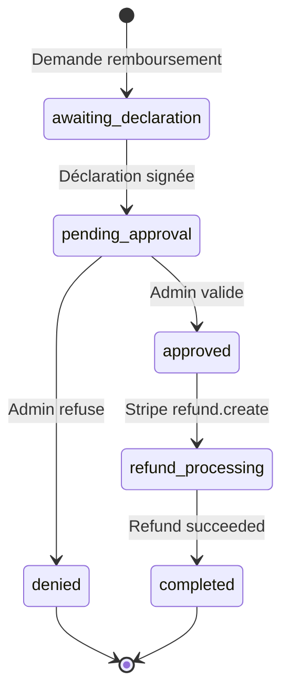

# US-REF-002 : Workflow multi-étapes de remboursement

> **Epic**: 7 - Remboursement | **Priorité**: P2 | **Estimation**: 5 points

## 📋 Description

Implémenter le workflow complet de remboursement avec déclaration donateur, validation admin, et émission attestation d'annulation.

## 🎯 Workflow



## 📐 Implémentation

```typescript
// services/refund-workflow.ts

async function requestRefund(donId: string): Promise<ReceiptCancellation> {
  const cancellation = await strapi.documents('api::receipt-cancellation.receipt-cancellation').create({
    data: {
      klub_don: donId,
      status: 'awaiting_declaration',
      requested_at: new Date(),
    },
  });
  
  // Envoyer email au donateur avec lien vers formulaire déclaration
  await sendDeclarationRequest(cancellation);
  
  return cancellation;
}

async function submitDeclaration(cancellationId: string, declarationData: DeclarationData) {
  await strapi.documents('api::receipt-cancellation.receipt-cancellation').update({
    documentId: cancellationId,
    data: {
      status: 'pending_approval',
      donor_declaration: declarationData,
      declaration_submitted_at: new Date(),
    },
  });
  
  // Notifier les admins
  await notifyAdminsForApproval(cancellationId);
}

async function approveRefund(cancellationId: string, adminId: string) {
  await strapi.documents('api::receipt-cancellation.receipt-cancellation').update({
    documentId: cancellationId,
    data: {
      status: 'approved',
      approved_by: adminId,
      approved_at: new Date(),
    },
  });
  
  // Lancer le remboursement Stripe
  await processStripeRefund(cancellationId);
}
```

## ✅ Definition of Done

- [ ] Machine à états implémentée
- [ ] Transitions validées
- [ ] Emails de notification
- [ ] Tests workflow complet
- [ ] PR approuvée et mergée
