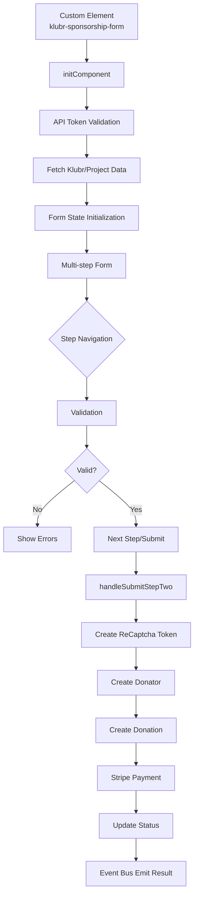

### Architecture

- [Language/Framework](#languageframework)
  - [Frontend](#frontend)
- [Full project structure](#full-project-structure)
  - [Naming Conventions](#naming-conventions)
- [Services communication](#services-communication)
  - [Form Workflow](#form-workflow)
  - [External Services](#external-services)
    - [Stripe](#stripe)
    - [Google Services](#google-services)
    - [Analytics](#analytics)

#### Language/Framework

##### Frontend

- **Framework**: Svelte 5 → @klubr-saas/package.json
- **Component Type**: Web Components (Custom Elements)
- **Routing**: N/A - Single component module
- **Data Fetching**: Custom fetch util with event bus pattern
- **Form Handling**: Multi-step form with reactive state
- **Validation**: Custom validators with Svelte directives
- **State Management**: Svelte stores (`writable`) + Svelte 5 `$state` reactivity
- **Build Tool**: Vite with individual component builds
- **Structure**: Component-based with logic separation

#### Full project structure

```text
klubr-saas/
├── src/
│   ├── assets/           # Static assets
│   │   ├── animations/   # Lottie JSON files
│   │   ├── fonts/        # Custom fonts
│   │   └── icons/        # SVG icons
│   ├── components/       # Web components
│   │   └── sponsorshipForm/
│   │       ├── components/     # Sub-components (breadcrumb, formBanner, formBody, formNavigation, etc)
│   │       ├── logic/          # Business logic (api, stripe, validator, state management)
│   │       ├── index.svelte    # Main component entry
│   │       └── index.scss      # Component styles
│   ├── types/            # TypeScript type definitions
│   ├── utils/            # Shared utilities (eventBus, fetch, analytics)
│   └── main.ts           # Entry point
├── build/                # Build output
│   └── klubr-web-components/
│       └── components/   # Individual component builds
├── vite.config.ts              # Production build config
└── vite.config.development.ts  # Development build config
```

##### Naming Conventions

- **Files**: kebab-case for directories, PascalCase for components
- **Components**: PascalCase
- **Functions**: camelCase
- **Variables**: camelCase
- **Constants**: UPPER_CASE
- **Types/Interfaces**: PascalCase

#### Services communication

##### Form Workflow



##### External Services

###### Stripe

- **Purpose**: Payment processing
- **Integration**: `@stripe/stripe-js` library
- **Flow**: Stripe Elements injected via slot → Payment creation → Confirmation
- **Files**: `logic/stripe.ts`

###### Google Services

- **ReCAPTCHA Enterprise**: Bot protection for form submission
- **Google Maps API**: Address autocomplete with Places library
- **Integration**: Script tags loaded in main component
- **Config**: Environment variables `VITE_GOOGLE_RECAPTCHA_SITE_KEY`, `VITE_GOOGLE_MAPS_KEY`

###### Analytics

- **Plausible**: Privacy-focused analytics tracking
- **Google Analytics**: Event tracking via `sendGaEvent`
- **Events**: Form navigation, open/close, step transitions
- **Config**: `VITE_ACTIVATE_ANALYTICS` flag


---
name: coding-assertions
description: Code quality verification checklist
argument-hint: N/A
---

### Coding Guidelines

> Those rules must be minimal because the MUST be checked after EVERY CODE GENERATION.

#### Requirements to complete a feature

**A feature is really completed if ALL of the above are satisfied: if not, iterate to fix all until all are green.**

#### Steps to follow

1. Check their is no duplication
2. Ensure code is re-used
3. Run all those commands, in order to ensure code is perfect:

```markdown
| Order | Command               | Description                  |
|-------|-----------------------|------------------------------|
| 1     | npm run build         | Vite production build        |
| 2     | npm test              | Run Vitest tests             |
```

#### TypeScript Configuration

Config: @klubr-saas/tsconfig.json

- Extends `@tsconfig/svelte`
- Target: ESNext
- Module: ESNext
- `checkJs: true` - typecheck JS files in `.svelte`
- `isolatedModules: true`
- `resolveJsonModule: true`
- Types: `vitest`

#### Component Structure

- Web Components: Use `<svelte:options customElement={{tag: 'tag-name'}}/>` at top
- Component files: Named `index.svelte` in component folders
- Logic separation: Business logic in separate `.ts` files under `logic/` folder
- Svelte 5 patterns: Use `$state`, `$derived`, `$effect`, `$props` runes
- State management: Svelte stores (`writable`) for reactive cross-component state

#### Naming Conventions

- Components: PascalCase (e.g., `FormBanner`)
- Files: PascalCase for Svelte components, camelCase for TS files
- Folders: camelCase (e.g., `formBanner/`, `videoPlayer/`)
- Functions: camelCase (e.g., `submitForm`, `initComponent`)
- Constants: SCREAMING_SNAKE_CASE (e.g., `DEFAULT_VALUES`, `FORM_CONFIG`)

#### TypeScript Patterns

- Use `type` for object shapes and unions
- Export types from `types/` folder by domain
- Return `Promise<T>` for async functions with explicit return types
- Use `Record<string, any>` for dynamic objects
- Declare globals in `global.d.ts`
- Use typed parameters in function signatures

#### State Management

- Svelte 5 runes: `$state` for reactive state, `$derived` for computed values
- Svelte stores: `writable` from `svelte/store` for cross-component state
- Store subscriptions: Use `.subscribe()` or `$` syntax in components
- Local state: `$state()` for component-specific data
- Event bus pattern: Custom event bus for cross-component communication

#### Svelte Patterns

- Script tags: Use `<script lang="ts">` for TypeScript
- Props: Use `$props()` rune (Svelte 5)
- Reactive declarations: Use `$derived` rune for computed values
- Lifecycle: `onMount`, `onDestroy` from `svelte`
- Effects: Use `$effect()` rune for side effects
- Custom actions: `use:` directive pattern for DOM manipulation

#### HTTP Services

- Centralized `Fetch` function in `@/utils/fetch.ts`
- Promises returned, rejection on non-ok responses
- Authorization via `Bearer` token from env
- FormData support via `isBlob` flag
- Service functions in `logic/api.ts` files

#### Error Handling

- Services return rejected promises on error
- Components use try/catch in async handlers
- Custom toast notifications via `dispatchToast`
- GA event tracking via `sendGaEvent`
- Console logs allowed for development (not production)

#### Forms & Validation

- Custom validation pattern with `validator` action
- Regular expressions for field validation (email, postal code, SIREN)
- `triggerValidation` store to trigger revalidation across form
- Error messages: Inline via `<small class="error">` elements
- Form state: Tracked in `$state` objects (`DEFAULT_VALUES`, `FORM_CONFIG`)

#### Vite Specifics

Config: @klubr-saas/vite.config.ts

- Plugin: `@sveltejs/vite-plugin-svelte`
- Preprocess: `svelte-preprocess` with TypeScript
- Custom elements: `customElement: true`
- Build mode: `BUILD_MODE=INDIVIDUAL` for separate component builds
- Output: ES modules to `build/klubr-web-components/components/`

#### Styling

Config: @klubr-saas/.prettierrc

- Prettier for formatting
- Tabs: 2 spaces (`"tabWidth": 2`)
- Print width: 100
- Single quotes for strings
- Trailing commas: none
- SCSS: Use `<style lang="scss">` with `@use` and `@forward`
- Utility classes: Custom utility classes in `styles/main.scss`
- BEM-like naming: `.sponsorFormParent`, `.mainContainer`, `.boxBoxShadow`

#### Code Quality

- No `console.log` in production code (development is OK)
- Prefer early returns over nested conditionals
- Extract complex logic into separate files under `logic/`
- Keep components focused on rendering
- Colocate related files (component + styles + logic)

#### Dependencies

Key libraries:
- `svelte` (5)
- `vite` (5)
- `@sveltejs/vite-plugin-svelte` (4)
- `vitest` (2) for testing
- `typescript` (5)
- `svelte-preprocess` (6)
- `@stripe/stripe-js` (4) for payments
- `swiper` (11) for carousels
- `lottie-web` (5) for animations
- `sass` (1) for styling

#### File Organization

```
src/
├── assets/           # Static assets (icons, fonts, animations)
├── components/       # Web components
│   └── sponsorshipForm/
│       ├── components/   # Sub-components
│       ├── logic/        # Business logic (TS files)
│       ├── __tests__/    # Component tests
│       ├── index.svelte  # Main component
│       └── index.scss    # Component styles
├── types/            # TypeScript types by domain
├── utils/            # Shared utilities
├── styles/           # Global styles
├── global.d.ts       # Global type declarations
└── main.ts           # Entry point
```


### Testing Guidelines

Testing strategy and configuration for klubr-saas module.

#### Tools and Frameworks

- **Test Runner**: Vitest 2
- **Test Environment**: Node (via Vite)
- **Config**: Uses @vite.config.ts (no separate vitest config)
- **Mocking**: Vitest native mocks (`vi.mock`, `vi.fn`, `vi.stubGlobal`)

#### Test Execution Process

- **Run tests**: `npm test`
- **Single test file**: `vitest run path/to/test.test.ts`
- **Watch mode**: `vitest` (default behavior)

#### Testing Strategy

- **Current Status**: Minimal test coverage
- **Test Location**: `__tests__` directories alongside components
- **File Pattern**: `*.test.ts`
- **Focus**: Component initialization and API integration

#### Test Patterns

##### File Structure
- Tests in `__tests__` subdirectories
- Example: @klubr-saas/src/components/sponsorshipForm/__tests__/initComponent.test.ts

##### Common Patterns
- Mock external dependencies (`Fetch`, `document.querySelectorAll`)
- Use `beforeEach` for setup, `afterEach` for cleanup
- Mock environment variables via `import.meta.env`
- Mock DOM APIs with `vi.stubGlobal`

##### Test Organization
```typescript
describe('ComponentName', () => {
  beforeEach(() => {
    vi.clearAllMocks();
  });

  it('should handle success case', async () => {
    // arrange, act, assert
  });

  it('should handle error case', async () => {
    await expect(fn()).rejects.toThrow('error');
  });
});
```

#### Mocking and Stubbing

- **API Mocking**: Mock `Fetch` utility for API calls
- **DOM Mocking**: Use `vi.stubGlobal` for global objects (`document`, `window`)
- **Module Mocking**: Use `vi.mock()` for external modules
- **Environment**: Mock `import.meta.env` for environment variables
